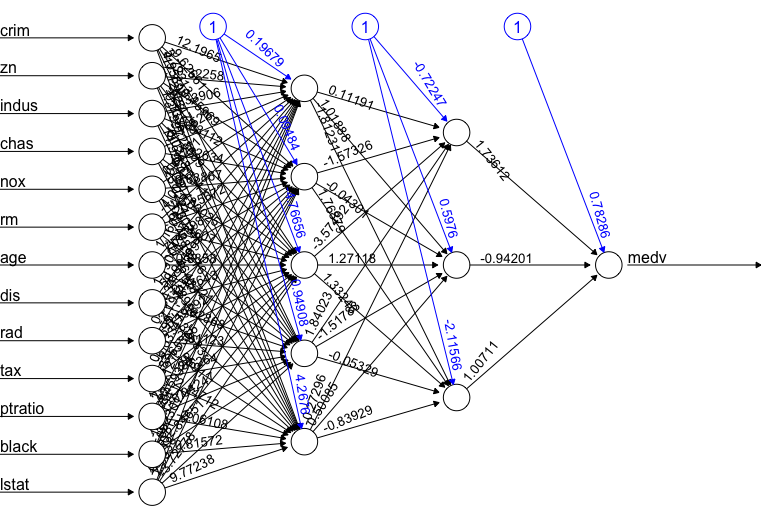

Artificial Neural Networks
==========================

* Based on a simple model of interconnected neurons
* A model neuron is referred to as a threshold unit
* A threshold unit receives input from a number of other units, weighs each input and adds them up
* If the total input is above a certain threshold, the output of the unit is one; otherwise it is zero
* Learning is achieved by making small adjustments in the weights and the threshold
* By introducing more threshold units (introducing more hyperplanes), we can solve non-linearly separable problems
* A hidden layer of threshold units, which performs a partial classification of the input and sends its output to a final layer, is called a multi-layer perceptron or a feed-forward network

# A simple example with one threshold unit

Assume you measure gene expression values for 20 different genes in 50 tumours of class 0 and 50 of class 1. On the basis of this data set, you can train a threshold unit that takes an array of 20 gene expression values as input and outputs a 0 or 1 for the two classes, respectively. If the data are linearly separable, the threshold unit will classify the training data correctly.

# Example in R

See [this tutorial](http://datascienceplus.com/fitting-neural-network-in-r/) and `analysis.Rmd`.

# Further reading

* [Back propagation](https://en.wikipedia.org/wiki/Backpropagation)
* [Gradient descent](https://en.wikipedia.org/wiki/Gradient_descent)

