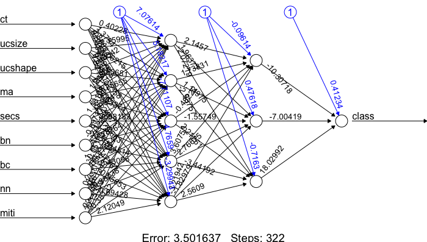

Artificial Neural Networks
==========================

* Based on a simple model of interconnected neurons
* A model neuron is referred to as a threshold unit
* A threshold unit receives input from a number of other units, weighs each input and adds them up
* If the total input is above a certain threshold, the output of the unit is one; otherwise it is zero
* Learning is achieved by making small adjustments in the weights and the threshold
* By introducing more threshold units (introducing more hyperplanes), we can solve non-linearly separable problems
* A hidden layer of threshold units, which performs a partial classification of the input and sends its output to a final layer, is called a multi-layer perceptron or a feed-forward network

# A simple example with one threshold unit

Assume you measure gene expression values for 20 different genes in 50 tumours of class 0 and 50 of class 1. On the basis of this data set, you can train a threshold unit that takes an array of 20 gene expression values as input and outputs a 0 or 1 for the two classes, respectively. If the data are linearly separable, the threshold unit will classify the training data correctly.

# Example in R

See [this tutorial](http://datascienceplus.com/fitting-neural-network-in-r/) and `analysis.Rmd`.

# Another example

Using the [Breast Cancer Wisconsin (Diagnostic) Data Set](http://archive.ics.uci.edu/ml/datasets/Breast+Cancer+Wisconsin+(Diagnostic)).

~~~~{.r}
my_link <- 'http://archive.ics.uci.edu/ml/machine-learning-databases/breast-cancer-wisconsin/breast-cancer-wisconsin.data'
data <- read.table(url(my_link), stringsAsFactors = FALSE, header = FALSE, sep = ',')
names(data) <- c('id','ct','ucsize','ucshape','ma','secs','bn','bc','nn','miti','class')

data$bn <- gsub(pattern = '\\?', replacement = NA, x = data$bn)
data$bn <- as.integer(data$bn)
my_median <- median(data$bn, na.rm = TRUE)
data$bn[is.na(data$bn)] <- my_median
data <- data[,-1]
data$class <- gsub(pattern = 2, replacement = 0, x = data$class)
data$class <- gsub(pattern = 4, replacement = 1, x = data$class)
data$class <- as.integer(data$class)

set.seed(31)
my_decider <- rbinom(n=nrow(data),size=1,p=0.8)
table(my_decider)
train <- data[as.logical(my_decider),]
test <- data[!as.logical(my_decider),]

library(neuralnet)
n <- names(train)
f <- as.formula(paste("class ~", paste(n[!n %in% "class"], collapse = " + ")))
nn <- neuralnet(f, data = train, hidden=c(5,3), linear.output = FALSE)
plot(nn)

result <- compute(nn, test[,-10])
result <- ifelse(result$net.result > 0.5, yes = 1, no = 0)

# test$class are the rows and result are the columns
table(test$class, result)
   result
     0  1
  0 92  6
  1  0 53
~~~~

Six benign cases that were classified as malignant, i.e. false positive.

# Demo

[Tinker With a Neural Network](http://playground.tensorflow.org/)

# Further reading

* [Back propagation](https://en.wikipedia.org/wiki/Backpropagation)
* [Gradient descent](https://en.wikipedia.org/wiki/Gradient_descent)

