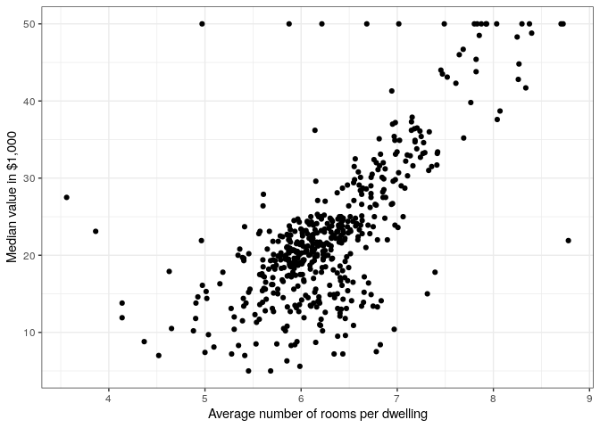
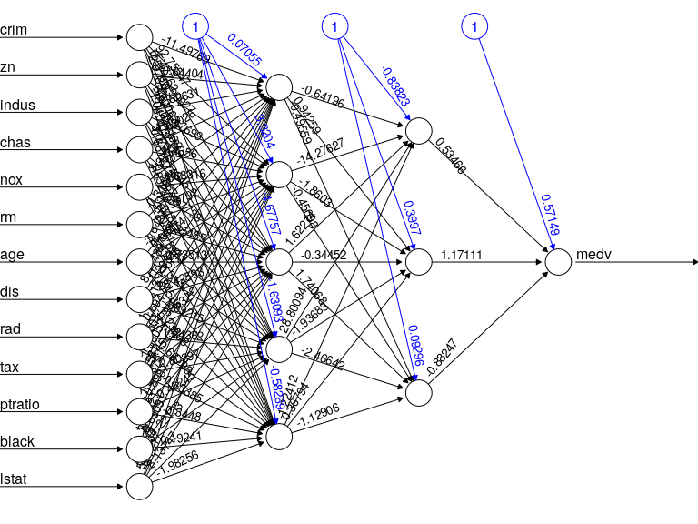
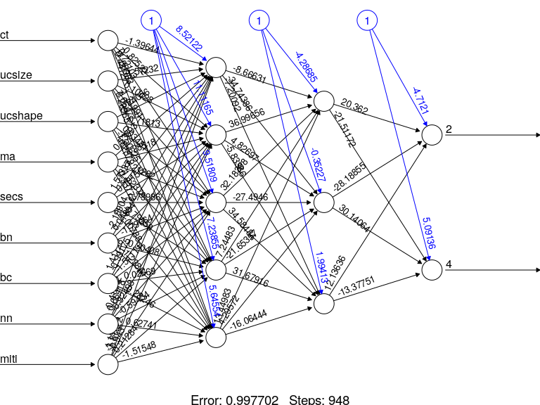

Introduction
------------

This notebook is adapted from [this
tutorial](https://datascienceplus.com/fitting-neural-network-in-r/).

Install packages if missing and load.

``` {.r}
.libPaths('/packages')
my_packages <- c('MASS', 'neuralnet')

for (my_package in my_packages){
   if(!require(my_package, character.only = TRUE)){
      install.packages(my_package, '/packages')
      library(my_package, character.only = TRUE)
   }
}
```

Housing values in Boston
------------------------

The `Boston` data set from the `MASS` package contains the following
features:

-   `crim` - per capita crime rate by town.
-   `zn` - proportion of residential land zoned for lots over 25,000
    sq.ft.
-   `indus` - proportion of non-retail business acres per town.
-   `chas` - Charles River dummy variable (= 1 if tract bounds river; 0
    otherwise).
-   `nox` - nitrogen oxides concentration (parts per 10 million).
-   `rm` - average number of rooms per dwelling.
-   `age` - proportion of owner-occupied units built prior to 1940.
-   `dis` - weighted mean of distances to five Boston employment
    centres.
-   `rad` - index of accessibility to radial highways.
-   `tax` - full-value property-tax rate per \$10,000.
-   `ptratio` - pupil-teacher ratio by town.
-   `black` - 1000(Bk - 0.63)\^2 where Bk is the proportion of blacks by
    town.
-   `lstat` - lower status of the population (percent).
-   `medv` - median value of owner-occupied homes in \$1000s.

``` {.r}
str(Boston)
```

    ## 'data.frame':    506 obs. of  14 variables:
    ##  $ crim   : num  0.00632 0.02731 0.02729 0.03237 0.06905 ...
    ##  $ zn     : num  18 0 0 0 0 0 12.5 12.5 12.5 12.5 ...
    ##  $ indus  : num  2.31 7.07 7.07 2.18 2.18 2.18 7.87 7.87 7.87 7.87 ...
    ##  $ chas   : int  0 0 0 0 0 0 0 0 0 0 ...
    ##  $ nox    : num  0.538 0.469 0.469 0.458 0.458 0.458 0.524 0.524 0.524 0.524 ...
    ##  $ rm     : num  6.58 6.42 7.18 7 7.15 ...
    ##  $ age    : num  65.2 78.9 61.1 45.8 54.2 58.7 66.6 96.1 100 85.9 ...
    ##  $ dis    : num  4.09 4.97 4.97 6.06 6.06 ...
    ##  $ rad    : int  1 2 2 3 3 3 5 5 5 5 ...
    ##  $ tax    : num  296 242 242 222 222 222 311 311 311 311 ...
    ##  $ ptratio: num  15.3 17.8 17.8 18.7 18.7 18.7 15.2 15.2 15.2 15.2 ...
    ##  $ black  : num  397 397 393 395 397 ...
    ##  $ lstat  : num  4.98 9.14 4.03 2.94 5.33 ...
    ##  $ medv   : num  24 21.6 34.7 33.4 36.2 28.7 22.9 27.1 16.5 18.9 ...

``` {.r}
any(is.na(Boston))
```

    ## [1] FALSE

### Multiple linear regression

Carry out multiple linear regression by regressing the median value onto
all other features.

``` {.r}
set.seed(500)
index <- sample(1:nrow(Boston), round(0.75*nrow(Boston)))
train <- Boston[index,]
test <- Boston[-index,]
lm.fit <- glm(medv ~ ., data=train)
summary(lm.fit)
```

    ## 
    ## Call:
    ## glm(formula = medv ~ ., data = train)
    ## 
    ## Deviance Residuals: 
    ##      Min        1Q    Median        3Q       Max  
    ## -15.2113   -2.5587   -0.6552    1.8275   29.7110  
    ## 
    ## Coefficients:
    ##               Estimate Std. Error t value Pr(>|t|)    
    ## (Intercept)  31.111702   5.459811   5.698 2.49e-08 ***
    ## crim         -0.111372   0.033256  -3.349 0.000895 ***
    ## zn            0.042633   0.014307   2.980 0.003077 ** 
    ## indus         0.001483   0.067455   0.022 0.982473    
    ## chas          1.756844   0.981087   1.791 0.074166 .  
    ## nox         -18.184847   4.471572  -4.067 5.84e-05 ***
    ## rm            4.760341   0.480472   9.908  < 2e-16 ***
    ## age          -0.013439   0.014101  -0.953 0.341190    
    ## dis          -1.553748   0.218929  -7.097 6.65e-12 ***
    ## rad           0.288181   0.072017   4.002 7.62e-05 ***
    ## tax          -0.013739   0.004060  -3.384 0.000791 ***
    ## ptratio      -0.947549   0.140120  -6.762 5.38e-11 ***
    ## black         0.009502   0.002901   3.276 0.001154 ** 
    ## lstat        -0.388902   0.059733  -6.511 2.47e-10 ***
    ## ---
    ## Signif. codes:  0 '***' 0.001 '**' 0.01 '*' 0.05 '.' 0.1 ' ' 1
    ## 
    ## (Dispersion parameter for gaussian family taken to be 20.23806)
    ## 
    ##     Null deviance: 32463.5  on 379  degrees of freedom
    ## Residual deviance:  7407.1  on 366  degrees of freedom
    ## AIC: 2237
    ## 
    ## Number of Fisher Scoring iterations: 2

The number of rooms has the highest *t*-statistic.

``` {.r}
ggplot(Boston, aes(rm, medv)) +
  geom_point() +
  labs(x = "Average number of rooms per dwelling", y = "Median value in $1,000")
```



Predict prices and calculate the mean squared error (MSE).

``` {.r}
pr.lm <- predict(lm.fit, test)
MSE.lm <- sum((pr.lm - test$medv)^2)/nrow(test)
MSE.lm
```

    ## [1] 31.26302

### Neural network

First we will carry out [feature
scaling](https://en.wikipedia.org/wiki/Feature_scaling) using:

%7D%7Bmax(x)&space;-&space;min(x)%7D)

Manually perform min-max and compare `scale` approach (just for fun).

``` {.r}
x <- 1:20
x_a <- (x - min(x)) / (max(x) - min(x))
x_b <- as.vector(scale(x, center = min(x), scale = max(x) - min(x)))
identical(x_a, x_b)
```

    ## [1] TRUE

Carrying out scaling on Boston data set.

``` {.r}
maxs <- apply(Boston, 2, max)
mins <- apply(Boston, 2, min)

scaled <- as.data.frame(
  scale(Boston, center = mins, scale = maxs - mins)
)

train_scaled <- scaled[index,]
test_scaled <- scaled[-index,]
```

Manually create formula as `f` since `neuralnet` does not recognise R
formulae.

``` {.r}
n <- names(train_scaled)
f <- as.formula(paste("medv ~", paste(n[!n %in% "medv"], collapse = " + ")))
```

Train neural network using two hidden layers with 5 and 3 neurons,
respectively.

``` {.r}
nn <- neuralnet(f, data = train_scaled, hidden=c(5,3), linear.output = TRUE)
plot(nn, rep = "best")
```



Predict (scaled) value.

``` {.r}
pr.nn <- compute(nn, test_scaled[,1:13])
```

We need to unscale the data before calculating the MSE.

``` {.r}
pr.nn_unscaled <- pr.nn$net.result * (max(Boston$medv) - min(Boston$medv)) + min(Boston$medv)
test.r <- (test_scaled$medv) * (max(Boston$medv) - min(Boston$medv)) + min(Boston$medv)

MSE.nn <- sum((test.r - pr.nn_unscaled)^2)/nrow(test_scaled)
```

Comparing the MSEs.

``` {.r}
print(paste0("MSE of multiple linear regression: ", MSE.lm))
```

    ## [1] "MSE of multiple linear regression: 31.2630222372615"

``` {.r}
print(paste0("MSE of neural network regression: ", MSE.nn))
```

    ## [1] "MSE of neural network regression: 16.4595537665717"

Breast cancer data
------------------

Classify breast cancer samples using the [Breast Cancer Wisconsin
(Diagnostic) Data
Set](https://archive.ics.uci.edu/ml/datasets/Breast+Cancer+Wisconsin+(Diagnostic)).

``` {.r}
data <- read.table(
   "../data/breast_cancer_data.csv",
   stringsAsFactors = FALSE,
   sep = ',',
   header = TRUE
)
data$class <- factor(data$class)
data <- data[,-1]
```

Separate into training (80%) and testing (20%).

``` {.r}
set.seed(31)
my_prob <- 0.8
my_split <- as.logical(
  rbinom(
    n = nrow(data),
    size = 1,
    p = my_prob
  )
)

train <- data[my_split,]
test <- data[!my_split,]
```

Train neural network.

``` {.r}
n <- names(train)
f <- as.formula(paste("class ~", paste(n[!n %in% "class"], collapse = " + ")))
nn <- neuralnet(f, data = train, hidden=c(5,3), linear.output = FALSE)
plot(nn, rep = "best")
```



Predict and check results.

``` {.r}
result <- compute(nn, test[,-10])
result <- apply(result$net.result, 1, function(x) ifelse(x[1] > x[2], yes = 2, no = 4))

# test$class are the rows and nn result are the columns
table(test$class, result)
```

    ##    result
    ##      2  4
    ##   2 78  1
    ##   4  2 41

Further reading
---------------

The neuralnet [reference
manual](https://cran.r-project.org/web/packages/neuralnet/neuralnet.pdf).

Session info
------------

Time built.

    ## [1] "2022-10-20 06:51:10 UTC"

Session info.

    ## R version 4.2.1 (2022-06-23)
    ## Platform: x86_64-pc-linux-gnu (64-bit)
    ## Running under: Ubuntu 20.04.4 LTS
    ## 
    ## Matrix products: default
    ## BLAS:   /usr/lib/x86_64-linux-gnu/openblas-pthread/libblas.so.3
    ## LAPACK: /usr/lib/x86_64-linux-gnu/openblas-pthread/liblapack.so.3
    ## 
    ## locale:
    ##  [1] LC_CTYPE=en_US.UTF-8       LC_NUMERIC=C              
    ##  [3] LC_TIME=en_US.UTF-8        LC_COLLATE=en_US.UTF-8    
    ##  [5] LC_MONETARY=en_US.UTF-8    LC_MESSAGES=en_US.UTF-8   
    ##  [7] LC_PAPER=en_US.UTF-8       LC_NAME=C                 
    ##  [9] LC_ADDRESS=C               LC_TELEPHONE=C            
    ## [11] LC_MEASUREMENT=en_US.UTF-8 LC_IDENTIFICATION=C       
    ## 
    ## attached base packages:
    ## [1] stats     graphics  grDevices utils     datasets  methods   base     
    ## 
    ## other attached packages:
    ##  [1] neuralnet_1.44.2 MASS_7.3-57      forcats_0.5.1    stringr_1.4.0   
    ##  [5] dplyr_1.0.9      purrr_0.3.4      readr_2.1.2      tidyr_1.2.0     
    ##  [9] tibble_3.1.7     ggplot2_3.3.6    tidyverse_1.3.1 
    ## 
    ## loaded via a namespace (and not attached):
    ##  [1] tidyselect_1.1.2 xfun_0.31        haven_2.5.0      colorspace_2.0-3
    ##  [5] vctrs_0.4.1      generics_0.1.3   htmltools_0.5.2  yaml_2.3.5      
    ##  [9] utf8_1.2.2       rlang_1.0.3      pillar_1.7.0     glue_1.6.2      
    ## [13] withr_2.5.0      DBI_1.1.3        dbplyr_2.2.1     modelr_0.1.8    
    ## [17] readxl_1.4.0     lifecycle_1.0.1  munsell_0.5.0    gtable_0.3.0    
    ## [21] cellranger_1.1.0 rvest_1.0.2      evaluate_0.15    labeling_0.4.2  
    ## [25] knitr_1.39       tzdb_0.3.0       fastmap_1.1.0    fansi_1.0.3     
    ## [29] highr_0.9        broom_1.0.0      scales_1.2.0     backports_1.4.1 
    ## [33] jsonlite_1.8.0   farver_2.1.1     fs_1.5.2         hms_1.1.1       
    ## [37] digest_0.6.29    stringi_1.7.6    grid_4.2.1       cli_3.3.0       
    ## [41] tools_4.2.1      magrittr_2.0.3   crayon_1.5.1     pkgconfig_2.0.3 
    ## [45] ellipsis_0.3.2   xml2_1.3.3       reprex_2.0.1     lubridate_1.8.0 
    ## [49] rstudioapi_0.13  assertthat_0.2.1 rmarkdown_2.14   httr_1.4.3      
    ## [53] R6_2.5.1         compiler_4.2.1
