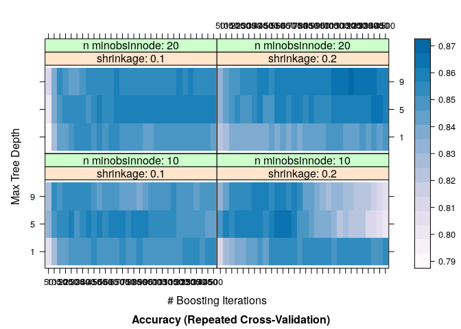
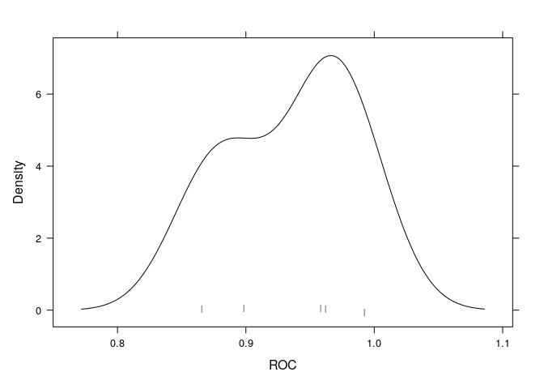

Introduction
------------

The `caret` [package](https://topepo.github.io/caret/) (Classification
And REgression Training) is a set of functions that attempt to
streamline the process for creating predictive models. The package
contains tools for, by is not limited to:

-   data splitting
-   pre-processing
-   feature selection
-   model tuning using resampling
-   variable importance estimation

This README was generated by running from the root directory of this
repository:

    script/rmd_to_md.sh template/template.Rmd

Install packages if missing and load.

    .libPaths('/packages')
    my_packages <- c('gbm', 'mlbench', 'caret')

    for (my_package in my_packages){
      if(!require(my_package, character.only = TRUE)){
        install.packages(my_package, '/packages')
      }
      library(my_package, character.only = TRUE)
    }

Breast cancer data
------------------

Using the [Breast Cancer Wisconsin (Diagnostic) Data
Set](https://archive.ics.uci.edu/ml/datasets/Breast+Cancer+Wisconsin+(Diagnostic)).

    data <- read.table(
       "../data/breast_cancer_data.csv",
       stringsAsFactors = FALSE,
       sep = ',',
       header = TRUE
    )
    data$class <- factor(data$class)
    data <- data[,-1]

    str(data)

    ## 'data.frame':    599 obs. of  10 variables:
    ##  $ ct     : int  5 5 3 6 8 1 2 1 2 5 ...
    ##  $ ucsize : int  1 4 1 8 10 1 1 1 1 3 ...
    ##  $ ucshape: int  1 4 1 8 10 1 2 1 1 3 ...
    ##  $ ma     : int  1 5 1 1 8 1 1 1 1 3 ...
    ##  $ secs   : int  2 7 2 3 7 2 2 1 2 2 ...
    ##  $ bn     : int  1 10 2 4 10 10 1 1 1 3 ...
    ##  $ bc     : int  3 3 3 3 9 3 3 3 2 4 ...
    ##  $ nn     : int  1 2 1 7 7 1 1 1 1 4 ...
    ##  $ miti   : int  1 1 1 1 1 1 1 1 1 1 ...
    ##  $ class  : Factor w/ 2 levels "2","4": 1 1 1 1 2 1 1 1 1 2 ...

Pre-processing
--------------

### Zero- and near zero-variance predictors

Predictors that have zero- or near zero-variance are not useful for
making predictions since different classes will have the same values.

    data(mdrr)

    nzv <- nearZeroVar(mdrrDescr, saveMetrics = TRUE)
    nzv[nzv$nzv, ][1:6, ]

    ##      freqRatio percentUnique zeroVar  nzv
    ## nTB   23.00000     0.3787879   FALSE TRUE
    ## nBR  131.00000     0.3787879   FALSE TRUE
    ## nI   527.00000     0.3787879   FALSE TRUE
    ## nR03 527.00000     0.3787879   FALSE TRUE
    ## nR08 527.00000     0.3787879   FALSE TRUE
    ## nR11  21.78261     0.5681818   FALSE TRUE

Remove zero- and near zero-variance predictors.

    nzv <- nearZeroVar(mdrrDescr)
    filtered_descr <- mdrrDescr[, -nzv]
    dim(filtered_descr)

    ## [1] 528 297

### Correlated predictors

The `findCorrelation` function flags correlated predictors for removal.

    descr_cor <- cor(filtered_descr)
    summary(descr_cor[lower.tri(descr_cor)])

    ##     Min.  1st Qu.   Median     Mean  3rd Qu.     Max. 
    ## -0.99607 -0.05373  0.25006  0.26078  0.65527  1.00000

Remove highly correlated predictors.

    highly_cor_descr <- findCorrelation(descr_cor, cutoff = 0.75)
    filtered_descr <- filtered_descr[, -highly_cor_descr]

    descr_cor_post <- cor(filtered_descr)
    summary(descr_cor_post[lower.tri(descr_cor_post)])

    ##     Min.  1st Qu.   Median     Mean  3rd Qu.     Max. 
    ## -0.70728 -0.05378  0.04418  0.06692  0.18858  0.74458

Data dimension after removing correlated predictors.

    dim(filtered_descr)

    ## [1] 528  50

### Linear dependencies

Linear dependencies can occur when large numbers of binary chemical
fingerprints are used to describe the structure of a molecule. The
function `findLinearCombos` uses the QR decomposition of a matrix to
enumerate sets of linear combinations.

    ltfr_design <- matrix(0, nrow=6, ncol=6)
    ltfr_design[,1] <- c(1, 1, 1, 1, 1, 1)
    ltfr_design[,2] <- c(1, 1, 1, 0, 0, 0)
    ltfr_design[,3] <- c(0, 0, 0, 1, 1, 1)
    ltfr_design[,4] <- c(1, 0, 0, 1, 0, 0)
    ltfr_design[,5] <- c(0, 1, 0, 0, 1, 0)
    ltfr_design[,6] <- c(0, 0, 1, 0, 0, 1)

    colnames(ltfr_design) <- paste0("c", 1:6)
    rownames(ltfr_design) <- paste0("r", 1:6)
    ltfr_design

    ##    c1 c2 c3 c4 c5 c6
    ## r1  1  1  0  1  0  0
    ## r2  1  1  0  0  1  0
    ## r3  1  1  0  0  0  1
    ## r4  1  0  1  1  0  0
    ## r5  1  0  1  0  1  0
    ## r6  1  0  1  0  0  1

Note that columns two and three add up to the first column and columns
four, five, and six also add up to the first column. `findLinearCombos`
will return a list that enumerates these dependencies.

    combo_info <- findLinearCombos(ltfr_design)
    combo_info

    ## $linearCombos
    ## $linearCombos[[1]]
    ## [1] 3 1 2
    ## 
    ## $linearCombos[[2]]
    ## [1] 6 1 4 5
    ## 
    ## 
    ## $remove
    ## [1] 3 6

Remove linear dependencies.

    ltfr_design[, -combo_info$remove]

    ##    c1 c2 c4 c5
    ## r1  1  1  1  0
    ## r2  1  1  0  1
    ## r3  1  1  0  0
    ## r4  1  0  1  0
    ## r5  1  0  0  1
    ## r6  1  0  0  0

### The `preProcess` function

The `preProcess` class can be used for many operations on predictors,
including centering and scaling. The function estimates the required
parameters for each operation and `predict.preProcess` is used to apply
them to specific data sets.

#### Centring and scaling

The function `preProcess` does not pre-process the data but
`predict.preProcess` is used for pre-processing.

    set.seed(1984)
    train_idx <- sample(seq(along = mdrrClass), length(mdrrClass)/2)

    training <- filtered_descr[train_idx, ]
    training_class <- mdrrClass[train_idx]
    test <- filtered_descr[-train_idx, ]
    test_class <- mdrrClass[-train_idx]

    pre_proc_values <- preProcess(training, method = c("center", "scale"))

    training_pre_proc <- predict(pre_proc_values, training)
    test_pre_proc <- predict(pre_proc_values, test)

Before pre-processing.

    training[1:6, 1:6]

    ##             AMW   Mp   Ms nDB nAB nS
    ## LOPERAMIDE 6.88 0.66 2.26   1  18  0
    ## MA1499     7.19 0.67 2.03   1  18  0
    ## ANTAZOLINE 6.80 0.67 1.92   0  14  0
    ## AY9944     7.25 0.67 1.94   0  12  0
    ## FENDILINE  6.44 0.68 1.88   0  18  0
    ## S791100    7.19 0.67 2.05   1  18  0

After pre-processing.

    training_pre_proc[1:6, 1:6]

    ##                   AMW        Mp         Ms        nDB        nAB        nS
    ## LOPERAMIDE -0.1215808 0.2441047  0.6561522  0.3708254  1.2428816 -0.349808
    ## MA1499      0.3210425 0.6144704 -0.4108420  0.3708254  1.2428816 -0.349808
    ## ANTAZOLINE -0.2358062 0.6144704 -0.9211435 -0.8842759  0.2118659 -0.349808
    ## AY9944      0.4067116 0.6144704 -0.8283614 -0.8842759 -0.3036419 -0.349808
    ## FENDILINE  -0.7498203 0.9848361 -1.1067077 -0.8842759  1.2428816 -0.349808
    ## S791100     0.3210425 0.6144704 -0.3180599  0.3708254  1.2428816 -0.349808

#### Transforming predictors

Principal Component Analysis (PCA) can be used to transform data to a
smaller sub-space where the new variables are uncorrelated with one
another. The `preProcess` class can apply this transformation by
including “pca” in the `method` argument (this will also force scaling
of the predictors).

Independent Component Analysis (ICA) can also be used to find new
variables that are linear combinations of the original set such that the
components are independent.

The spatial sign transformation projects the data for a predictor to the
unit circle in *p* dimensions, where *p* is the number of predictors.
Essentially a vector of data is divided by its norm.

### Data splitting

Separate into training (80%) and testing (20%).

    set.seed(1984)
    my_prob <- 0.8
    my_split <- as.logical(
      rbinom(
        n = nrow(data),
        size = 1,
        p = my_prob
      )
    )

    train <- data[my_split,]
    test <- data[!my_split,]

    my_df <- rbind(
      prop.table(table(data$class)),
      prop.table(table(train$class)),
      prop.table(table(test$class))
    )

    rownames(my_df) <- c('orig', 'train', 'test')
    my_df

    ##               2         4
    ## orig  0.6243740 0.3756260
    ## train 0.6396588 0.3603412
    ## test  0.5692308 0.4307692

The function `createDataPartition` can be used to create balanced splits
of the data. If the `y` argument to this function is a factor, the
random sampling occurs within each class and should preserve the overall
class distribution of the data.

    set.seed(1984)
    train_idx <- createDataPartition(
      y = data$class,
      p = 0.8,
      list = FALSE,
      times = 1
    )

    train_caret <- data[train_idx, ]
    test_caret <- data[-train_idx, ]

    my_df <- rbind(
      prop.table(table(data$class)),
      prop.table(table(train_caret$class)),
      prop.table(table(test_caret$class))
    )

    rownames(my_df) <- c('orig', 'train', 'test')
    my_df

    ##               2         4
    ## orig  0.6243740 0.3756260
    ## train 0.6250000 0.3750000
    ## test  0.6218487 0.3781513

Model training and tuning
-------------------------

There are several functions that help to streamline the model building
and evaluation process. The `train` function can be used to:

-   estimate model performance from a training set
-   evaluate, using resampling, the effect of model tuning parameters on
    performance
-   choose the “optimal” model across these parameters

The first step in tuning the model is to choose a set of parameters to
evaluate. Once the model and tuning parameter values have been defined,
the type of resampling should be specified. *k*-fold cross-validation
(once or repeated), leave-one-out cross-validation and bootstrap
resampling methods can be used by `train`. After resampling, the process
produces a profile of performance measures that is available for finding
the tuning parameter values that should be used.

### An example

Using the `Sonar` data from the `mlbench` package.

    data("Sonar")
    str(Sonar[, 1:6])

    ## 'data.frame':    208 obs. of  6 variables:
    ##  $ V1: num  0.02 0.0453 0.0262 0.01 0.0762 0.0286 0.0317 0.0519 0.0223 0.0164 ...
    ##  $ V2: num  0.0371 0.0523 0.0582 0.0171 0.0666 0.0453 0.0956 0.0548 0.0375 0.0173 ...
    ##  $ V3: num  0.0428 0.0843 0.1099 0.0623 0.0481 ...
    ##  $ V4: num  0.0207 0.0689 0.1083 0.0205 0.0394 ...
    ##  $ V5: num  0.0954 0.1183 0.0974 0.0205 0.059 ...
    ##  $ V6: num  0.0986 0.2583 0.228 0.0368 0.0649 ...

Split.

    set.seed(1984)
    idx <- createDataPartition(Sonar$Class, p = 0.75, list = FALSE)
    training <- Sonar[idx, ]
    testing <- Sonar[-idx, ]

The function `trainControl` can be used to specify the type of
resampling and in the example below we perform 10 by 10
cross-validation.

    fit_control <- trainControl(
      method = "repeatedcv",
      number = 10,
      repeats = 10
    )

The first two arguments to `train` are the predictor and outcome data
objects, respectively. The third argument, `method`, specifies the type
of model. In the example below, we fit a boosted tree model via the
`gbm` package.

    set.seed(1984)
    system.time(
      gbm_fit <- train(
        Class ~ .,
        data = training,
        method = "gbm",
        trControl = fit_control,
        verbose = FALSE
      )
    )

    ##    user  system elapsed 
    ##  16.329   0.215  16.736

    gbm_fit

    ## Stochastic Gradient Boosting 
    ## 
    ## 157 samples
    ##  60 predictor
    ##   2 classes: 'M', 'R' 
    ## 
    ## No pre-processing
    ## Resampling: Cross-Validated (10 fold, repeated 10 times) 
    ## Summary of sample sizes: 141, 141, 141, 142, 141, 142, ... 
    ## Resampling results across tuning parameters:
    ## 
    ##   interaction.depth  n.trees  Accuracy   Kappa    
    ##   1                   50      0.8040147  0.6037850
    ##   1                  100      0.8369510  0.6707514
    ##   1                  150      0.8357647  0.6685990
    ##   2                   50      0.8302475  0.6571250
    ##   2                  100      0.8439191  0.6843235
    ##   2                  150      0.8483039  0.6936068
    ##   3                   50      0.8286446  0.6537330
    ##   3                  100      0.8460245  0.6889748
    ##   3                  150      0.8556593  0.7083322
    ## 
    ## Tuning parameter 'shrinkage' was held constant at a value of 0.1
    ## 
    ## Tuning parameter 'n.minobsinnode' was held constant at a value of 10
    ## Accuracy was used to select the optimal model using the largest value.
    ## The final values used for the model were n.trees = 150, interaction.depth =
    ##  3, shrinkage = 0.1 and n.minobsinnode = 10.

For a Gradient Boosting Machine (GBM) model, there are three main tuning
parameters:

-   complexity of the tree called `interaction.depth`
-   number of iterations, i.e. trees (called `n.trees`)
-   learning rate: how quickly the algorithm adapts, called `shrinkage`
-   the minimum number of training set samples in a node to commence
    splitting (`n.minobsinnode`)

The default values tested for this model are shown in the first two
columns; `shrinkage` and `n.minobsinnode` are not shown because the grid
set of candidate models all use a single value for these tuning
parameters.

The `Accuracy` column is the overall agreement rate averaged over
cross-validation iterations. The agreement standard deviation is also
calculated from the cross-validation results. The `Kappa` column is
Cohen’s (unweighted) Kappa statistic averaged across the resampling
results.

`train` can also automatically create a grid of tuning parameters for
some models. By default, if *p* is the number of tuning parameters, the
grid size is 3*p*.

The `train` function has an argument called `preProcess` that is used to
specify what pre-processing should be carried out. This argument takes a
character string of methods that would normally be passed to the
`method` argument of the `preProcess` function.

The tuning parameter grid can be specified using the `tuneGrid` argument
in the `train` function. Use `expand.grid` function to create a grid.

    gbm_grid <- expand.grid(
      interaction.depth = c(1, 5, 9),
      n.trees = (1:30)*50,
      shrinkage = 0.1,
      n.minobsinnode = 20
    )

    head(gbm_grid)

    ##   interaction.depth n.trees shrinkage n.minobsinnode
    ## 1                 1      50       0.1             20
    ## 2                 5      50       0.1             20
    ## 3                 9      50       0.1             20
    ## 4                 1     100       0.1             20
    ## 5                 5     100       0.1             20
    ## 6                 9     100       0.1             20

Train using parameters specified in our grid.

    set.seed(1984)
    system.time(
      gbm_fit_grid <- train(
        Class ~ .,
        data = training,
        method = "gbm",
        trControl = fit_control,
        verbose = FALSE,
        tuneGrid = gbm_grid
      )
    )

    ##    user  system elapsed 
    ## 109.984   8.574 111.463

    gbm_fit_grid

    ## Stochastic Gradient Boosting 
    ## 
    ## 157 samples
    ##  60 predictor
    ##   2 classes: 'M', 'R' 
    ## 
    ## No pre-processing
    ## Resampling: Cross-Validated (10 fold, repeated 10 times) 
    ## Summary of sample sizes: 141, 141, 141, 142, 141, 142, ... 
    ## Resampling results across tuning parameters:
    ## 
    ##   interaction.depth  n.trees  Accuracy   Kappa    
    ##   1                    50     0.7835735  0.5621391
    ##   1                   100     0.8225123  0.6419372
    ##   1                   150     0.8402672  0.6777867
    ##   1                   200     0.8434755  0.6840516
    ##   1                   250     0.8461789  0.6889603
    ##   1                   300     0.8404191  0.6774742
    ##   1                   350     0.8417525  0.6803184
    ##   1                   400     0.8372990  0.6710734
    ##   1                   450     0.8402574  0.6774131
    ##   1                   500     0.8427255  0.6823474
    ##   1                   550     0.8422206  0.6812464
    ##   1                   600     0.8415539  0.6801108
    ##   1                   650     0.8444951  0.6859744
    ##   1                   700     0.8426103  0.6822001
    ##   1                   750     0.8422255  0.6815636
    ##   1                   800     0.8429706  0.6831321
    ##   1                   850     0.8416373  0.6806077
    ##   1                   900     0.8429608  0.6833167
    ##   1                   950     0.8441740  0.6857446
    ##   1                  1000     0.8428824  0.6828056
    ##   1                  1050     0.8437892  0.6847428
    ##   1                  1100     0.8469142  0.6911132
    ##   1                  1150     0.8461740  0.6892732
    ##   1                  1200     0.8460123  0.6891467
    ##   1                  1250     0.8430441  0.6831939
    ##   1                  1300     0.8406078  0.6781814
    ##   1                  1350     0.8438627  0.6847171
    ##   1                  1400     0.8455809  0.6880673
    ##   1                  1450     0.8450711  0.6870113
    ##   1                  1500     0.8464412  0.6899866
    ##   5                    50     0.8081397  0.6135063
    ##   5                   100     0.8380270  0.6731663
    ##   5                   150     0.8482255  0.6942498
    ##   5                   200     0.8526520  0.7029205
    ##   5                   250     0.8565539  0.7106475
    ##   5                   300     0.8570221  0.7119278
    ##   5                   350     0.8562819  0.7104071
    ##   5                   400     0.8529853  0.7036701
    ##   5                   450     0.8583137  0.7142778
    ##   5                   500     0.8563186  0.7100256
    ##   5                   550     0.8595270  0.7168502
    ##   5                   600     0.8601569  0.7177081
    ##   5                   650     0.8578088  0.7130800
    ##   5                   700     0.8571471  0.7117875
    ##   5                   750     0.8609020  0.7194554
    ##   5                   800     0.8578137  0.7132084
    ##   5                   850     0.8603554  0.7183101
    ##   5                   900     0.8591936  0.7158802
    ##   5                   950     0.8616103  0.7208111
    ##   5                  1000     0.8609853  0.7195539
    ##   5                  1050     0.8616103  0.7207326
    ##   5                  1100     0.8591054  0.7157003
    ##   5                  1150     0.8604020  0.7183818
    ##   5                  1200     0.8604755  0.7185999
    ##   5                  1250     0.8603554  0.7181768
    ##   5                  1300     0.8603137  0.7180980
    ##   5                  1350     0.8591422  0.7157124
    ##   5                  1400     0.8559706  0.7094513
    ##   5                  1450     0.8584755  0.7143722
    ##   5                  1500     0.8583971  0.7141931
    ##   9                    50     0.8040613  0.6047199
    ##   9                   100     0.8384657  0.6739542
    ##   9                   150     0.8480907  0.6932013
    ##   9                   200     0.8482941  0.6933494
    ##   9                   250     0.8508824  0.6985950
    ##   9                   300     0.8541544  0.7055808
    ##   9                   350     0.8585490  0.7140863
    ##   9                   400     0.8553358  0.7080196
    ##   9                   450     0.8562353  0.7095681
    ##   9                   500     0.8601520  0.7170714
    ##   9                   550     0.8627721  0.7225602
    ##   9                   600     0.8596471  0.7163227
    ##   9                   650     0.8598456  0.7166466
    ##   9                   700     0.8558088  0.7087391
    ##   9                   750     0.8571005  0.7113546
    ##   9                   800     0.8564289  0.7102271
    ##   9                   850     0.8570956  0.7115897
    ##   9                   900     0.8590123  0.7154597
    ##   9                   950     0.8616422  0.7206826
    ##   9                  1000     0.8584289  0.7143158
    ##   9                  1050     0.8597941  0.7171601
    ##   9                  1100     0.8596005  0.7166471
    ##   9                  1150     0.8591324  0.7158730
    ##   9                  1200     0.8585490  0.7146270
    ##   9                  1250     0.8585123  0.7146446
    ##   9                  1300     0.8578824  0.7133377
    ##   9                  1350     0.8603088  0.7179830
    ##   9                  1400     0.8616422  0.7206135
    ##   9                  1450     0.8603088  0.7179843
    ##   9                  1500     0.8621887  0.7216408
    ## 
    ## Tuning parameter 'shrinkage' was held constant at a value of 0.1
    ## 
    ## Tuning parameter 'n.minobsinnode' was held constant at a value of 20
    ## Accuracy was used to select the optimal model using the largest value.
    ## The final values used for the model were n.trees = 550, interaction.depth =
    ##  9, shrinkage = 0.1 and n.minobsinnode = 20.

Plot grid results.

    ggplot(gbm_fit_grid)

Heatmap.

    trellis.par.set(caretTheme())
    plot(gbm_fit_grid, plotType = "level")

Using area under the ROC curve as a performance metric.

    fit_control_roc <- trainControl(
      method = "repeatedcv",
      number = 10,
      repeats = 10,
      classProbs = TRUE,
      summaryFunction = twoClassSummary
    )

    set.seed(1984)
    system.time(
      gbm_fit_roc <- train(
        Class ~ .,
        data = training,
        method = "gbm",
        trControl = fit_control_roc,
        verbose = FALSE,
        tuneGrid = gbm_grid,
        metric = "ROC"
      )
    )

    ##    user  system elapsed 
    ## 113.676   9.765 116.357

    gbm_fit_roc

    ## Stochastic Gradient Boosting 
    ## 
    ## 157 samples
    ##  60 predictor
    ##   2 classes: 'M', 'R' 
    ## 
    ## No pre-processing
    ## Resampling: Cross-Validated (10 fold, repeated 10 times) 
    ## Summary of sample sizes: 141, 141, 141, 142, 141, 142, ... 
    ## Resampling results across tuning parameters:
    ## 
    ##   interaction.depth  n.trees  ROC        Sens       Spec     
    ##   1                    50     0.8849901  0.8293056  0.7303571
    ##   1                   100     0.9090179  0.8491667  0.7916071
    ##   1                   150     0.9142956  0.8640278  0.8132143
    ##   1                   200     0.9152406  0.8683333  0.8146429
    ##   1                   250     0.9193180  0.8768056  0.8105357
    ##   1                   300     0.9181424  0.8722222  0.8035714
    ##   1                   350     0.9155332  0.8733333  0.8053571
    ##   1                   400     0.9168750  0.8673611  0.8021429
    ##   1                   450     0.9164360  0.8683333  0.8075000
    ##   1                   500     0.9169221  0.8718056  0.8087500
    ##   1                   550     0.9179812  0.8705556  0.8087500
    ##   1                   600     0.9184177  0.8706944  0.8076786
    ##   1                   650     0.9170660  0.8726389  0.8114286
    ##   1                   700     0.9197545  0.8713889  0.8087500
    ##   1                   750     0.9189112  0.8693056  0.8105357
    ##   1                   800     0.9177232  0.8695833  0.8117857
    ##   1                   850     0.9195734  0.8681944  0.8107143
    ##   1                   900     0.9197321  0.8681944  0.8133929
    ##   1                   950     0.9190079  0.8683333  0.8158929
    ##   1                  1000     0.9209871  0.8694444  0.8116071
    ##   1                  1050     0.9192932  0.8700000  0.8132143
    ##   1                  1100     0.9202976  0.8709722  0.8185714
    ##   1                  1150     0.9192634  0.8745833  0.8128571
    ##   1                  1200     0.9193080  0.8727778  0.8142857
    ##   1                  1250     0.9191319  0.8683333  0.8128571
    ##   1                  1300     0.9192262  0.8683333  0.8078571
    ##   1                  1350     0.9185119  0.8709722  0.8117857
    ##   1                  1400     0.9191344  0.8719444  0.8142857
    ##   1                  1450     0.9190923  0.8720833  0.8128571
    ##   1                  1500     0.9201935  0.8733333  0.8144643
    ##   5                    50     0.8957366  0.8337500  0.7782143
    ##   5                   100     0.9126910  0.8597222  0.8119643
    ##   5                   150     0.9217956  0.8609722  0.8332143
    ##   5                   200     0.9259350  0.8683333  0.8341071
    ##   5                   250     0.9275025  0.8765278  0.8328571
    ##   5                   300     0.9251513  0.8751389  0.8358929
    ##   5                   350     0.9283160  0.8729167  0.8367857
    ##   5                   400     0.9263070  0.8715278  0.8312500
    ##   5                   450     0.9254018  0.8790278  0.8341071
    ##   5                   500     0.9263666  0.8800000  0.8285714
    ##   5                   550     0.9271652  0.8798611  0.8358929
    ##   5                   600     0.9284251  0.8848611  0.8312500
    ##   5                   650     0.9268353  0.8826389  0.8289286
    ##   5                   700     0.9258780  0.8826389  0.8276786
    ##   5                   750     0.9257292  0.8826389  0.8357143
    ##   5                   800     0.9263566  0.8818056  0.8303571
    ##   5                   850     0.9275496  0.8841667  0.8328571
    ##   5                   900     0.9263715  0.8854167  0.8287500
    ##   5                   950     0.9266171  0.8863889  0.8328571
    ##   5                  1000     0.9260863  0.8863889  0.8314286
    ##   5                  1050     0.9263145  0.8890278  0.8300000
    ##   5                  1100     0.9272991  0.8852778  0.8287500
    ##   5                  1150     0.9264013  0.8865278  0.8301786
    ##   5                  1200     0.9269196  0.8854167  0.8316071
    ##   5                  1250     0.9267411  0.8876389  0.8287500
    ##   5                  1300     0.9269916  0.8862500  0.8301786
    ##   5                  1350     0.9269122  0.8840278  0.8301786
    ##   5                  1400     0.9271875  0.8793056  0.8289286
    ##   5                  1450     0.9270908  0.8829167  0.8300000
    ##   5                  1500     0.9271255  0.8840278  0.8285714
    ##   9                    50     0.8930060  0.8398611  0.7630357
    ##   9                   100     0.9113393  0.8661111  0.8062500
    ##   9                   150     0.9189633  0.8815278  0.8089286
    ##   9                   200     0.9209673  0.8768056  0.8146429
    ##   9                   250     0.9232168  0.8838889  0.8117857
    ##   9                   300     0.9212674  0.8819444  0.8214286
    ##   9                   350     0.9229241  0.8901389  0.8216071
    ##   9                   400     0.9242088  0.8844444  0.8217857
    ##   9                   450     0.9236458  0.8873611  0.8200000
    ##   9                   500     0.9231944  0.8941667  0.8201786
    ##   9                   550     0.9242510  0.8956944  0.8242857
    ##   9                   600     0.9251116  0.8922222  0.8216071
    ##   9                   650     0.9235193  0.8923611  0.8217857
    ##   9                   700     0.9241617  0.8851389  0.8216071
    ##   9                   750     0.9227059  0.8862500  0.8230357
    ##   9                   800     0.9239534  0.8851389  0.8230357
    ##   9                   850     0.9243080  0.8863889  0.8232143
    ##   9                   900     0.9246726  0.8876389  0.8258929
    ##   9                   950     0.9261979  0.8900000  0.8287500
    ##   9                  1000     0.9257763  0.8852778  0.8273214
    ##   9                  1050     0.9262153  0.8866667  0.8287500
    ##   9                  1100     0.9248487  0.8862500  0.8287500
    ##   9                  1150     0.9259921  0.8854167  0.8287500
    ##   9                  1200     0.9243428  0.8841667  0.8287500
    ##   9                  1250     0.9247569  0.8829167  0.8301786
    ##   9                  1300     0.9250546  0.8830556  0.8287500
    ##   9                  1350     0.9248760  0.8887500  0.8273214
    ##   9                  1400     0.9248810  0.8912500  0.8273214
    ##   9                  1450     0.9244692  0.8887500  0.8273214
    ##   9                  1500     0.9256920  0.8911111  0.8285714
    ## 
    ## Tuning parameter 'shrinkage' was held constant at a value of 0.1
    ## 
    ## Tuning parameter 'n.minobsinnode' was held constant at a value of 20
    ## ROC was used to select the optimal model using the largest value.
    ## The final values used for the model were n.trees = 600, interaction.depth =
    ##  5, shrinkage = 0.1 and n.minobsinnode = 20.

Best model according to area under the ROC.

    slice_max(.data = gbm_fit_roc$results, order_by = ROC, n = 1)

    ##   shrinkage interaction.depth n.minobsinnode n.trees       ROC      Sens
    ## 1       0.1                 5             20     600 0.9284251 0.8848611
    ##      Spec      ROCSD    SensSD    SpecSD
    ## 1 0.83125 0.05922416 0.1003349 0.1169561

The best parameters are stored in `bestTune`.

    gbm_fit_roc$bestTune

    ##    n.trees interaction.depth shrinkage n.minobsinnode
    ## 42     600                 5       0.1             20

Density plot.

    trellis.par.set(caretTheme())
    densityplot(gbm_fit_roc, pch = '|')

Session info
------------

Time built.

    ## [1] "2022-11-07 04:12:31 UTC"

Session info.

    ## R version 4.2.1 (2022-06-23)
    ## Platform: x86_64-pc-linux-gnu (64-bit)
    ## Running under: Ubuntu 20.04.4 LTS
    ## 
    ## Matrix products: default
    ## BLAS:   /usr/lib/x86_64-linux-gnu/openblas-pthread/libblas.so.3
    ## LAPACK: /usr/lib/x86_64-linux-gnu/openblas-pthread/liblapack.so.3
    ## 
    ## locale:
    ##  [1] LC_CTYPE=en_US.UTF-8       LC_NUMERIC=C              
    ##  [3] LC_TIME=en_US.UTF-8        LC_COLLATE=en_US.UTF-8    
    ##  [5] LC_MONETARY=en_US.UTF-8    LC_MESSAGES=en_US.UTF-8   
    ##  [7] LC_PAPER=en_US.UTF-8       LC_NAME=C                 
    ##  [9] LC_ADDRESS=C               LC_TELEPHONE=C            
    ## [11] LC_MEASUREMENT=en_US.UTF-8 LC_IDENTIFICATION=C       
    ## 
    ## attached base packages:
    ## [1] stats     graphics  grDevices utils     datasets  methods   base     
    ## 
    ## other attached packages:
    ##  [1] caret_6.0-92    lattice_0.20-45 mlbench_2.1-3   gbm_2.1.8.1    
    ##  [5] forcats_0.5.1   stringr_1.4.0   dplyr_1.0.9     purrr_0.3.4    
    ##  [9] readr_2.1.2     tidyr_1.2.0     tibble_3.1.7    ggplot2_3.3.6  
    ## [13] tidyverse_1.3.1
    ## 
    ## loaded via a namespace (and not attached):
    ##  [1] nlme_3.1-157         fs_1.5.2             lubridate_1.8.0     
    ##  [4] httr_1.4.3           tools_4.2.1          backports_1.4.1     
    ##  [7] utf8_1.2.2           R6_2.5.1             rpart_4.1.16        
    ## [10] DBI_1.1.3            colorspace_2.0-3     nnet_7.3-17         
    ## [13] withr_2.5.0          tidyselect_1.1.2     compiler_4.2.1      
    ## [16] cli_3.3.0            rvest_1.0.2          xml2_1.3.3          
    ## [19] labeling_0.4.2       scales_1.2.0         proxy_0.4-27        
    ## [22] digest_0.6.29        rmarkdown_2.14       pkgconfig_2.0.3     
    ## [25] htmltools_0.5.2      parallelly_1.32.0    highr_0.9           
    ## [28] dbplyr_2.2.1         fastmap_1.1.0        rlang_1.0.3         
    ## [31] readxl_1.4.0         rstudioapi_0.13      farver_2.1.1        
    ## [34] generics_0.1.3       jsonlite_1.8.0       ModelMetrics_1.2.2.2
    ## [37] magrittr_2.0.3       Matrix_1.4-1         Rcpp_1.0.8.3        
    ## [40] munsell_0.5.0        fansi_1.0.3          lifecycle_1.0.1     
    ## [43] pROC_1.18.0          stringi_1.7.6        yaml_2.3.5          
    ## [46] MASS_7.3-57          plyr_1.8.7           recipes_1.0.1       
    ## [49] grid_4.2.1           parallel_4.2.1       listenv_0.8.0       
    ## [52] crayon_1.5.1         haven_2.5.0          splines_4.2.1       
    ## [55] hms_1.1.1            knitr_1.39           pillar_1.7.0        
    ## [58] stats4_4.2.1         future.apply_1.9.0   reshape2_1.4.4      
    ## [61] codetools_0.2-18     reprex_2.0.1         glue_1.6.2          
    ## [64] evaluate_0.15        data.table_1.14.2    modelr_0.1.8        
    ## [67] vctrs_0.4.1          tzdb_0.3.0           foreach_1.5.2       
    ## [70] cellranger_1.1.0     gtable_0.3.0         future_1.26.1       
    ## [73] assertthat_0.2.1     xfun_0.31            gower_1.0.0         
    ## [76] prodlim_2019.11.13   broom_1.0.0          e1071_1.7-11        
    ## [79] class_7.3-20         survival_3.3-1       timeDate_3043.102   
    ## [82] iterators_1.0.14     hardhat_1.2.0        lava_1.6.10         
    ## [85] globals_0.15.1       ellipsis_0.3.2       ipred_0.9-13
