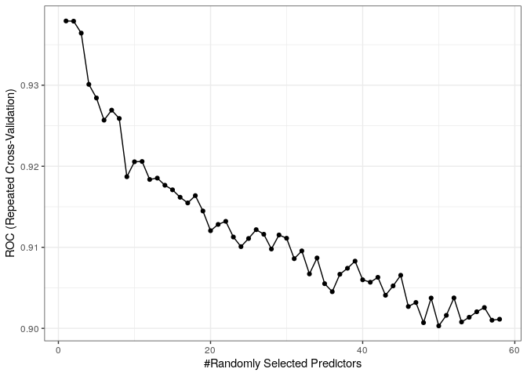

## Introduction

This README was generated by running from the root directory of this
repository:

    script/rmd_to_md.sh template/template.Rmd

Install packages if missing and load.

    .libPaths('/packages')
    my_packages <- c('doParallel', 'e1071', 'randomForest', 'mlbench', 'caret')

    for (my_package in my_packages){
      if(!require(my_package, character.only = TRUE)){
        install.packages(my_package, '/packages')
      }
      library(my_package, character.only = TRUE)
    }

## Sonar data

From `?Sonar`

> This is the data set used by Gorman and Sejnowski in their study of
> the classification of sonar signals using a neural network. The task
> is to train a network to discriminate between sonar signals bounced
> off a metal cylinder and those bounced off a roughly cylindrical rock.
>
> Each pattern is a set of 60 numbers in the range 0.0 to 1.0. Each
> number represents the energy within a particular frequency band,
> integrated over a certain period of time. The integration aperture for
> higher frequencies occur later in time, since these frequencies are
> transmitted later during the chirp.
>
> The label associated with each record contains the letter “R” if the
> object is a rock and “M” if it is a mine (metal cylinder). The numbers
> in the labels are in increasing order of aspect angle, but they do not
> encode the angle directly.

    data(Sonar, package = "mlbench")

    my_feat <- Sonar[, -ncol(Sonar)]
    my_lab <- Sonar[, ncol(Sonar)]

    dim(my_feat)

    ## [1] 208  60

## Pre-processing

### Zero- and near zero-variance predictors

Predictors that have zero- or near zero-variance are not useful for
making predictions since different classes will have the same values.

    nzv <- nearZeroVar(my_feat, saveMetrics = TRUE)
    table(nzv$nzv)

    ## 
    ## FALSE 
    ##    60

### Correlated predictors

The `findCorrelation` function flags correlated predictors for removal.

    my_cor <- cor(my_feat)
    summary(my_cor[lower.tri(my_cor)])

    ##     Min.  1st Qu.   Median     Mean  3rd Qu.     Max. 
    ## -0.53178 -0.10560  0.10370  0.09967  0.25883  0.92584

Remove highly correlated predictors.

    my_cor_feat <- findCorrelation(my_cor, cutoff = 0.90)

    my_feat_filt <- my_feat[, -my_cor_feat]
    my_cor <- cor(my_feat_filt)
    summary(my_cor[lower.tri(my_cor)])

    ##    Min. 1st Qu.  Median    Mean 3rd Qu.    Max. 
    ## -0.5318 -0.0935  0.1095  0.1047  0.2588  0.8992

Data dimension after removing correlated predictors.

    dim(my_feat_filt)

    ## [1] 208  57

### Data splitting

Separate into training (80%) and testing (20%) using
`createDataPartition`. If the `y` argument to this function is a factor,
the random sampling occurs within each class and should preserve the
overall class distribution of the data.

    set.seed(1984)
    my_idx <- createDataPartition(
      y = my_lab,
      p = 0.8,
      list = FALSE,
      times = 1
    )

    my_train <- my_feat_filt[my_idx, ]
    my_train$class <- my_lab[my_idx]
    my_test <- my_feat_filt[-my_idx, ]
    my_test$class <- my_lab[-my_idx]

## Model training and tuning

The function `trainControl` can be used to specify the type of
resampling and in the example below we perform 10 by 10
cross-validation. `classProbs` (logical) refers to whether class
probabilities should be computed for classification models (along with
predicted values) in each resample. `twoClassSummary` computes
sensitivity, specificity and the area under the ROC curve.

    fit_control <- trainControl(
      method = "repeatedcv",
      number = 10,
      repeats = 10,
      classProbs = TRUE,
      summaryFunction = twoClassSummary
    )

Try all possible `mtry` values.

    gbm_grid <- expand.grid(
      mtry = 1:ncol(my_train)
    )

Train in parallel using half of all available CPUs.

    ncore <- ceiling(detectCores() / 2)

    cl <- makePSOCKcluster(ncore)
    registerDoParallel(cl)

    set.seed(1984)
    system.time(
      my_rf <- train(
        class ~ .,
        data = my_train,
        method = "rf",
        trControl = fit_control,
        tuneGrid = gbm_grid,
        metric = "ROC",
        verbose = FALSE
      )
    )

    ##    user  system elapsed 
    ##   6.052   1.020  39.181

    stopCluster(cl)

    my_rf$bestTune

    ##   mtry
    ## 1    1

Plot results.

    ggplot(my_rf)

Best model according to area under the ROC.

    slice_max(.data = my_rf$results, order_by = ROC, n = 1)

    ##   mtry       ROC      Sens      Spec      ROCSD     SensSD    SpecSD
    ## 1    1 0.9379241 0.9259722 0.7655357 0.05740992 0.08717427 0.1672195

## Session info

Time built.

    ## [1] "2022-11-08 06:47:27 UTC"

Session info.

    ## R version 4.2.0 (2022-04-22)
    ## Platform: x86_64-pc-linux-gnu (64-bit)
    ## Running under: Ubuntu 20.04.4 LTS
    ## 
    ## Matrix products: default
    ## BLAS:   /usr/lib/x86_64-linux-gnu/openblas-pthread/libblas.so.3
    ## LAPACK: /usr/lib/x86_64-linux-gnu/openblas-pthread/liblapack.so.3
    ## 
    ## locale:
    ##  [1] LC_CTYPE=en_US.UTF-8       LC_NUMERIC=C              
    ##  [3] LC_TIME=en_US.UTF-8        LC_COLLATE=en_US.UTF-8    
    ##  [5] LC_MONETARY=en_US.UTF-8    LC_MESSAGES=en_US.UTF-8   
    ##  [7] LC_PAPER=en_US.UTF-8       LC_NAME=C                 
    ##  [9] LC_ADDRESS=C               LC_TELEPHONE=C            
    ## [11] LC_MEASUREMENT=en_US.UTF-8 LC_IDENTIFICATION=C       
    ## 
    ## attached base packages:
    ## [1] parallel  stats     graphics  grDevices utils     datasets  methods  
    ## [8] base     
    ## 
    ## other attached packages:
    ##  [1] caret_6.0-93         lattice_0.20-45      mlbench_2.1-3       
    ##  [4] randomForest_4.7-1.1 e1071_1.7-12         doParallel_1.0.17   
    ##  [7] iterators_1.0.14     foreach_1.5.2        forcats_0.5.2       
    ## [10] stringr_1.4.1        dplyr_1.0.10         purrr_0.3.5         
    ## [13] readr_2.1.3          tidyr_1.2.1          tibble_3.1.8        
    ## [16] ggplot2_3.4.0        tidyverse_1.3.2     
    ## 
    ## loaded via a namespace (and not attached):
    ##  [1] nlme_3.1-160         fs_1.5.2             lubridate_1.9.0     
    ##  [4] httr_1.4.4           tools_4.2.0          backports_1.4.1     
    ##  [7] utf8_1.2.2           R6_2.5.1             rpart_4.1.19        
    ## [10] DBI_1.1.3            colorspace_2.0-3     nnet_7.3-18         
    ## [13] withr_2.5.0          tidyselect_1.2.0     compiler_4.2.0      
    ## [16] cli_3.4.1            rvest_1.0.3          xml2_1.3.3          
    ## [19] labeling_0.4.2       scales_1.2.1         proxy_0.4-27        
    ## [22] digest_0.6.30        rmarkdown_2.17       pkgconfig_2.0.3     
    ## [25] htmltools_0.5.3      parallelly_1.32.1    highr_0.9           
    ## [28] dbplyr_2.2.1         fastmap_1.1.0        rlang_1.0.6         
    ## [31] readxl_1.4.1         rstudioapi_0.14      farver_2.1.1        
    ## [34] generics_0.1.3       jsonlite_1.8.3       ModelMetrics_1.2.2.2
    ## [37] googlesheets4_1.0.1  magrittr_2.0.3       Matrix_1.5-1        
    ## [40] Rcpp_1.0.9           munsell_0.5.0        fansi_1.0.3         
    ## [43] lifecycle_1.0.3      pROC_1.18.0          stringi_1.7.8       
    ## [46] yaml_2.3.6           MASS_7.3-58.1        plyr_1.8.7          
    ## [49] recipes_1.0.2        grid_4.2.0           listenv_0.8.0       
    ## [52] crayon_1.5.2         haven_2.5.1          splines_4.2.0       
    ## [55] hms_1.1.2            knitr_1.40           pillar_1.8.1        
    ## [58] stats4_4.2.0         reshape2_1.4.4       future.apply_1.10.0 
    ## [61] codetools_0.2-18     reprex_2.0.2         glue_1.6.2          
    ## [64] evaluate_0.17        data.table_1.14.4    modelr_0.1.9        
    ## [67] vctrs_0.5.0          tzdb_0.3.0           cellranger_1.1.0    
    ## [70] gtable_0.3.1         future_1.29.0        assertthat_0.2.1    
    ## [73] xfun_0.34            gower_1.0.0          prodlim_2019.11.13  
    ## [76] broom_1.0.1          class_7.3-20         survival_3.4-0      
    ## [79] googledrive_2.0.0    gargle_1.2.1         timeDate_4021.106   
    ## [82] hardhat_1.2.0        lava_1.7.0           timechange_0.1.1    
    ## [85] globals_0.16.1       ellipsis_0.3.2       ipred_0.9-13
