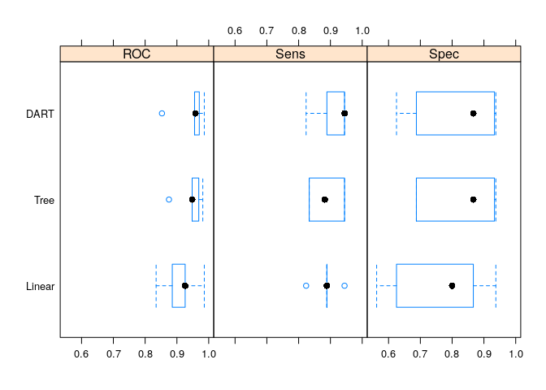
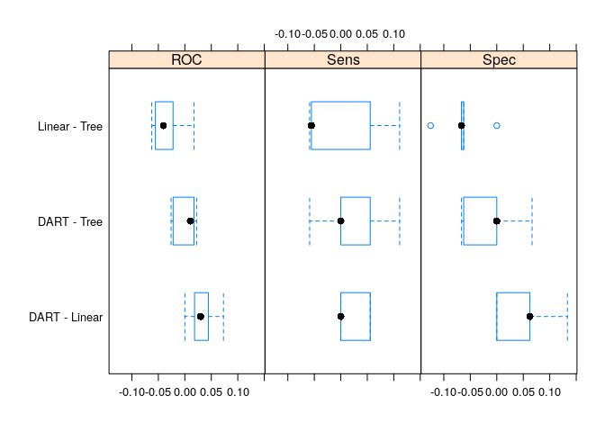

## Introduction

See [XGBoost R
Tutorial](https://xgboost.readthedocs.io/en/stable/R-package/xgboostPresentation.html)
for more information. This README was generated by running this notebook
in an RStudio server instance.

Install packages if missing and load.

    .libPaths('/packages')
    my_packages <- c('doParallel', 'xgboost', 'plyr', 'mlbench', 'caret')

    for (my_package in my_packages){
      if(!require(my_package, character.only = TRUE)){
        install.packages(my_package, '/packages')
      }
      library(my_package, character.only = TRUE)
    }

## Sonar data

From `?Sonar`

> This is the data set used by Gorman and Sejnowski in their study of
> the classification of sonar signals using a neural network. The task
> is to train a network to discriminate between sonar signals bounced
> off a metal cylinder and those bounced off a roughly cylindrical rock.
>
> Each pattern is a set of 60 numbers in the range 0.0 to 1.0. Each
> number represents the energy within a particular frequency band,
> integrated over a certain period of time. The integration aperture for
> higher frequencies occur later in time, since these frequencies are
> transmitted later during the chirp.
>
> The label associated with each record contains the letter “R” if the
> object is a rock and “M” if it is a mine (metal cylinder). The numbers
> in the labels are in increasing order of aspect angle, but they do not
> encode the angle directly.

    data(Sonar, package = "mlbench")

    my_feat <- Sonar[, -ncol(Sonar)]
    my_lab <- Sonar[, ncol(Sonar)]

    dim(my_feat)

    ## [1] 208  60

## Pre-processing

### Zero- and near zero-variance predictors

Predictors that have zero- or near zero-variance are not useful for
making predictions since different classes will have the same values.

    nzv <- nearZeroVar(my_feat, saveMetrics = TRUE)
    table(nzv$nzv)

    ## 
    ## FALSE 
    ##    60

### Correlated predictors

The `findCorrelation` function flags correlated predictors for removal.

    my_cor <- cor(my_feat)
    summary(my_cor[lower.tri(my_cor)])

    ##     Min.  1st Qu.   Median     Mean  3rd Qu.     Max. 
    ## -0.53178 -0.10560  0.10370  0.09967  0.25883  0.92584

Remove highly correlated predictors.

    my_cor_feat <- findCorrelation(my_cor, cutoff = 0.90)

    my_feat_filt <- my_feat[, -my_cor_feat]
    my_cor <- cor(my_feat_filt)
    summary(my_cor[lower.tri(my_cor)])

    ##    Min. 1st Qu.  Median    Mean 3rd Qu.    Max. 
    ## -0.5318 -0.0935  0.1095  0.1047  0.2588  0.8992

Data dimension after removing correlated predictors.

    dim(my_feat_filt)

    ## [1] 208  57

### Data splitting

Separate into training (80%) and testing (20%) using
`createDataPartition`. If the `y` argument to this function is a factor,
the random sampling occurs within each class and should preserve the
overall class distribution of the data.

    set.seed(1984)
    my_idx <- createDataPartition(
      y = my_lab,
      p = 0.8,
      list = FALSE,
      times = 1
    )

    my_train <- my_feat_filt[my_idx, ]
    my_train$class <- my_lab[my_idx]
    my_test <- my_feat_filt[-my_idx, ]
    my_test$class <- my_lab[-my_idx]

## Model training and tuning

The caret package supports three different XGBoost models (which
correspond to the type of booster):

1.  `xgbDART` - used for classification and regression and tuning
    parameters include: nrounds, max\_depth, eta, gamma, subsample,
    colsample\_bytree, rate\_drop, skip\_drop, min\_child\_weight
2.  `xgbLinear` - used for classification and regression, and tuning
    parameters include: nrounds, lambda, alpha, eta
3.  `xgbTree` - used for classification and regression, and tuning
    parameters include: nrounds, max\_depth, eta, gamma,
    colsample\_bytree, min\_child\_weight, subsample

[Parameter
descriptions](https://xgboost.readthedocs.io/en/stable/parameter.html):

-   `num_round` (range: \[0, Inf\]) - The number of rounds for boosting
-   `eta` (range: \[0,1\]) - a.k.a. the learning rate is a step size
    shrinkage used in update to prevents overfitting. After each
    boosting step, we can directly get the weights of new features, and
    `eta` shrinks the feature weights to make the boosting process more
    conservative.
-   `gamma` (range: \[0, Inf\]) - the minimum loss reduction required to
    make a further partition on a leaf node of the tree. The larger
    gamma is, the more conservative the algorithm will be.
-   `max_depth` (range: \[0, Inf\]) - the maximum depth of a tree.
    Increasing this value will make the model more complex and more
    likely to overfit. 0 indicates no limit on depth. Beware that
    XGBoost aggressively consumes memory when training a deep tree.
-   `min_child_weight` (range: \[0, Inf\]) - the minimum sum of instance
    weight (hessian) needed in a child. If the tree partition step
    results in a leaf node with the sum of instance weight less than
    `min_child_weight`, then the building process will give up further
    partitioning. In linear regression task, this simply corresponds to
    minimum number of instances needed to be in each node. The larger
    `min_child_weight` is, the more conservative the algorithm will be.
-   `subsample` (range: \[0,1\]) - the subsample ratio of the training
    instances. Setting it to 0.5 means that XGBoost would randomly
    sample half of the training data prior to growing trees. and this
    will prevent overfitting. Subsampling will occur once in every
    boosting iteration.
-   `colsample_bytree` (range: \[0,1\]) - is the subsample ratio of
    columns when constructing each tree. Subsampling occurs once for
    every tree constructed.
-   `rate_drop` (range: \[0,1\]) - dropout rate (a fraction of previous
    trees to drop during the dropout).
-   `skip_drop` (range: \[0,1\]) - probability of skipping the dropout
    procedure during a boosting iteration. If a dropout is skipped, new
    trees are added in the same manner as `gbtree`. Note that non-zero
    `skip_drop` has higher priority than `rate_drop` or `one_drop`.

Default grid for [DART
booster](https://xgboost.readthedocs.io/en/latest/tutorials/dart.html)
([xgbDART](https://github.com/topepo/caret/blob/master/models/files/xgbDART.R)).

    default_grid <- expand.grid(
      nrounds = floor((1:10) * 50),
      eta = c(0.3, 0.4),
      gamma = 0,
      max_depth = seq(1, 10),
      min_child_weight = c(1),
      subsample = seq(.5, 1, length = 10),
      colsample_bytree = c(0.6, 0.8),
      rate_drop = c(0.01, 0.50),
      skip_drop = c(0.05, 0.95)
    )

The function `trainControl` can be used to specify the type of
resampling and in the example below we perform 10 by 10
cross-validation. `classProbs` (logical) refers to whether class
probabilities should be computed for classification models (along with
predicted values) in each resample. `twoClassSummary` computes
sensitivity, specificity and the area under the ROC curve.

    fit_control <- trainControl(
      method = "repeatedcv",
      number = 5,
      repeats = 1,
      classProbs = TRUE,
      summaryFunction = twoClassSummary
    )

Train with DART Booster.

    ncore <- 16
    cl <- makePSOCKcluster(ncore)
    registerDoParallel(cl)
    my_grid <- expand.grid(
      nrounds = c(5, 10, 20, 50),
      max_depth = 6:7,
      eta = c(0.3, 0.4),
      gamma = 0,
      subsample = seq(.5, 1, length = 10),
      colsample_bytree = c(0.6, 0.8),
      rate_drop = c(0.01, 0.50),
      skip_drop = c(0.05, 0.95),
      min_child_weight = 1
    )

    set.seed(1984)
    system.time(
      my_xgbdart <- train(
        class ~ .,
        data = my_train,
        method = "xgbDART",
        trControl = fit_control,
        metric = "ROC",
        tuneGrid = my_grid,
        nthread = 2
      )
    )

    ##    user  system elapsed 
    ##  12.069  12.675 300.466

    stopCluster(cl)

    arrange(my_xgbdart$results, desc(ROC)) %>%
      select(ROC, nrounds, everything()) %>%
      head()

    ##         ROC nrounds max_depth eta rate_drop skip_drop min_child_weight
    ## 1 0.9446623      50         6 0.4      0.01      0.05                1
    ## 2 0.9416939      50         6 0.3      0.01      0.05                1
    ## 3 0.9406454      50         6 0.3      0.01      0.95                1
    ## 4 0.9383034      50         7 0.4      0.01      0.95                1
    ## 5 0.9376634      20         7 0.4      0.01      0.05                1
    ## 6 0.9375054      50         7 0.4      0.01      0.05                1
    ##   subsample colsample_bytree gamma      Sens      Spec      ROCSD     SensSD
    ## 1 0.8888889              0.8     0 0.9091503 0.8100000 0.05267170 0.05356886
    ## 2 0.5555556              0.8     0 0.8653595 0.8600000 0.02703605 0.02935725
    ## 3 0.8888889              0.6     0 0.8647059 0.7841667 0.02581661 0.05149522
    ## 4 0.8888889              0.6     0 0.8869281 0.8358333 0.04464540 0.04283415
    ## 5 0.9444444              0.6     0 0.8980392 0.7958333 0.04051349 0.06363745
    ## 6 0.9444444              0.6     0 0.9098039 0.8091667 0.04662337 0.05050051
    ##      SpecSD
    ## 1 0.1448359
    ## 2 0.1194097
    ## 3 0.1545996
    ## 4 0.1117102
    ## 5 0.1187317
    ## 6 0.1147688

Train using `xgbTree`.

    ncore <- 16
    cl <- makePSOCKcluster(ncore)
    registerDoParallel(cl)

    fit_control <- trainControl(
      method = "repeatedcv",
      number = 5,
      repeats = 1,
      classProbs = TRUE,
      summaryFunction = twoClassSummary
    )

    my_grid <- expand.grid(
      nrounds = c(5, 10, 20, 50),
      max_depth = 6:7,
      eta = c(0.3, 0.4),
      gamma = 0,
      subsample = seq(.5, 1, length = 10),
      colsample_bytree = c(0.6, 0.8),
      min_child_weight = 1
    )

    set.seed(1984)
    system.time(
      my_xgbtree <- train(
        class ~ .,
        data = my_train,
        method = "xgbTree",
        trControl = fit_control,
        metric = "ROC",
        tuneGrid = my_grid,
        nthread = 2
      )
    )

    ##    user  system elapsed 
    ##   8.159   6.323  81.941

    stopCluster(cl)

    arrange(my_xgbtree$results, desc(ROC)) %>%
      select(ROC, nrounds, everything()) %>%
      head()

    ##         ROC nrounds eta max_depth gamma colsample_bytree min_child_weight
    ## 1 0.9442593      50 0.4         6     0              0.8                1
    ## 2 0.9381400      50 0.4         7     0              0.8                1
    ## 3 0.9356863      50 0.4         7     0              0.6                1
    ## 4 0.9355692      50 0.4         7     0              0.8                1
    ## 5 0.9335240      50 0.3         7     0              0.8                1
    ## 6 0.9329548      50 0.3         7     0              0.8                1
    ##   subsample      Sens      Spec      ROCSD     SensSD     SpecSD
    ## 1 0.5555556 0.8875817 0.8225000 0.04126329 0.05563240 0.12640186
    ## 2 0.7222222 0.8647059 0.8100000 0.05556162 0.05149522 0.15774562
    ## 3 0.7222222 0.8535948 0.8600000 0.03250095 0.03246663 0.10174689
    ## 4 0.6666667 0.8764706 0.8208333 0.02674169 0.02427997 0.09218603
    ## 5 0.5000000 0.8980392 0.8608333 0.04996001 0.05006510 0.13435804
    ## 6 0.6666667 0.8640523 0.7966667 0.01507364 0.06802568 0.11881942

Linear Booster parameters.

-   `lambda` - L2 regularization term on weights. Increasing this value
    will make model more conservative. Normalised to number of training
    examples.
-   `alpha` - L1 regularization term on weights. Increasing this value
    will make model more conservative. Normalised to number of training
    examples.

Train using `xgbLinear` - used for classification and regression, and
tuning parameters include: nrounds, lambda, alpha, eta

    ncore <- 16
    cl <- makePSOCKcluster(ncore)
    registerDoParallel(cl)

    fit_control <- trainControl(
      method = "repeatedcv",
      number = 5,
      repeats = 1,
      classProbs = TRUE,
      summaryFunction = twoClassSummary
    )

    my_grid <- expand.grid(
      nrounds = c(5, 10, 20, 50),
      eta = c(0.3, 0.4),
      lambda = c(0.3, 0.6, 1, 2, 3, 5),
      alpha = c(0.3, 0.6, 1, 2, 3, 5)
    )

    set.seed(1984)
    system.time(
      my_xgblinear <- train(
        class ~ .,
        data = my_train,
        method = "xgbLinear",
        trControl = fit_control,
        metric = "ROC",
        tuneGrid = my_grid,
        nthread = 2
      )
    )

    ##    user  system elapsed 
    ##   5.361   0.316 256.623

    stopCluster(cl)

    arrange(my_xgblinear$results, desc(ROC)) %>%
      select(ROC, nrounds, everything()) %>%
      head()

    ##         ROC nrounds eta lambda alpha      Sens      Spec      ROCSD     SensSD
    ## 1 0.9115877      50 0.3    0.6   0.3 0.8869281 0.7583333 0.05608761 0.04283415
    ## 2 0.9115877      50 0.4    0.6   0.3 0.8869281 0.7583333 0.05608761 0.04283415
    ## 3 0.9115822      50 0.3    5.0   0.3 0.8758170 0.7583333 0.05287847 0.02922965
    ## 4 0.9115822      50 0.4    5.0   0.3 0.8758170 0.7583333 0.05287847 0.02922965
    ## 5 0.9109395      50 0.3    5.0   2.0 0.8529412 0.7583333 0.05411627 0.05487861
    ## 6 0.9109395      50 0.4    5.0   2.0 0.8529412 0.7583333 0.05411627 0.05487861
    ##      SpecSD
    ## 1 0.1594533
    ## 2 0.1594533
    ## 3 0.1594533
    ## 4 0.1594533
    ## 5 0.1251388
    ## 6 0.1251388

## Comparing models

Collect resampling results using `resamples`.

    resamps <- resamples(
      list(
        DART = my_xgbdart,
        Linear = my_xgblinear,
        Tree = my_xgbtree
      )
    )
    resamps

    ## 
    ## Call:
    ## resamples.default(x = list(DART = my_xgbdart, Linear = my_xgblinear, Tree
    ##  = my_xgbtree))
    ## 
    ## Models: DART, Linear, Tree 
    ## Number of resamples: 5 
    ## Performance metrics: ROC, Sens, Spec 
    ## Time estimates for: everything, final model fit

Summary.

    summary(resamps)

    ## 
    ## Call:
    ## summary.resamples(object = resamps)
    ## 
    ## Models: DART, Linear, Tree 
    ## Number of resamples: 5 
    ## 
    ## ROC 
    ##             Min.   1st Qu.    Median      Mean   3rd Qu.      Max. NA's
    ## DART   0.8529412 0.9555556 0.9583333 0.9446623 0.9703704 0.9861111    0
    ## Linear 0.8345588 0.8854167 0.9259259 0.9115877 0.9259259 0.9861111    0
    ## Tree   0.8750000 0.9479167 0.9481481 0.9442593 0.9687500 0.9814815    0
    ## 
    ## Sens 
    ##             Min.   1st Qu.    Median      Mean   3rd Qu.      Max. NA's
    ## DART   0.8235294 0.8888889 0.9444444 0.9091503 0.9444444 0.9444444    0
    ## Linear 0.8235294 0.8888889 0.8888889 0.8869281 0.8888889 0.9444444    0
    ## Tree   0.8333333 0.8333333 0.8823529 0.8875817 0.9444444 0.9444444    0
    ## 
    ## Spec 
    ##          Min. 1st Qu.    Median      Mean   3rd Qu.   Max. NA's
    ## DART   0.6250  0.6875 0.8666667 0.8100000 0.9333333 0.9375    0
    ## Linear 0.5625  0.6250 0.8000000 0.7583333 0.8666667 0.9375    0
    ## Tree   0.6875  0.6875 0.8666667 0.8225000 0.9333333 0.9375    0

Boxplots.

    bwplot(resamps, layout = c(3, 1))

Compute differences and use a simple *t*-test to evaluate the null
hypothesis that there is no difference between models.

    diff_values <- diff(resamps)
    summary(diff_values)

    ## 
    ## Call:
    ## summary.diff.resamples(object = diff_values)
    ## 
    ## p-value adjustment: bonferroni 
    ## Upper diagonal: estimates of the difference
    ## Lower diagonal: p-value for H0: difference = 0
    ## 
    ## ROC 
    ##        DART   Linear     Tree      
    ## DART           0.0330746  0.0004031
    ## Linear 0.1651            -0.0326716
    ## Tree   1.0000 0.2528               
    ## 
    ## Sens 
    ##        DART   Linear     Tree      
    ## DART           0.0222222  0.0215686
    ## Linear 0.5334            -0.0006536
    ## Tree   1.0000 1.0000               
    ## 
    ## Spec 
    ##        DART    Linear   Tree    
    ## DART            0.05167 -0.01250
    ## Linear 0.31512          -0.06417
    ## Tree   1.00000 0.09482

Boxplots.

    bwplot(diff_values, layout = c(3, 1))

## Session info

Time built.

    ## [1] "2022-12-20 02:44:12 UTC"

Session info.

    ## R version 4.2.0 (2022-04-22)
    ## Platform: x86_64-pc-linux-gnu (64-bit)
    ## Running under: Ubuntu 20.04.4 LTS
    ## 
    ## Matrix products: default
    ## BLAS:   /usr/lib/x86_64-linux-gnu/openblas-pthread/libblas.so.3
    ## LAPACK: /usr/lib/x86_64-linux-gnu/openblas-pthread/liblapack.so.3
    ## 
    ## locale:
    ##  [1] LC_CTYPE=en_US.UTF-8       LC_NUMERIC=C              
    ##  [3] LC_TIME=en_US.UTF-8        LC_COLLATE=en_US.UTF-8    
    ##  [5] LC_MONETARY=en_US.UTF-8    LC_MESSAGES=en_US.UTF-8   
    ##  [7] LC_PAPER=en_US.UTF-8       LC_NAME=C                 
    ##  [9] LC_ADDRESS=C               LC_TELEPHONE=C            
    ## [11] LC_MEASUREMENT=en_US.UTF-8 LC_IDENTIFICATION=C       
    ## 
    ## attached base packages:
    ## [1] parallel  stats     graphics  grDevices utils     datasets  methods  
    ## [8] base     
    ## 
    ## other attached packages:
    ##  [1] caret_6.0-93      lattice_0.20-45   mlbench_2.1-3     plyr_1.8.7       
    ##  [5] xgboost_1.6.0.1   doParallel_1.0.17 iterators_1.0.14  foreach_1.5.2    
    ##  [9] forcats_0.5.2     stringr_1.4.1     dplyr_1.0.10      purrr_0.3.5      
    ## [13] readr_2.1.3       tidyr_1.2.1       tibble_3.1.8      ggplot2_3.4.0    
    ## [17] tidyverse_1.3.2  
    ## 
    ## loaded via a namespace (and not attached):
    ##  [1] nlme_3.1-160         fs_1.5.2             lubridate_1.9.0     
    ##  [4] httr_1.4.4           tools_4.2.0          backports_1.4.1     
    ##  [7] utf8_1.2.2           R6_2.5.1             rpart_4.1.19        
    ## [10] DBI_1.1.3            colorspace_2.0-3     nnet_7.3-18         
    ## [13] withr_2.5.0          tidyselect_1.2.0     compiler_4.2.0      
    ## [16] cli_3.4.1            rvest_1.0.3          xml2_1.3.3          
    ## [19] scales_1.2.1         digest_0.6.30        rmarkdown_2.17      
    ## [22] pkgconfig_2.0.3      htmltools_0.5.3      parallelly_1.32.1   
    ## [25] highr_0.9            dbplyr_2.2.1         fastmap_1.1.0       
    ## [28] rlang_1.0.6          readxl_1.4.1         rstudioapi_0.14     
    ## [31] generics_0.1.3       jsonlite_1.8.3       ModelMetrics_1.2.2.2
    ## [34] googlesheets4_1.0.1  magrittr_2.0.3       Matrix_1.5-1        
    ## [37] Rcpp_1.0.9           munsell_0.5.0        fansi_1.0.3         
    ## [40] lifecycle_1.0.3      pROC_1.18.0          stringi_1.7.8       
    ## [43] yaml_2.3.6           MASS_7.3-58.1        recipes_1.0.2       
    ## [46] grid_4.2.0           listenv_0.8.0        crayon_1.5.2        
    ## [49] haven_2.5.1          splines_4.2.0        hms_1.1.2           
    ## [52] knitr_1.40           pillar_1.8.1         stats4_4.2.0        
    ## [55] reshape2_1.4.4       future.apply_1.10.0  codetools_0.2-18    
    ## [58] reprex_2.0.2         glue_1.6.2           evaluate_0.17       
    ## [61] data.table_1.14.4    modelr_0.1.9         vctrs_0.5.0         
    ## [64] tzdb_0.3.0           cellranger_1.1.0     gtable_0.3.1        
    ## [67] future_1.29.0        assertthat_0.2.1     xfun_0.34           
    ## [70] gower_1.0.0          prodlim_2019.11.13   broom_1.0.1         
    ## [73] class_7.3-20         survival_3.4-0       googledrive_2.0.0   
    ## [76] gargle_1.2.1         timeDate_4021.106    hardhat_1.2.0       
    ## [79] lava_1.7.0           timechange_0.1.1     globals_0.16.1      
    ## [82] ellipsis_0.3.2       ipred_0.9-13
