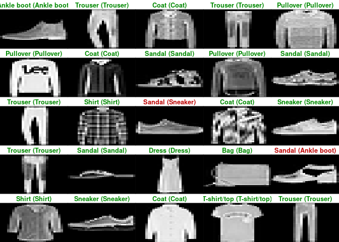

## Introduction

Install packages if missing and load.

``` r
.libPaths('/packages')
my_packages <- c('keras3', 'tensorflow')

for (my_package in my_packages){
   if(!require(my_package, character.only = TRUE)){
      install.packages(my_package, '/packages')
      library(my_package, character.only = TRUE)
   }
}
```

## Reticulate

Use [reticulate](https://rstudio.github.io/reticulate/).

``` r
library(reticulate)
use_python("/usr/bin/python3")
reticulate::py_config()
```

    ## python:         /usr/bin/python3
    ## libpython:      /usr/lib/python3.10/config-3.10-x86_64-linux-gnu/libpython3.10.so
    ## pythonhome:     //usr://usr
    ## version:        3.10.12 (main, Nov 20 2023, 15:14:05) [GCC 11.4.0]
    ## numpy:          /usr/local/lib/python3.10/dist-packages/numpy
    ## numpy_version:  1.26.4
    ## keras:          /usr/local/lib/python3.10/dist-packages/keras
    ## 
    ## NOTE: Python version was forced by use_python() function

## MNIST dataset

``` r
mnist <- dataset_mnist()
```

    ## Downloading data from https://storage.googleapis.com/tensorflow/tf-keras-datasets/mnist.npz
    ##        0/11490434 ━━━━━━━━━━━━━━━━━━━━ 0s 0s/step   16384/11490434 ━━━━━━━━━━━━━━━━━━━━ 44s 4us/step   49152/11490434 ━━━━━━━━━━━━━━━━━━━━ 38s 3us/step   81920/11490434 ━━━━━━━━━━━━━━━━━━━━ 37s 3us/step  147456/11490434 ━━━━━━━━━━━━━━━━━━━━ 25s 2us/step  212992/11490434 ━━━━━━━━━━━━━━━━━━━━ 20s 2us/step  294912/11490434 ━━━━━━━━━━━━━━━━━━━━ 16s 1us/step  458752/11490434 ━━━━━━━━━━━━━━━━━━━━ 11s 1us/step  655360/11490434 ━━━━━━━━━━━━━━━━━━━━ 9s 1us/step   983040/11490434 ━━━━━━━━━━━━━━━━━━━━ 6s 1us/step 1458176/11490434 ━━━━━━━━━━━━━━━━━━━━ 4s 0us/step 2154496/11490434 ━━━━━━━━━━━━━━━━━━━━ 3s 0us/step 3252224/11490434 ━━━━━━━━━━━━━━━━━━━━ 1s 0us/step 4800512/11490434 ━━━━━━━━━━━━━━━━━━━━ 1s 0us/step 7143424/11490434 ━━━━━━━━━━━━━━━━━━━━ 0s 0us/step 8994816/11490434 ━━━━━━━━━━━━━━━━━━━━ 0s 0us/step11239424/11490434 ━━━━━━━━━━━━━━━━━━━━ 0s 0us/step11490434/11490434 ━━━━━━━━━━━━━━━━━━━━ 1s 0us/step

``` r
train_images <- mnist$train$x
train_labels <- mnist$train$y
test_images <- mnist$test$x
test_labels <- mnist$test$y
```

``` r
network <- keras_model_sequential() %>%
   layer_dense(units = 512, activation = "relu", input_shape = c(28 * 28)) %>%
   layer_dense(units = 10, activation = "softmax")

network
```

    ## Model: "sequential"
    ## ┏━━━━━━━━━━━━━━━━━━━━━━━━━━━━━━━━━━━┳━━━━━━━━━━━━━━━━━━━━━━━━━━┳━━━━━━━━━━━━━━━┓
    ## ┃ Layer (type)                      ┃ Output Shape             ┃       Param # ┃
    ## ┡━━━━━━━━━━━━━━━━━━━━━━━━━━━━━━━━━━━╇━━━━━━━━━━━━━━━━━━━━━━━━━━╇━━━━━━━━━━━━━━━┩
    ## │ dense (Dense)                     │ (None, 512)              │       401,920 │
    ## ├───────────────────────────────────┼──────────────────────────┼───────────────┤
    ## │ dense_1 (Dense)                   │ (None, 10)               │         5,130 │
    ## └───────────────────────────────────┴──────────────────────────┴───────────────┘
    ##  Total params: 407,050 (1.55 MB)
    ##  Trainable params: 407,050 (1.55 MB)
    ##  Non-trainable params: 0 (0.00 B)

``` r
network %>% compile(
   optimizer = "rmsprop",
   loss = "categorical_crossentropy",
   metrics = c("accuracy")
)
```

``` r
train_images <- array_reshape(train_images, c(60000, 28 * 28))
train_images <- train_images / 255
test_images <- array_reshape(test_images, c(10000, 28 * 28))
test_images <- test_images / 255
train_labels <- to_categorical(train_labels)
test_labels <- to_categorical(test_labels)
```

``` r
network %>% fit(train_images, train_labels, epochs = 5, batch_size = 128)
```

    ## Epoch 1/5
    ## 469/469 - 2s - 3ms/step - accuracy: 0.9248 - loss: 0.2618
    ## Epoch 2/5
    ## 469/469 - 1s - 3ms/step - accuracy: 0.9679 - loss: 0.1077
    ## Epoch 3/5
    ## 469/469 - 1s - 2ms/step - accuracy: 0.9788 - loss: 0.0710
    ## Epoch 4/5
    ## 469/469 - 1s - 3ms/step - accuracy: 0.9846 - loss: 0.0516
    ## Epoch 5/5
    ## 469/469 - 1s - 2ms/step - accuracy: 0.9883 - loss: 0.0393

``` r
metrics <- network %>% evaluate(test_images, test_labels)
```

    ## 313/313 - 0s - 1ms/step - accuracy: 0.9796 - loss: 0.0688

``` r
metrics
```

    ## $accuracy
    ## [1] 0.9796
    ## 
    ## $loss
    ## [1] 0.06884416

``` r
network %>% predict(test_images[1:10,]) %>% k_argmax()
```

## Fashion MNIST

Following the [Basic Image
Classification](https://tensorflow.rstudio.com/tutorials/beginners/basic-ml/tutorial_basic_classification/)
guide.

This guide uses the Fashion MNIST dataset which contains 70,000
grayscale images in 10 categories. The images show individual articles
of clothing at low resolution (28 by 28 pixels).

Fashion MNIST is intended as a drop-in replacement for the classic MNIST
dataset and is a slightly more challenging problem than regular MNIST.

We will use 60,000 images to train the network and 10,000 images to
evaluate how accurately the network learned to classify images.

``` r
fashion_mnist <- dataset_fashion_mnist()
```

    ## Downloading data from https://storage.googleapis.com/tensorflow/tf-keras-datasets/train-labels-idx1-ubyte.gz
    ##     0/29515 ━━━━━━━━━━━━━━━━━━━━ 0s 0s/step29515/29515 ━━━━━━━━━━━━━━━━━━━━ 0s 0us/step
    ## Downloading data from https://storage.googleapis.com/tensorflow/tf-keras-datasets/train-images-idx3-ubyte.gz
    ##        0/26421880 ━━━━━━━━━━━━━━━━━━━━ 0s 0s/step   16384/26421880 ━━━━━━━━━━━━━━━━━━━━ 1:39 4us/step   49152/26421880 ━━━━━━━━━━━━━━━━━━━━ 1:28 3us/step   81920/26421880 ━━━━━━━━━━━━━━━━━━━━ 1:25 3us/step  147456/26421880 ━━━━━━━━━━━━━━━━━━━━ 57s 2us/step   212992/26421880 ━━━━━━━━━━━━━━━━━━━━ 47s 2us/step  294912/26421880 ━━━━━━━━━━━━━━━━━━━━ 38s 1us/step  458752/26421880 ━━━━━━━━━━━━━━━━━━━━ 27s 1us/step  655360/26421880 ━━━━━━━━━━━━━━━━━━━━ 21s 1us/step  999424/26421880 ━━━━━━━━━━━━━━━━━━━━ 15s 1us/step 1474560/26421880 ━━━━━━━━━━━━━━━━━━━━ 10s 0us/step 2170880/26421880 ━━━━━━━━━━━━━━━━━━━━ 7s 0us/step  3252224/26421880 ━━━━━━━━━━━━━━━━━━━━ 5s 0us/step 4800512/26421880 ━━━━━━━━━━━━━━━━━━━━ 3s 0us/step 6619136/26421880 ━━━━━━━━━━━━━━━━━━━━ 2s 0us/step 8355840/26421880 ━━━━━━━━━━━━━━━━━━━━ 1s 0us/step10076160/26421880 ━━━━━━━━━━━━━━━━━━━━ 1s 0us/step11993088/26421880 ━━━━━━━━━━━━━━━━━━━━ 1s 0us/step13451264/26421880 ━━━━━━━━━━━━━━━━━━━━ 1s 0us/step14647296/26421880 ━━━━━━━━━━━━━━━━━━━━ 0s 0us/step16711680/26421880 ━━━━━━━━━━━━━━━━━━━━ 0s 0us/step19775488/26421880 ━━━━━━━━━━━━━━━━━━━━ 0s 0us/step21544960/26421880 ━━━━━━━━━━━━━━━━━━━━ 0s 0us/step23232512/26421880 ━━━━━━━━━━━━━━━━━━━━ 0s 0us/step25083904/26421880 ━━━━━━━━━━━━━━━━━━━━ 0s 0us/step26421880/26421880 ━━━━━━━━━━━━━━━━━━━━ 1s 0us/step
    ## Downloading data from https://storage.googleapis.com/tensorflow/tf-keras-datasets/t10k-labels-idx1-ubyte.gz
    ##    0/5148 ━━━━━━━━━━━━━━━━━━━━ 0s 0s/step5148/5148 ━━━━━━━━━━━━━━━━━━━━ 0s 0us/step
    ## Downloading data from https://storage.googleapis.com/tensorflow/tf-keras-datasets/t10k-images-idx3-ubyte.gz
    ##       0/4422102 ━━━━━━━━━━━━━━━━━━━━ 0s 0s/step3514368/4422102 ━━━━━━━━━━━━━━━━━━━━ 0s 0us/step4422102/4422102 ━━━━━━━━━━━━━━━━━━━━ 0s 0us/step

``` r
str(fashion_mnist)
```

    ## List of 2
    ##  $ train:List of 2
    ##   ..$ x: int [1:60000, 1:28, 1:28] 0 0 0 0 0 0 0 0 0 0 ...
    ##   ..$ y: int [1:60000(1d)] 9 0 0 3 0 2 7 2 5 5 ...
    ##  $ test :List of 2
    ##   ..$ x: int [1:10000, 1:28, 1:28] 0 0 0 0 0 0 0 0 0 0 ...
    ##   ..$ y: int [1:10000(1d)] 9 2 1 1 6 1 4 6 5 7 ...

Assign.

``` r
c(train_images, train_labels) %<-% fashion_mnist$train
c(test_images, test_labels) %<-% fashion_mnist$test
```

The labels are arrays of integers ranging from 0 to 9 and correspond to
the class of clothing the image represents:

  Digit   Class
  ------- -------------
  0       T-shirt/top
  1       Trouser
  2       Pullover
  3       Dress
  4       Coat
  5       Sandal
  6       Shirt
  7       Sneaker
  8       Bag
  9       Ankle boot

``` r
class_names = c(
   'T-shirt/top',
   'Trouser',
   'Pullover',
   'Dress',
   'Coat', 
   'Sandal',
   'Shirt',
   'Sneaker',
   'Bag',
   'Ankle boot'
)
```

``` r
image_1 <- as.data.frame(train_images[1, , ])
colnames(image_1) <- seq_len(ncol(image_1))
image_1$y <- seq_len(nrow(image_1))
image_1 <- gather(image_1, "x", "value", -y)
image_1$x <- as.integer(image_1$x)

ggplot(image_1, aes(x = x, y = y, fill = value)) +
  geom_tile() +
  scale_fill_gradient(low = "white", high = "black", na.value = NA) +
  scale_y_reverse() +
  theme_minimal() +
  theme(panel.grid = element_blank())   +
  theme(aspect.ratio = 1) +
  xlab("") +
  ylab("")
```


Scale values to a range of 0 to 1 by dividing by 255 before feeding to
the neural network model. It is important that the training set and the
testing set are pre-processed in the same way.

``` r
train_images <- train_images / 255
test_images <- test_images / 255
```

Display the first 25 images.

``` r
par(mfcol=c(5,5))
par(mar=c(0, 0, 1.5, 0), xaxs='i', yaxs='i')
for (i in 1:25) { 
  img <- train_images[i, , ]
  img <- t(apply(img, 2, rev)) 
  image(1:28, 1:28, img, col = gray((0:255)/255), xaxt = 'n', yaxt = 'n',
        main = paste(class_names[train_labels[i] + 1]))
}
```


Set up the layers.

``` r
model <- keras_model_sequential()
model %>%
  layer_flatten(input_shape = c(28, 28)) %>%
  layer_dense(units = 128, activation = 'relu') %>%
  layer_dense(units = 10, activation = 'softmax')
```

``` r
model %>% compile(
  optimizer = 'adam', 
  loss = 'sparse_categorical_crossentropy',
  metrics = c('accuracy')
)
```

``` r
model %>% fit(train_images, train_labels, epochs = 5, verbose = 2)
```

    ## Epoch 1/5
    ## 1875/1875 - 2s - 1ms/step - accuracy: 0.8235 - loss: 0.5004
    ## Epoch 2/5
    ## 1875/1875 - 2s - 892us/step - accuracy: 0.8644 - loss: 0.3753
    ## Epoch 3/5
    ## 1875/1875 - 2s - 891us/step - accuracy: 0.8781 - loss: 0.3363
    ## Epoch 4/5
    ## 1875/1875 - 2s - 892us/step - accuracy: 0.8869 - loss: 0.3103
    ## Epoch 5/5
    ## 1875/1875 - 2s - 882us/step - accuracy: 0.8923 - loss: 0.2930

``` r
score <- model %>% evaluate(test_images, test_labels, verbose = 0)
score
```

    ## $accuracy
    ## [1] 0.8753
    ## 
    ## $loss
    ## [1] 0.345738

``` r
predictions <- model %>% predict(test_images)
```

    ## 313/313 - 0s - 677us/step

``` r
predictions[1, ]
```

    ##  [1] 7.293896e-07 4.100511e-08 6.834866e-08 1.239387e-07 2.690090e-07
    ##  [6] 3.874218e-03 1.926635e-06 2.916905e-02 6.440329e-07 9.669528e-01

``` r
which.max(predictions[1, ])
```

    ## [1] 10

``` r
class_pred <- model %>% predict(test_images) %>% k_argmax()

class_pred[1:20]
```

``` r
test_labels[1:20]
```

    ##  [1] 9 2 1 1 6 1 4 6 5 7 4 5 7 3 4 1 2 4 8 0

``` r
par(mfcol=c(5,5))
par(mar=c(0, 0, 1.5, 0), xaxs='i', yaxs='i')
for (i in 1:25) { 
   img <- test_images[i, , ]
   img <- t(apply(img, 2, rev)) 
   # subtract 1 as labels go from 0 to 9
   predicted_label <- which.max(predictions[i, ]) - 1
   true_label <- test_labels[i]
   if (predicted_label == true_label) {
      color <- '#008800' 
   } else {
      color <- '#bb0000'
   }
   image(1:28, 1:28, img, col = gray((0:255)/255), xaxt = 'n', yaxt = 'n',
         main = paste0(class_names[predicted_label + 1], " (",
                       class_names[true_label + 1], ")"),
         col.main = color)
}
```



## Session info

Time built.

    ## [1] "2024-06-11 02:11:27 UTC"

Session info.

    ## R version 4.4.0 (2024-04-24)
    ## Platform: x86_64-pc-linux-gnu
    ## Running under: Ubuntu 22.04.4 LTS
    ## 
    ## Matrix products: default
    ## BLAS:   /usr/lib/x86_64-linux-gnu/openblas-pthread/libblas.so.3 
    ## LAPACK: /usr/lib/x86_64-linux-gnu/openblas-pthread/libopenblasp-r0.3.20.so;  LAPACK version 3.10.0
    ## 
    ## locale:
    ##  [1] LC_CTYPE=en_US.UTF-8       LC_NUMERIC=C              
    ##  [3] LC_TIME=en_US.UTF-8        LC_COLLATE=en_US.UTF-8    
    ##  [5] LC_MONETARY=en_US.UTF-8    LC_MESSAGES=en_US.UTF-8   
    ##  [7] LC_PAPER=en_US.UTF-8       LC_NAME=C                 
    ##  [9] LC_ADDRESS=C               LC_TELEPHONE=C            
    ## [11] LC_MEASUREMENT=en_US.UTF-8 LC_IDENTIFICATION=C       
    ## 
    ## time zone: Etc/UTC
    ## tzcode source: system (glibc)
    ## 
    ## attached base packages:
    ## [1] stats     graphics  grDevices utils     datasets  methods   base     
    ## 
    ## other attached packages:
    ##  [1] reticulate_1.37.0 tensorflow_2.16.0 keras3_1.0.0      lubridate_1.9.3  
    ##  [5] forcats_1.0.0     stringr_1.5.1     dplyr_1.1.4       purrr_1.0.2      
    ##  [9] readr_2.1.5       tidyr_1.3.1       tibble_3.2.1      ggplot2_3.5.1    
    ## [13] tidyverse_2.0.0  
    ## 
    ## loaded via a namespace (and not attached):
    ##  [1] utf8_1.2.4        generics_0.1.3    stringi_1.8.3     lattice_0.22-6   
    ##  [5] hms_1.1.3         digest_0.6.35     magrittr_2.0.3    evaluate_0.23    
    ##  [9] grid_4.4.0        timechange_0.3.0  fastmap_1.1.1     jsonlite_1.8.8   
    ## [13] Matrix_1.7-0      whisker_0.4.1     tfruns_1.5.3      fansi_1.0.6      
    ## [17] scales_1.3.0      cli_3.6.2         rlang_1.1.3       munsell_0.5.1    
    ## [21] base64enc_0.1-3   withr_3.0.0       yaml_2.3.8        tools_4.4.0      
    ## [25] tzdb_0.4.0        zeallot_0.1.0     colorspace_2.1-0  vctrs_0.6.5      
    ## [29] R6_2.5.1          png_0.1-8         lifecycle_1.0.4   pkgconfig_2.0.3  
    ## [33] pillar_1.9.0      gtable_0.3.5      glue_1.7.0        Rcpp_1.0.12      
    ## [37] highr_0.10        xfun_0.43         tidyselect_1.2.1  knitr_1.46       
    ## [41] farver_2.1.1      htmltools_0.5.8.1 labeling_0.4.3    rmarkdown_2.27   
    ## [45] compiler_4.4.0
