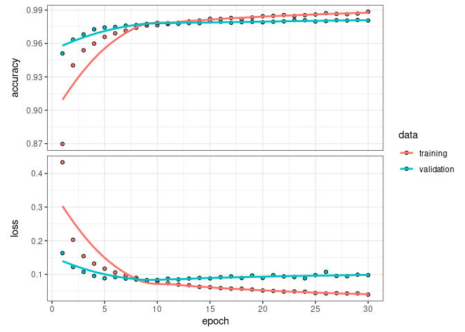
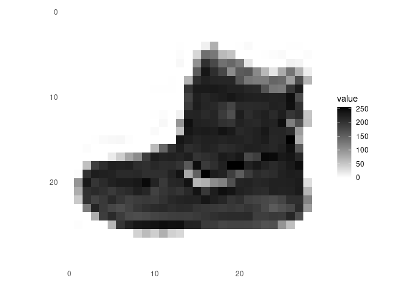
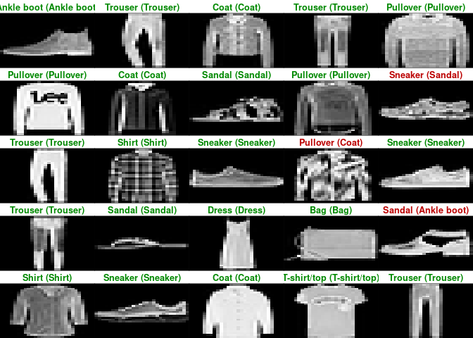

# Keras

[Keras](https://keras.posit.co/) is a high-level neural networks API
developed with a focus on enabling fast experimentation. Being able to
go from idea to result with the least possible delay is key to doing
good research. Keras has the following key features:

-   Allows the same code to run on CPU or on GPU, seamlessly.
-   User-friendly API which makes it easy to quickly prototype deep
    learning models.
-   Built-in support for convolutional networks (for computer vision),
    recurrent networks (for sequence processing), and any combination of
    both.
-   Supports arbitrary network architectures: multi-input or
    multi-output models, layer sharing, model sharing, etc. This means
    that Keras is appropriate for building essentially any deep learning
    model, from a memory network to a neural Turing machine.

## Packages

Install packages if missing and load.

``` r
.libPaths('/packages')
my_packages <- c('keras3', 'tensorflow')

for (my_package in my_packages){
   if(!require(my_package, character.only = TRUE)){
      install.packages(my_package, '/packages')
      library(my_package, character.only = TRUE)
   }
}
```

## Reticulate

Use [reticulate](https://rstudio.github.io/reticulate/).

``` r
library(reticulate)
use_python("/usr/bin/python3")
reticulate::py_config()
```

    ## python:         /usr/bin/python3
    ## libpython:      /usr/lib/python3.10/config-3.10-x86_64-linux-gnu/libpython3.10.so
    ## pythonhome:     //usr://usr
    ## version:        3.10.12 (main, Nov 20 2023, 15:14:05) [GCC 11.4.0]
    ## numpy:          /usr/local/lib/python3.10/dist-packages/numpy
    ## numpy_version:  1.26.4
    ## keras:          /usr/local/lib/python3.10/dist-packages/keras
    ## 
    ## NOTE: Python version was forced by use_python() function

## MNIST dataset

[Simple
example](https://keras.posit.co/articles/getting_started.html#mnist-example)
of trying to recognise handwritten digits from the
[MNIST](https://en.wikipedia.org/wiki/MNIST_database) dataset. MNIST
consists of 28 x 28 grayscale images of handwritten digits.

The MNIST dataset is included with Keras and can be accessed using the
`dataset_mnist()` function.

``` r
mnist <- dataset_mnist()
```

    ## Downloading data from https://storage.googleapis.com/tensorflow/tf-keras-datasets/mnist.npz
    ##        0/11490434 ━━━━━━━━━━━━━━━━━━━━ 0s 0s/step   16384/11490434 ━━━━━━━━━━━━━━━━━━━━ 43s 4us/step   49152/11490434 ━━━━━━━━━━━━━━━━━━━━ 38s 3us/step   81920/11490434 ━━━━━━━━━━━━━━━━━━━━ 37s 3us/step  147456/11490434 ━━━━━━━━━━━━━━━━━━━━ 24s 2us/step  212992/11490434 ━━━━━━━━━━━━━━━━━━━━ 20s 2us/step  294912/11490434 ━━━━━━━━━━━━━━━━━━━━ 16s 1us/step  458752/11490434 ━━━━━━━━━━━━━━━━━━━━ 11s 1us/step  655360/11490434 ━━━━━━━━━━━━━━━━━━━━ 8s 1us/step   983040/11490434 ━━━━━━━━━━━━━━━━━━━━ 6s 1us/step 1458176/11490434 ━━━━━━━━━━━━━━━━━━━━ 4s 0us/step 2154496/11490434 ━━━━━━━━━━━━━━━━━━━━ 2s 0us/step 3252224/11490434 ━━━━━━━━━━━━━━━━━━━━ 1s 0us/step 4653056/11490434 ━━━━━━━━━━━━━━━━━━━━ 1s 0us/step 7110656/11490434 ━━━━━━━━━━━━━━━━━━━━ 0s 0us/step 8945664/11490434 ━━━━━━━━━━━━━━━━━━━━ 0s 0us/step11173888/11490434 ━━━━━━━━━━━━━━━━━━━━ 0s 0us/step11490434/11490434 ━━━━━━━━━━━━━━━━━━━━ 1s 0us/step

``` r
x_train <- mnist$train$x
y_train <- mnist$train$y
x_test <- mnist$test$x
y_test <- mnist$test$y
```

The x data is a 3-d array (images, width, height) of grayscale values.
To prepare the data for training we convert the 3-d arrays into matrices
by reshaping width and height into a single dimension (28x28 images are
flattened into length 784 vectors). Then, we convert the grayscale
values from integers ranging between 0 to 255 into floating point values
ranging between 0 and 1.

``` r
# reshape
x_train <- array_reshape(x_train, c(nrow(x_train), 784))
x_test <- array_reshape(x_test, c(nrow(x_test), 784))
# rescale
x_train <- x_train / 255
x_test <- x_test / 255
```

The y data is an integer vector with values ranging from 0 to 9. To
prepare this data for training we one-hot encode the vectors into binary
class matrices using the Keras `to_categorical()` function.

``` r
y_train <- to_categorical(y_train, 10)
y_test <- to_categorical(y_test, 10)
```

The core data structure of Keras is a model, a way to organise layers.
The simplest type of model is the Sequential model, a linear stack of
layers.

We begin by creating a sequential model and then adding layers using the
pipe (\|\>) operator.

``` r
model <- keras_model_sequential(input_shape = c(784))
model |>
  layer_dense(units = 256, activation = 'relu') |>
  layer_dropout(rate = 0.4) |>
  layer_dense(units = 128, activation = 'relu') |>
  layer_dropout(rate = 0.3) |>
  layer_dense(units = 10, activation = 'softmax')
```

The input_shape argument to the first layer specifies the shape of the
input data (a length 784 numeric vector representing a grayscale image).
The final layer outputs a length 10 numeric vector (probabilities for
each digit) using a softmax activation function.

Use the `summary()` function to print the details of the model.

``` r
summary(model)
```

    ## Model: "sequential"
    ## ┏━━━━━━━━━━━━━━━━━━━━━━━━━━━━━━━━━━━┳━━━━━━━━━━━━━━━━━━━━━━━━━━┳━━━━━━━━━━━━━━━┓
    ## ┃ Layer (type)                      ┃ Output Shape             ┃       Param # ┃
    ## ┡━━━━━━━━━━━━━━━━━━━━━━━━━━━━━━━━━━━╇━━━━━━━━━━━━━━━━━━━━━━━━━━╇━━━━━━━━━━━━━━━┩
    ## │ dense (Dense)                     │ (None, 256)              │       200,960 │
    ## ├───────────────────────────────────┼──────────────────────────┼───────────────┤
    ## │ dropout (Dropout)                 │ (None, 256)              │             0 │
    ## ├───────────────────────────────────┼──────────────────────────┼───────────────┤
    ## │ dense_1 (Dense)                   │ (None, 128)              │        32,896 │
    ## ├───────────────────────────────────┼──────────────────────────┼───────────────┤
    ## │ dropout_1 (Dropout)               │ (None, 128)              │             0 │
    ## ├───────────────────────────────────┼──────────────────────────┼───────────────┤
    ## │ dense_2 (Dense)                   │ (None, 10)               │         1,290 │
    ## └───────────────────────────────────┴──────────────────────────┴───────────────┘
    ##  Total params: 235,146 (918.54 KB)
    ##  Trainable params: 235,146 (918.54 KB)
    ##  Non-trainable params: 0 (0.00 B)

Plot.

``` r
plot(model)
```

``{=html}

Next, compile the model with appropriate loss function, optimiser, and
metrics.

``` r
model |> compile(
  loss = 'categorical_crossentropy',
  optimizer = optimizer_rmsprop(),
  metrics = c('accuracy')
)
```

Use the `fit()` function to train the model for 30 epochs using batches
of 128 images.

``` r
history <- model |> fit(
  x_train, y_train,
  epochs = 30, batch_size = 128,
  validation_split = 0.2
)
```

    ## Epoch 1/30
    ## 375/375 - 1s - 4ms/step - accuracy: 0.8697 - loss: 0.4332 - val_accuracy: 0.9510 - val_loss: 0.1630
    ## Epoch 2/30
    ## 375/375 - 1s - 2ms/step - accuracy: 0.9403 - loss: 0.2028 - val_accuracy: 0.9634 - val_loss: 0.1218
    ## Epoch 3/30
    ## 375/375 - 1s - 2ms/step - accuracy: 0.9539 - loss: 0.1541 - val_accuracy: 0.9681 - val_loss: 0.1072
    ## Epoch 4/30
    ## 375/375 - 1s - 2ms/step - accuracy: 0.9599 - loss: 0.1319 - val_accuracy: 0.9727 - val_loss: 0.0955
    ## Epoch 5/30
    ## 375/375 - 1s - 2ms/step - accuracy: 0.9659 - loss: 0.1168 - val_accuracy: 0.9743 - val_loss: 0.0882
    ## Epoch 6/30
    ## 375/375 - 1s - 2ms/step - accuracy: 0.9691 - loss: 0.1056 - val_accuracy: 0.9747 - val_loss: 0.0918
    ## Epoch 7/30
    ## 375/375 - 1s - 2ms/step - accuracy: 0.9715 - loss: 0.0964 - val_accuracy: 0.9760 - val_loss: 0.0873
    ## Epoch 8/30
    ## 375/375 - 1s - 2ms/step - accuracy: 0.9741 - loss: 0.0896 - val_accuracy: 0.9765 - val_loss: 0.0844
    ## Epoch 9/30
    ## 375/375 - 1s - 2ms/step - accuracy: 0.9760 - loss: 0.0791 - val_accuracy: 0.9776 - val_loss: 0.0830
    ## Epoch 10/30
    ## 375/375 - 1s - 2ms/step - accuracy: 0.9764 - loss: 0.0791 - val_accuracy: 0.9784 - val_loss: 0.0833
    ## Epoch 11/30
    ## 375/375 - 1s - 2ms/step - accuracy: 0.9774 - loss: 0.0736 - val_accuracy: 0.9782 - val_loss: 0.0873
    ## Epoch 12/30
    ## 375/375 - 1s - 2ms/step - accuracy: 0.9786 - loss: 0.0695 - val_accuracy: 0.9777 - val_loss: 0.0848
    ## Epoch 13/30
    ## 375/375 - 1s - 2ms/step - accuracy: 0.9797 - loss: 0.0676 - val_accuracy: 0.9783 - val_loss: 0.0875
    ## Epoch 14/30
    ## 375/375 - 1s - 2ms/step - accuracy: 0.9805 - loss: 0.0627 - val_accuracy: 0.9782 - val_loss: 0.0893
    ## Epoch 15/30
    ## 375/375 - 1s - 2ms/step - accuracy: 0.9821 - loss: 0.0615 - val_accuracy: 0.9797 - val_loss: 0.0879
    ## Epoch 16/30
    ## 375/375 - 1s - 2ms/step - accuracy: 0.9820 - loss: 0.0589 - val_accuracy: 0.9795 - val_loss: 0.0914
    ## Epoch 17/30
    ## 375/375 - 1s - 2ms/step - accuracy: 0.9829 - loss: 0.0576 - val_accuracy: 0.9786 - val_loss: 0.0936
    ## Epoch 18/30
    ## 375/375 - 1s - 3ms/step - accuracy: 0.9818 - loss: 0.0574 - val_accuracy: 0.9792 - val_loss: 0.0891
    ## Epoch 19/30
    ## 375/375 - 1s - 3ms/step - accuracy: 0.9833 - loss: 0.0549 - val_accuracy: 0.9794 - val_loss: 0.0966
    ## Epoch 20/30
    ## 375/375 - 1s - 3ms/step - accuracy: 0.9845 - loss: 0.0519 - val_accuracy: 0.9790 - val_loss: 0.0892
    ## Epoch 21/30
    ## 375/375 - 1s - 3ms/step - accuracy: 0.9848 - loss: 0.0506 - val_accuracy: 0.9795 - val_loss: 0.0977
    ## Epoch 22/30
    ## 375/375 - 1s - 3ms/step - accuracy: 0.9855 - loss: 0.0486 - val_accuracy: 0.9798 - val_loss: 0.0937
    ## Epoch 23/30
    ## 375/375 - 1s - 3ms/step - accuracy: 0.9845 - loss: 0.0492 - val_accuracy: 0.9809 - val_loss: 0.0918
    ## Epoch 24/30
    ## 375/375 - 1s - 3ms/step - accuracy: 0.9854 - loss: 0.0483 - val_accuracy: 0.9808 - val_loss: 0.0881
    ## Epoch 25/30
    ## 375/375 - 1s - 3ms/step - accuracy: 0.9860 - loss: 0.0444 - val_accuracy: 0.9797 - val_loss: 0.0977
    ## Epoch 26/30
    ## 375/375 - 1s - 3ms/step - accuracy: 0.9871 - loss: 0.0431 - val_accuracy: 0.9801 - val_loss: 0.1073
    ## Epoch 27/30
    ## 375/375 - 1s - 3ms/step - accuracy: 0.9865 - loss: 0.0440 - val_accuracy: 0.9808 - val_loss: 0.0951
    ## Epoch 28/30
    ## 375/375 - 1s - 3ms/step - accuracy: 0.9862 - loss: 0.0431 - val_accuracy: 0.9806 - val_loss: 0.0944
    ## Epoch 29/30
    ## 375/375 - 1s - 3ms/step - accuracy: 0.9868 - loss: 0.0432 - val_accuracy: 0.9811 - val_loss: 0.0988
    ## Epoch 30/30
    ## 375/375 - 1s - 3ms/step - accuracy: 0.9885 - loss: 0.0398 - val_accuracy: 0.9806 - val_loss: 0.0975

The history object returned by `fit()` includes loss and accuracy
metrics which we can plot.

``` r
plot(history)
```



Evaluate the model's performance on the test data.

``` r
model |> evaluate(x_test, y_test)
```

    ## 313/313 - 0s - 828us/step - accuracy: 0.9799 - loss: 0.0958

    ## $accuracy
    ## [1] 0.9799
    ## 
    ## $loss
    ## [1] 0.09581154

Generate predictions on new data x.

``` r
probs <- model |> predict(x_test)
```

    ## 313/313 - 0s - 880us/step

``` r
max.col(probs) - 1L
```

    ##     [1] 7 2 1 0 4 1 4 9 5 9 0 6 9 0 1 5 9 7 3 4 9 6 6 5 4 0 7 4 0 1 3 1 3 4 7 2
    ##    [37] 7 1 2 1 1 7 4 2 3 5 1 2 4 4 6 3 5 5 6 0 4 1 9 5 7 8 9 3 7 4 6 4 3 0 7 0
    ##    [73] 2 9 1 7 3 2 9 7 7 6 2 7 8 4 7 3 6 1 3 6 9 3 1 4 1 7 6 9 6 0 5 4 9 9 2 1
    ##   [109] 9 4 8 7 3 9 7 9 4 4 9 2 5 4 7 6 7 9 0 5 8 5 6 6 5 7 8 1 0 1 6 4 6 7 3 1
    ##   [145] 7 1 8 2 0 3 9 9 5 5 1 5 6 0 3 4 4 6 5 4 6 5 4 5 1 4 4 7 2 3 2 7 1 8 1 8
    ##   [181] 1 8 5 0 8 9 2 5 0 1 1 1 0 9 0 3 1 6 4 2 3 6 1 1 1 3 9 5 2 9 4 5 9 3 9 0
    ##   [217] 3 6 5 5 7 2 2 7 1 2 8 4 1 7 3 3 8 8 7 9 2 2 4 1 5 9 8 7 2 3 0 6 4 2 4 1
    ##   [253] 9 5 7 7 2 8 2 0 8 5 7 7 9 1 8 1 8 0 3 0 1 9 9 4 1 8 2 1 2 9 7 5 9 2 6 4
    ##   [289] 1 5 8 2 9 2 0 4 0 0 2 8 4 7 1 2 4 0 2 7 4 3 3 0 0 3 1 9 6 5 2 5 9 7 9 3
    ##   [325] 0 4 2 0 7 1 1 2 1 5 3 3 9 7 8 6 3 6 1 3 8 1 0 5 1 3 1 5 5 6 1 8 5 1 7 9
    ##   [361] 4 6 2 2 5 0 6 5 6 3 7 2 0 8 8 5 4 1 1 4 0 7 3 7 6 1 6 2 1 9 2 8 6 1 9 5
    ##   [397] 2 5 4 4 2 8 3 8 2 4 5 0 3 1 7 7 5 7 9 7 1 9 2 1 4 2 9 2 0 4 9 1 4 8 1 8
    ##   [433] 4 5 9 8 8 3 7 6 0 0 3 0 2 0 6 4 9 3 3 3 2 3 9 1 2 6 8 0 5 6 6 6 3 8 8 2
    ##   [469] 7 5 8 9 6 1 8 4 1 2 5 9 1 9 7 5 4 0 8 9 9 1 0 5 2 3 7 8 9 4 0 6 3 9 5 2
    ##   [505] 1 3 1 3 6 5 7 4 2 2 6 3 2 6 5 4 8 9 7 1 3 0 3 8 3 1 9 3 4 4 6 4 2 1 8 2
    ##   [541] 5 4 8 8 4 0 0 2 3 2 7 7 6 8 7 4 4 7 9 6 9 0 9 8 0 4 6 0 6 3 5 4 8 3 3 9
    ##   [577] 3 3 3 7 8 0 2 2 1 7 0 6 5 4 3 8 0 9 6 3 8 0 9 9 6 8 6 8 5 7 8 6 0 2 4 0
    ##   [613] 2 2 3 1 9 7 5 1 0 8 4 6 2 6 7 9 3 2 9 8 2 2 9 2 7 3 5 9 1 8 0 2 0 5 2 1
    ##   [649] 3 7 6 7 1 2 5 8 0 3 7 7 4 0 9 1 8 6 7 7 4 3 4 9 1 9 5 1 7 3 9 7 6 9 1 3
    ##   [685] 3 8 3 3 6 7 2 4 5 8 5 1 1 4 4 3 1 0 7 7 0 7 9 9 4 8 5 5 4 0 8 2 1 0 8 4
    ##   [721] 8 0 4 0 6 1 7 3 2 6 7 2 6 9 3 1 4 6 2 5 9 2 0 6 2 1 7 3 4 1 0 5 4 3 1 1
    ##   [757] 7 4 9 9 4 8 4 0 2 4 5 1 1 6 4 7 1 9 4 2 4 1 5 5 3 8 3 1 4 5 6 8 9 4 1 5
    ##   [793] 3 8 0 3 2 5 1 2 8 3 4 4 0 8 8 3 3 1 7 3 5 9 6 3 2 6 1 3 6 0 7 2 1 7 1 4
    ##   [829] 2 4 2 1 7 9 6 1 1 2 4 8 1 7 7 4 8 0 7 3 1 3 1 0 7 7 0 3 5 5 2 7 6 6 9 2
    ##   [865] 8 3 5 2 2 5 6 0 8 2 9 2 8 8 8 8 7 4 9 3 0 6 6 3 2 1 3 2 2 9 3 0 0 5 7 8
    ##   [901] 1 4 4 6 0 2 9 1 4 7 4 7 3 9 8 8 4 7 1 2 1 2 2 3 7 3 2 3 9 1 7 4 0 3 5 5
    ##   [937] 8 6 5 2 6 7 6 6 3 2 7 9 1 1 7 4 6 4 9 5 3 3 3 4 7 8 9 1 1 6 9 1 4 4 5 4
    ##   [973] 0 6 2 2 3 1 5 1 2 0 3 8 1 2 6 7 1 6 2 3 9 0 1 2 2 0 8 9 9 0 2 5 1 9 7 8
    ##  [1009] 1 0 4 1 7 9 5 4 2 6 8 1 3 7 5 4 4 1 8 1 3 8 1 2 5 8 0 6 2 1 1 7 1 5 3 4
    ##  [1045] 6 9 5 0 9 2 2 4 8 2 1 7 2 4 9 4 4 0 3 9 2 2 3 3 8 3 5 7 3 5 8 1 2 4 4 6
    ##  [1081] 4 9 5 1 0 6 9 5 9 5 9 7 3 8 0 3 7 1 3 6 7 8 5 9 7 9 6 3 6 3 7 4 6 5 8 5
    ##  [1117] 4 7 8 7 8 0 7 6 8 8 7 3 3 1 9 5 2 7 3 5 1 1 2 1 4 7 4 7 5 4 5 4 0 8 3 6
    ##  [1153] 9 6 0 2 7 4 4 4 4 6 6 4 7 9 3 4 5 5 8 7 3 7 2 7 0 2 4 1 1 6 5 9 2 8 7 2
    ##  [1189] 0 1 5 0 9 1 7 0 6 0 8 6 8 1 8 0 3 3 7 2 3 6 2 1 6 1 1 3 7 9 0 8 0 5 4 0
    ##  [1225] 4 8 2 2 9 8 4 0 4 5 8 5 1 2 1 3 1 7 9 5 7 2 0 5 8 8 6 2 5 4 1 9 2 1 5 8
    ##  [1261] 1 0 2 4 4 3 6 8 8 2 4 0 5 0 4 4 7 9 3 4 1 5 9 7 3 5 8 8 0 5 3 3 6 6 0 1
    ##  [1297] 6 0 3 5 4 4 1 2 9 1 4 6 9 9 3 9 8 4 4 3 1 3 1 3 8 7 9 4 8 8 7 9 9 1 4 5
    ##  [1333] 6 0 5 2 2 2 1 5 5 2 4 9 6 2 7 7 2 2 1 1 2 8 3 7 2 4 1 7 1 7 6 7 8 2 7 3
    ##  [1369] 1 7 5 8 2 6 2 2 5 6 6 0 9 2 4 3 3 9 7 6 6 8 0 4 1 3 8 3 9 1 8 0 6 7 2 1
    ##  [1405] 0 5 5 2 0 2 2 0 2 4 9 8 0 9 9 4 6 5 4 9 1 8 3 4 9 9 1 2 2 8 1 9 6 4 0 9
    ##  [1441] 4 8 3 8 6 0 2 5 1 9 6 2 9 4 0 9 6 0 6 2 5 4 2 3 8 4 5 5 0 3 8 5 3 5 8 6
    ##  [1477] 5 7 6 3 3 9 6 1 1 2 9 0 4 3 3 6 9 5 0 3 9 7 7 8 7 9 8 3 0 7 2 7 9 4 5 4
    ##  [1513] 9 3 2 1 4 0 2 3 7 5 9 8 8 5 0 3 1 4 7 3 9 0 0 0 6 6 2 3 7 8 4 7 7 9 2 4
    ##  [1549] 1 6 5 2 4 9 9 1 8 4 0 9 8 4 8 7 7 0 7 8 8 6 0 4 8 8 2 4 7 6 6 6 4 7 1 8
    ##  [1585] 8 2 3 6 3 0 0 3 7 6 9 7 9 9 5 4 3 3 6 1 2 3 7 3 3 2 0 3 3 8 4 3 6 3 5 0
    ##  [1621] 2 0 9 0 7 4 6 9 3 5 1 9 6 1 4 5 4 5 0 5 9 5 2 1 2 9 1 9 9 4 0 8 4 5 2 9
    ##  [1657] 2 1 2 1 7 3 6 8 8 4 9 1 9 8 5 7 5 1 1 8 6 5 0 4 4 7 2 3 5 6 8 8 6 2 3 1
    ##  [1693] 0 5 8 9 2 9 6 7 0 4 8 7 1 7 4 1 0 3 7 2 0 0 9 1 7 0 7 8 4 7 2 0 4 6 0 3
    ##  [1729] 1 1 3 3 9 6 7 4 1 5 3 0 8 7 3 9 6 9 3 5 0 2 7 4 5 1 2 5 8 0 8 8 1 5 0 3
    ##  [1765] 0 3 1 4 0 3 7 2 7 1 8 0 7 0 4 3 1 9 8 7 7 1 4 9 9 3 7 1 7 9 0 2 0 3 3 7
    ##  [1801] 6 9 2 3 3 7 7 0 0 7 5 2 9 8 7 4 4 2 6 6 1 9 6 8 2 9 0 8 5 1 1 6 3 5 1 1
    ##  [1837] 1 3 1 2 3 0 2 0 1 3 5 5 7 4 9 9 6 9 6 8 3 6 6 8 5 1 4 2 4 4 5 1 1 9 0 2
    ##  [1873] 4 9 5 7 1 8 8 5 6 9 8 7 1 1 6 7 6 3 2 2 0 8 9 2 5 1 0 8 1 4 5 7 9 6 9 0
    ##  [1909] 6 1 5 5 8 3 8 2 6 5 0 7 4 6 1 3 4 7 3 2 3 4 2 5 2 7 1 7 2 6 4 1 5 7 8 6
    ##  [1945] 0 1 8 2 5 7 7 6 9 3 5 8 4 2 4 0 8 8 3 4 9 2 7 5 8 6 5 6 0 8 6 7 3 6 4 9
    ##  [1981] 4 6 6 3 2 4 1 0 1 4 6 2 9 1 1 0 6 3 9 5 6 5 6 5 9 4 6 4 3 9 1 3 4 1 9 1
    ##  [2017] 7 1 1 9 3 5 4 0 9 3 6 1 7 5 5 3 3 0 1 5 7 5 8 6 5 1 0 4 7 3 4 6 7 9 8 1
    ##  [2053] 6 9 9 2 8 6 2 7 0 0 6 7 5 8 6 0 9 3 7 1 3 5 4 3 3 5 5 6 3 0 2 3 4 2 3 0
    ##  [2089] 9 9 4 7 2 1 4 7 0 6 0 8 5 2 8 5 7 3 0 8 2 7 2 8 2 5 5 7 6 4 0 8 4 8 2 7
    ##  [2125] 4 5 2 0 3 9 9 6 7 2 5 1 1 1 2 3 6 7 8 7 6 4 8 9 4 8 6 3 8 3 1 0 6 2 2 5
    ##  [2161] 6 9 5 8 1 4 1 7 8 4 6 1 8 4 5 1 2 8 0 8 5 9 1 4 2 0 2 7 0 9 0 2 5 7 6 7
    ##  [2197] 9 4 2 6 2 4 4 8 0 4 4 5 8 0 6 8 9 8 5 6 9 0 4 8 7 1 3 4 5 8 0 9 1 3 3 6
    ##  [2233] 9 8 7 1 0 6 7 1 7 5 2 7 9 1 8 5 2 4 9 4 7 2 2 3 4 9 1 9 2 1 7 9 4 4 1 6
    ##  [2269] 7 2 7 8 8 1 9 7 1 1 7 5 3 3 5 1 3 7 6 1 3 8 7 3 9 6 0 0 2 8 8 2 3 7 1 3
    ##  [2305] 0 3 4 4 3 8 9 2 3 9 7 1 1 7 0 4 9 6 5 9 1 7 0 2 0 0 4 6 7 0 7 1 4 6 4 5
    ##  [2341] 4 9 9 1 7 9 5 3 3 8 2 3 6 2 2 1 1 1 1 1 6 9 8 4 3 7 1 6 4 8 0 4 7 4 2 4
    ##  [2377] 0 7 0 1 0 8 8 6 0 0 4 1 6 8 2 2 3 8 4 8 2 2 1 7 5 4 4 0 4 3 4 7 3 1 0 1
    ##  [2413] 2 5 9 2 1 0 1 8 9 1 4 8 3 8 4 3 6 2 8 3 2 1 1 0 4 2 9 2 4 3 7 9 1 5 2 9
    ##  [2449] 9 0 3 8 5 3 6 0 9 4 6 2 5 0 0 7 4 6 6 8 6 6 8 6 9 1 7 2 5 9 9 0 7 2 7 6
    ##  [2485] 7 0 6 5 4 4 7 2 0 9 9 2 2 9 4 4 2 3 3 2 1 7 0 7 6 4 1 3 8 7 4 5 9 2 5 1
    ##  [2521] 8 7 3 7 1 5 5 0 9 1 4 0 6 3 3 6 0 4 9 7 5 1 6 8 9 5 5 7 9 3 8 3 8 1 5 3
    ##  [2557] 5 0 5 5 3 8 6 7 7 7 3 7 0 5 9 0 2 5 5 3 1 7 7 8 6 5 9 3 8 9 5 3 7 9 1 7
    ##  [2593] 0 0 3 7 2 5 8 1 8 6 2 9 5 7 5 7 8 6 2 5 1 4 8 4 5 8 3 0 6 2 7 3 3 2 1 0
    ##  [2629] 7 3 4 0 3 9 3 2 8 9 0 3 8 0 7 6 5 4 7 3 5 0 8 6 2 5 1 1 0 0 4 4 0 1 2 3
    ##  [2665] 2 7 7 8 5 2 5 7 6 9 1 4 1 6 4 2 4 3 5 4 3 9 5 0 1 5 3 8 9 1 9 7 9 5 5 2
    ##  [2701] 7 4 6 0 1 1 1 0 4 4 7 6 3 0 0 4 3 0 6 1 9 6 1 3 8 1 2 5 6 2 7 3 6 0 1 9
    ##  [2737] 7 6 6 8 9 2 9 5 8 3 1 0 0 7 6 6 2 1 6 9 3 1 8 6 9 0 6 0 0 0 6 3 5 9 3 4
    ##  [2773] 5 5 8 5 3 0 4 0 2 9 6 8 2 3 1 2 1 1 5 6 9 8 0 6 6 5 5 3 8 6 2 1 4 5 4 3
    ##  [2809] 7 8 5 0 9 3 5 1 1 0 4 4 7 0 1 7 0 1 6 1 4 5 6 6 5 7 8 4 4 7 2 5 3 7 0 7
    ##  [2845] 7 9 6 4 2 8 5 7 8 3 9 5 8 9 9 8 6 2 8 9 2 3 6 1 1 8 9 3 4 0 7 9 6 7 1 4
    ##  [2881] 1 3 4 9 3 1 4 7 7 4 7 2 9 3 0 8 0 8 4 0 4 4 1 5 2 8 3 4 9 5 2 8 1 5 3 7
    ##  [2917] 9 4 2 5 6 2 5 9 3 5 9 3 1 9 7 3 0 6 9 8 4 0 4 7 2 9 0 1 0 3 1 6 5 8 1 5
    ##  [2953] 3 5 0 3 5 5 9 2 8 7 0 4 9 1 9 7 7 5 3 2 0 9 1 8 6 2 3 9 6 2 1 9 1 3 5 5
    ##  [2989] 0 3 8 3 3 7 6 6 0 1 4 0 6 9 8 1 2 9 9 5 9 7 3 7 9 0 1 3 0 4 6 1 0 2 5 8
    ##  [3025] 4 4 1 1 5 4 6 6 0 6 9 2 6 2 7 1 7 9 4 0 0 3 8 2 2 3 1 6 0 5 7 7 9 2 6 7
    ##  [3061] 9 7 5 6 8 8 4 6 8 4 1 2 8 2 3 9 4 0 3 7 3 2 3 3 7 3 4 0 6 2 0 8 1 5 3 5
    ##  [3097] 4 1 7 1 5 7 5 7 3 2 2 7 3 7 3 7 8 5 4 5 2 9 6 5 3 6 7 4 1 7 1 5 2 3 6 3
    ##  [3133] 1 4 2 6 7 4 3 8 0 6 2 1 6 5 3 9 1 9 3 2 1 8 4 4 6 5 8 6 9 7 7 8 6 9 7 3
    ##  [3169] 9 4 0 5 4 6 4 1 2 3 0 0 2 6 6 5 7 0 8 6 4 7 9 0 7 3 4 2 1 8 8 5 9 2 7 1
    ##  [3205] 8 8 8 2 7 6 0 1 2 7 1 0 8 3 6 0 5 3 6 2 8 7 0 1 4 2 1 1 4 4 4 4 7 1 6 2
    ##  [3241] 9 9 0 0 1 8 8 4 3 4 2 0 6 1 6 1 2 2 2 1 2 3 7 8 1 0 0 2 1 6 6 0 1 6 2 5
    ##  [3277] 1 7 4 8 2 1 4 3 8 3 9 9 4 9 3 4 7 2 7 5 7 0 4 3 3 2 6 7 6 0 0 6 7 7 0 5
    ##  [3313] 5 8 1 0 7 0 2 8 1 5 0 8 8 0 3 2 7 7 2 6 4 7 5 5 5 2 9 2 8 4 6 8 6 5 0 0
    ##  [3349] 8 7 6 1 7 1 1 2 7 4 0 0 7 7 6 3 8 6 4 2 0 9 4 0 5 7 8 3 7 4 7 1 1 3 6 6
    ##  [3385] 6 9 1 9 4 8 3 6 9 5 9 6 2 4 6 7 7 0 6 6 9 4 8 3 5 3 4 9 0 0 5 2 5 0 7 1
    ##  [3421] 1 1 0 7 6 7 9 6 6 4 1 4 3 1 1 2 2 4 1 0 8 7 6 3 4 0 0 6 3 3 0 9 1 7 1 1
    ##  [3457] 3 1 0 9 9 7 5 4 1 4 8 9 5 3 5 1 9 8 2 3 3 9 9 0 1 0 2 9 3 9 3 3 6 2 4 9
    ##  [3493] 8 3 7 4 0 4 7 8 4 9 8 1 9 7 5 9 2 8 2 2 0 2 2 3 8 4 6 8 4 8 2 4 6 7 9 3
    ##  [3529] 3 9 4 3 1 9 4 7 0 5 9 6 0 4 4 4 4 6 1 2 3 2 6 4 5 9 6 8 5 6 0 5 6 4 1 8
    ##  [3565] 6 5 2 8 4 5 5 4 7 7 0 7 8 2 2 3 7 0 1 8 0 7 1 9 8 7 5 5 9 1 7 5 4 3 1 2
    ##  [3601] 2 1 6 6 0 1 1 4 0 7 4 2 4 0 6 4 7 6 9 5 3 4 6 5 0 1 8 8 2 8 3 5 7 8 0 8
    ##  [3637] 5 7 1 1 0 1 3 7 8 5 0 7 1 1 0 1 1 4 5 2 7 6 2 3 0 2 8 5 9 6 9 7 2 1 3 6
    ##  [3673] 4 1 3 2 4 0 5 1 0 3 2 6 4 4 3 9 6 1 6 5 7 9 2 0 2 6 0 1 4 3 5 2 8 8 0 8
    ##  [3709] 8 9 0 9 6 7 6 3 9 3 4 7 7 7 4 9 0 6 4 4 4 2 7 2 8 1 0 0 7 8 3 3 3 1 3 7
    ##  [3745] 6 1 3 1 6 0 5 2 4 7 5 9 5 8 4 9 9 1 6 5 0 1 3 2 0 3 4 8 2 2 0 2 8 1 5 1
    ##  [3781] 6 8 8 9 1 2 1 3 5 1 0 9 4 4 8 3 2 5 9 7 6 6 2 0 0 0 5 8 8 1 5 3 3 8 5 1
    ##  [3817] 8 2 0 4 9 9 6 2 3 3 5 6 4 8 0 9 2 8 3 6 7 5 7 2 9 4 9 1 2 8 6 0 7 0 9 1
    ##  [3853] 1 5 7 5 9 9 1 9 5 9 2 5 0 4 1 0 8 4 0 8 9 8 9 4 2 5 7 9 8 9 8 0 9 9 6 8
    ##  [3889] 9 9 5 9 8 5 1 0 3 3 5 2 1 6 5 0 2 8 3 5 6 2 3 0 2 2 6 4 3 5 5 1 7 2 1 6
    ##  [3925] 9 1 9 9 5 5 1 6 2 2 8 6 7 1 4 6 0 6 0 5 3 2 2 3 6 8 9 8 5 3 8 5 4 5 2 0
    ##  [3961] 5 6 3 2 8 3 9 9 5 7 9 4 6 7 1 3 1 3 6 6 0 9 0 1 9 9 2 8 8 0 1 6 9 7 5 3
    ##  [3997] 4 7 4 9 9 4 3 6 3 1 1 9 6 9 1 8 4 1 1 9 9 4 3 6 8 1 6 0 4 1 3 1 7 4 9 5
    ##  [4033] 1 0 0 1 1 6 2 1 9 8 4 0 3 6 4 9 0 7 1 6 5 7 5 2 5 1 8 5 4 7 0 6 7 2 2 5
    ##  [4069] 8 1 0 4 5 7 1 3 5 1 3 0 0 6 0 7 3 1 8 3 9 7 0 0 8 9 5 9 8 3 2 7 2 9 7 2
    ##  [4105] 1 1 3 7 5 3 1 9 8 2 2 2 8 8 5 7 3 8 9 8 8 6 8 2 3 9 7 5 6 2 9 2 8 8 1 6
    ##  [4141] 2 8 7 9 1 8 0 1 7 2 0 7 5 1 9 0 2 0 9 8 6 2 3 0 3 8 0 2 1 1 1 1 4 2 9 7
    ##  [4177] 7 5 1 1 2 1 9 9 9 1 0 2 0 2 1 1 4 6 4 1 5 4 9 7 7 1 5 6 2 2 2 8 0 6 9 6
    ##  [4213] 1 9 7 7 1 4 8 5 3 4 3 4 7 7 5 0 7 4 8 8 1 5 3 9 5 9 7 6 9 0 3 6 3 9 8 2
    ##  [4249] 8 1 2 8 6 8 5 5 3 9 4 9 2 5 1 5 1 4 4 1 4 4 3 5 9 1 2 2 3 3 0 2 9 0 0 9
    ##  [4285] 9 6 0 9 3 7 8 4 1 9 9 7 2 7 9 9 5 9 5 1 1 8 3 5 1 9 5 3 5 4 9 5 9 3 1 9
    ##  [4321] 0 9 7 5 4 9 2 0 1 0 5 1 4 9 3 3 6 1 5 2 5 2 2 0 9 2 6 6 0 1 2 0 3 0 2 5
    ##  [4357] 5 7 9 3 3 0 8 9 5 0 3 2 5 9 0 8 8 4 5 8 8 4 5 4 8 5 4 9 2 2 1 2 6 8 8 7
    ##  [4393] 0 3 6 6 4 3 8 8 7 2 2 0 0 9 3 9 9 1 9 8 6 6 4 2 6 9 2 8 5 4 5 7 9 9 9 2
    ##  [4429] 1 8 3 4 0 7 8 3 9 3 4 6 5 6 2 3 9 2 6 0 0 6 1 2 8 7 9 8 2 0 4 7 7 5 0 5
    ##  [4465] 6 4 6 7 4 3 0 7 5 0 7 4 2 0 8 9 9 4 2 4 6 7 8 7 6 9 4 1 3 7 3 0 8 7 7 6
    ##  [4501] 9 3 9 2 2 9 2 1 8 3 2 9 6 8 4 0 1 2 8 4 5 2 7 8 1 1 3 0 3 5 7 0 3 1 9 3
    ##  [4537] 5 3 1 7 7 3 0 8 4 8 2 6 5 2 9 7 3 9 0 9 9 6 4 2 9 7 2 1 1 6 7 4 7 5 9 6
    ##  [4573] 8 2 1 4 4 5 7 6 1 3 2 5 9 9 3 6 1 1 4 6 9 7 2 1 5 1 4 6 3 4 1 1 0 3 1 6
    ##  [4609] 8 4 9 0 7 3 0 2 9 0 6 6 6 3 6 7 7 2 8 6 0 8 3 0 2 9 8 3 2 5 3 8 8 0 0 1
    ##  [4645] 9 5 1 3 9 6 0 1 4 1 7 1 2 3 7 9 7 4 9 9 3 9 2 8 2 7 1 8 0 9 1 0 1 7 7 9
    ##  [4681] 6 9 9 9 2 1 6 1 3 5 7 1 9 7 6 4 5 7 6 6 9 9 6 3 6 2 9 8 1 2 2 5 5 2 3 7
    ##  [4717] 2 1 0 1 0 4 5 2 8 2 8 3 5 1 7 7 1 1 2 9 7 8 4 0 3 0 7 8 8 4 7 7 8 5 8 4
    ##  [4753] 9 8 1 3 8 0 3 1 7 9 5 5 1 6 5 7 4 9 3 5 4 7 1 2 0 8 1 6 0 7 3 4 7 3 9 6
    ##  [4789] 0 8 6 4 8 7 7 9 3 8 6 9 7 2 3 4 0 2 1 3 3 5 5 7 2 4 6 7 2 8 3 0 8 7 8 6
    ##  [4825] 0 8 4 4 5 8 5 6 6 3 0 9 3 7 6 8 9 3 4 9 5 8 9 1 2 8 8 6 8 1 3 7 9 0 1 1
    ##  [4861] 4 7 0 8 1 7 4 5 7 1 2 1 1 3 9 6 4 1 2 8 8 7 6 6 9 3 7 0 5 2 8 0 5 4 3 8
    ##  [4897] 4 6 6 2 7 9 5 1 3 2 4 3 6 1 9 4 4 7 6 5 4 1 9 9 2 7 8 0 1 3 6 1 3 4 1 1
    ##  [4933] 1 5 6 0 7 0 7 2 3 2 5 2 2 9 4 9 8 1 3 1 6 1 2 7 4 0 0 0 8 2 2 9 2 2 1 9
    ##  [4969] 9 2 7 5 1 3 4 9 4 1 9 5 6 2 8 3 1 2 8 4 9 9 3 7 0 7 7 2 3 2 4 0 3 9 9 8
    ##  [5005] 4 1 0 6 0 9 6 8 6 1 1 9 8 9 2 3 5 5 9 4 2 1 9 4 3 9 6 0 4 0 6 0 1 2 3 4
    ##  [5041] 7 8 9 0 1 2 3 4 7 8 9 0 1 2 3 4 5 6 7 8 9 8 3 4 7 8 6 3 4 0 9 7 1 9 3 8
    ##  [5077] 4 7 3 0 9 1 4 5 4 6 2 0 6 2 1 1 1 1 7 2 4 7 5 2 9 4 5 8 4 2 9 7 0 0 7 5
    ##  [5113] 1 1 7 6 6 6 8 2 2 7 7 4 0 2 4 2 1 8 9 6 1 0 5 9 6 9 8 0 3 0 8 3 9 6 3 0
    ##  [5149] 1 2 3 4 5 6 7 0 1 2 3 4 5 6 7 8 9 0 1 2 3 4 5 6 7 8 5 4 8 7 4 7 7 3 9 8
    ##  [5185] 8 3 1 5 8 2 7 4 2 1 5 4 5 5 8 6 4 4 4 1 8 7 5 5 1 8 9 1 3 6 3 3 2 2 6 9
    ##  [5221] 9 6 5 5 3 3 8 1 6 5 6 8 1 9 7 6 8 3 7 4 7 0 9 0 0 3 7 9 3 0 2 0 1 0 1 0
    ##  [5257] 4 0 1 0 4 7 9 6 2 6 2 2 9 9 0 1 2 3 4 5 6 7 8 9 0 1 2 3 4 5 6 7 8 9 0 1
    ##  [5293] 2 3 4 5 6 7 8 9 8 0 5 6 6 0 8 0 2 3 7 9 4 7 1 9 1 7 1 4 0 0 4 1 7 5 7 1
    ##  [5329] 3 3 3 6 6 9 7 4 3 0 2 5 2 6 0 8 9 4 3 5 4 8 1 5 9 0 6 4 3 6 3 3 8 1 4 7
    ##  [5365] 5 7 2 2 0 0 1 7 7 9 5 9 8 9 6 8 8 2 3 6 1 2 9 8 9 5 2 6 2 4 8 4 6 5 0 1
    ##  [5401] 5 6 7 8 9 0 1 2 3 4 5 6 7 8 9 0 1 2 3 4 5 6 7 8 9 7 4 2 0 9 0 1 5 8 8 0
    ##  [5437] 2 7 8 4 4 6 1 0 4 5 3 9 4 2 0 5 0 1 3 2 9 8 6 0 1 1 8 0 4 7 7 6 3 6 0 7
    ##  [5473] 3 5 4 2 4 1 8 3 5 6 7 0 6 7 1 2 5 8 1 9 3 8 2 8 7 6 7 1 4 6 2 9 3 0 1 2
    ##  [5509] 3 4 5 6 7 0 1 2 3 4 5 0 1 2 8 9 1 4 0 9 5 0 8 0 7 7 1 1 2 9 3 6 7 2 3 8
    ##  [5545] 1 2 9 8 8 7 1 7 1 1 0 3 4 2 6 4 7 4 2 7 4 9 1 0 6 8 5 5 5 3 5 9 7 4 8 5
    ##  [5581] 9 6 9 3 0 3 8 9 1 8 1 6 0 0 1 2 3 4 5 6 9 8 9 0 1 2 3 4 5 6 7 8 9 0 1 2
    ##  [5617] 3 4 5 6 7 8 9 3 5 3 2 9 3 2 1 4 5 5 3 3 2 1 3 9 7 2 8 2 8 9 1 8 8 7 8 1
    ##  [5653] 0 0 7 7 8 7 5 0 6 1 5 7 4 6 1 2 5 0 7 9 9 0 3 8 3 4 8 1 8 6 5 9 0 0 0 3
    ##  [5689] 7 1 6 4 2 6 6 0 4 5 4 1 3 8 6 3 9 9 5 9 3 7 8 5 6 4 7 6 2 2 0 9 4 0 1 2
    ##  [5725] 3 4 5 6 7 8 9 0 1 2 7 5 6 0 1 2 3 4 5 6 8 7 1 3 2 8 0 7 5 9 9 6 0 9 4 1
    ##  [5761] 3 2 1 2 3 8 3 2 6 5 6 8 2 7 4 8 1 8 0 5 3 9 4 1 9 2 1 9 6 7 9 0 4 6 1 7
    ##  [5797] 3 8 7 2 9 6 5 8 3 9 0 5 7 1 6 1 0 9 3 3 4 4 0 6 2 5 4 2 3 4 6 0 0 2 0 1
    ##  [5833] 4 5 6 7 8 9 0 1 2 3 4 5 6 7 8 0 1 2 3 4 5 6 7 8 9 8 7 1 3 7 5 2 8 0 7 5
    ##  [5869] 9 9 0 9 1 1 5 8 8 6 3 2 1 8 3 2 6 5 6 0 0 1 0 5 3 1 9 2 1 9 6 0 4 6 1 7
    ##  [5905] 3 8 7 2 9 6 5 8 3 5 7 1 6 1 0 9 6 2 5 4 2 3 4 4 6 0 0 2 0 1 2 3 9 3 6 7
    ##  [5941] 8 9 0 1 2 3 4 5 6 7 8 9 0 1 2 8 4 5 6 7 8 9 8 6 5 0 6 8 9 4 1 9 5 8 0 4
    ##  [5977] 8 9 1 4 0 5 5 2 1 5 4 0 7 6 0 1 7 0 6 8 9 5 1 7 9 8 6 0 8 1 7 7 1 3 2 5
    ##  [6013] 1 4 2 0 0 7 8 4 6 4 9 9 8 4 7 2 5 6 3 6 9 6 3 2 2 4 6 9 0 2 5 5 1 3 3 9
    ##  [6049] 7 8 7 2 2 5 7 9 8 2 1 3 1 3 0 1 2 3 4 5 6 7 8 9 0 1 2 3 4 5 6 7 8 9 0 1
    ##  [6085] 2 3 4 5 6 7 8 9 1 2 6 5 3 0 7 0 4 1 4 3 6 7 2 3 1 2 1 2 9 6 0 1 3 0 2 7
    ##  [6121] 5 7 6 2 9 1 9 0 6 0 6 0 2 0 6 1 5 8 4 3 0 1 5 4 4 8 5 7 5 7 8 3 4 8 8 5
    ##  [6157] 2 9 7 1 3 8 1 0 7 5 3 6 9 4 7 7 9 0 3 4 4 3 8 6 2 0 1 2 3 4 5 6 7 8 9 0
    ##  [6193] 1 2 3 4 5 6 7 8 9 0 1 2 3 4 5 6 7 8 9 0 8 3 9 5 5 2 6 8 4 9 1 7 1 2 3 5
    ##  [6229] 9 6 9 1 1 1 2 9 5 6 8 1 2 0 7 7 5 8 2 9 8 9 0 4 6 7 1 3 4 5 6 0 3 6 8 7
    ##  [6265] 0 4 2 7 4 7 5 4 3 4 2 8 1 5 1 2 0 2 5 6 4 3 0 0 0 3 3 5 7 0 6 4 8 8 6 3
    ##  [6301] 4 6 9 9 8 2 7 7 1 0 1 2 3 4 5 6 7 8 9 0 1 2 3 4 5 6 7 8 0 1 2 3 4 5 6 7
    ##  [6337] 8 2 1 7 2 5 0 8 0 2 7 8 8 3 6 0 2 7 6 6 1 2 8 8 7 7 4 7 7 3 7 4 5 4 3 3
    ##  [6373] 8 4 1 1 9 7 4 3 7 3 3 0 2 5 5 6 6 3 5 2 5 9 9 8 4 1 0 6 0 9 6 8 8 5 6 1
    ##  [6409] 1 9 8 9 2 3 5 5 9 4 2 1 9 3 9 2 0 6 0 4 0 0 1 2 3 4 7 8 9 0 1 2 3 7 8 9
    ##  [6445] 0 1 2 3 4 7 8 9 7 3 0 3 1 8 7 6 4 0 2 6 8 3 2 8 1 2 0 7 1 0 4 4 5 8 0 6
    ##  [6481] 2 3 1 5 1 8 5 9 4 0 7 5 8 8 3 8 9 2 6 2 5 3 1 7 3 0 1 9 9 6 0 3 9 2 8 1
    ##  [6517] 4 3 5 2 9 2 5 8 9 5 0 1 2 4 5 6 0 1 2 3 4 5 6 7 1 2 3 4 5 1 0 4 5 6 6 3
    ##  [6553] 4 4 2 9 1 0 6 4 9 7 2 3 3 9 2 0 9 3 3 7 1 5 2 3 7 7 8 4 0 2 4 0 2 4 7 8
    ##  [6589] 0 7 0 6 9 3 2 8 6 7 5 7 5 1 0 8 1 6 7 2 9 7 9 5 8 6 2 6 2 8 1 7 5 0 1 1
    ##  [6625] 3 4 4 9 1 8 6 8 9 0 1 2 3 4 5 6 7 5 9 0 1 2 3 4 7 8 9 5 1 7 8 9 9 8 9 8
    ##  [6661] 4 1 7 7 3 3 7 6 6 6 1 9 0 1 7 6 3 2 1 7 1 3 9 1 7 6 8 4 1 4 3 6 9 6 1 4
    ##  [6697] 4 7 2 4 4 0 1 2 3 4 5 6 7 8 9 0 1 2 3 4 5 6 9 0 1 2 3 4 7 8 1 3 5 1 7 7
    ##  [6733] 2 1 4 8 3 4 4 3 9 7 4 1 2 3 5 9 1 6 0 1 0 0 2 7 7 1 1 4 0 4 7 3 6 8 0 3
    ##  [6769] 7 4 0 6 9 2 6 5 8 6 9 0 4 0 6 6 9 2 0 9 5 1 3 7 6 9 3 0 2 2 0 1 2 3 4 5
    ##  [6805] 6 7 8 9 0 1 2 3 4 5 6 7 8 9 0 1 2 3 4 5 6 7 8 9 2 1 7 2 5 0 8 0 2 7 8 8
    ##  [6841] 3 0 6 0 2 7 6 4 1 2 8 8 7 7 4 7 7 3 7 4 5 4 3 3 8 4 5 4 1 1 9 7 4 3 7 3
    ##  [6877] 3 0 2 5 5 6 3 1 5 2 5 9 9 8 4 1 0 6 0 9 6 8 8 5 6 1 1 9 8 9 2 3 5 5 9 4
    ##  [6913] 2 1 9 4 9 1 3 9 2 0 6 0 4 0 6 0 1 2 3 4 5 6 7 8 9 0 1 2 3 4 5 6 7 8 9 0
    ##  [6949] 1 2 3 4 5 6 7 8 9 3 8 0 7 1 0 7 5 5 6 9 0 1 0 0 8 3 4 3 1 5 0 0 9 5 3 4
    ##  [6985] 9 3 7 6 9 2 4 5 7 2 6 4 9 4 9 4 1 2 2 5 8 1 3 2 9 4 3 8 2 2 1 2 8 6 5 1
    ##  [7021] 6 7 2 1 3 9 3 8 7 5 7 0 7 4 8 8 5 0 6 6 3 7 6 9 9 4 8 4 1 0 6 6 0 1 2 3
    ##  [7057] 4 5 6 7 8 9 0 1 2 3 4 5 6 7 8 9 0 1 2 3 4 5 6 7 8 9 7 4 0 4 0 1 7 9 5 1
    ##  [7093] 4 2 9 9 4 3 7 8 2 4 4 3 3 6 9 9 5 8 6 7 0 6 8 2 6 3 9 3 2 8 6 1 7 4 8 8
    ##  [7129] 9 0 3 3 9 0 5 2 9 4 1 0 3 7 5 8 7 7 8 2 9 7 1 2 6 4 2 5 2 3 6 6 5 0 0 2
    ##  [7165] 8 1 6 1 0 4 3 1 6 1 9 0 1 4 5 6 7 8 9 1 2 3 4 5 6 7 0 1 2 3 4 5 6 7 8 9
    ##  [7201] 8 4 0 0 7 2 4 3 8 6 6 3 2 6 3 3 6 1 4 7 8 0 3 1 9 0 1 9 1 2 7 0 1 3 8 2
    ##  [7237] 9 2 7 6 5 5 9 9 8 2 9 1 3 2 3 4 3 1 9 0 9 3 6 8 7 0 1 0 5 8 2 7 7 0 1 2
    ##  [7273] 3 4 5 6 7 8 9 0 1 2 3 4 5 6 7 8 9 0 1 2 3 4 5 6 7 8 9 1 7 4 8 1 5 6 5 7
    ##  [7309] 2 8 6 3 3 8 6 5 4 0 9 1 7 2 9 1 5 1 3 2 2 3 0 6 4 3 7 6 9 0 4 8 1 4 0 6
    ##  [7345] 1 2 6 9 2 2 3 5 5 1 0 7 7 9 6 2 9 4 7 0 2 3 4 0 0 8 8 8 5 1 3 7 4 9 8 8
    ##  [7381] 9 0 9 8 9 0 2 6 5 6 7 4 7 5 4 1 3 5 3 1 2 3 4 5 6 1 2 3 4 6 0 1 2 4 5 6
    ##  [7417] 7 8 1 7 2 4 1 4 1 4 9 6 8 4 5 3 7 8 8 3 3 5 6 7 0 6 1 6 8 7 0 1 5 0 8 5
    ##  [7453] 0 1 5 8 4 2 3 9 7 6 9 1 9 0 6 7 1 2 3 9 2 4 5 5 3 7 5 3 1 8 2 2 3 0 2 9
    ##  [7489] 4 9 7 0 2 7 4 9 9 2 5 9 8 3 8 6 7 0 0 1 2 3 4 5 6 7 8 9 0 1 2 3 4 5 6 7
    ##  [7525] 8 9 0 1 2 3 4 5 6 7 8 9 0 0 7 2 6 5 5 3 7 8 6 6 6 6 4 3 8 8 3 0 1 9 0 5
    ##  [7561] 4 1 9 1 2 7 0 1 3 8 2 9 2 7 4 2 6 5 5 9 9 1 1 5 7 6 8 2 9 4 3 1 9 0 9 3
    ##  [7597] 6 8 7 0 1 0 5 8 2 7 7 0 1 2 3 4 5 6 7 8 9 0 1 2 3 4 5 8 9 0 1 2 3 4 5 6
    ##  [7633] 7 8 9 2 1 2 1 3 9 9 8 5 3 7 0 7 7 5 7 9 9 4 7 0 3 4 1 5 8 1 4 8 4 1 8 6
    ##  [7669] 6 4 6 0 5 5 3 3 5 7 2 5 9 6 9 2 6 2 1 2 0 8 3 8 3 0 8 7 4 9 5 0 9 7 0 0
    ##  [7705] 4 6 0 9 1 6 2 7 6 8 3 5 2 1 8 3 8 6 1 0 2 1 4 0 1 2 3 4 5 6 7 8 9 0 1 2
    ##  [7741] 3 4 5 6 7 8 9 0 1 2 3 4 5 6 7 8 9 7 6 4 7 6 2 3 4 8 7 8 6 9 8 3 2 2 8 4
    ##  [7777] 8 5 6 5 0 2 0 1 1 2 9 6 8 2 1 0 6 5 2 9 7 5 3 9 3 7 1 8 3 8 1 9 5 5 0 1
    ##  [7813] 1 9 8 2 6 0 4 5 0 3 1 8 6 7 5 9 9 3 0 3 1 4 4 0 4 9 0 1 2 3 5 6 7 8 0 1
    ##  [7849] 2 3 5 6 7 8 9 0 1 2 3 5 6 7 8 9 9 7 0 9 0 1 5 8 8 0 9 3 2 7 8 4 6 1 0 4
    ##  [7885] 9 4 2 0 5 0 1 6 9 3 2 9 1 6 0 1 1 8 7 7 6 3 6 0 7 2 4 1 7 0 6 7 1 2 5 8
    ##  [7921] 1 2 2 8 7 6 8 7 1 6 2 9 3 0 1 2 3 4 5 6 7 8 9 0 1 2 3 4 5 6 7 8 9 0 1 2
    ##  [7957] 3 4 5 6 7 8 9 8 9 5 7 0 3 1 6 8 4 1 5 6 4 2 7 8 1 3 4 3 4 7 2 0 5 0 1 9
    ##  [7993] 2 3 2 3 5 5 7 8 4 9 9 7 1 1 9 0 7 8 3 4 8 6 3 8 0 9 6 2 1 0 1 0 6 2 3 8
    ##  [8029] 9 0 7 2 3 4 5 5 2 8 5 4 6 6 6 7 9 1 8 2 1 5 3 4 7 9 4 0 0 0 1 1 3 4 5 6
    ##  [8065] 7 8 9 0 1 2 3 4 5 6 7 8 9 0 1 2 3 4 5 6 9 0 1 3 1 5 1 2 4 9 8 4 6 8 0 1
    ##  [8101] 1 9 2 6 6 8 7 4 2 9 7 0 2 1 0 3 6 0 1 2 3 4 5 6 7 8 9 0 1 2 3 4 5 6 7 8
    ##  [8137] 9 0 1 2 3 4 5 6 7 8 9 8 6 5 9 7 0 2 3 4 3 8 5 1 5 2 3 0 1 2 1 3 2 6 5 3
    ##  [8173] 0 7 2 7 4 6 4 0 5 9 9 8 9 5 3 1 7 4 7 6 5 4 0 0 6 6 2 0 6 3 7 7 4 4 3 9
    ##  [8209] 2 8 9 6 0 9 5 3 8 8 7 1 4 0 4 8 5 2 3 9 0 1 9 1 5 1 7 4 8 6 2 1 6 8 8 0
    ##  [8245] 1 2 9 4 7 8 9 0 1 2 3 4 6 7 8 9 0 1 2 3 4 7 8 9 1 4 5 3 3 0 9 5 4 9 0 8
    ##  [8281] 4 6 7 0 7 7 1 6 9 1 3 6 2 3 8 2 3 8 9 5 8 8 7 1 7 1 1 0 3 4 2 6 4 7 4 2
    ##  [8317] 7 4 2 9 2 7 9 2 1 6 6 5 3 4 8 5 9 6 9 0 6 3 0 8 1 6 0 0 1 2 3 4 5 6 7 0
    ##  [8353] 1 2 3 4 7 8 9 0 1 2 3 4 7 2 5 1 6 4 3 9 9 0 9 9 1 6 4 3 6 2 0 9 8 6 5 7
    ##  [8389] 0 0 1 7 4 3 2 4 1 3 7 6 4 7 7 7 9 8 4 3 6 2 8 3 5 8 0 5 4 7 1 3 1 7 9 6
    ##  [8425] 2 0 9 1 7 3 3 9 1 6 4 3 9 8 2 1 8 6 4 1 5 5 6 5 0 1 2 3 4 5 6 7 0 9 0 1
    ##  [8461] 2 3 4 5 6 7 8 9 0 1 2 3 4 5 6 7 8 9 6 9 7 0 2 3 4 3 8 5 1 3 0 1 2 1 3 2
    ##  [8497] 0 7 2 6 4 0 5 9 9 8 9 5 3 1 7 4 7 0 0 6 6 6 3 7 4 2 8 9 8 7 1 9 0 4 8 5
    ##  [8533] 2 3 9 0 1 9 1 5 1 7 6 1 2 1 6 8 0 1 2 3 4 5 6 7 8 9 0 1 2 3 4 5 6 7 8 0
    ##  [8569] 1 2 3 5 6 7 8 1 0 4 5 6 6 3 4 4 2 8 1 0 6 4 9 7 2 9 2 0 9 3 3 9 1 5 2 3
    ##  [8605] 1 6 7 3 7 8 4 0 2 4 0 2 4 7 8 0 7 0 6 9 3 2 4 8 6 0 5 7 5 1 0 8 1 6 7 2
    ##  [8641] 9 7 9 5 6 5 2 6 2 8 1 7 5 5 7 3 5 0 1 1 3 8 4 9 4 5 1 8 6 8 9 0 1 2 3 4
    ##  [8677] 5 6 7 8 9 0 1 2 3 4 5 6 7 8 9 0 1 2 3 4 5 6 7 8 9 3 5 3 2 9 3 2 1 4 5 5
    ##  [8713] 2 3 2 1 3 9 7 2 1 2 8 9 1 8 8 7 8 1 0 0 6 7 7 8 7 5 0 6 1 5 7 4 6 1 2 5
    ##  [8749] 0 7 9 9 0 3 4 4 8 4 1 8 6 5 9 0 0 0 3 7 1 6 4 6 0 4 5 4 1 3 8 6 3 9 9 5
    ##  [8785] 9 3 7 8 5 6 4 7 6 2 2 0 9 4 0 1 2 3 4 5 6 7 8 9 0 1 2 3 4 5 6 7 8 9 0 1
    ##  [8821] 2 3 4 5 6 7 8 9 6 4 2 6 4 7 5 5 4 7 2 9 3 9 3 8 2 0 9 5 6 0 1 0 6 5 3 5
    ##  [8857] 3 8 0 0 3 4 1 5 3 0 8 3 0 6 2 7 8 1 7 1 3 8 5 4 2 0 9 7 6 7 4 1 6 2 6 7
    ##  [8893] 1 9 8 0 6 9 4 9 9 6 2 3 7 1 9 2 2 5 3 7 8 0 1 2 3 4 7 8 9 0 1 2 3 4 7 8
    ##  [8929] 9 0 1 7 8 9 8 9 2 6 1 3 5 4 8 2 6 4 3 4 5 9 2 0 3 9 4 9 7 3 8 7 4 4 9 8
    ##  [8965] 5 8 2 6 6 2 3 1 3 2 7 3 1 9 0 1 1 3 5 0 7 8 1 5 1 4 6 0 0 4 9 1 6 6 9 0
    ##  [9001] 7 6 1 1 0 1 2 3 4 2 2 3 4 5 6 2 0 1 2 7 8 6 3 9 2 1 9 3 9 6 1 7 2 4 4 5
    ##  [9037] 7 0 0 1 6 6 8 2 7 7 2 4 2 1 6 1 0 6 9 8 3 9 6 3 0 1 2 3 4 5 6 7 8 9 0 1
    ##  [9073] 2 3 4 5 6 7 8 9 0 1 2 3 4 5 6 7 8 9 1 6 8 9 9 0 1 2 4 4 3 7 4 4 4 0 3 8
    ##  [9109] 7 5 8 2 1 7 5 3 8 5 2 5 1 1 6 2 1 3 8 6 4 2 6 2 5 5 0 2 8 0 6 8 1 7 9 1
    ##  [9145] 9 2 6 7 6 6 8 7 4 9 2 1 3 3 0 5 5 8 0 3 7 9 7 0 2 7 9 1 7 8 0 3 5 3 6 0
    ##  [9181] 1 2 3 4 5 6 7 8 9 0 1 2 3 4 5 6 7 8 9 0 1 2 3 4 7 8 9 6 4 2 6 4 7 8 9 2
    ##  [9217] 9 3 9 3 0 0 1 0 4 2 6 3 5 3 0 3 4 1 5 3 0 8 3 0 6 1 7 8 0 9 2 6 7 1 9 6
    ##  [9253] 9 4 9 9 6 7 1 2 5 3 7 8 0 1 2 4 5 6 7 8 9 0 1 3 4 5 6 7 5 0 1 3 4 7 8 9
    ##  [9289] 7 5 5 1 9 9 7 1 0 0 5 9 7 1 7 2 2 3 6 8 3 2 0 0 6 1 7 5 8 6 2 9 4 8 8 7
    ##  [9325] 1 0 8 7 7 5 8 5 3 4 6 1 1 5 5 0 7 2 3 6 4 1 2 4 1 5 4 2 0 4 8 6 1 9 0 2
    ##  [9361] 5 6 9 3 6 3 6 0 1 2 3 4 5 6 7 8 9 0 1 2 3 4 5 6 7 8 9 0 1 2 3 5 6 7 8 1
    ##  [9397] 0 9 5 7 5 1 8 6 9 0 4 1 9 3 8 4 4 7 0 1 9 2 8 7 8 2 5 9 6 0 6 5 5 3 3 3
    ##  [9433] 9 8 1 1 0 6 1 0 0 6 2 1 1 3 2 7 7 8 8 7 8 4 6 0 2 0 7 0 3 6 8 7 1 5 9 9
    ##  [9469] 3 7 2 4 9 4 3 6 2 2 5 3 2 5 5 9 4 1 7 2 0 1 2 3 4 5 6 7 8 9 0 1 2 3 4 5
    ##  [9505] 6 7 8 9 0 1 2 3 4 5 6 7 8 9 1 0 1 2 7 5 3 4 4 0 0 6 9 6 6 5 7 2 3 4 4 9
    ##  [9541] 1 4 0 7 9 5 7 2 3 1 4 4 0 9 9 6 1 8 3 3 7 3 9 8 8 4 7 7 6 2 1 9 8 7 8 8
    ##  [9577] 7 2 2 3 9 3 3 5 5 0 7 4 5 6 5 1 4 1 1 2 8 2 6 1 5 0 1 2 3 4 5 6 7 8 9 0
    ##  [9613] 1 2 3 4 5 6 7 8 9 0 1 2 3 4 5 6 7 8 8 0 6 0 1 2 3 7 9 4 7 1 9 1 7 1 4 0
    ##  [9649] 0 1 7 5 7 1 3 3 3 1 6 9 7 1 3 0 7 6 0 8 9 4 3 5 4 8 1 5 9 0 6 3 3 8 1 4
    ##  [9685] 7 5 2 0 0 1 7 8 9 6 8 8 2 3 6 1 2 9 5 2 0 1 2 3 4 5 6 7 8 9 0 1 2 3 4 5
    ##  [9721] 6 7 8 9 0 1 2 3 4 6 6 7 8 9 7 4 6 1 4 0 9 9 3 7 8 2 7 5 8 5 3 2 2 0 5 8
    ##  [9757] 6 0 3 8 1 0 3 0 4 7 4 9 0 9 0 7 1 7 1 6 6 5 6 2 8 7 6 4 9 9 5 3 7 4 3 0
    ##  [9793] 4 6 6 1 1 3 2 1 0 0 1 2 3 4 7 8 4 0 1 2 3 4 5 6 7 8 0 1 2 3 4 7 8 9 0 8
    ##  [9829] 3 9 5 5 2 6 8 4 1 7 1 3 3 5 6 9 1 1 1 2 1 2 0 7 7 5 8 2 9 8 8 7 3 4 6 8
    ##  [9865] 7 0 4 2 7 7 5 4 3 4 2 8 1 5 1 0 2 3 3 5 7 0 6 8 6 3 9 9 8 2 7 7 1 0 1 7
    ##  [9901] 8 9 0 1 0 3 4 5 6 7 8 0 1 2 3 4 7 8 9 7 8 6 4 1 9 3 8 4 4 7 0 1 9 2 8 7
    ##  [9937] 8 2 6 0 6 5 3 3 3 9 1 4 0 6 1 0 0 6 2 1 1 7 7 8 4 6 0 7 0 3 6 8 7 1 5 2
    ##  [9973] 4 9 4 3 6 4 1 7 2 6 6 0 1 2 3 4 5 6 7 8 9 0 1 2 3 4 5 6

## Fashion MNIST

Following the [Basic Image
Classification](https://tensorflow.rstudio.com/tutorials/beginners/basic-ml/tutorial_basic_classification/)
guide.

This guide uses the Fashion MNIST dataset which contains 70,000
grayscale images in 10 categories. The images show individual articles
of clothing at low resolution (28 by 28 pixels).

Fashion MNIST is intended as a drop-in replacement for the classic MNIST
dataset and is a slightly more challenging problem than regular MNIST.

We will use 60,000 images to train the network and 10,000 images to
evaluate how accurately the network learned to classify images.

``` r
fashion_mnist <- dataset_fashion_mnist()
```

    ## Downloading data from https://storage.googleapis.com/tensorflow/tf-keras-datasets/train-labels-idx1-ubyte.gz
    ##     0/29515 ━━━━━━━━━━━━━━━━━━━━ 0s 0s/step29515/29515 ━━━━━━━━━━━━━━━━━━━━ 0s 0us/step
    ## Downloading data from https://storage.googleapis.com/tensorflow/tf-keras-datasets/train-images-idx3-ubyte.gz
    ##        0/26421880 ━━━━━━━━━━━━━━━━━━━━ 0s 0s/step   16384/26421880 ━━━━━━━━━━━━━━━━━━━━ 1:42 4us/step   49152/26421880 ━━━━━━━━━━━━━━━━━━━━ 1:29 3us/step   81920/26421880 ━━━━━━━━━━━━━━━━━━━━ 1:26 3us/step  147456/26421880 ━━━━━━━━━━━━━━━━━━━━ 58s 2us/step   212992/26421880 ━━━━━━━━━━━━━━━━━━━━ 47s 2us/step  294912/26421880 ━━━━━━━━━━━━━━━━━━━━ 38s 1us/step  458752/26421880 ━━━━━━━━━━━━━━━━━━━━ 27s 1us/step  655360/26421880 ━━━━━━━━━━━━━━━━━━━━ 21s 1us/step  966656/26421880 ━━━━━━━━━━━━━━━━━━━━ 15s 1us/step 1458176/26421880 ━━━━━━━━━━━━━━━━━━━━ 11s 0us/step 2170880/26421880 ━━━━━━━━━━━━━━━━━━━━ 7s 0us/step  2859008/26421880 ━━━━━━━━━━━━━━━━━━━━ 6s 0us/step 4784128/26421880 ━━━━━━━━━━━━━━━━━━━━ 3s 0us/step 7110656/26421880 ━━━━━━━━━━━━━━━━━━━━ 2s 0us/step 9109504/26421880 ━━━━━━━━━━━━━━━━━━━━ 1s 0us/step11616256/26421880 ━━━━━━━━━━━━━━━━━━━━ 1s 0us/step13254656/26421880 ━━━━━━━━━━━━━━━━━━━━ 0s 0us/step15802368/26421880 ━━━━━━━━━━━━━━━━━━━━ 0s 0us/step18087936/26421880 ━━━━━━━━━━━━━━━━━━━━ 0s 0us/step20127744/26421880 ━━━━━━━━━━━━━━━━━━━━ 0s 0us/step22708224/26421880 ━━━━━━━━━━━━━━━━━━━━ 0s 0us/step24510464/26421880 ━━━━━━━━━━━━━━━━━━━━ 0s 0us/step26421880/26421880 ━━━━━━━━━━━━━━━━━━━━ 1s 0us/step
    ## Downloading data from https://storage.googleapis.com/tensorflow/tf-keras-datasets/t10k-labels-idx1-ubyte.gz
    ##    0/5148 ━━━━━━━━━━━━━━━━━━━━ 0s 0s/step5148/5148 ━━━━━━━━━━━━━━━━━━━━ 0s 0us/step
    ## Downloading data from https://storage.googleapis.com/tensorflow/tf-keras-datasets/t10k-images-idx3-ubyte.gz
    ##       0/4422102 ━━━━━━━━━━━━━━━━━━━━ 0s 0s/step4399104/4422102 ━━━━━━━━━━━━━━━━━━━━ 0s 0us/step4422102/4422102 ━━━━━━━━━━━━━━━━━━━━ 0s 0us/step

``` r
str(fashion_mnist)
```

    ## List of 2
    ##  $ train:List of 2
    ##   ..$ x: int [1:60000, 1:28, 1:28] 0 0 0 0 0 0 0 0 0 0 ...
    ##   ..$ y: int [1:60000(1d)] 9 0 0 3 0 2 7 2 5 5 ...
    ##  $ test :List of 2
    ##   ..$ x: int [1:10000, 1:28, 1:28] 0 0 0 0 0 0 0 0 0 0 ...
    ##   ..$ y: int [1:10000(1d)] 9 2 1 1 6 1 4 6 5 7 ...

Assign.

``` r
c(train_images, train_labels) %<-% fashion_mnist$train
c(test_images, test_labels) %<-% fashion_mnist$test
```

The labels are arrays of integers ranging from 0 to 9 and correspond to
the class of clothing the image represents:

  Digit   Class
  ------- -------------
  0       T-shirt/top
  1       Trouser
  2       Pullover
  3       Dress
  4       Coat
  5       Sandal
  6       Shirt
  7       Sneaker
  8       Bag
  9       Ankle boot

``` r
class_names = c(
   'T-shirt/top',
   'Trouser',
   'Pullover',
   'Dress',
   'Coat', 
   'Sandal',
   'Shirt',
   'Sneaker',
   'Bag',
   'Ankle boot'
)
```

``` r
image_1 <- as.data.frame(train_images[1, , ])
colnames(image_1) <- seq_len(ncol(image_1))
image_1$y <- seq_len(nrow(image_1))
image_1 <- gather(image_1, "x", "value", -y)
image_1$x <- as.integer(image_1$x)

ggplot(image_1, aes(x = x, y = y, fill = value)) +
  geom_tile() +
  scale_fill_gradient(low = "white", high = "black", na.value = NA) +
  scale_y_reverse() +
  theme_minimal() +
  theme(panel.grid = element_blank())   +
  theme(aspect.ratio = 1) +
  xlab("") +
  ylab("")
```



Scale values to a range of 0 to 1 by dividing by 255 before feeding to
the neural network model. It is important that the training set and the
testing set are pre-processed in the same way.

``` r
train_images <- train_images / 255
test_images <- test_images / 255
```

Display the first 25 images.

``` r
par(mfcol=c(5,5))
par(mar=c(0, 0, 1.5, 0), xaxs='i', yaxs='i')
for (i in 1:25) { 
  img <- train_images[i, , ]
  img <- t(apply(img, 2, rev)) 
  image(1:28, 1:28, img, col = gray((0:255)/255), xaxt = 'n', yaxt = 'n',
        main = paste(class_names[train_labels[i] + 1]))
}
```


Set up the layers.

``` r
model <- keras_model_sequential()
model %>%
  layer_flatten(input_shape = c(28, 28)) %>%
  layer_dense(units = 128, activation = 'relu') %>%
  layer_dense(units = 10, activation = 'softmax')
```

``` r
model %>% compile(
  optimizer = 'adam', 
  loss = 'sparse_categorical_crossentropy',
  metrics = c('accuracy')
)
```

``` r
model %>% fit(train_images, train_labels, epochs = 5, verbose = 2)
```

    ## Epoch 1/5
    ## 1875/1875 - 3s - 1ms/step - accuracy: 0.8248 - loss: 0.4991
    ## Epoch 2/5
    ## 1875/1875 - 2s - 1ms/step - accuracy: 0.8631 - loss: 0.3747
    ## Epoch 3/5
    ## 1875/1875 - 2s - 1ms/step - accuracy: 0.8778 - loss: 0.3346
    ## Epoch 4/5
    ## 1875/1875 - 2s - 1ms/step - accuracy: 0.8855 - loss: 0.3111
    ## Epoch 5/5
    ## 1875/1875 - 2s - 1ms/step - accuracy: 0.8902 - loss: 0.2927

``` r
score <- model %>% evaluate(test_images, test_labels, verbose = 0)
score
```

    ## $accuracy
    ## [1] 0.8669
    ## 
    ## $loss
    ## [1] 0.370322

``` r
predictions <- model %>% predict(test_images)
```

    ## 313/313 - 0s - 702us/step

``` r
predictions[1, ]
```

    ##  [1] 1.769969e-06 6.282979e-07 1.340997e-06 7.633244e-07 1.280185e-06
    ##  [6] 4.071089e-03 2.058330e-06 1.026932e-01 4.458279e-05 8.931832e-01

``` r
which.max(predictions[1, ])
```

    ## [1] 10

``` r
class_pred <- model %>% predict(test_images) %>% k_argmax()

class_pred[1:20]
```

``` r
test_labels[1:20]
```

    ##  [1] 9 2 1 1 6 1 4 6 5 7 4 5 7 3 4 1 2 4 8 0

``` r
par(mfcol=c(5,5))
par(mar=c(0, 0, 1.5, 0), xaxs='i', yaxs='i')
for (i in 1:25) { 
   img <- test_images[i, , ]
   img <- t(apply(img, 2, rev)) 
   # subtract 1 as labels go from 0 to 9
   predicted_label <- which.max(predictions[i, ]) - 1
   true_label <- test_labels[i]
   if (predicted_label == true_label) {
      color <- '#008800' 
   } else {
      color <- '#bb0000'
   }
   image(1:28, 1:28, img, col = gray((0:255)/255), xaxt = 'n', yaxt = 'n',
         main = paste0(class_names[predicted_label + 1], " (",
                       class_names[true_label + 1], ")"),
         col.main = color)
}
```



## Session info

Time built.

    ## [1] "2024-06-11 03:11:22 UTC"

Session info.

    ## R version 4.4.0 (2024-04-24)
    ## Platform: x86_64-pc-linux-gnu
    ## Running under: Ubuntu 22.04.4 LTS
    ## 
    ## Matrix products: default
    ## BLAS:   /usr/lib/x86_64-linux-gnu/openblas-pthread/libblas.so.3 
    ## LAPACK: /usr/lib/x86_64-linux-gnu/openblas-pthread/libopenblasp-r0.3.20.so;  LAPACK version 3.10.0
    ## 
    ## locale:
    ##  [1] LC_CTYPE=en_US.UTF-8       LC_NUMERIC=C              
    ##  [3] LC_TIME=en_US.UTF-8        LC_COLLATE=en_US.UTF-8    
    ##  [5] LC_MONETARY=en_US.UTF-8    LC_MESSAGES=en_US.UTF-8   
    ##  [7] LC_PAPER=en_US.UTF-8       LC_NAME=C                 
    ##  [9] LC_ADDRESS=C               LC_TELEPHONE=C            
    ## [11] LC_MEASUREMENT=en_US.UTF-8 LC_IDENTIFICATION=C       
    ## 
    ## time zone: Etc/UTC
    ## tzcode source: system (glibc)
    ## 
    ## attached base packages:
    ## [1] stats     graphics  grDevices utils     datasets  methods   base     
    ## 
    ## other attached packages:
    ##  [1] reticulate_1.37.0 tensorflow_2.16.0 keras3_1.0.0      lubridate_1.9.3  
    ##  [5] forcats_1.0.0     stringr_1.5.1     dplyr_1.1.4       purrr_1.0.2      
    ##  [9] readr_2.1.5       tidyr_1.3.1       tibble_3.2.1      ggplot2_3.5.1    
    ## [13] tidyverse_2.0.0  
    ## 
    ## loaded via a namespace (and not attached):
    ##  [1] utf8_1.2.4        generics_0.1.3    stringi_1.8.3     lattice_0.22-6   
    ##  [5] hms_1.1.3         digest_0.6.35     magrittr_2.0.3    evaluate_0.23    
    ##  [9] grid_4.4.0        timechange_0.3.0  fastmap_1.1.1     jsonlite_1.8.8   
    ## [13] Matrix_1.7-0      whisker_0.4.1     tfruns_1.5.3      mgcv_1.9-1       
    ## [17] fansi_1.0.6       scales_1.3.0      cli_3.6.2         rlang_1.1.3      
    ## [21] splines_4.4.0     munsell_0.5.1     base64enc_0.1-3   withr_3.0.0      
    ## [25] yaml_2.3.8        tools_4.4.0       tzdb_0.4.0        zeallot_0.1.0    
    ## [29] colorspace_2.1-0  vctrs_0.6.5       R6_2.5.1          png_0.1-8        
    ## [33] lifecycle_1.0.4   pkgconfig_2.0.3   pillar_1.9.0      gtable_0.3.5     
    ## [37] glue_1.7.0        Rcpp_1.0.12       highr_0.10        xfun_0.43        
    ## [41] tidyselect_1.2.1  knitr_1.46        farver_2.1.1      nlme_3.1-164     
    ## [45] htmltools_0.5.8.1 labeling_0.4.3    rmarkdown_2.27    compiler_4.4.0
