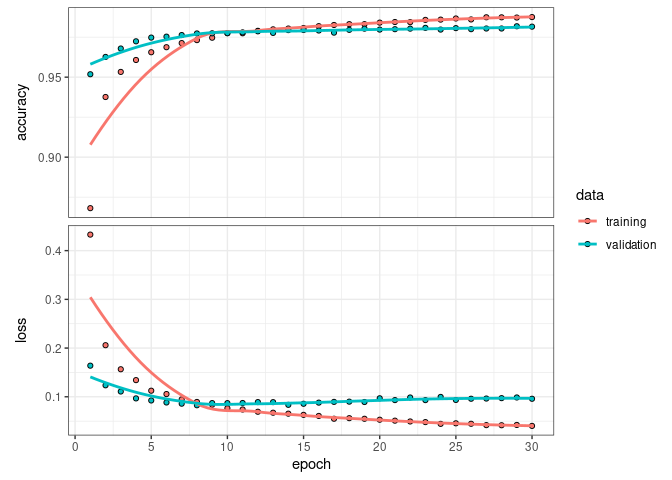
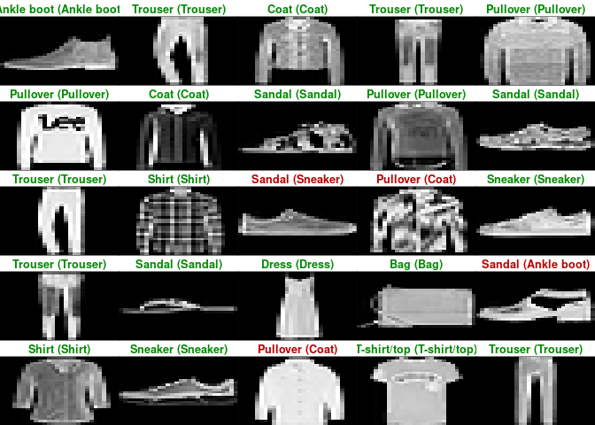

Getting started with Keras
================

# Keras

[Keras](https://keras.posit.co/) is a high-level neural networks API
developed with a focus on enabling fast experimentation. Being able to
go from idea to result with the least possible delay is key to doing
good research. Keras has the following key features:

- Allows the same code to run on CPU or on GPU, seamlessly.
- User-friendly API which makes it easy to quickly prototype deep
  learning models.
- Built-in support for convolutional networks (for computer vision),
  recurrent networks (for sequence processing), and any combination of
  both.
- Supports arbitrary network architectures: multi-input or multi-output
  models, layer sharing, model sharing, etc. This means that Keras is
  appropriate for building essentially any deep learning model, from a
  memory network to a neural Turing machine.

## Packages

Install packages if missing and load.

``` r
.libPaths('/packages')
my_packages <- c('keras3', 'tensorflow')

for (my_package in my_packages){
   if(!require(my_package, character.only = TRUE)){
      install.packages(my_package, '/packages')
      library(my_package, character.only = TRUE)
   }
}
```

## Reticulate

Use [reticulate](https://rstudio.github.io/reticulate/).

``` r
library(reticulate)
use_python("/usr/bin/python3")
reticulate::py_config()
```

    ## python:         /usr/bin/python3
    ## libpython:      /usr/lib/python3.10/config-3.10-x86_64-linux-gnu/libpython3.10.so
    ## pythonhome:     //usr://usr
    ## version:        3.10.12 (main, Nov 20 2023, 15:14:05) [GCC 11.4.0]
    ## numpy:          /usr/local/lib/python3.10/dist-packages/numpy
    ## numpy_version:  1.26.4
    ## keras:          /usr/local/lib/python3.10/dist-packages/keras
    ## 
    ## NOTE: Python version was forced by use_python() function

## MNIST dataset

[Simple
example](https://keras.posit.co/articles/getting_started.html#mnist-example)
of trying to recognise handwritten digits from the
[MNIST](https://en.wikipedia.org/wiki/MNIST_database) dataset. MNIST
consists of 28 x 28 grayscale images of handwritten digits.

The MNIST dataset is included with Keras and can be accessed using the
`dataset_mnist()` function.

``` r
mnist <- suppressMessages(dataset_mnist())
```

    ## Downloading data from https://storage.googleapis.com/tensorflow/tf-keras-datasets/mnist.npz
    ##        0/11490434 ━━━━━━━━━━━━━━━━━━━━ 0s 0s/step   49152/11490434 ━━━━━━━━━━━━━━━━━━━━ 20s 2us/step   81920/11490434 ━━━━━━━━━━━━━━━━━━━━ 24s 2us/step  770048/11490434 ━━━━━━━━━━━━━━━━━━━━ 3s 0us/step  1474560/11490434 ━━━━━━━━━━━━━━━━━━━━ 1s 0us/step 2220032/11490434 ━━━━━━━━━━━━━━━━━━━━ 1s 0us/step 3612672/11490434 ━━━━━━━━━━━━━━━━━━━━ 0s 0us/step 5341184/11490434 ━━━━━━━━━━━━━━━━━━━━ 0s 0us/step 7503872/11490434 ━━━━━━━━━━━━━━━━━━━━ 0s 0us/step 9781248/11490434 ━━━━━━━━━━━━━━━━━━━━ 0s 0us/step11490434/11490434 ━━━━━━━━━━━━━━━━━━━━ 1s 0us/step

``` r
str(mnist)
```

    ## List of 2
    ##  $ train:List of 2
    ##   ..$ x: int [1:60000, 1:28, 1:28] 0 0 0 0 0 0 0 0 0 0 ...
    ##   ..$ y: int [1:60000(1d)] 5 0 4 1 9 2 1 3 1 4 ...
    ##  $ test :List of 2
    ##   ..$ x: int [1:10000, 1:28, 1:28] 0 0 0 0 0 0 0 0 0 0 ...
    ##   ..$ y: int [1:10000(1d)] 7 2 1 0 4 1 4 9 5 9 ...

The `x` data is a 3-d array (images, width, height) of grayscale values.

``` r
idx <- 1984
image(mnist$train$x[idx,,], main = mnist$train$y[idx])
```

<!-- -->

Store training and testing data.

``` r
x_train <- mnist$train$x
y_train <- mnist$train$y
x_test <- mnist$test$x
y_test <- mnist$test$y
```

To prepare the data for training we convert the 3-d arrays into matrices
by reshaping width and height into a single dimension (28x28 images are
flattened into length 784 vectors). Then, we convert the grayscale
values from integers ranging between 0 to 255 into floating point values
ranging between 0 and 1.

``` r
# reshape
x_train <- array_reshape(x_train, c(nrow(x_train), 784))
x_test <- array_reshape(x_test, c(nrow(x_test), 784))
# rescale
x_train <- x_train / 255
x_test <- x_test / 255

str(x_train)
```

    ##  num [1:60000, 1:784] 0 0 0 0 0 0 0 0 0 0 ...

The y data is an integer vector with values ranging from 0 to 9. To
prepare this data for training we one-hot encode the vectors into binary
class matrices using the Keras `to_categorical()` function.

``` r
y_train <- to_categorical(y_train, 10)
y_test <- to_categorical(y_test, 10)

str(y_train)
```

    ##  num [1:60000, 1:10] 0 1 0 0 0 0 0 0 0 0 ...

The core data structure of Keras is a model, a way to organise layers.
The simplest type of model is the Sequential model, a linear stack of
layers.

We begin by creating a sequential model and then adding layers using the
pipe (\|\>) operator.

``` r
model <- keras_model_sequential(input_shape = c(784))
model |>
  layer_dense(units = 256, activation = 'relu') |>
  layer_dropout(rate = 0.4) |>
  layer_dense(units = 128, activation = 'relu') |>
  layer_dropout(rate = 0.3) |>
  layer_dense(units = 10, activation = 'softmax')
```

The input_shape argument to the first layer specifies the shape of the
input data (a length 784 numeric vector representing a grayscale image).
The final layer outputs a length 10 numeric vector (probabilities for
each digit) using a softmax activation function.

Use the `summary()` function to print the details of the model.

``` r
summary(model)
```

    ## Model: "sequential"
    ## ┏━━━━━━━━━━━━━━━━━━━━━━━━━━━━━━━━━━━┳━━━━━━━━━━━━━━━━━━━━━━━━━━┳━━━━━━━━━━━━━━━┓
    ## ┃ Layer (type)                      ┃ Output Shape             ┃       Param # ┃
    ## ┡━━━━━━━━━━━━━━━━━━━━━━━━━━━━━━━━━━━╇━━━━━━━━━━━━━━━━━━━━━━━━━━╇━━━━━━━━━━━━━━━┩
    ## │ dense (Dense)                     │ (None, 256)              │       200,960 │
    ## ├───────────────────────────────────┼──────────────────────────┼───────────────┤
    ## │ dropout (Dropout)                 │ (None, 256)              │             0 │
    ## ├───────────────────────────────────┼──────────────────────────┼───────────────┤
    ## │ dense_1 (Dense)                   │ (None, 128)              │        32,896 │
    ## ├───────────────────────────────────┼──────────────────────────┼───────────────┤
    ## │ dropout_1 (Dropout)               │ (None, 128)              │             0 │
    ## ├───────────────────────────────────┼──────────────────────────┼───────────────┤
    ## │ dense_2 (Dense)                   │ (None, 10)               │         1,290 │
    ## └───────────────────────────────────┴──────────────────────────┴───────────────┘
    ##  Total params: 235,146 (918.54 KB)
    ##  Trainable params: 235,146 (918.54 KB)
    ##  Non-trainable params: 0 (0.00 B)

Plot.

``` r
plot(model)
```


Next, compile the model with appropriate loss function, optimiser, and
metrics.

``` r
model |> compile(
  loss = 'categorical_crossentropy',
  optimizer = optimizer_rmsprop(),
  metrics = c('accuracy')
)
```

Use the `fit()` function to train the model for 30 epochs using batches
of 128 images.

``` r
history <- model |> fit(
  x_train,
  y_train,
  epochs = 30,
  batch_size = 128,
  validation_split = 0.2
)
```

    ## Epoch 1/30
    ## 375/375 - 1s - 4ms/step - accuracy: 0.8707 - loss: 0.4303 - val_accuracy: 0.9508 - val_loss: 0.1612
    ## Epoch 2/30
    ## 375/375 - 1s - 2ms/step - accuracy: 0.9399 - loss: 0.2062 - val_accuracy: 0.9618 - val_loss: 0.1256
    ## Epoch 3/30
    ## 375/375 - 1s - 2ms/step - accuracy: 0.9538 - loss: 0.1556 - val_accuracy: 0.9718 - val_loss: 0.0996
    ## Epoch 4/30
    ## 375/375 - 1s - 2ms/step - accuracy: 0.9616 - loss: 0.1294 - val_accuracy: 0.9734 - val_loss: 0.0923
    ## Epoch 5/30
    ## 375/375 - 1s - 2ms/step - accuracy: 0.9653 - loss: 0.1144 - val_accuracy: 0.9739 - val_loss: 0.0896
    ## Epoch 6/30
    ## 375/375 - 1s - 2ms/step - accuracy: 0.9686 - loss: 0.1034 - val_accuracy: 0.9753 - val_loss: 0.0888
    ## Epoch 7/30
    ## 375/375 - 1s - 2ms/step - accuracy: 0.9718 - loss: 0.0946 - val_accuracy: 0.9767 - val_loss: 0.0846
    ## Epoch 8/30
    ## 375/375 - 1s - 2ms/step - accuracy: 0.9737 - loss: 0.0876 - val_accuracy: 0.9785 - val_loss: 0.0834
    ## Epoch 9/30
    ## 375/375 - 1s - 2ms/step - accuracy: 0.9751 - loss: 0.0825 - val_accuracy: 0.9785 - val_loss: 0.0841
    ## Epoch 10/30
    ## 375/375 - 1s - 2ms/step - accuracy: 0.9771 - loss: 0.0739 - val_accuracy: 0.9784 - val_loss: 0.0839
    ## Epoch 11/30
    ## 375/375 - 1s - 2ms/step - accuracy: 0.9787 - loss: 0.0721 - val_accuracy: 0.9797 - val_loss: 0.0813
    ## Epoch 12/30
    ## 375/375 - 1s - 2ms/step - accuracy: 0.9793 - loss: 0.0684 - val_accuracy: 0.9803 - val_loss: 0.0810
    ## Epoch 13/30
    ## 375/375 - 1s - 2ms/step - accuracy: 0.9797 - loss: 0.0678 - val_accuracy: 0.9798 - val_loss: 0.0805
    ## Epoch 14/30
    ## 375/375 - 1s - 2ms/step - accuracy: 0.9804 - loss: 0.0655 - val_accuracy: 0.9800 - val_loss: 0.0876
    ## Epoch 15/30
    ## 375/375 - 1s - 2ms/step - accuracy: 0.9817 - loss: 0.0595 - val_accuracy: 0.9804 - val_loss: 0.0858
    ## Epoch 16/30
    ## 375/375 - 1s - 2ms/step - accuracy: 0.9820 - loss: 0.0603 - val_accuracy: 0.9802 - val_loss: 0.0820
    ## Epoch 17/30
    ## 375/375 - 1s - 2ms/step - accuracy: 0.9831 - loss: 0.0546 - val_accuracy: 0.9802 - val_loss: 0.0869
    ## Epoch 18/30
    ## 375/375 - 1s - 2ms/step - accuracy: 0.9832 - loss: 0.0558 - val_accuracy: 0.9809 - val_loss: 0.0876
    ## Epoch 19/30
    ## 375/375 - 1s - 2ms/step - accuracy: 0.9846 - loss: 0.0508 - val_accuracy: 0.9812 - val_loss: 0.0880
    ## Epoch 20/30
    ## 375/375 - 1s - 2ms/step - accuracy: 0.9841 - loss: 0.0499 - val_accuracy: 0.9804 - val_loss: 0.0922
    ## Epoch 21/30
    ## 375/375 - 1s - 2ms/step - accuracy: 0.9846 - loss: 0.0497 - val_accuracy: 0.9816 - val_loss: 0.0843
    ## Epoch 22/30
    ## 375/375 - 1s - 2ms/step - accuracy: 0.9853 - loss: 0.0495 - val_accuracy: 0.9806 - val_loss: 0.0930
    ## Epoch 23/30
    ## 375/375 - 1s - 2ms/step - accuracy: 0.9846 - loss: 0.0501 - val_accuracy: 0.9826 - val_loss: 0.0865
    ## Epoch 24/30
    ## 375/375 - 1s - 2ms/step - accuracy: 0.9855 - loss: 0.0478 - val_accuracy: 0.9804 - val_loss: 0.0891
    ## Epoch 25/30
    ## 375/375 - 1s - 2ms/step - accuracy: 0.9862 - loss: 0.0441 - val_accuracy: 0.9802 - val_loss: 0.0965
    ## Epoch 26/30
    ## 375/375 - 1s - 2ms/step - accuracy: 0.9862 - loss: 0.0466 - val_accuracy: 0.9817 - val_loss: 0.0907
    ## Epoch 27/30
    ## 375/375 - 1s - 2ms/step - accuracy: 0.9859 - loss: 0.0459 - val_accuracy: 0.9813 - val_loss: 0.0902
    ## Epoch 28/30
    ## 375/375 - 1s - 2ms/step - accuracy: 0.9871 - loss: 0.0423 - val_accuracy: 0.9803 - val_loss: 0.1066
    ## Epoch 29/30
    ## 375/375 - 1s - 2ms/step - accuracy: 0.9861 - loss: 0.0473 - val_accuracy: 0.9818 - val_loss: 0.0978
    ## Epoch 30/30
    ## 375/375 - 1s - 2ms/step - accuracy: 0.9877 - loss: 0.0425 - val_accuracy: 0.9818 - val_loss: 0.0948

The history object returned by `fit()` includes loss and accuracy
metrics which we can plot.

``` r
plot(history)
```

<!-- -->

Evaluate the model’s performance on the test data.

``` r
model |> evaluate(x_test, y_test)
```

    ## 313/313 - 0s - 700us/step - accuracy: 0.9827 - loss: 0.0838

    ## $accuracy
    ## [1] 0.9827
    ## 
    ## $loss
    ## [1] 0.08379976

Generate predictions on new data x.

``` r
probs <- model |> predict(x_test)
```

    ## 313/313 - 0s - 784us/step

Predictions.

``` r
head(max.col(probs) - 1L)
```

    ## [1] 7 2 1 0 4 1

Truth.

``` r
head(mnist$test$y)
```

    ## [1] 7 2 1 0 4 1

Double check accuracy.

``` r
sum(max.col(probs) - 1L == mnist$test$y) / length(mnist$test$y)
```

    ## [1] 0.9827

## Fashion MNIST

Following the [Basic Image
Classification](https://tensorflow.rstudio.com/tutorials/beginners/basic-ml/tutorial_basic_classification/)
guide.

This guide uses the Fashion MNIST dataset which contains 70,000
grayscale images in 10 categories. The images show individual articles
of clothing at low resolution (28 by 28 pixels).

Fashion MNIST is intended as a drop-in replacement for the classic MNIST
dataset and is a slightly more challenging problem than regular MNIST.

We will use 60,000 images to train the network and 10,000 images to
evaluate how accurately the network learned to classify images.

``` r
fashion_mnist <- dataset_fashion_mnist()
```

    ## Downloading data from https://storage.googleapis.com/tensorflow/tf-keras-datasets/train-labels-idx1-ubyte.gz
    ##     0/29515 ━━━━━━━━━━━━━━━━━━━━ 0s 0s/step29515/29515 ━━━━━━━━━━━━━━━━━━━━ 0s 0us/step
    ## Downloading data from https://storage.googleapis.com/tensorflow/tf-keras-datasets/train-images-idx3-ubyte.gz
    ##        0/26421880 ━━━━━━━━━━━━━━━━━━━━ 0s 0s/step   16384/26421880 ━━━━━━━━━━━━━━━━━━━━ 1:39 4us/step   49152/26421880 ━━━━━━━━━━━━━━━━━━━━ 1:28 3us/step   81920/26421880 ━━━━━━━━━━━━━━━━━━━━ 1:25 3us/step  147456/26421880 ━━━━━━━━━━━━━━━━━━━━ 57s 2us/step   212992/26421880 ━━━━━━━━━━━━━━━━━━━━ 47s 2us/step  294912/26421880 ━━━━━━━━━━━━━━━━━━━━ 38s 1us/step  458752/26421880 ━━━━━━━━━━━━━━━━━━━━ 27s 1us/step  655360/26421880 ━━━━━━━━━━━━━━━━━━━━ 21s 1us/step  983040/26421880 ━━━━━━━━━━━━━━━━━━━━ 15s 1us/step 1458176/26421880 ━━━━━━━━━━━━━━━━━━━━ 11s 0us/step 2187264/26421880 ━━━━━━━━━━━━━━━━━━━━ 7s 0us/step  3268608/26421880 ━━━━━━━━━━━━━━━━━━━━ 5s 0us/step 4767744/26421880 ━━━━━━━━━━━━━━━━━━━━ 3s 0us/step 6406144/26421880 ━━━━━━━━━━━━━━━━━━━━ 2s 0us/step 8208384/26421880 ━━━━━━━━━━━━━━━━━━━━ 1s 0us/step 9666560/26421880 ━━━━━━━━━━━━━━━━━━━━ 1s 0us/step11386880/26421880 ━━━━━━━━━━━━━━━━━━━━ 1s 0us/step12943360/26421880 ━━━━━━━━━━━━━━━━━━━━ 1s 0us/step14573568/26421880 ━━━━━━━━━━━━━━━━━━━━ 0s 0us/step16121856/26421880 ━━━━━━━━━━━━━━━━━━━━ 0s 0us/step17743872/26421880 ━━━━━━━━━━━━━━━━━━━━ 0s 0us/step19415040/26421880 ━━━━━━━━━━━━━━━━━━━━ 0s 0us/step21127168/26421880 ━━━━━━━━━━━━━━━━━━━━ 0s 0us/step22740992/26421880 ━━━━━━━━━━━━━━━━━━━━ 0s 0us/step24297472/26421880 ━━━━━━━━━━━━━━━━━━━━ 0s 0us/step25952256/26421880 ━━━━━━━━━━━━━━━━━━━━ 0s 0us/step26421880/26421880 ━━━━━━━━━━━━━━━━━━━━ 1s 0us/step
    ## Downloading data from https://storage.googleapis.com/tensorflow/tf-keras-datasets/t10k-labels-idx1-ubyte.gz
    ##    0/5148 ━━━━━━━━━━━━━━━━━━━━ 0s 0s/step5148/5148 ━━━━━━━━━━━━━━━━━━━━ 0s 0us/step
    ## Downloading data from https://storage.googleapis.com/tensorflow/tf-keras-datasets/t10k-images-idx3-ubyte.gz
    ##       0/4422102 ━━━━━━━━━━━━━━━━━━━━ 0s 0s/step4112384/4422102 ━━━━━━━━━━━━━━━━━━━━ 0s 0us/step4422102/4422102 ━━━━━━━━━━━━━━━━━━━━ 0s 0us/step

``` r
str(fashion_mnist)
```

    ## List of 2
    ##  $ train:List of 2
    ##   ..$ x: int [1:60000, 1:28, 1:28] 0 0 0 0 0 0 0 0 0 0 ...
    ##   ..$ y: int [1:60000(1d)] 9 0 0 3 0 2 7 2 5 5 ...
    ##  $ test :List of 2
    ##   ..$ x: int [1:10000, 1:28, 1:28] 0 0 0 0 0 0 0 0 0 0 ...
    ##   ..$ y: int [1:10000(1d)] 9 2 1 1 6 1 4 6 5 7 ...

Assign.

``` r
c(train_images, train_labels) %<-% fashion_mnist$train
c(test_images, test_labels) %<-% fashion_mnist$test
```

The labels are arrays of integers ranging from 0 to 9 and correspond to
the class of clothing the image represents:

| Digit | Class       |
|-------|-------------|
| 0     | T-shirt/top |
| 1     | Trouser     |
| 2     | Pullover    |
| 3     | Dress       |
| 4     | Coat        |
| 5     | Sandal      |
| 6     | Shirt       |
| 7     | Sneaker     |
| 8     | Bag         |
| 9     | Ankle boot  |

``` r
class_names = c(
   'T-shirt/top',
   'Trouser',
   'Pullover',
   'Dress',
   'Coat', 
   'Sandal',
   'Shirt',
   'Sneaker',
   'Bag',
   'Ankle boot'
)
```

``` r
image_1 <- as.data.frame(train_images[1, , ])
colnames(image_1) <- seq_len(ncol(image_1))
image_1$y <- seq_len(nrow(image_1))
image_1 <- gather(image_1, "x", "value", -y)
image_1$x <- as.integer(image_1$x)

ggplot(image_1, aes(x = x, y = y, fill = value)) +
  geom_tile() +
  scale_fill_gradient(low = "white", high = "black", na.value = NA) +
  scale_y_reverse() +
  theme_minimal() +
  theme(panel.grid = element_blank())   +
  theme(aspect.ratio = 1) +
  xlab("") +
  ylab("")
```

<!-- -->

Scale values to a range of 0 to 1 by dividing by 255 before feeding to
the neural network model. It is important that the training set and the
testing set are pre-processed in the same way.

``` r
train_images <- train_images / 255
test_images <- test_images / 255
```

Display the first 25 images.

``` r
par(mfcol=c(5,5))
par(mar=c(0, 0, 1.5, 0), xaxs='i', yaxs='i')
for (i in 1:25) { 
  img <- train_images[i, , ]
  img <- t(apply(img, 2, rev)) 
  image(1:28, 1:28, img, col = gray((0:255)/255), xaxt = 'n', yaxt = 'n',
        main = paste(class_names[train_labels[i] + 1]))
}
```

<!-- -->

Set up the layers.

``` r
model <- keras_model_sequential()
model %>%
  layer_flatten(input_shape = c(28, 28)) %>%
  layer_dense(units = 128, activation = 'relu') %>%
  layer_dense(units = 10, activation = 'softmax')
```

``` r
model %>% compile(
  optimizer = 'adam', 
  loss = 'sparse_categorical_crossentropy',
  metrics = c('accuracy')
)
```

``` r
model %>% fit(train_images, train_labels, epochs = 5, verbose = 2)
```

    ## Epoch 1/5
    ## 1875/1875 - 2s - 1ms/step - accuracy: 0.8237 - loss: 0.5052
    ## Epoch 2/5
    ## 1875/1875 - 2s - 873us/step - accuracy: 0.8641 - loss: 0.3792
    ## Epoch 3/5
    ## 1875/1875 - 2s - 887us/step - accuracy: 0.8757 - loss: 0.3370
    ## Epoch 4/5
    ## 1875/1875 - 2s - 882us/step - accuracy: 0.8858 - loss: 0.3142
    ## Epoch 5/5
    ## 1875/1875 - 2s - 886us/step - accuracy: 0.8932 - loss: 0.2959

``` r
score <- model %>% evaluate(test_images, test_labels, verbose = 0)
score
```

    ## $accuracy
    ## [1] 0.875
    ## 
    ## $loss
    ## [1] 0.3560719

``` r
predictions <- model %>% predict(test_images)
```

    ## 313/313 - 0s - 664us/step

``` r
predictions[1, ]
```

    ##  [1] 4.504090e-07 4.258666e-08 1.976059e-06 9.351735e-08 3.027783e-06
    ##  [6] 1.937603e-03 1.640400e-05 6.861927e-02 5.886920e-05 9.293622e-01

``` r
which.max(predictions[1, ])
```

    ## [1] 10

``` r
class_pred <- model %>% predict(test_images) %>% k_argmax()

class_pred[1:20]
```

``` r
test_labels[1:20]
```

    ##  [1] 9 2 1 1 6 1 4 6 5 7 4 5 7 3 4 1 2 4 8 0

``` r
par(mfcol=c(5,5))
par(mar=c(0, 0, 1.5, 0), xaxs='i', yaxs='i')
for (i in 1:25) { 
   img <- test_images[i, , ]
   img <- t(apply(img, 2, rev)) 
   # subtract 1 as labels go from 0 to 9
   predicted_label <- which.max(predictions[i, ]) - 1
   true_label <- test_labels[i]
   if (predicted_label == true_label) {
      color <- '#008800' 
   } else {
      color <- '#bb0000'
   }
   image(1:28, 1:28, img, col = gray((0:255)/255), xaxt = 'n', yaxt = 'n',
         main = paste0(class_names[predicted_label + 1], " (",
                       class_names[true_label + 1], ")"),
         col.main = color)
}
```

<!-- -->

## Session info

Time built.

    ## [1] "2024-06-11 05:22:19 UTC"

Session info.

    ## R version 4.4.0 (2024-04-24)
    ## Platform: x86_64-pc-linux-gnu
    ## Running under: Ubuntu 22.04.4 LTS
    ## 
    ## Matrix products: default
    ## BLAS:   /usr/lib/x86_64-linux-gnu/openblas-pthread/libblas.so.3 
    ## LAPACK: /usr/lib/x86_64-linux-gnu/openblas-pthread/libopenblasp-r0.3.20.so;  LAPACK version 3.10.0
    ## 
    ## locale:
    ##  [1] LC_CTYPE=en_US.UTF-8       LC_NUMERIC=C              
    ##  [3] LC_TIME=en_US.UTF-8        LC_COLLATE=en_US.UTF-8    
    ##  [5] LC_MONETARY=en_US.UTF-8    LC_MESSAGES=en_US.UTF-8   
    ##  [7] LC_PAPER=en_US.UTF-8       LC_NAME=C                 
    ##  [9] LC_ADDRESS=C               LC_TELEPHONE=C            
    ## [11] LC_MEASUREMENT=en_US.UTF-8 LC_IDENTIFICATION=C       
    ## 
    ## time zone: Etc/UTC
    ## tzcode source: system (glibc)
    ## 
    ## attached base packages:
    ## [1] stats     graphics  grDevices utils     datasets  methods   base     
    ## 
    ## other attached packages:
    ##  [1] reticulate_1.37.0 tensorflow_2.16.0 keras3_1.0.0      lubridate_1.9.3  
    ##  [5] forcats_1.0.0     stringr_1.5.1     dplyr_1.1.4       purrr_1.0.2      
    ##  [9] readr_2.1.5       tidyr_1.3.1       tibble_3.2.1      ggplot2_3.5.1    
    ## [13] tidyverse_2.0.0  
    ## 
    ## loaded via a namespace (and not attached):
    ##  [1] utf8_1.2.4        generics_0.1.3    stringi_1.8.3     lattice_0.22-6   
    ##  [5] hms_1.1.3         digest_0.6.35     magrittr_2.0.3    evaluate_0.23    
    ##  [9] grid_4.4.0        timechange_0.3.0  fastmap_1.1.1     jsonlite_1.8.8   
    ## [13] Matrix_1.7-0      whisker_0.4.1     tfruns_1.5.3      mgcv_1.9-1       
    ## [17] fansi_1.0.6       scales_1.3.0      cli_3.6.2         rlang_1.1.3      
    ## [21] splines_4.4.0     munsell_0.5.1     base64enc_0.1-3   withr_3.0.0      
    ## [25] yaml_2.3.8        tools_4.4.0       tzdb_0.4.0        zeallot_0.1.0    
    ## [29] colorspace_2.1-0  vctrs_0.6.5       R6_2.5.1          png_0.1-8        
    ## [33] lifecycle_1.0.4   pkgconfig_2.0.3   pillar_1.9.0      gtable_0.3.5     
    ## [37] glue_1.7.0        Rcpp_1.0.12       highr_0.10        xfun_0.43        
    ## [41] tidyselect_1.2.1  knitr_1.46        farver_2.1.1      nlme_3.1-164     
    ## [45] htmltools_0.5.8.1 labeling_0.4.3    rmarkdown_2.27    compiler_4.4.0
