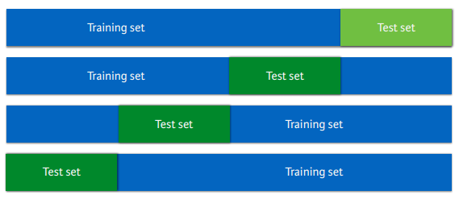
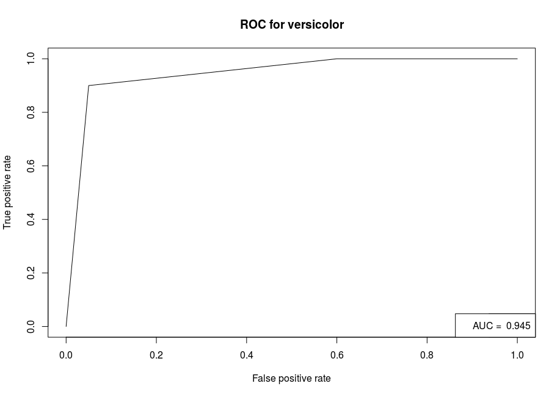
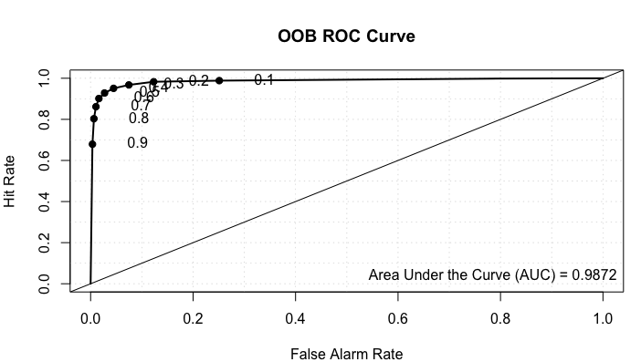

Performance measures
====================

Different performance measures for evaluating whether your model is good or not.

# Classification

Build confusion matrix and calculate accuracy, precision, and recall. Check out [this guide as well](http://www.dataschool.io/simple-guide-to-confusion-matrix-terminology/).

* Sensitivity or True Positive Rate (TPR) or Recall or Hit Rate = TP / (TP + FN)
* Specificity or True Negative Rate (TNR) = TN / (TN + FP)
* Precision or Positive Predictive Value (PPV) = TP / (TP + FP)
* Negative Predictive Value (NPV) = TN / (TN + FN)
* Fall-out or False Positive Rate (FPR) = FP / (FP + TN) = 1 - specificity
* False Negative Rate (FNR) = FN / (FN + TP) = 1 - TPR
* False Discovery Rate (FDR) = TP / (TP + FP) = 1 - PPV
* Accuracy = (TP + TN) / (TP + FP + FN + TN)

The formulae for TPR, TNR, FPR, and FNR are easy to remember. For example, if we are calculating the TPR, use TPs as the numerator and the denominator will be TPs + the opposite of TPs, which are the FNs. For the TNR, use TNs as the numerator and the denominator will be TNs + the opposite of TNs, which are the FPs. Why is this so? It's because a FN is really a TP that was misclassified as a negative, a FP is really a TN that was misclassified as a positive, and so on.

In R:

~~~~{.r}
conf <- table(real, predicted)

TP <- conf[1, 1]
FN <- conf[1, 2]
FP <- conf[2, 1]
TN <- conf[2, 2]

accuracy  <- (TP + TN) / (TP + FN + FP + TN)
# or
accuracy  <- sum(diag(conf)) / sum(conf)
precision <- TP / (TP + FP)
recall    <- TP / (TP + FN)
~~~~

# Regression

Root Mean Squared Error (RMSE), which is the mean distance between estimates and the regression line.

$$ RMSE = \sqrt{ \frac{1}{N} \sum_{i=1}^{N} (y_i - \hat{y}_i)^2 } $$

In R:

~~~~{.r}
rmse <- sqrt( ( 1/length(pred) ) * sum( (real - pred) ^ 2) )
~~~~

# Clustering

Measure the distance between points within a cluster and between clusters.

* Within Sum of Squares (WSS) measures the within cluster similarity
* Between cluster Sum of Squares (BSS) measures the between cluster similarity
* The [Dunn index](https://en.wikipedia.org/wiki/Dunn_index) is the minimal intercluster distance (between cluster measurement) divided by the maximal diameter (within cluster measurement); a higher Dunn index indicates better clustering

For K-means clustering, the measures for WSS and BSS can be found in the cluster object as tot.withinss and betweenss.

~~~~{.r}
km <- kmeans(iris[,-5], centers = 3, nstart = 1)

km
K-means clustering with 3 clusters of sizes 62, 50, 38

Cluster means:
  Sepal.Length Sepal.Width Petal.Length Petal.Width
1     5.901613    2.748387     4.393548    1.433871
2     5.006000    3.428000     1.462000    0.246000
3     6.850000    3.073684     5.742105    2.071053

Clustering vector:
  [1] 2 2 2 2 2 2 2 2 2 2 2 2 2 2 2 2 2 2 2 2 2 2 2 2 2 2 2 2 2 2 2 2 2 2 2 2 2
 [38] 2 2 2 2 2 2 2 2 2 2 2 2 2 1 1 3 1 1 1 1 1 1 1 1 1 1 1 1 1 1 1 1 1 1 1 1 1
 [75] 1 1 1 3 1 1 1 1 1 1 1 1 1 1 1 1 1 1 1 1 1 1 1 1 1 1 3 1 3 3 3 3 1 3 3 3 3
[112] 3 3 1 1 3 3 3 3 1 3 1 3 1 3 3 1 1 3 3 3 3 3 1 3 3 3 3 1 3 3 3 1 3 3 3 1 3
[149] 3 1

Within cluster sum of squares by cluster:
[1] 39.82097 15.15100 23.87947
 (between_SS / total_SS =  88.4 %)

Available components:

[1] "cluster"      "centers"      "totss"        "withinss"     "tot.withinss"
[6] "betweenss"    "size"         "iter"         "ifault"

# install.packages('clValid')
library(clValid)
d  <- dist(iris[,-5])
dunn(d, km$cluster)
[1] 0.09880739

# my expanded example from clValid
express <- mouse[1:25, -c(1,8)]
rownames(express) <- mouse$ID[1:25]
express_dist <- dist(express,method="euclidean")
express_hclust <- hclust(express_dist, method="average")
express_cluster <- cutree(express_hclust, k = 3)
dunn(Dist, express_cluster)
[1] 0.2315126

# install.packages('dendextend')
library(dendextend)
plot(color_branches(express_hclust, k = 3))
~~~~

# Cross validation

Instead of a single instance of train/test, cross validation carries out n-fold train/test evaluations. For example, the example below illustrates a 4-fold cross validation.

The `caret` package in R supports many types of cross-validation, and you can specify which type of cross-validation and the number of cross-validation folds with the trainControl() function, which you pass to the trControl argument in train().

~~~~{.r}
# use the caret package
# install.packages('caret')
library(caret)

# using the diamonds data set from ggplot2
# ggplot2 is automatically loaded with caret
model <- train(
  price ~ ., diamonds,
  method = "lm",
  trControl = trainControl(
    method = "cv", number = 10,
    verboseIter = TRUE
  )
)

model
Linear Regression 

53940 samples
    9 predictors

No pre-processing
Resampling: Cross-Validated (10 fold) 
Summary of sample sizes: 48547, 48546, 48546, 48546, 48546, 48546, ... 
Resampling results:

  RMSE      Rsquared 
  1131.021  0.9196795

Tuning parameter 'intercept' was held constant at a value of TRUE
~~~~

Using the `caret` package, you can perform 5 x 5-fold cross validations by adding the `repeats` parameter.

~~~~{.r}
model <- train(
  price ~ ., diamonds,
  method = "lm",
  trControl = trainControl(
    method = "cv", number = 5,
    repeats = 5, verboseIter = TRUE
  )
)

model
Linear Regression 

53940 samples
    9 predictors

No pre-processing
Resampling: Cross-Validated (5 fold) 
Summary of sample sizes: 43152, 43152, 43152, 43152, 43152 
Resampling results:

  RMSE      Rsquared 
  1131.219  0.9196155

Tuning parameter 'intercept' was held constant at a value of TRUE
~~~~

# Receiver Operator Characteristic Curve

* The false positive rate (second row of confusion matrix), FP / (FP + TN), is on the x-axis
* The true positive rate (recall or first row of confusion matrix), TP / (TP + FN), is on the y-axis
* Use the R package called ROCR

~~~~{.r}
# split iris dataset into training and test
set.seed(31)
x     <- sample(1:nrow(iris), size = 0.8 * nrow(iris), replace = FALSE)
x_hat <- setdiff(1:150, x)
train <- iris[x,]
test  <- iris[x_hat,]

library(rpart)
tree <- rpart(Species ~ ., train, method = "class")

probs <- predict(tree, test, type = "prob")
probs_setosa <- probs[,1]
probs_versicolor <- probs[,2]

library(ROCR)
setosa <- as.numeric(grepl(pattern = 'setosa', x = test$Species))
versicolor <- as.numeric(grepl(pattern = 'versicolor', x = test$Species))
pred <- prediction(probs_setosa, setosa)
pred <- prediction(probs_versicolor, versicolor)

auc <- performance(pred, 'auc')
auc_value <- auc@y.values[[1]]

perf <- performance(pred, 'tpr', 'fpr')
plot(perf, main='ROC for versicolor')
legend('bottomright', legend = paste('AUC = ', auc_value))
~~~~

Another example using [spam data](https://archive.ics.uci.edu/ml/machine-learning-databases/spambase/spambase.names) and plotting a ROC curve with the verification package.

~~~~{.r}
df <- read.csv('https://archive.ics.uci.edu/ml/machine-learning-databases/spambase/spambase.data', header = FALSE)
names(df) <- c('make', 'address', 'all', 'x3d', 'our', 'over', 'remove', 'internet', 'order', 'mail', 'receive', 'will', 'people', 'report', 'addresses', 'free', 'business', 'email', 'you', 'credit', 'your', 'font', 'x000', 'money', 'hp', 'hpl', 'george', 'x650', 'lab', 'labs', 'telnet', 'x857', 'data', 'x415', 'x85', 'technology', 'x1999', 'parts', 'pm', 'direct', 'cs', 'meeting', 'original', 'project', 're', 'edu', 'table', 'conference', 'semicolon', 'left_par', 'left_square', 'exclamation', 'dollar', 'hash', 'capital_average', 'capital_longest', 'capital_total', 'class')
df$class <- factor(df$class)
dim(df)
[1] 4601   58

table(df$class)

   0    1 
2788 1813

library(randomForest)
set.seed(31)
system.time(rf <- randomForest(class ~ ., data = df, importance=TRUE, proximity=TRUE, do.trace=100))
ntree      OOB      1      2
  100:   4.48%  2.87%  6.95%
  200:   4.61%  2.87%  7.28%
  300:   4.67%  2.94%  7.34%
  400:   4.56%  2.80%  7.28%
  500:   4.50%  2.76%  7.17%
   user  system elapsed 
 50.524   0.464  51.641 

library(verification)
auc <- roc.area(as.integer(df$class==1), rf$votes[,2])$A
roc.plot(as.integer(df$class==1), rf$votes[,2], main="", threshold = seq(0, 1, 0.1))
legend("bottomright", bty="n", sprintf("Area Under the Curve (AUC) = %1.4f", auc))
title(main="OOB ROC Curve")
~~~~

Plotting with confidence intervals, which are calculated by bootstrapping the observations and prediction, then calculating probability of detection yes (PODy) and probability of detection no (PODn) values. The default CI is 95%.

~~~~{.r}
system.time(roc.plot(as.integer(df$class==1), rf$votes[,2], main="", threshold = seq(0, 1, 0.1), CI = TRUE))
   user  system elapsed 
 12.197   1.828  14.076
legend("bottomright", bty="n", sprintf("Area Under the Curve (AUC) = %1.4f", auc))
title(main="OOB ROC Curve")
~~~~

