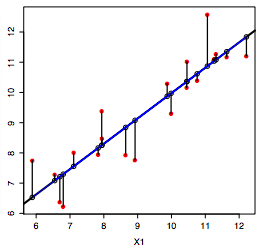

Performance measures
====================

Different performance measures for evaluating whether your model is good or not.

# Classification

Build confusion matrix and calculate accuracy, precision, and recall.

* Precision (first column) = TP / (TP + FP)
* Recall (first row) = TP / (TP + FN)
* Accuracy = (TP + TN) / (TP + FP + FN + TN)

# Regression

Use Root Mean Squared Error (RMSE), which is the mean distance between estimates and the regression line.

# Clustering

Measure the distance between points within a cluster and between clusters.

* Within Sum of Squares (WSS) measures the within cluster similarity
* Between cluster Sum of Squares (BSS) measures the between cluster similarity
* Dunn's index is the minimal intercluster distance (between cluster measurement) divided by the maximal diameter (within cluster measurement)

