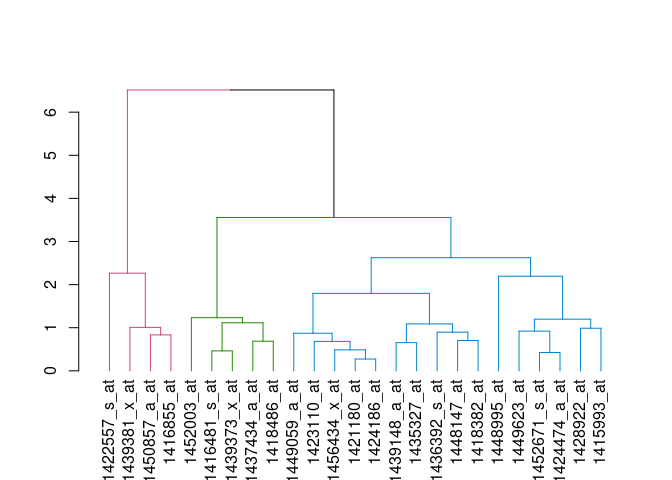
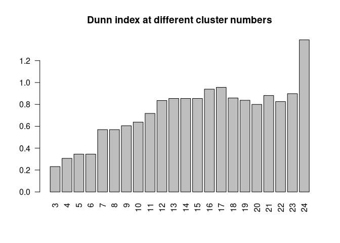
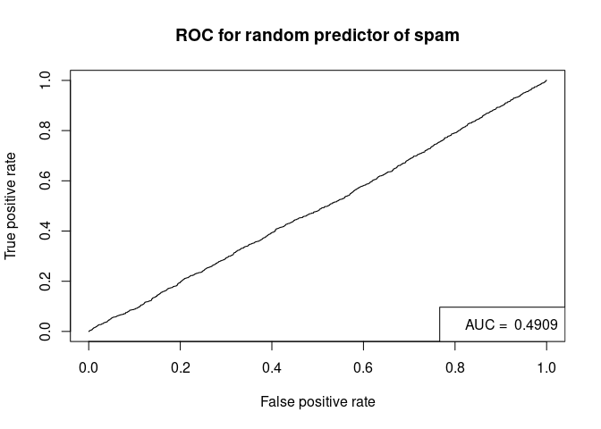
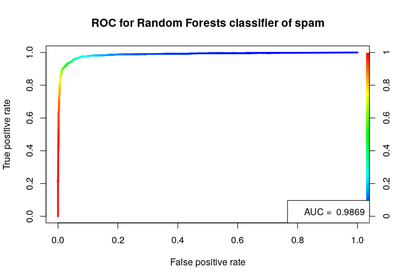
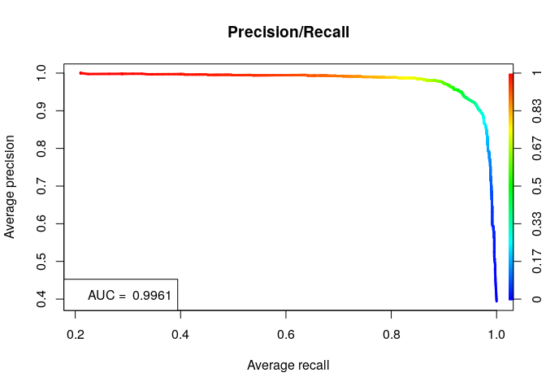

## Introduction

Different performance measures for evaluating predictive models and
unsupervised clustering.

Install packages if missing and load.

``` r
.libPaths('/packages')
my_packages <- c('caret', 'clValid', 'dendextend', 'rpart', 'ROCR', 'randomForest', 'verification')

for (my_package in my_packages){
   if(!require(my_package, character.only = TRUE)){
      install.packages(my_package, '/packages')
      library(my_package, character.only = TRUE)
   }
}
library(tidyverse)
theme_set(theme_bw())
```

## Spam

Use [spam
data](https://archive.ics.uci.edu/ml/machine-learning-databases/spambase/spambase.names)
to train a Random Forest model to illustrate evaluation measures. Class
0 and 1 are ham (non-spam) and spam, respectively.

``` r
spam_data <- read.csv(file = "../data/spambase.csv")
spam_data$class <- factor(spam_data$class)

spam_data[c(1:3, (nrow(spam_data)-2):nrow(spam_data)), (ncol(spam_data)-2):ncol(spam_data)]
```

    ##      capital_run_length_longest capital_run_length_total class
    ## 1                            61                      278     1
    ## 2                           101                     1028     1
    ## 3                           485                     2259     1
    ## 4599                          6                      118     0
    ## 4600                          5                       78     0
    ## 4601                          5                       40     0

Train model.

``` r
set.seed(31)
system.time(rf <- randomForest(class ~ ., data = spam_data, importance=TRUE, proximity=TRUE, do.trace=100))
```

    ## ntree      OOB      1      2
    ##   100:   4.76%  3.16%  7.23%
    ##   200:   4.65%  2.80%  7.50%
    ##   300:   4.65%  2.73%  7.61%
    ##   400:   4.63%  2.73%  7.56%
    ##   500:   4.59%  2.73%  7.45%

    ##    user  system elapsed 
    ##  26.583   0.071  26.656

## Classification measures

The metrics that are typically used are:

-   Sensitivity (a.k.a. recall) versus specificity
-   Precision versus recall

Since I always forget what the metrics measure, I'll try and think of
some way to link the terms and their inherent meanings with the
performance measure that they are trying to capture.

When I hear the word sensitivity, I immediately think of someone who is
acute at picking up signals. For example, when talking with somebody, a
sensitive person not only hears the words but can also detect signals
from someone's body language. In this sense, I should try to remember
sensitivity as picking up positive signals *regardless of mixed
signals*; body language can be easily misinterpreted. The way it is
calculated is by tallying the number of detected positive signals and
dividing this by the total number of real/true positive signals.

When I think of specificity, I think of subsetting. If we had a lot of
marbles, a specific subset of marbles would be one with only blue
marbles; a set with orange, yellow, and blue, marbles is not very
specific. However, a non-specific set of marbles can still have a very
high sensitivity because if a classifier's job is to pick out the blue
marbles out of many different colours and it classifies everything as
blue, it has detected all the true positives. Specificity is like
sensitivity but it is concerned with true negatives, which are the
marbles that are not blue. Therefore, try to remember specificity as the
opposite of sensitivity: tallying the number of "detected" true
negatives and dividing by the total number of true negatives.

When I think of precision, I think about a surgeon making a precise
surgical incision. It is important to make the correct incision for
obvious reasons and therefore precision measures the ability to identify
a positive case divided by all true positives plus all the false
positives (e.g. incorrect locations). A surgeon needs to make an
incision and needs to make a correct incision; they can't just be
sensitive or specific.

When I think of recall, I think about a defective product that needs to
be recalled. For example if a batch of medicine was found to defective,
it is absolutely necessary to recall **every single defective project**.
It doesn't matter that non-defective products (false positives) are also
recalled because the focus is on identifying the true positives and it
is fine if the manufacturer recalls every single product.

Summary:

-   Sensitivity -\> a sensitive person
-   Specificity -\> a specific subset
-   Precision -\> a surgeon making a precise incision
-   Recall -\> recalling a defective product

### Details

Build confusion matrix and calculate accuracy, precision, and recall.
Check out [this guide as
well](https://www.dataschool.io/simple-guide-to-confusion-matrix-terminology/).


Use `table` to construct a confusion matrix, where rows are real labels
and columns are the predictions (different from the table above).
Therefore the first row and first column cell are the non-spam cases
that were predicted as non-spam (true negative). The first row and
second column cell are the non-spam cases predicted as spam (false
positive). The second row and first column cell are spam cases predicted
as non-spam (false negative). Finally, the second row and second column
cell are cases that are spam and predicted as spam (true positive).

``` r
(spam_rf_table <- table(spam_data$class, rf$predicted))
```

    ##    
    ##        0    1
    ##   0 2712   76
    ##   1  135 1678

``` r
TN <- spam_rf_table[1, 1]
FP <- spam_rf_table[1, 2]
FN <- spam_rf_table[2, 1]
TP <- spam_rf_table[2, 2]
```

Accuracy is the easiest to remember; you take all the correct
predictions and divide by the total:

-   Accuracy = (TP + TN) / (TP + FP + FN + TN)

``` r
(accuracy <- (TP + TN) / (TP + FN + FP + TN))
```

    ## [1] 0.9541404

``` r
(accuracy  <- sum(diag(spam_rf_table)) / sum(spam_rf_table))
```

    ## [1] 0.9541404

Precision or Positive Predictive Value (PPV) is concerned with all the
*positive* calls that were *predicted* (column two of our table):

-   Precision or Positive Predictive Value (PPV) = TP / (TP + FP)

``` r
(precision <- TP / (TP + FP))
```

    ## [1] 0.9566705

Recall (also known by other names, see below) is concerned with how many
of the *truth positive cases* were predicted as positive (row two of our
table). The term sensitivity makes a bit more sense to me as it
describes how sensitive a method is in detecting positive cases.

-   Sensitivity or True Positive Rate (TPR) or Recall or Hit Rate = TP /
    (TP + FN)

``` r
(recall <- TP / (TP + FN))
```

    ## [1] 0.9255378

Specificity is concerned with how many of the *truth negative cases*
were predicted as negative (row one of our table), which is opposite to
sensitivity.

-   Specificity or True Negative Rate (TNR) = TN / (TN + FP)

``` r
(specificity <- TN / (TN + FP))
```

    ## [1] 0.9727403

-   Fall-out or False Positive Rate (FPR) = FP / (FP + TN) = 1 -
    specificity

``` r
(false_positive_rate <- FP / (FP + TN))
```

    ## [1] 0.02725968

``` r
(1 - specificity)
```

    ## [1] 0.02725968

-   Negative Predictive Value (NPV) = TN / (TN + FN)

``` r
(npv <- TN / (TN + FN))
```

    ## [1] 0.9525817

-   False Discovery Rate (FDR) = FP / (TP + FP) = 1 - PPV

``` r
(fdr <- FP / (TP + FP))
```

    ## [1] 0.04332953

``` r
(1 - precision)
```

    ## [1] 0.04332953

-   False Negative Rate (FNR) = FN / (FN + TP) = 1 - TPR

``` r
(fnr <- FN / (FN + TP))
```

    ## [1] 0.07446222

``` r
(1 - recall)
```

    ## [1] 0.07446222

Depending on the application, different metrics can be more desirable
than others. For example when detecting spam, it is more preferably to
have a high specificity (detect all real emails) than to have a high
sensitivity (detect all spam).

## Regression

Root Mean Squared Error (RMSE), which is the mean distance between
estimates and the regression line.

%5E2&space;%7D)

The blue line and black lines in the plot below shows the linear fit and
the residuals (how far off a prediction was from the actual value),
respectively. The RMSE sums all squared residuals, divides by all cases
(i.e. calculates the mean), and then takes the square root.


We can calculate the RMSE as per below.

``` r
# predict height from weight
lm.fit <- lm(height ~ weight, data = women)
h_pred <- predict(lm.fit, women)
(rmse <- sqrt( ( 1/length(h_pred) ) * sum( (women$height - h_pred) ^ 2) ))
```

    ## [1] 0.4096541

## Clustering

Measure the distance between points within a cluster and between
clusters. Perform k-means to demonstrate.

``` r
km <- kmeans(iris[,-5], centers = 3, nstart = 1)
```

Within Sum of Squares (WSS) measures the within cluster similarity

``` r
km$withinss
```

    ## [1] 23.87947 39.82097 15.15100

Between cluster Sum of Squares (BSS) measures the between cluster
similarity

``` r
km$betweenss
```

    ## [1] 602.5192

The [Dunn index](https://en.wikipedia.org/wiki/Dunn_index) is the
minimal intercluster distance (between cluster measurement) divided by
the maximal diameter (within cluster measurement); a higher Dunn index
indicates better clustering.

``` r
d  <- dist(iris[,-5])
dunn(d, km$cluster)
```

    ## [1] 0.09880739

Perform hierarchical clustering and cut dendrogram to form three
clusters (example adapted from `clValid`).

``` r
data(mouse, package = "clValid")
express <- mouse[1:25, -c(1,8)]
rownames(express) <- mouse$ID[1:25]
express_dist <- dist(express, method="euclidean")
express_hclust <- hclust(express_dist, method="average")
express_cluster <- cutree(express_hclust, k = 3)
dunn(express_dist, express_cluster)
```

    ## [1] 0.2315126

Hierarchical clustering.

``` r
plot(color_branches(express_hclust, k = 3))
```



Not sure that a higher Dunn index indicates better clustering.

``` r
my_dunn <- vector()
i <- 1
min_k <- 3
max_k <- nrow(express)-1
for (k in min_k:max_k){
  my_clust <- cutree(express_hclust, k = k)
  my_dunn[i] <- dunn(express_dist, my_clust)
  i <- i + 1
}
names(my_dunn) <- min_k:max_k

barplot(
  my_dunn,
  main = "Dunn index at different cluster numbers",
  las = 2
)
```



## Cross validation

Instead of a single instance of train/test, cross validation carries out
n-fold train/test evaluations. For example, the example below
illustrates a 4-fold cross validation.


The `caret` package in R supports many types of cross-validation, and
you can specify which type of cross-validation and the number of
cross-validation folds with the trainControl() function, which you pass
to the trControl argument in train().

``` r
# using the diamonds data set from ggplot2
# ggplot2 is automatically loaded with caret
model <- train(
  price ~ ., diamonds,
  method = "lm",
  trControl = trainControl(
    method = "cv",
    number = 10,
    verboseIter = TRUE
  )
)
```

    ## + Fold01: intercept=TRUE 
    ## - Fold01: intercept=TRUE 
    ## + Fold02: intercept=TRUE 
    ## - Fold02: intercept=TRUE 
    ## + Fold03: intercept=TRUE 
    ## - Fold03: intercept=TRUE 
    ## + Fold04: intercept=TRUE 
    ## - Fold04: intercept=TRUE 
    ## + Fold05: intercept=TRUE 
    ## - Fold05: intercept=TRUE 
    ## + Fold06: intercept=TRUE 
    ## - Fold06: intercept=TRUE 
    ## + Fold07: intercept=TRUE 
    ## - Fold07: intercept=TRUE 
    ## + Fold08: intercept=TRUE 
    ## - Fold08: intercept=TRUE 
    ## + Fold09: intercept=TRUE 
    ## - Fold09: intercept=TRUE 
    ## + Fold10: intercept=TRUE 
    ## - Fold10: intercept=TRUE 
    ## Aggregating results
    ## Fitting final model on full training set

``` r
model
```

    ## Linear Regression 
    ## 
    ## 53940 samples
    ##     9 predictor
    ## 
    ## No pre-processing
    ## Resampling: Cross-Validated (10 fold) 
    ## Summary of sample sizes: 48547, 48547, 48546, 48547, 48545, 48545, ... 
    ## Resampling results:
    ## 
    ##   RMSE      Rsquared   MAE     
    ##   1130.808  0.9196786  740.3986
    ## 
    ## Tuning parameter 'intercept' was held constant at a value of TRUE

Using the `caret` package, you can perform 5 x 5-fold cross validations
by adding the `repeats` parameter.

``` r
model <- train(
  price ~ ., diamonds,
  method = "lm",
  trControl = trainControl(
    method = "cv",
    number = 5,
    repeats = 5,
    verboseIter = TRUE
  )
)
```

    ## Warning: `repeats` has no meaning for this resampling method.

    ## + Fold1: intercept=TRUE 
    ## - Fold1: intercept=TRUE 
    ## + Fold2: intercept=TRUE 
    ## - Fold2: intercept=TRUE 
    ## + Fold3: intercept=TRUE 
    ## - Fold3: intercept=TRUE 
    ## + Fold4: intercept=TRUE 
    ## - Fold4: intercept=TRUE 
    ## + Fold5: intercept=TRUE 
    ## - Fold5: intercept=TRUE 
    ## Aggregating results
    ## Fitting final model on full training set

``` r
model
```

    ## Linear Regression 
    ## 
    ## 53940 samples
    ##     9 predictor
    ## 
    ## No pre-processing
    ## Resampling: Cross-Validated (5 fold) 
    ## Summary of sample sizes: 43152, 43152, 43152, 43152, 43152 
    ## Resampling results:
    ## 
    ##   RMSE      Rsquared   MAE     
    ##   1131.282  0.9195997  740.5735
    ## 
    ## Tuning parameter 'intercept' was held constant at a value of TRUE

## Receiver Operator Characteristic Curve

The
[ROCR](https://cran.rstudio.com/web/packages/ROCR/vignettes/ROCR.html)
package can be used to generate ROC curves, which has the False Positive
Rate (FP / \[FP + TN\]) on the x-axis and the True Positive Rate (TP /
\[TP + FN\]) on the y-axis.

The point of the ROC curve is to find the best probability to use
maximising the True Positive Rate at the lowest False Positive rate. We
will use the spam data again and we will start with a random predictor
to illustrate how a ROC curve looks with a random predictor.

``` r
spam_data <- read.csv(file = "../data/spambase.csv")
spam_data$class <- factor(spam_data$class)

set.seed(1984)
random_prob <- runif(n = nrow(spam_data))
pred <- prediction(random_prob, spam_data$class)

auc <- performance(pred, 'auc')
auc_value <- round(auc@y.values[[1]], 4)

perf <- performance(pred, 'tpr', 'fpr')
plot(perf, main='ROC for random predictor of spam')
legend('bottomright', legend = paste('AUC = ', auc_value))
```



Let's train a random forest model and use the votes as the probability.

``` r
set.seed(1984)
system.time(rf <- randomForest(class ~ ., data = spam_data))
```

    ##    user  system elapsed 
    ##   6.956   0.036   6.993

``` r
pred <- prediction(rf$votes[, 2], spam_data$class)
auc <- performance(pred, 'auc')
auc_value <- round(auc@y.values[[1]], 4)

perf <- performance(pred, 'tpr', 'fpr')
plot(
  perf,
  main='ROC for Random Forests classifier of spam',
  colorize = TRUE,
  lwd = 3
)
legend("bottomright", legend = paste('AUC = ', auc_value))
```



The [verification
package](https://cran.r-project.org/web/packages/verification/index.html)
can also be used to generate a (nicer looking) ROC curve.

``` r
labels <- as.integer(spam_data$class == 1)
probs <- rf$votes[, 2]
auc <- roc.area(labels, probs)$A
roc.plot(labels, probs, main="OOB ROC Curve", threshold = seq(0, 1, 0.1))
legend("bottomright", bty="n", sprintf("Area Under the Curve (AUC) = %1.4f", auc))
```


Plotting with confidence intervals, which are calculated by
bootstrapping the observations and prediction, then calculating
probability of detection yes (PODy) and probability of detection no
(PODn) values. The default CI is 95%.

``` r
system.time(
  roc.plot(labels, probs, main="OOB ROC Curve", threshold = seq(0, 1, 0.1), CI = TRUE)
)
```

    ##    user  system elapsed 
    ##   9.311   0.000   9.311

``` r
legend("bottomright", bty="n", sprintf("Area Under the Curve (AUC) = %1.4f", auc))
```


Precision (TP / \[TP + FP\]) Recall (TP / \[TP + FN\]).

``` r
pred <- prediction(rf$votes[, 2], spam_data$class)
perf <- performance(pred, "prec", "rec")
auc <- performance(pred, "aucpr")
auc_value <- round(auc@y.values[[1]], 4)

plot(perf,
     avg= "threshold",
     colorize=TRUE,
     lwd= 3,
     main= "Precision/Recall"
)
legend('bottomleft', legend = paste('AUC = ', auc_value))
```



## Session info

Time built.

    ## [1] "2024-06-19 00:54:23 UTC"

Session info.

    ## R version 4.4.0 (2024-04-24)
    ## Platform: x86_64-pc-linux-gnu
    ## Running under: Ubuntu 22.04.4 LTS
    ## 
    ## Matrix products: default
    ## BLAS:   /usr/lib/x86_64-linux-gnu/openblas-pthread/libblas.so.3 
    ## LAPACK: /usr/lib/x86_64-linux-gnu/openblas-pthread/libopenblasp-r0.3.20.so;  LAPACK version 3.10.0
    ## 
    ## locale:
    ##  [1] LC_CTYPE=en_US.UTF-8       LC_NUMERIC=C              
    ##  [3] LC_TIME=en_US.UTF-8        LC_COLLATE=en_US.UTF-8    
    ##  [5] LC_MONETARY=en_US.UTF-8    LC_MESSAGES=en_US.UTF-8   
    ##  [7] LC_PAPER=en_US.UTF-8       LC_NAME=C                 
    ##  [9] LC_ADDRESS=C               LC_TELEPHONE=C            
    ## [11] LC_MEASUREMENT=en_US.UTF-8 LC_IDENTIFICATION=C       
    ## 
    ## time zone: Etc/UTC
    ## tzcode source: system (glibc)
    ## 
    ## attached base packages:
    ## [1] stats     graphics  grDevices utils     datasets  methods   base     
    ## 
    ## other attached packages:
    ##  [1] lubridate_1.9.3      forcats_1.0.0        stringr_1.5.1       
    ##  [4] dplyr_1.1.4          purrr_1.0.2          readr_2.1.5         
    ##  [7] tidyr_1.3.1          tibble_3.2.1         tidyverse_2.0.0     
    ## [10] verification_1.42    dtw_1.23-1           proxy_0.4-27        
    ## [13] CircStats_0.2-6      MASS_7.3-60.2        boot_1.3-30         
    ## [16] fields_15.2          viridisLite_0.4.2    spam_2.10-0         
    ## [19] randomForest_4.7-1.1 ROCR_1.0-11          rpart_4.1.23        
    ## [22] dendextend_1.17.1    clValid_0.7          cluster_2.1.6       
    ## [25] caret_6.0-94         lattice_0.22-6       ggplot2_3.5.1       
    ## 
    ## loaded via a namespace (and not attached):
    ##  [1] tidyselect_1.2.1     timeDate_4032.109    viridis_0.6.5       
    ##  [4] fastmap_1.1.1        pROC_1.18.5          digest_0.6.35       
    ##  [7] dotCall64_1.1-1      timechange_0.3.0     lifecycle_1.0.4     
    ## [10] survival_3.5-8       magrittr_2.0.3       compiler_4.4.0      
    ## [13] rlang_1.1.3          tools_4.4.0          utf8_1.2.4          
    ## [16] yaml_2.3.8           data.table_1.15.4    knitr_1.46          
    ## [19] plyr_1.8.9           withr_3.0.0          nnet_7.3-19         
    ## [22] grid_4.4.0           stats4_4.4.0         fansi_1.0.6         
    ## [25] colorspace_2.1-0     future_1.33.2        globals_0.16.3      
    ## [28] scales_1.3.0         iterators_1.0.14     cli_3.6.2           
    ## [31] rmarkdown_2.27       generics_0.1.3       future.apply_1.11.2 
    ## [34] tzdb_0.4.0           reshape2_1.4.4       splines_4.4.0       
    ## [37] maps_3.4.2           parallel_4.4.0       vctrs_0.6.5         
    ## [40] hardhat_1.4.0        Matrix_1.7-0         hms_1.1.3           
    ## [43] listenv_0.9.1        foreach_1.5.2        gower_1.0.1         
    ## [46] recipes_1.0.10       glue_1.7.0           parallelly_1.37.1   
    ## [49] codetools_0.2-20     stringi_1.8.3        gtable_0.3.5        
    ## [52] munsell_0.5.1        pillar_1.9.0         htmltools_0.5.8.1   
    ## [55] ipred_0.9-14         lava_1.8.0           R6_2.5.1            
    ## [58] evaluate_0.23        highr_0.10           class_7.3-22        
    ## [61] Rcpp_1.0.12          gridExtra_2.3        nlme_3.1-164        
    ## [64] prodlim_2023.08.28   xfun_0.43            ModelMetrics_1.2.2.2
    ## [67] pkgconfig_2.0.3
