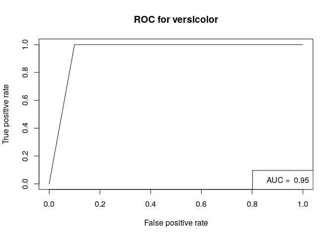

Introduction
------------

Different performance measures for evaluating whether your model is good
or not.

Install packages if missing and load.

    .libPaths('/packages')
    my_packages <- c('caret', 'clValid', 'dendextend', 'rpart', 'ROCR', 'randomForest', 'verification')

    for (my_package in my_packages){
       if(!require(my_package, character.only = TRUE)){
          install.packages(my_package, '/packages')
          library(my_package, character.only = TRUE)
       }
    }

Spam
----

Use [spam
data](https://archive.ics.uci.edu/ml/machine-learning-databases/spambase/spambase.names)
to train a Random Forest model to illustrate evaluation measures.

    spam_data <- read.csv(file = "../data/spambase.csv")

    spam_data$class <- factor(spam_data$class)

    set.seed(31)
    system.time(rf <- randomForest(class ~ ., data = spam_data, importance=TRUE, proximity=TRUE, do.trace=100))

    ## ntree      OOB      1      2
    ##   100:   4.76%  3.16%  7.23%
    ##   200:   4.65%  2.80%  7.50%
    ##   300:   4.65%  2.73%  7.61%
    ##   400:   4.63%  2.73%  7.56%
    ##   500:   4.59%  2.73%  7.45%

    ##    user  system elapsed 
    ##  32.138   0.864  33.080

Classification measures
-----------------------

Build confusion matrix and calculate accuracy, precision, and recall.
Check out [this guide as
well](http://www.dataschool.io/simple-guide-to-confusion-matrix-terminology/).

Use `table` to construct a confusion matrix.

    (spam_rf_table <- table(spam_data$class, rf$predicted))

    ##    
    ##        0    1
    ##   0 2712   76
    ##   1  135 1678

    TP <- spam_rf_table[1, 1]
    FN <- spam_rf_table[1, 2]
    FP <- spam_rf_table[2, 1]
    TN <- spam_rf_table[2, 2]

Accuracy is the easiest to remember; you take all the correct
predictions and divide by the total:

-   Accuracy = (TP + TN) / (TP + FP + FN + TN)

<!-- -->

    (accuracy <- (TP + TN) / (TP + FN + FP + TN))

    ## [1] 0.9541404

    # (accuracy  <- sum(diag(spam_rf_table)) / sum(spam_rf_table))

Precision or Positive Predictive Value (PPV) is concerned with all the
*positive* calls that were *predicted*:

-   Precision or Positive Predictive Value (PPV) = TP / (TP + FP)

<!-- -->

    (precision <- TP / (TP + FP))

    ## [1] 0.9525817

Recall (also known by other names, see below) is concerned with how many
of the *truth positive cases* were predicted as positive. The term
sensitivity makes a bit more sense to me as it describes how sensitive a
method is in detecting positive cases.

-   Sensitivity or True Positive Rate (TPR) or Recall or Hit Rate = TP /
    (TP + FN)

<!-- -->

    (recall <- TP / (TP + FN))

    ## [1] 0.9727403

Specificity is concerned with how many of the *truth negative cases*
were predicted as negative, which is opposite to sensitivity.

-   Specificity or True Negative Rate (TNR) = TN / (TN + FP)

<!-- -->

    (specificity <- TN / (TN + FP))

    ## [1] 0.9255378

Depending on the application, different metrics can be more desirable
than others. For example when detecting spam, it is more preferably to
have a high specificity (detect all real emails) than to have a high
sensitivity (detect all spam).

Other measures include:

-   Negative Predictive Value (NPV) = TN / (TN + FN)
-   Fall-out or False Positive Rate (FPR) = FP / (FP + TN) = 1 -
    specificity
-   False Negative Rate (FNR) = FN / (FN + TP) = 1 - TPR
-   False Discovery Rate (FDR) = TP / (TP + FP) = 1 - PPV

Regression
----------

Root Mean Squared Error (RMSE), which is the mean distance between
estimates and the regression line.

%5E2&space;%7D)

The blue line and black lines in the plot below shows the linear fit and
the residuals (how far off a prediction was from the actual value),
respectively. The RMSE sums all squared residuals, divides by all cases
(i.e. calculates the mean), and then takes the square root.

We can calculate the RMSE as per below.

    # predict height from weight
    lm.fit <- lm(height ~ weight, data = women)
    h_pred <- predict(lm.fit, women)
    (rmse <- sqrt( ( 1/length(h_pred) ) * sum( (women$height - h_pred) ^ 2) ))

    ## [1] 0.4096541

Clustering
----------

Measure the distance between points within a cluster and between
clusters.

-   Within Sum of Squares (WSS) measures the within cluster similarity
-   Between cluster Sum of Squares (BSS) measures the between cluster
    similarity
-   The [Dunn index](https://en.wikipedia.org/wiki/Dunn_index) is the
    minimal intercluster distance (between cluster measurement) divided
    by the maximal diameter (within cluster measurement); a higher Dunn
    index indicates better clustering

For K-means clustering, the measures for WSS and BSS can be found in the
cluster object as tot.withinss and betweenss.

    km <- kmeans(iris[,-5], centers = 3, nstart = 1)
    km

    ## K-means clustering with 3 clusters of sizes 38, 62, 50
    ## 
    ## Cluster means:
    ##   Sepal.Length Sepal.Width Petal.Length Petal.Width
    ## 1     6.850000    3.073684     5.742105    2.071053
    ## 2     5.901613    2.748387     4.393548    1.433871
    ## 3     5.006000    3.428000     1.462000    0.246000
    ## 
    ## Clustering vector:
    ##   [1] 3 3 3 3 3 3 3 3 3 3 3 3 3 3 3 3 3 3 3 3 3 3 3 3 3 3 3 3 3 3 3 3 3 3 3 3 3
    ##  [38] 3 3 3 3 3 3 3 3 3 3 3 3 3 2 2 1 2 2 2 2 2 2 2 2 2 2 2 2 2 2 2 2 2 2 2 2 2
    ##  [75] 2 2 2 1 2 2 2 2 2 2 2 2 2 2 2 2 2 2 2 2 2 2 2 2 2 2 1 2 1 1 1 1 2 1 1 1 1
    ## [112] 1 1 2 2 1 1 1 1 2 1 2 1 2 1 1 2 2 1 1 1 1 1 2 1 1 1 1 2 1 1 1 2 1 1 1 2 1
    ## [149] 1 2
    ## 
    ## Within cluster sum of squares by cluster:
    ## [1] 23.87947 39.82097 15.15100
    ##  (between_SS / total_SS =  88.4 %)
    ## 
    ## Available components:
    ## 
    ## [1] "cluster"      "centers"      "totss"        "withinss"     "tot.withinss"
    ## [6] "betweenss"    "size"         "iter"         "ifault"

    d  <- dist(iris[,-5])
    dunn(d, km$cluster)

    ## [1] 0.09880739

    # example adapted from clValid
    data(mouse, package = "clValid")
    express <- mouse[1:25, -c(1,8)]
    rownames(express) <- mouse$ID[1:25]
    express_dist <- dist(express,method="euclidean")
    express_hclust <- hclust(express_dist, method="average")
    express_cluster <- cutree(express_hclust, k = 3)
    dunn(express_dist, express_cluster)

    ## [1] 0.2315126

    plot(color_branches(express_hclust, k = 3))

Cross validation
----------------

Instead of a single instance of train/test, cross validation carries out
n-fold train/test evaluations. For example, the example below
illustrates a 4-fold cross validation.

The `caret` package in R supports many types of cross-validation, and
you can specify which type of cross-validation and the number of
cross-validation folds with the trainControl() function, which you pass
to the trControl argument in train().

    # using the diamonds data set from ggplot2
    # ggplot2 is automatically loaded with caret
    model <- train(
      price ~ ., diamonds,
      method = "lm",
      trControl = trainControl(
        method = "cv",
        number = 10,
        verboseIter = TRUE
      )
    )

    ## + Fold01: intercept=TRUE 
    ## - Fold01: intercept=TRUE 
    ## + Fold02: intercept=TRUE 
    ## - Fold02: intercept=TRUE 
    ## + Fold03: intercept=TRUE 
    ## - Fold03: intercept=TRUE 
    ## + Fold04: intercept=TRUE 
    ## - Fold04: intercept=TRUE 
    ## + Fold05: intercept=TRUE 
    ## - Fold05: intercept=TRUE 
    ## + Fold06: intercept=TRUE 
    ## - Fold06: intercept=TRUE 
    ## + Fold07: intercept=TRUE 
    ## - Fold07: intercept=TRUE 
    ## + Fold08: intercept=TRUE 
    ## - Fold08: intercept=TRUE 
    ## + Fold09: intercept=TRUE 
    ## - Fold09: intercept=TRUE 
    ## + Fold10: intercept=TRUE 
    ## - Fold10: intercept=TRUE 
    ## Aggregating results
    ## Fitting final model on full training set

    model

    ## Linear Regression 
    ## 
    ## 53940 samples
    ##     9 predictor
    ## 
    ## No pre-processing
    ## Resampling: Cross-Validated (10 fold) 
    ## Summary of sample sizes: 48547, 48547, 48546, 48547, 48545, 48545, ... 
    ## Resampling results:
    ## 
    ##   RMSE      Rsquared   MAE     
    ##   1130.808  0.9196786  740.3986
    ## 
    ## Tuning parameter 'intercept' was held constant at a value of TRUE

Using the `caret` package, you can perform 5 x 5-fold cross validations
by adding the `repeats` parameter.

    model <- train(
      price ~ ., diamonds,
      method = "lm",
      trControl = trainControl(
        method = "cv",
        number = 5,
        repeats = 5,
        verboseIter = TRUE
      )
    )

    ## Warning: `repeats` has no meaning for this resampling method.

    ## + Fold1: intercept=TRUE 
    ## - Fold1: intercept=TRUE 
    ## + Fold2: intercept=TRUE 
    ## - Fold2: intercept=TRUE 
    ## + Fold3: intercept=TRUE 
    ## - Fold3: intercept=TRUE 
    ## + Fold4: intercept=TRUE 
    ## - Fold4: intercept=TRUE 
    ## + Fold5: intercept=TRUE 
    ## - Fold5: intercept=TRUE 
    ## Aggregating results
    ## Fitting final model on full training set

    model

    ## Linear Regression 
    ## 
    ## 53940 samples
    ##     9 predictor
    ## 
    ## No pre-processing
    ## Resampling: Cross-Validated (5 fold) 
    ## Summary of sample sizes: 43152, 43152, 43152, 43152, 43152 
    ## Resampling results:
    ## 
    ##   RMSE      Rsquared   MAE     
    ##   1131.282  0.9195997  740.5735
    ## 
    ## Tuning parameter 'intercept' was held constant at a value of TRUE

Receiver Operator Characteristic Curve
--------------------------------------

-   The false positive rate (second row of confusion matrix), FP / (FP +
    TN), is on the x-axis
-   The true positive rate (recall or first row of confusion matrix), TP
    / (TP + FN), is on the y-axis
-   Use the R package called ROCR

<!-- -->

    # split iris dataset into training and test
    set.seed(31)
    x     <- sample(1:nrow(iris), size = 0.8 * nrow(iris), replace = FALSE)
    x_hat <- setdiff(1:150, x)
    train <- iris[x,]
    test  <- iris[x_hat,]

    tree <- rpart(Species ~ ., train, method = "class")

    probs <- predict(tree, test, type = "prob")
    probs_setosa <- probs[,1]
    probs_versicolor <- probs[,2]

    setosa <- as.numeric(grepl(pattern = 'setosa', x = test$Species))
    versicolor <- as.numeric(grepl(pattern = 'versicolor', x = test$Species))
    pred <- prediction(probs_setosa, setosa)
    pred <- prediction(probs_versicolor, versicolor)

    auc <- performance(pred, 'auc')
    auc_value <- auc@y.values[[1]]

    perf <- performance(pred, 'tpr', 'fpr')
    plot(perf, main='ROC for versicolor')
    legend('bottomright', legend = paste('AUC = ', auc_value))

    auc <- roc.area(as.integer(spam_data$class==1), rf$votes[,2])$A
    roc.plot(as.integer(spam_data$class==1), rf$votes[,2], main="", threshold = seq(0, 1, 0.1))
    legend("bottomright", bty="n", sprintf("Area Under the Curve (AUC) = %1.4f", auc))
    title(main="OOB ROC Curve")

Plotting with confidence intervals, which are calculated by
bootstrapping the observations and prediction, then calculating
probability of detection yes (PODy) and probability of detection no
(PODn) values. The default CI is 95%.

    system.time(roc.plot(as.integer(spam_data$class==1), rf$votes[,2], main="", threshold = seq(0, 1, 0.1), CI = TRUE))

    ##    user  system elapsed 
    ##  10.054   0.186  10.264

    legend("bottomright", bty="n", sprintf("Area Under the Curve (AUC) = %1.4f", auc))
    title(main="OOB ROC Curve")

Session info
------------

Time built.

    ## [1] "2022-04-12 08:10:31 UTC"

Session info.

    ## R version 4.1.3 (2022-03-10)
    ## Platform: x86_64-pc-linux-gnu (64-bit)
    ## Running under: Ubuntu 20.04.4 LTS
    ## 
    ## Matrix products: default
    ## BLAS:   /usr/lib/x86_64-linux-gnu/openblas-pthread/libblas.so.3
    ## LAPACK: /usr/lib/x86_64-linux-gnu/openblas-pthread/liblapack.so.3
    ## 
    ## locale:
    ##  [1] LC_CTYPE=en_US.UTF-8       LC_NUMERIC=C              
    ##  [3] LC_TIME=en_US.UTF-8        LC_COLLATE=en_US.UTF-8    
    ##  [5] LC_MONETARY=en_US.UTF-8    LC_MESSAGES=en_US.UTF-8   
    ##  [7] LC_PAPER=en_US.UTF-8       LC_NAME=C                 
    ##  [9] LC_ADDRESS=C               LC_TELEPHONE=C            
    ## [11] LC_MEASUREMENT=en_US.UTF-8 LC_IDENTIFICATION=C       
    ## 
    ## attached base packages:
    ## [1] stats     graphics  grDevices utils     datasets  methods   base     
    ## 
    ## other attached packages:
    ##  [1] verification_1.42  dtw_1.22-3         proxy_0.4-26       CircStats_0.2-6   
    ##  [5] MASS_7.3-55        boot_1.3-28        fields_13.3        viridis_0.6.2     
    ##  [9] viridisLite_0.4.0  spam_2.8-0         randomForest_4.7-1 ROCR_1.0-11       
    ## [13] rpart_4.1.16       dendextend_1.15.2  clValid_0.7        cluster_2.1.2     
    ## [17] caret_6.0-91       lattice_0.20-45    forcats_0.5.1      stringr_1.4.0     
    ## [21] dplyr_1.0.8        purrr_0.3.4        readr_2.1.2        tidyr_1.2.0       
    ## [25] tibble_3.1.6       ggplot2_3.3.5      tidyverse_1.3.1   
    ## 
    ## loaded via a namespace (and not attached):
    ##  [1] nlme_3.1-155         fs_1.5.2             lubridate_1.8.0     
    ##  [4] httr_1.4.2           tools_4.1.3          backports_1.4.1     
    ##  [7] utf8_1.2.2           R6_2.5.1             DBI_1.1.2           
    ## [10] colorspace_2.0-3     nnet_7.3-17          withr_2.5.0         
    ## [13] gridExtra_2.3        tidyselect_1.1.2     compiler_4.1.3      
    ## [16] cli_3.2.0            rvest_1.0.2          xml2_1.3.3          
    ## [19] scales_1.1.1         digest_0.6.29        rmarkdown_2.13      
    ## [22] pkgconfig_2.0.3      htmltools_0.5.2      parallelly_1.31.0   
    ## [25] highr_0.9            maps_3.4.0           dbplyr_2.1.1        
    ## [28] fastmap_1.1.0        rlang_1.0.2          readxl_1.4.0        
    ## [31] rstudioapi_0.13      generics_0.1.2       jsonlite_1.8.0      
    ## [34] ModelMetrics_1.2.2.2 magrittr_2.0.3       dotCall64_1.0-1     
    ## [37] Matrix_1.4-0         Rcpp_1.0.8.3         munsell_0.5.0       
    ## [40] fansi_1.0.3          lifecycle_1.0.1      stringi_1.7.6       
    ## [43] pROC_1.18.0          yaml_2.3.5           plyr_1.8.7          
    ## [46] recipes_0.2.0        grid_4.1.3           parallel_4.1.3      
    ## [49] listenv_0.8.0        crayon_1.5.1         haven_2.4.3         
    ## [52] splines_4.1.3        hms_1.1.1            knitr_1.38          
    ## [55] pillar_1.7.0         future.apply_1.8.1   reshape2_1.4.4      
    ## [58] codetools_0.2-18     stats4_4.1.3         reprex_2.0.1        
    ## [61] glue_1.6.2           evaluate_0.15        data.table_1.14.2   
    ## [64] modelr_0.1.8         vctrs_0.4.0          tzdb_0.3.0          
    ## [67] foreach_1.5.2        cellranger_1.1.0     gtable_0.3.0        
    ## [70] future_1.24.0        assertthat_0.2.1     xfun_0.30           
    ## [73] gower_1.0.0          prodlim_2019.11.13   broom_0.7.12        
    ## [76] class_7.3-20         survival_3.2-13      timeDate_3043.102   
    ## [79] iterators_1.0.14     hardhat_0.2.0        lava_1.6.10         
    ## [82] globals_0.14.0       ellipsis_0.3.2       ipred_0.9-12
