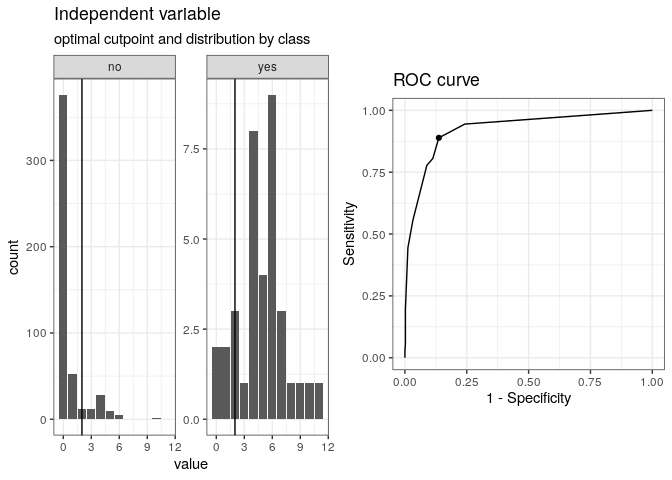
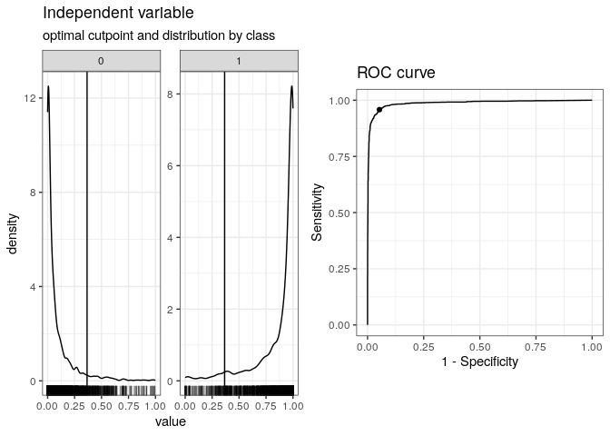
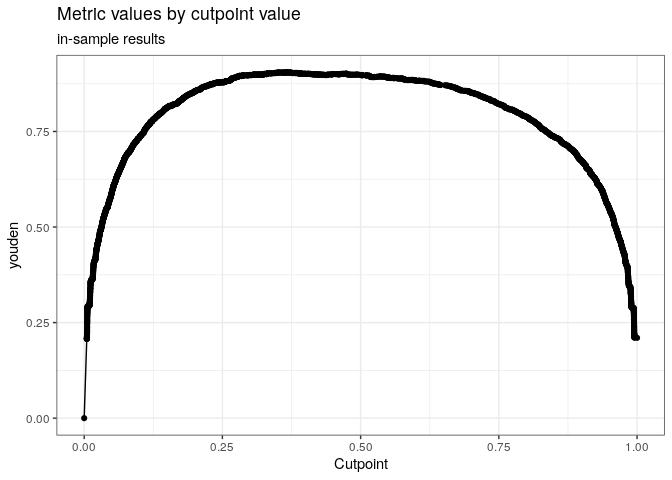

## Introduction

[cutpointr](https://cran.r-project.org/web/packages/cutpointr/vignettes/cutpointr.html)
can be used to calculate optimal cut offs.

Install packages if missing and load.

``` r
.libPaths('/packages')
my_packages <- c('cutpointr', 'randomForest')

for (my_package in my_packages){
   if(!require(my_package, character.only = TRUE)){
      install.packages(my_package, '/packages')
   }
  library(my_package, character.only = TRUE)
}

library(tidyverse)
theme_set(theme_bw())
```

## Example

The `suicide` data is a data frame with 532 rows and 4 variables:

1.  `age` - (numeric) Age of participants in years
2.  `gender` - (factor) Gender
3.  `dsi` - (numeric) Sum-score (0 = low suicidality, 12 = high
    suicidality)
4.  `suicide` - (factor) Past suicide attempt (no = no attempt, yes = at
    least one attempt)

``` r
data(suicide)
head(suicide)
```

    ##   age gender dsi suicide
    ## 1  29 female   1      no
    ## 2  26   male   0      no
    ## 3  26 female   0      no
    ## 4  27 female   0      no
    ## 5  28 female   0      no
    ## 6  53   male   2      no

-   `data` - A data.frame with the data needed for x, class and
    optionally subgroup.
-   `x` - The variable name to be used for classification,
    e.g. predictions. The raw vector of values if the data argument is
    unused.
-   `class` - The variable name indicating class membership. If the data
    argument is unused, the vector of raw numeric values.
-   `method` - (function) A function for determining cutpoints. Can be
    user supplied or use some of the built in methods. See details.
-   `metric` - (function) The function for computing a metric when using
    maximize_metric or minimize_metric as method and and for the
    out-of-bag values during bootstrapping. A way of internally
    validating the performance. User defined functions can be supplied,
    see details.

``` r
cp <- cutpointr(
  data = suicide,
  x = dsi,
  class = suicide, 
  method = maximize_metric,
  metric = sum_sens_spec
)
```

    ## Assuming the positive class is yes

    ## Assuming the positive class has higher x values

``` r
summary(cp)
```

    ## Method: maximize_metric 
    ## Predictor: dsi 
    ## Outcome: suicide 
    ## Direction: >= 
    ## 
    ##     AUC   n n_pos n_neg
    ##  0.9238 532    36   496
    ## 
    ##  optimal_cutpoint sum_sens_spec    acc sensitivity specificity tp fn fp  tn
    ##                 2        1.7518 0.8647      0.8889      0.8629 32  4 68 428
    ## 
    ## Predictor summary: 
    ##     Data Min.   5% 1st Qu. Median      Mean 3rd Qu.  95% Max.       SD NAs
    ##  Overall    0 0.00       0      0 0.9210526       1 5.00   11 1.852714   0
    ##       no    0 0.00       0      0 0.6330645       0 4.00   10 1.412225   0
    ##      yes    0 0.75       4      5 4.8888889       6 9.25   11 2.549821   0

Optimal cut off.

``` r
cp$optimal_cutpoint
```

    ## [1] 2

Plot.

``` r
plot(cp)
```



[Youden's J
statistic](https://en.wikipedia.org/wiki/Youden%27s_J_statistic) =
sensitivity + specificity - 1.

``` r
cp_youden <- cutpointr(
  data = suicide,
  x = dsi,
  class = suicide, 
  method = maximize_metric,
  metric = youden
)
```

    ## Assuming the positive class is yes

    ## Assuming the positive class has higher x values

``` r
summary(cp_youden)
```

    ## Method: maximize_metric 
    ## Predictor: dsi 
    ## Outcome: suicide 
    ## Direction: >= 
    ## 
    ##     AUC   n n_pos n_neg
    ##  0.9238 532    36   496
    ## 
    ##  optimal_cutpoint youden    acc sensitivity specificity tp fn fp  tn
    ##                 2 0.7518 0.8647      0.8889      0.8629 32  4 68 428
    ## 
    ## Predictor summary: 
    ##     Data Min.   5% 1st Qu. Median      Mean 3rd Qu.  95% Max.       SD NAs
    ##  Overall    0 0.00       0      0 0.9210526       1 5.00   11 1.852714   0
    ##       no    0 0.00       0      0 0.6330645       0 4.00   10 1.412225   0
    ##      yes    0 0.75       4      5 4.8888889       6 9.25   11 2.549821   0

## Random Forests

Use [spam
data](https://archive.ics.uci.edu/ml/machine-learning-databases/spambase/spambase.names)
to train a Random Forest model to test with `cutpointr`. Class 0 and 1
are ham (non-spam) and spam, respectively.

``` r
spam_data <- read.csv(file = "../data/spambase.csv")
spam_data$class <- factor(spam_data$class)
set.seed(1984)
rf <- randomForest(class ~ ., data = spam_data)
```

Optimal cut off using Youden's J statistic.

``` r
cp_rf_youden <- cutpointr(
  x = rf$votes[, 2],
  class = as.integer(spam_data$class)-1,
  method = maximize_metric,
  metric = youden
)
```

    ## Assuming the positive class is 1

    ## Assuming the positive class has higher x values

``` r
summary(cp_rf_youden)
```

    ## Method: maximize_metric 
    ## Predictor: x 
    ## Outcome: class 
    ## Direction: >= 
    ## 
    ##     AUC    n n_pos n_neg
    ##  0.9869 4601  1813  2788
    ## 
    ##  optimal_cutpoint youden    acc sensitivity specificity   tp fn  fp   tn
    ##            0.3657  0.905 0.9513      0.9581      0.9469 1737 76 148 2640
    ## 
    ## Predictor summary: 
    ##     Data Min.        5%     1st Qu.     Median       Mean   3rd Qu.   95%
    ##  Overall    0 0.0000000 0.017341040 0.14204545 0.39599104 0.9222798 1.000
    ##        0    0 0.0000000 0.005405405 0.03045685 0.08577174 0.1022727 0.379
    ##        1    0 0.3889122 0.840659341 0.96132597 0.87304092 0.9945355 1.000
    ##      Max.        SD NAs
    ##  1.000000 0.4188878   0
    ##  0.994898 0.1400542   0
    ##  1.000000 0.1987519   0

Plot.

``` r
plot(cp_rf_youden)
```



Plot metric.

``` r
plot_metric(cp_rf_youden)
```



## Session info

Time built.

    ## [1] "2022-11-18 07:04:37 UTC"

Session info.

    ## R version 4.2.0 (2022-04-22)
    ## Platform: x86_64-pc-linux-gnu (64-bit)
    ## Running under: Ubuntu 20.04.4 LTS
    ## 
    ## Matrix products: default
    ## BLAS:   /usr/lib/x86_64-linux-gnu/openblas-pthread/libblas.so.3
    ## LAPACK: /usr/lib/x86_64-linux-gnu/openblas-pthread/liblapack.so.3
    ## 
    ## locale:
    ##  [1] LC_CTYPE=en_US.UTF-8       LC_NUMERIC=C              
    ##  [3] LC_TIME=en_US.UTF-8        LC_COLLATE=en_US.UTF-8    
    ##  [5] LC_MONETARY=en_US.UTF-8    LC_MESSAGES=en_US.UTF-8   
    ##  [7] LC_PAPER=en_US.UTF-8       LC_NAME=C                 
    ##  [9] LC_ADDRESS=C               LC_TELEPHONE=C            
    ## [11] LC_MEASUREMENT=en_US.UTF-8 LC_IDENTIFICATION=C       
    ## 
    ## attached base packages:
    ## [1] stats     graphics  grDevices utils     datasets  methods   base     
    ## 
    ## other attached packages:
    ##  [1] forcats_0.5.2        stringr_1.4.1        dplyr_1.0.10        
    ##  [4] purrr_0.3.5          readr_2.1.3          tidyr_1.2.1         
    ##  [7] tibble_3.1.8         ggplot2_3.4.0        tidyverse_1.3.2     
    ## [10] randomForest_4.7-1.1 cutpointr_1.1.2     
    ## 
    ## loaded via a namespace (and not attached):
    ##  [1] Rcpp_1.0.9          lubridate_1.9.0     assertthat_0.2.1   
    ##  [4] digest_0.6.30       foreach_1.5.2       utf8_1.2.2         
    ##  [7] R6_2.5.1            cellranger_1.1.0    backports_1.4.1    
    ## [10] reprex_2.0.2        evaluate_0.17       highr_0.9          
    ## [13] httr_1.4.4          pillar_1.8.1        rlang_1.0.6        
    ## [16] googlesheets4_1.0.1 readxl_1.4.1        rstudioapi_0.14    
    ## [19] rmarkdown_2.17      labeling_0.4.2      googledrive_2.0.0  
    ## [22] munsell_0.5.0       broom_1.0.1         compiler_4.2.0     
    ## [25] modelr_0.1.9        xfun_0.34           pkgconfig_2.0.3    
    ## [28] htmltools_0.5.3     tidyselect_1.2.0    gridExtra_2.3      
    ## [31] codetools_0.2-18    fansi_1.0.3         crayon_1.5.2       
    ## [34] tzdb_0.3.0          dbplyr_2.2.1        withr_2.5.0        
    ## [37] grid_4.2.0          jsonlite_1.8.3      gtable_0.3.1       
    ## [40] lifecycle_1.0.3     DBI_1.1.3           magrittr_2.0.3     
    ## [43] scales_1.2.1        cli_3.4.1           stringi_1.7.8      
    ## [46] farver_2.1.1        fs_1.5.2            xml2_1.3.3         
    ## [49] ellipsis_0.3.2      generics_0.1.3      vctrs_0.5.0        
    ## [52] iterators_1.0.14    tools_4.2.0         glue_1.6.2         
    ## [55] hms_1.1.2           fastmap_1.1.0       yaml_2.3.6         
    ## [58] timechange_0.1.1    colorspace_2.0-3    gargle_1.2.1       
    ## [61] rvest_1.0.3         knitr_1.40          haven_2.5.1
