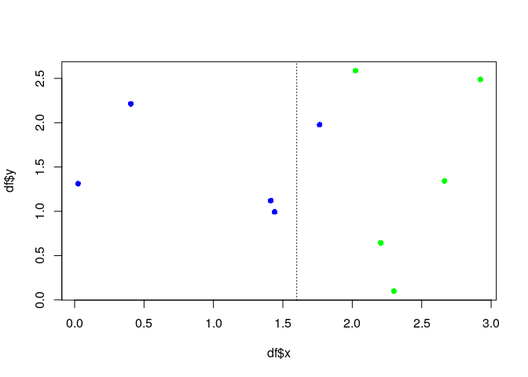

## Introduction

Mathematical formulae elaborated.

## Root Mean Square Error

The Root Mean Square Error (RMSE) is often used in regression problems
to indicate how much error was made by the predictions, with a higher
value to larger errors.

$$ RMSE(X, h) = \sqrt{ \frac{1}{m} \sum^m_{i = 1} ( h(x^{(i)}) - y^{(i)} )^2 } $$

-   $m$ is the number of instances/cases in the dataset
-   $x^{(i)}$ is a vector of all the feature values of the $i^{th}$
    instance in the dataset and $y^{(i)}$ is the label
-   $X$ is a matrix containing all the feature values of all instances
    in the dataset. There is one row per instance, and the $i^{th}$ row
    is equal to the transpose of $x^{(i)}$, noted $(x^{(i)})^T$.
-   $h$ is the prediction function, also called a hypothesis. When the
    function is given an instance's feature vector $x^{(i)}$, it outputs
    a predicted value $\hat{y}^{(i)} = h(x^{(i)})$ for that instance.
-   $RMSE(X,h)$ is the cost function measured on the set using
    hypothesis $h$.

## Mean Absolute Error

If there are many outliers, the Mean Absolute Error (MAE, also called
the average absolute deviation) can be considered.

$$ MAE(X, h) = \frac{1}{m} \sum^m_{i = 1} |h(x^{(i)}) - y^{(i)}| $$

## Shannon Entropy

[Entropy is a measure of
randomness](https://medium.com/udacity/shannon-entropy-information-gain-and-picking-balls-from-buckets-5810d35d54b4)
(or variance), where high entropy == more randomness/variance and low
entropy == less randomness/variance. The general formula is:

$$ Entropy = - \sum^n_{i=1} p_i\ log_2\ p_i$$

-   $n$ is the number of classes/labels
-   $p_i$ is the probability of the $i^{th}$ class

The `entropy` function will take a vector of classes/labels and return
the entropy.

``` r
eg1 <- c('A', 'A', 'A', 'A', 'A', 'A', 'A', 'A')
eg2 <- c('A', 'A', 'A', 'A', 'B', 'B', 'C', 'D')
eg3 <- c('A', 'A', 'B', 'B', 'C', 'C', 'D', 'D')

entropy <- function(x){
  probs <- table(x) / length(x)
  -sum(probs * log2(probs))
}

entropy(eg1)
```

    ## [1] 0

``` r
entropy(eg2)
```

    ## [1] 1.75

``` r
entropy(eg3)
```

    ## [1] 2

## Information Gain

Consider the [following
dataset](https://victorzhou.com/blog/information-gain/).

``` r
set.seed(1984)
y <- runif(n = 10, min = 0, max = 3)
x1 <- runif(n = 5, min = 0, max = 2)
x2 <- runif(n = 5, min = 2, max = 3)

df <- data.frame(
  x = c(x1, x2),
  y = y,
  label = rep(c("blue", "green"), each = 5)
)

plot(df$x, df$y, col = df$label, pch = 16)
abline(v = 1.6, lty = 3)
```



Before the split, the entropy was:

``` r
entropy(df$label)
```

    ## [1] 1

After the split.

``` r
my_split <- df$x < 1.6

left_split <- df$label[my_split]
entropy(left_split)
```

    ## [1] 0

``` r
right_split <- df$label[!my_split]
entropy(right_split)
```

    ## [1] 0.6500224

Weigh by number of elements and calculate entropy after split.

``` r
entropy_after <- entropy(left_split) * (length(left_split) / length(df$label)) + entropy(right_split) * (length(right_split) / length(df$label))
entropy_after
```

    ## [1] 0.3900135

Information gain == how much entropy we removed.

``` r
information_gain <- entropy(df$label) - entropy_after
information_gain
```

    ## [1] 0.6099865

Information gain is calculated for a split by subtracting the weighted
entropies of each branch from the original entropy.

## Session info

Time built.

    ## [1] "2022-11-22 07:45:47 UTC"

Session info.

    ## R version 4.2.0 (2022-04-22)
    ## Platform: x86_64-pc-linux-gnu (64-bit)
    ## Running under: Ubuntu 20.04.4 LTS
    ## 
    ## Matrix products: default
    ## BLAS:   /usr/lib/x86_64-linux-gnu/openblas-pthread/libblas.so.3
    ## LAPACK: /usr/lib/x86_64-linux-gnu/openblas-pthread/liblapack.so.3
    ## 
    ## locale:
    ##  [1] LC_CTYPE=en_US.UTF-8       LC_NUMERIC=C              
    ##  [3] LC_TIME=en_US.UTF-8        LC_COLLATE=en_US.UTF-8    
    ##  [5] LC_MONETARY=en_US.UTF-8    LC_MESSAGES=en_US.UTF-8   
    ##  [7] LC_PAPER=en_US.UTF-8       LC_NAME=C                 
    ##  [9] LC_ADDRESS=C               LC_TELEPHONE=C            
    ## [11] LC_MEASUREMENT=en_US.UTF-8 LC_IDENTIFICATION=C       
    ## 
    ## attached base packages:
    ## [1] stats     graphics  grDevices utils     datasets  methods   base     
    ## 
    ## loaded via a namespace (and not attached):
    ##  [1] compiler_4.2.0  magrittr_2.0.3  fastmap_1.1.0   cli_3.4.1      
    ##  [5] tools_4.2.0     htmltools_0.5.3 rstudioapi_0.14 yaml_2.3.6     
    ##  [9] stringi_1.7.8   rmarkdown_2.17  highr_0.9       knitr_1.40     
    ## [13] stringr_1.4.1   xfun_0.34       digest_0.6.30   rlang_1.0.6    
    ## [17] evaluate_0.17
