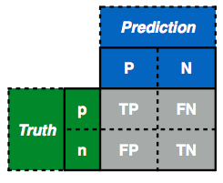
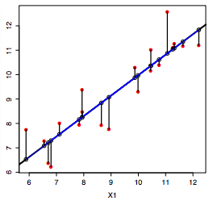
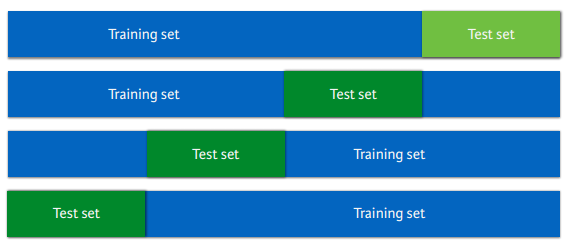

```{r setup, include=FALSE}
knitr::opts_chunk$set(cache = FALSE)
knitr::opts_chunk$set(echo = TRUE)
knitr::opts_chunk$set(fig.path = "img/")
```

## Introduction

Different performance measures for evaluating predictive models and unsupervised clustering.

Install packages if missing and load.

```{r load_package, message=FALSE, warning=FALSE}
.libPaths('/packages')
my_packages <- c('caret', 'clValid', 'dendextend', 'rpart', 'ROCR', 'randomForest', 'verification')

for (my_package in my_packages){
   if(!require(my_package, character.only = TRUE)){
      install.packages(my_package, '/packages')
      library(my_package, character.only = TRUE)
   }
}
library(tidyverse)
theme_set(theme_bw())
```

## Spam

Use [spam data](https://archive.ics.uci.edu/ml/machine-learning-databases/spambase/spambase.names) to train a Random Forest model to illustrate evaluation measures. Class 0 and 1 are ham (non-spam) and spam, respectively.

```{r load_spam}
spam_data <- read.csv(file = "../data/spambase.csv")
spam_data$class <- factor(spam_data$class)

spam_data[c(1:3, (nrow(spam_data)-2):nrow(spam_data)), (ncol(spam_data)-2):ncol(spam_data)]
```

Train model.

```{r random_forest_spam}
set.seed(31)
system.time(rf <- randomForest(class ~ ., data = spam_data, importance=TRUE, proximity=TRUE, do.trace=100))
```

## Classification measures

The metrics that are typically used are:

* Sensitivity (a.k.a. recall) versus specificity
* Precision versus recall

Since I always forget what the metrics measure, I'll try and think of some way to link the terms and their inherent meanings with the performance measure that they are trying to capture.

When I hear the word sensitivity, I immediately think of someone who is acute at picking up signals. For example, when talking with somebody, a sensitive person not only hears the words but can also detect signals from someone's body language. In this sense, I should try to remember sensitivity as picking up positive signals _regardless of mixed signals_; body language can be easily misinterpreted. The way it is calculated is by tallying the number of detected positive signals and dividing this by the total number of real/true positive signals.

When I think of specificity, I think of subsetting. If we had a lot of marbles, a specific subset of marbles would be one with only blue marbles; a set with orange, yellow, and blue, marbles is not very specific. However, a non-specific set of marbles can still have a very high sensitivity because if a classifier's job is to pick out the blue marbles out of many different colours and it classifies everything as blue, it has detected all the true positives. Specificity is like sensitivity but it is concerned with true negatives, which are the marbles that are not blue. Therefore, try to remember specificity as the opposite of sensitivity: tallying the number of "detected" true negatives and dividing by the total number of true negatives.

When I think of precision, I think about a surgeon making a precise surgical incision. It is important to make the correct incision for obvious reasons and therefore precision measures the ability to identify a positive case divided by all true positives plus all the false positives (e.g. incorrect locations). A surgeon needs to make an incision and needs to make a correct incision; they can't just be sensitive or specific.

When I think of recall, I think about a defective product that needs to be recalled. For example if a batch of medicine was found to defective, it is absolutely necessary to recall **every single defective project**. It doesn't matter that non-defective products (false positives) are also recalled because the focus is on identifying the true positives and it is fine if the manufacturer recalls every single product.

Summary:

* Sensitivity -> a sensitive person
* Specificity -> a specific subset
* Precision -> a surgeon making a precise incision
* Recall -> recalling a defective product

### Details

Build confusion matrix and calculate accuracy, precision, and recall. Check out [this guide as well](https://www.dataschool.io/simple-guide-to-confusion-matrix-terminology/).



Use `table` to construct a confusion matrix, where rows are real labels and columns are the predictions (different from the table above). Therefore the first row and first column cell are the non-spam cases that were predicted as non-spam (true negative). The first row and second column cell are the non-spam cases predicted as spam (false positive). The second row and first column cell are spam cases predicted as non-spam (false negative). Finally, the second row and second column cell are cases that are spam and predicted as spam (true positive).

```{r spam_rf_table}
(spam_rf_table <- table(spam_data$class, rf$predicted))

TN <- spam_rf_table[1, 1]
FP <- spam_rf_table[1, 2]
FN <- spam_rf_table[2, 1]
TP <- spam_rf_table[2, 2]
```

Accuracy is the easiest to remember; you take all the correct predictions and divide by the total:

* Accuracy = (TP + TN) / (TP + FP + FN + TN)

```{r accuracy}
(accuracy <- (TP + TN) / (TP + FN + FP + TN))

(accuracy  <- sum(diag(spam_rf_table)) / sum(spam_rf_table))
```

Precision or Positive Predictive Value (PPV) is concerned with all the _positive_ calls that were _predicted_ (column two of our table):

* Precision or Positive Predictive Value (PPV) = TP / (TP + FP)

```{r precision}
(precision <- TP / (TP + FP))
```

Recall (also known by other names, see below) is concerned with how many of the _truth positive cases_ were predicted as positive (row two of our table). The term sensitivity makes a bit more sense to me as it describes how sensitive a method is in detecting positive cases.

* Sensitivity or True Positive Rate (TPR) or Recall or Hit Rate = TP / (TP + FN)

```{r sensitivity}
(recall <- TP / (TP + FN))
```

Specificity is concerned with how many of the _truth negative cases_ were predicted as negative (row one of our table), which is opposite to sensitivity.

* Specificity or True Negative Rate (TNR) = TN / (TN + FP)

```{r specificity}
(specificity <- TN / (TN + FP))
```

* Fall-out or False Positive Rate (FPR) = FP / (FP + TN) = 1 - specificity

```{r fpr}
(false_positive_rate <- FP / (FP + TN))
(1 - specificity)
```

* Negative Predictive Value (NPV) = TN / (TN + FN)

```{r npv}
(npv <- TN / (TN + FN))
```

* False Discovery Rate (FDR) = FP / (TP + FP) = 1 - PPV

```{r fdr}
(fdr <- FP / (TP + FP))
(1 - precision)
```

* False Negative Rate (FNR) = FN / (FN + TP) = 1 - TPR

```{r fnr}
(fnr <- FN / (FN + TP))
(1 - recall)
```

Depending on the application, different metrics can be more desirable than others. For example when detecting spam, it is more preferably to have a high specificity (detect all real emails) than to have a high sensitivity (detect all spam).

### F1

The F1 score is an evaluation metric that assesses the predictive skill of a model by elaborating on its **class-wise performance** rather than an overall performance as done by accuracy. F1 score combines the precision and recall scores of a model.

Accuracy is calculated across the entire dataset and can be a reliable metric only if the dataset is class-balanced. For example, if a dataset has 90 and 10 samples in class 1 and class 2, respectively, a model that only predicts class 1, will still be 90% accurate.

Precision and recall offer a trade-off, i.e., one metric comes at the cost of another. More precision involves a harsher classifier that doubts even the actual positive samples from the dataset, thus reducing the recall score. On the other hand, more recall entails a lax critic that allows any sample that resembles a positive class to pass, which makes border-case negative samples classified as positive, thus reducing the precision. Ideally, we want to maximize both precision and recall metrics to obtain the perfect classifier.

The F1 score combines precision and recall using their harmonic mean, and maximising the F1 score implies simultaneously maximising both precision and recall.

> The [harmonic mean](https://en.wikipedia.org/wiki/Harmonic_mean) can be expressed as the reciprocal of the arithmetic mean of the reciprocals of the given set of observations. As a simple example, the harmonic mean of 1, 4, and 4 is

$$ (\frac{ 1^{-1} + 4^{-1} + 4^{-1} }{3})^{-1} = \frac{3}{1/1 + 1/4 + 1/4} = \frac{3}{1.5} = 2$$

The traditional F-measure or balanced F-score ([F1 score](https://en.wikipedia.org/wiki/F-score)) is the harmonic mean of precision and recall:

$$ F_1 = \frac{2}{recall^{-1} + precision^{-1}} = 2\frac{precision \times recall}{precision + recall} = \frac{2TP}{2TP + FP + FN} $$

The macro-averaged F1 score of a model is just a simple average of the class-wise F1 scores obtained.

## Regression

Root Mean Squared Error (RMSE), which is the mean distance between estimates and the regression line.

^2&space;})

The blue line and black lines in the plot below shows the linear fit and the residuals (how far off a prediction was from the actual value), respectively. The RMSE sums all squared residuals, divides by all cases (i.e. calculates the mean), and then takes the square root.



We can calculate the RMSE as per below.

```{r women_rmse}
# predict height from weight
lm.fit <- lm(height ~ weight, data = women)
h_pred <- predict(lm.fit, women)
(rmse <- sqrt( ( 1/length(h_pred) ) * sum( (women$height - h_pred) ^ 2) ))
```

## Clustering

Measure the distance between points within a cluster and between clusters. Perform k-means to demonstrate.

```{r kmeans}
km <- kmeans(iris[,-5], centers = 3, nstart = 1)
```

Within Sum of Squares (WSS) measures the within cluster similarity

```{r kmeans_wss}
km$withinss
```

Between cluster Sum of Squares (BSS) measures the between cluster similarity

```{r kmeans_bss}
km$betweenss
```

The [Dunn index](https://en.wikipedia.org/wiki/Dunn_index) is the minimal intercluster distance (between cluster measurement) divided by the maximal diameter (within cluster measurement); a higher Dunn index indicates better clustering.

```{r kmeans_dunn}
d  <- dist(iris[,-5])
dunn(d, km$cluster)
```

Perform hierarchical clustering and cut dendrogram to form three clusters (example adapted from `clValid`).

```{r dunn_express}
data(mouse, package = "clValid")
express <- mouse[1:25, -c(1,8)]
rownames(express) <- mouse$ID[1:25]
express_dist <- dist(express, method="euclidean")
express_hclust <- hclust(express_dist, method="average")
express_cluster <- cutree(express_hclust, k = 3)
dunn(express_dist, express_cluster)
```

Hierarchical clustering.

```{r dendrogram}
plot(color_branches(express_hclust, k = 3))
```

Not sure that a higher Dunn index indicates better clustering.

```{r try_k}
my_dunn <- vector()
i <- 1
min_k <- 3
max_k <- nrow(express)-1
for (k in min_k:max_k){
  my_clust <- cutree(express_hclust, k = k)
  my_dunn[i] <- dunn(express_dist, my_clust)
  i <- i + 1
}
names(my_dunn) <- min_k:max_k

barplot(
  my_dunn,
  main = "Dunn index at different cluster numbers",
  las = 2
)
```

## Cross validation

Instead of a single instance of train/test, cross validation carries out n-fold train/test evaluations. For example, the example below illustrates a 4-fold cross validation.



The `caret` package in R supports many types of cross-validation, and you can specify which type of cross-validation and the number of cross-validation folds with the trainControl() function, which you pass to the trControl argument in train().

```{r caret_lm}
# using the diamonds data set from ggplot2
# ggplot2 is automatically loaded with caret
model <- train(
  price ~ ., diamonds,
  method = "lm",
  trControl = trainControl(
    method = "cv",
    number = 10,
    verboseIter = TRUE
  )
)

model
```

Using the `caret` package, you can perform 5 x 5-fold cross validations by adding the `repeats` parameter.

```{r caret_lm_xv}
model <- train(
  price ~ ., diamonds,
  method = "lm",
  trControl = trainControl(
    method = "cv",
    number = 5,
    repeats = 5,
    verboseIter = TRUE
  )
)

model
```

## Receiver Operator Characteristic Curve

The [ROCR](https://cran.rstudio.com/web/packages/ROCR/vignettes/ROCR.html) package can be used to generate ROC curves, which has the False Positive Rate (FP / [FP + TN]) on the x-axis and the True Positive Rate (TP / [TP + FN]) on the y-axis.

The point of the ROC curve is to find the best probability to use maximising the True Positive Rate at the lowest False Positive rate. We will use the spam data again and we will start with a random predictor to illustrate how a ROC curve looks with a random predictor.

```{r random_predictor}
spam_data <- read.csv(file = "../data/spambase.csv")
spam_data$class <- factor(spam_data$class)

set.seed(1984)
random_prob <- runif(n = nrow(spam_data))
pred <- prediction(random_prob, spam_data$class)

auc <- performance(pred, 'auc')
auc_value <- round(auc@y.values[[1]], 4)

perf <- performance(pred, 'tpr', 'fpr')
plot(perf, main='ROC for random predictor of spam')
legend('bottomright', legend = paste('AUC = ', auc_value))
```

Let's train a random forest model and use the votes as the probability.

```{r random_forest_roc}
set.seed(1984)
system.time(rf <- randomForest(class ~ ., data = spam_data))

pred <- prediction(rf$votes[, 2], spam_data$class)
auc <- performance(pred, 'auc')
auc_value <- round(auc@y.values[[1]], 4)

perf <- performance(pred, 'tpr', 'fpr')
plot(
  perf,
  main='ROC for Random Forests classifier of spam',
  colorize = TRUE,
  lwd = 3
)
legend("bottomright", legend = paste('AUC = ', auc_value))
```

The [verification package](https://cran.r-project.org/web/packages/verification/index.html) can also be used to generate a (nicer looking) ROC curve.

```{r roc_verification}
labels <- as.integer(spam_data$class == 1)
probs <- rf$votes[, 2]
auc <- roc.area(labels, probs)$A
roc.plot(labels, probs, main="OOB ROC Curve", threshold = seq(0, 1, 0.1))
legend("bottomright", bty="n", sprintf("Area Under the Curve (AUC) = %1.4f", auc))
```

Plotting with confidence intervals, which are calculated by bootstrapping the observations and prediction, then calculating probability of detection yes (PODy) and probability of detection no (PODn) values. The default CI is 95%.

```{r roc_verification_ci}
system.time(
  roc.plot(labels, probs, main="OOB ROC Curve", threshold = seq(0, 1, 0.1), CI = TRUE)
)
legend("bottomright", bty="n", sprintf("Area Under the Curve (AUC) = %1.4f", auc))
```

Precision (TP / [TP + FP]) Recall (TP / [TP + FN]).

```{r precision_recall}
pred <- prediction(rf$votes[, 2], spam_data$class)
perf <- performance(pred, "prec", "rec")
auc <- performance(pred, "aucpr")
auc_value <- round(auc@y.values[[1]], 4)

plot(perf,
     avg= "threshold",
     colorize=TRUE,
     lwd= 3,
     main= "Precision/Recall"
)
legend('bottomleft', legend = paste('AUC = ', auc_value))
```

## Session info

Time built.

```{r time, echo=FALSE}
Sys.time()
```

Session info.

```{r session_info, echo=FALSE}
sessionInfo()
```
