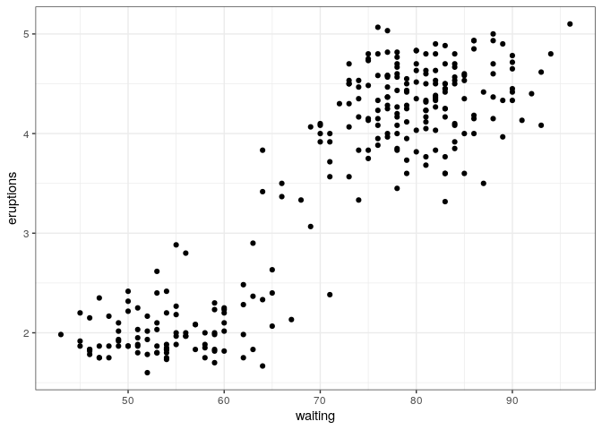
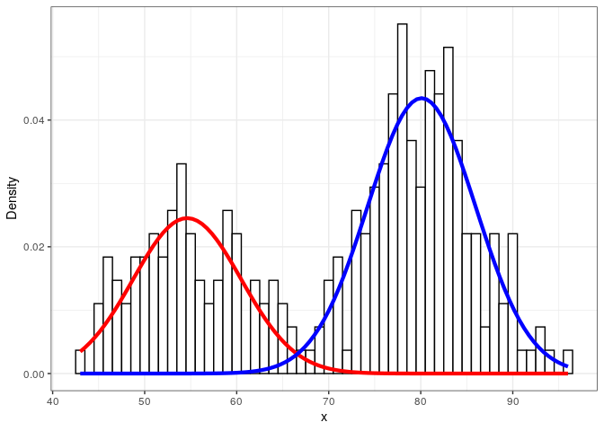
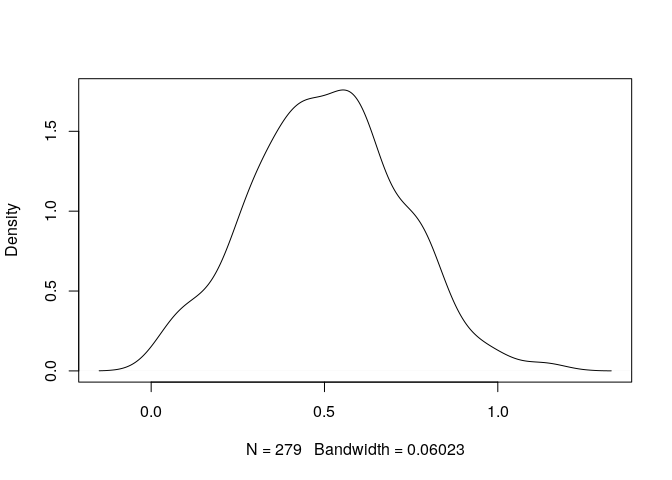
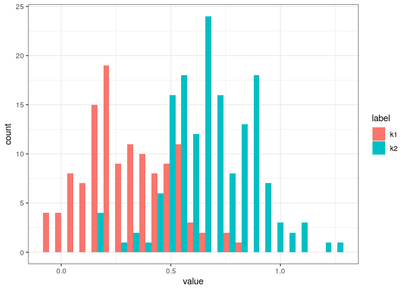
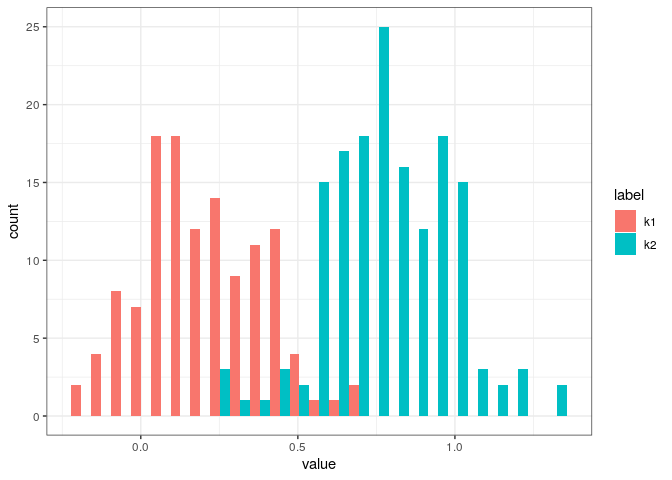

## Introduction

Following these blog posts:

-   <https://tinyheero.github.io/2015/10/13/mixture-model.html>
-   <https://tinyheero.github.io/2016/01/03/gmm-em.html>
-   <https://exploringdatablog.blogspot.com/2011/08/fitting-mixture-distributions-with-r.html>

Install and load
[mixtools](https://cran.r-project.org/web/packages/mixtools/index.html).

``` r
.libPaths('/packages')
my_packages <- c('mixtools')

for (my_package in my_packages){
   if(!require(my_package, character.only = TRUE)){
      install.packages(my_package, '/packages')
   }
  library(my_package, character.only = TRUE)
}
```

Waiting time between eruptions and the duration of the eruption for the
Old Faithful geyser in Yellowstone National Park, Wyoming, USA.

A data frame with 272 observations on 2 variables.

-   `eruptions` - Eruption time in minutes
-   `waiting` - Waiting time to next eruption in minutes

``` r
ggplot(faithful, aes(waiting, eruptions)) +
  geom_point()
```



The `normalmixEM` function builds a 2-component GMM (k = 2 indicates to
use 2 components).

``` r
set.seed(1984)
mixmdl <- normalmixEM(faithful$waiting, k = 2)
```

    ## number of iterations= 33

``` r
summary(mixmdl)
```

    ## summary of normalmixEM object:
    ##           comp 1    comp 2
    ## lambda  0.360887  0.639113
    ## mu     54.614889 80.091090
    ## sigma   5.871242  5.867717
    ## loglik at estimate:  -1034.002

The red and blue lines indicate the two fitted Gaussian distributions.

``` r
#' Plot a Mixture Component
#' 
#' @param x Input data
#' @param mu Mean of component
#' @param sigma Standard deviation of component
#' @param lam Mixture weight of component
plot_mix_comps <- function(x, mu, sigma, lam) {
  lam * dnorm(x, mu, sigma)
}

data.frame(x = mixmdl$x) %>%
  ggplot() +
  geom_histogram(aes(x, ..density..), binwidth = 1, colour = "black", 
                 fill = "white") +
  stat_function(geom = "line", fun = plot_mix_comps,
                args = list(mixmdl$mu[1], mixmdl$sigma[1], lam = mixmdl$lambda[1]),
                colour = "red", lwd = 1.5) +
  stat_function(geom = "line", fun = plot_mix_comps,
                args = list(mixmdl$mu[2], mixmdl$sigma[2], lam = mixmdl$lambda[2]),
                colour = "blue", lwd = 1.5) +
  ylab("Density")
```

    ## Warning: Using `size` aesthetic for lines was deprecated in ggplot2 3.4.0.
    ## ℹ Please use `linewidth` instead.

    ## Warning: The dot-dot notation (`..density..`) was deprecated in ggplot2 3.4.0.
    ## ℹ Please use `after_stat(density)` instead.



Mean and standard deviation.

``` r
mixmdl$mu
```

    ## [1] 54.61489 80.09109

``` r
mixmdl$sigma
```

    ## [1] 5.871242 5.867717

`lambda` indicates the ratio of the dataset but formally it is referred
to as the mixing weights (or mixing proportions or mixing
co-efficients). It can be interpreted as the red component representing
36% and the blue component representing 64% of the input data.

``` r
mixmdl$lambda
```

    ## [1] 0.3608869 0.6391131

``` r
sum(mixmdl$lambda)
```

    ## [1] 1

Each input data point is assigned a posterior probability of belonging
to one of these components.

``` r
head(cbind(mixmdl$x, mixmdl$posterior))
```

    ##                comp.1        comp.2
    ## [1,] 79 0.00010308682 0.99989691318
    ## [2,] 54 0.99990933925 0.00009066075
    ## [3,] 74 0.00413570621 0.99586429379
    ## [4,] 62 0.96738179012 0.03261820988
    ## [5,] 85 0.00000122356 0.99999877644
    ## [6,] 55 0.99981001049 0.00018998951

## Predict

When two distributions are close to each other.

``` r
set.seed(1984)
k1 <- rnorm(n = 123, mean = 0.4, sd = 0.2)
k2 <- rnorm(n = 156, mean = 0.6, sd = 0.2)

plot(density(c(k1, k2)), main = '')
```



EM.

``` r
set.seed(1984)
mm <- normalmixEM(c(k1, k2), k = 2, maxit = 10000)
```

    ## number of iterations= 1070

``` r
summary(mm)
```

    ## summary of normalmixEM object:
    ##          comp 1   comp 2
    ## lambda 0.876386 0.123614
    ## mu     0.537445 0.263425
    ## sigma  0.199632 0.131696
    ## loglik at estimate:  36.66233

Two more distinguishable distributions.

``` r
set.seed(1984)
k1 <- rnorm(n = 123, mean = 0.3, sd = 0.2)
k2 <- rnorm(n = 156, mean = 0.7, sd = 0.2)

df <- tibble(
  label = rep(c('k1', 'k2'), c(length(k1), length(k2))),
  value = c(k1, k2)
)

ggplot(df, aes(value, fill = label)) +
  geom_histogram(bins = 25, position = "dodge")
```



EM.

``` r
set.seed(1984)
mm2 <- normalmixEM(df$value, k = 2, maxit = 10000)
```

    ## number of iterations= 119

``` r
summary(mm2)
```

    ## summary of normalmixEM object:
    ##          comp 1   comp 2
    ## lambda 0.788235 0.211765
    ## mu     0.609444 0.165352
    ## sigma  0.219127 0.109758
    ## loglik at estimate:  -23.46705

Component 1 is the distribution with the higher mean (`k2`).

``` r
table(
  real = df$label,
  predicted = ifelse(mm2$posterior[, 1] < 0.5, yes = 'k1', no = 'k2')
)
```

    ##     predicted
    ## real  k1  k2
    ##   k1  59  64
    ##   k2   4 152

Two clearly distinguishable distributions.

``` r
set.seed(1984)
k1 <- rnorm(n = 123, mean = 0.2, sd = 0.2)
k2 <- rnorm(n = 156, mean = 0.8, sd = 0.2)

df2 <- tibble(
  label = rep(c('k1', 'k2'), c(length(k1), length(k2))),
  value = c(k1, k2)
)

ggplot(df2, aes(value, fill = label)) +
  geom_histogram(bins = 25, position = "dodge")
```



EM and predict.

``` r
set.seed(1984)
mm3 <- normalmixEM(df2$value, k = 2, maxit = 10000)
```

    ## number of iterations= 142

``` r
table(
  real = df2$label,
  predicted = ifelse(mm3$posterior[, 2] < 0.5, yes = 'k1', no = 'k2')
)
```

    ##     predicted
    ## real  k1  k2
    ##   k1 101  22
    ##   k2   5 151

Do we do better by simply setting a threshold at 0.5? In this case, yes.

``` r
table(
  real = df2$label,
  predicted = ifelse(df2$value < 0.5, yes = 'k1', no = 'k2')
)
```

    ##     predicted
    ## real  k1  k2
    ##   k1 117   6
    ##   k2   8 148

## Session info

Time built.

    ## [1] "2022-11-24 06:38:21 UTC"

Session info.

    ## R version 4.2.0 (2022-04-22)
    ## Platform: x86_64-pc-linux-gnu (64-bit)
    ## Running under: Ubuntu 20.04.4 LTS
    ## 
    ## Matrix products: default
    ## BLAS:   /usr/lib/x86_64-linux-gnu/openblas-pthread/libblas.so.3
    ## LAPACK: /usr/lib/x86_64-linux-gnu/openblas-pthread/liblapack.so.3
    ## 
    ## locale:
    ##  [1] LC_CTYPE=en_US.UTF-8       LC_NUMERIC=C              
    ##  [3] LC_TIME=en_US.UTF-8        LC_COLLATE=en_US.UTF-8    
    ##  [5] LC_MONETARY=en_US.UTF-8    LC_MESSAGES=en_US.UTF-8   
    ##  [7] LC_PAPER=en_US.UTF-8       LC_NAME=C                 
    ##  [9] LC_ADDRESS=C               LC_TELEPHONE=C            
    ## [11] LC_MEASUREMENT=en_US.UTF-8 LC_IDENTIFICATION=C       
    ## 
    ## attached base packages:
    ## [1] stats     graphics  grDevices utils     datasets  methods   base     
    ## 
    ## other attached packages:
    ##  [1] mixtools_1.2.0  forcats_0.5.2   stringr_1.4.1   dplyr_1.0.10   
    ##  [5] purrr_0.3.5     readr_2.1.3     tidyr_1.2.1     tibble_3.1.8   
    ##  [9] ggplot2_3.4.0   tidyverse_1.3.2
    ## 
    ## loaded via a namespace (and not attached):
    ##  [1] lubridate_1.9.0     lattice_0.20-45     assertthat_0.2.1   
    ##  [4] digest_0.6.30       utf8_1.2.2          R6_2.5.1           
    ##  [7] cellranger_1.1.0    backports_1.4.1     reprex_2.0.2       
    ## [10] evaluate_0.17       highr_0.9           httr_1.4.4         
    ## [13] pillar_1.8.1        rlang_1.0.6         googlesheets4_1.0.1
    ## [16] readxl_1.4.1        rstudioapi_0.14     kernlab_0.9-31     
    ## [19] Matrix_1.5-1        rmarkdown_2.17      labeling_0.4.2     
    ## [22] splines_4.2.0       googledrive_2.0.0   munsell_0.5.0      
    ## [25] broom_1.0.1         compiler_4.2.0      modelr_0.1.9       
    ## [28] xfun_0.34           pkgconfig_2.0.3     segmented_1.6-1    
    ## [31] htmltools_0.5.3     tidyselect_1.2.0    fansi_1.0.3        
    ## [34] crayon_1.5.2        tzdb_0.3.0          dbplyr_2.2.1       
    ## [37] withr_2.5.0         MASS_7.3-58.1       grid_4.2.0         
    ## [40] nlme_3.1-160        jsonlite_1.8.3      gtable_0.3.1       
    ## [43] lifecycle_1.0.3     DBI_1.1.3           magrittr_2.0.3     
    ## [46] scales_1.2.1        cli_3.4.1           stringi_1.7.8      
    ## [49] farver_2.1.1        fs_1.5.2            xml2_1.3.3         
    ## [52] ellipsis_0.3.2      generics_0.1.3      vctrs_0.5.0        
    ## [55] tools_4.2.0         glue_1.6.2          hms_1.1.2          
    ## [58] survival_3.4-0      fastmap_1.1.0       yaml_2.3.6         
    ## [61] timechange_0.1.1    colorspace_2.0-3    gargle_1.2.1       
    ## [64] rvest_1.0.3         knitr_1.40          haven_2.5.1
