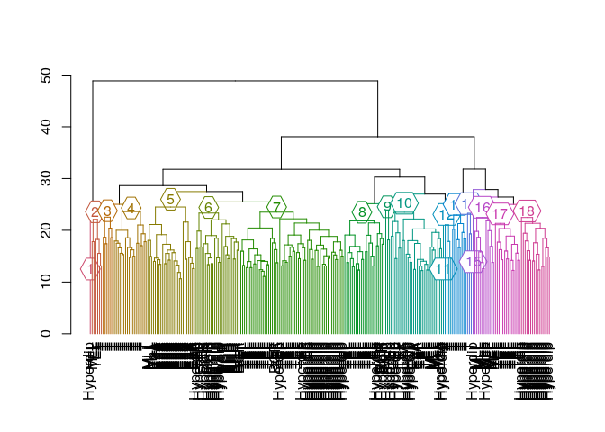

Introduction
------------

Here's a [good
post](http://datascienceplus.com/hierarchical-clustering-in-r/) on
hierarchical clustering. Using data from the `datamicroarray` package.

``` {.r}
.libPaths('/packages')
my_packages <- c('dendextend', 'remotes', 'datamicroarray')

for (my_package in my_packages){
   if(!require(my_package, character.only = TRUE)){
      if (my_package == 'datamicroarray'){
         install_github('ramhiser/datamicroarray')
      } else {
         install.packages(my_package, '/packages')
      }
      library(my_package, character.only = TRUE)
   }
}
```

    ## * checking for file ‘/tmp/Rtmpj6OTci/remotes17133c6ec/ramhiser-datamicroarray-a95f6f6/DESCRIPTION’ ... OK
    ## * preparing ‘datamicroarray’:
    ## * checking DESCRIPTION meta-information ... OK
    ## * checking for LF line-endings in source and make files and shell scripts
    ## * checking for empty or unneeded directories
    ## * looking to see if a ‘data/datalist’ file should be added
    ## * building ‘datamicroarray_0.2.3.tar.gz’

Using microarray data
---------------------

I will use the `yeoh` data set.

``` {.r}
data('yeoh', package = "datamicroarray")

dim(yeoh$x)
```

    ## [1]   248 12625

``` {.r}
table(yeoh$y)
```

    ## 
    ##      BCR      E2A Hyperdip      MLL        T      TEL 
    ##       15       27       64       20       43       79

Calculate distance between all samples.

``` {.r}
choose(248, 2)
```

    ## [1] 30628

``` {.r}
my_dist <- dist(yeoh$x)

summary(my_dist)
```

    ##    Min. 1st Qu.  Median    Mean 3rd Qu.    Max. 
    ##   10.65   19.32   21.93   22.40   24.87   48.88

Perform hierarchical clustering using complete (maximum) linkage, which
is the default.

``` {.r}
my_hclust <- hclust(my_dist)
```

Form six clusters based on the clustering.

``` {.r}
my_clus <- cutree(my_hclust, k = 6)

table(my_clus, yeoh$y)
```

    ##        
    ## my_clus BCR E2A Hyperdip MLL  T TEL
    ##       1  13  23       32   3 24  35
    ##       2   2   0        4   1  0  18
    ##       3   0   4        9   5  5  10
    ##       4   0   0       18  10  0  14
    ##       5   0   0        1   1  3   2
    ##       6   0   0        0   0 11   0

``` {.r}
cluster_one <- yeoh$y[my_clus == 1]
```

Form `n` clusters based on arbitrary distance.

``` {.r}
my_clus_two <- cutree(my_hclust, h = 25)
# much more homogeneous
table(my_clus_two, yeoh$y)
```

    ##            
    ## my_clus_two BCR E2A Hyperdip MLL  T TEL
    ##          1   12   0       10   0  0   2
    ##          2    1   0       22   0  0  33
    ##          3    2   0        3   0  0  17
    ##          4    0  23        0   3  0   0
    ##          5    0   4        8   5  1  10
    ##          6    0   0       16   0  0   0
    ##          7    0   0        1   0  0   0
    ##          8    0   0        1   0  0   0
    ##          9    0   0        1  10  0   0
    ##          10   0   0        1   1  0   1
    ##          11   0   0        1   0  0   0
    ##          12   0   0        0   1  3   2
    ##          13   0   0        0   0  6   0
    ##          14   0   0        0   0 18   0
    ##          15   0   0        0   0  8   0
    ##          16   0   0        0   0  3   0
    ##          17   0   0        0   0  4   0
    ##          18   0   0        0   0  0  14

Plot.

``` {.r}
my_hclust_mod <- my_hclust
my_hclust_mod$labels <- as.vector(yeoh$y)
plot(color_branches(my_hclust_mod, h = 25, groupLabels = TRUE))
```



Session info
------------

Time built.

    ## [1] "2022-07-12 05:55:44 UTC"

Session info.

    ## R version 4.2.1 (2022-06-23)
    ## Platform: x86_64-pc-linux-gnu (64-bit)
    ## Running under: Ubuntu 20.04.4 LTS
    ## 
    ## Matrix products: default
    ## BLAS:   /usr/lib/x86_64-linux-gnu/openblas-pthread/libblas.so.3
    ## LAPACK: /usr/lib/x86_64-linux-gnu/openblas-pthread/liblapack.so.3
    ## 
    ## locale:
    ##  [1] LC_CTYPE=en_US.UTF-8       LC_NUMERIC=C              
    ##  [3] LC_TIME=en_US.UTF-8        LC_COLLATE=en_US.UTF-8    
    ##  [5] LC_MONETARY=en_US.UTF-8    LC_MESSAGES=en_US.UTF-8   
    ##  [7] LC_PAPER=en_US.UTF-8       LC_NAME=C                 
    ##  [9] LC_ADDRESS=C               LC_TELEPHONE=C            
    ## [11] LC_MEASUREMENT=en_US.UTF-8 LC_IDENTIFICATION=C       
    ## 
    ## attached base packages:
    ## [1] stats     graphics  grDevices utils     datasets  methods   base     
    ## 
    ## other attached packages:
    ##  [1] datamicroarray_0.2.3 remotes_2.4.2        dendextend_1.16.0   
    ##  [4] forcats_0.5.1        stringr_1.4.0        dplyr_1.0.9         
    ##  [7] purrr_0.3.4          readr_2.1.2          tidyr_1.2.0         
    ## [10] tibble_3.1.7         ggplot2_3.3.6        tidyverse_1.3.1     
    ## 
    ## loaded via a namespace (and not attached):
    ##  [1] tidyselect_1.1.2  xfun_0.31         haven_2.5.0       colorspace_2.0-3 
    ##  [5] vctrs_0.4.1       generics_0.1.3    viridisLite_0.4.0 htmltools_0.5.2  
    ##  [9] yaml_2.3.5        utf8_1.2.2        rlang_1.0.3       pillar_1.7.0     
    ## [13] glue_1.6.2        withr_2.5.0       DBI_1.1.3         dbplyr_2.2.1     
    ## [17] modelr_0.1.8      readxl_1.4.0      lifecycle_1.0.1   munsell_0.5.0    
    ## [21] gtable_0.3.0      cellranger_1.1.0  rvest_1.0.2       evaluate_0.15    
    ## [25] knitr_1.39        tzdb_0.3.0        fastmap_1.1.0     curl_4.3.2       
    ## [29] fansi_1.0.3       highr_0.9         broom_1.0.0       scales_1.2.0     
    ## [33] backports_1.4.1   jsonlite_1.8.0    fs_1.5.2          gridExtra_2.3    
    ## [37] hms_1.1.1         digest_0.6.29     stringi_1.7.6     grid_4.2.1       
    ## [41] cli_3.3.0         tools_4.2.1       magrittr_2.0.3    crayon_1.5.1     
    ## [45] pkgconfig_2.0.3   ellipsis_0.3.2    xml2_1.3.3        reprex_2.0.1     
    ## [49] lubridate_1.8.0   viridis_0.6.2     rstudioapi_0.13   assertthat_0.2.1 
    ## [53] rmarkdown_2.14    httr_1.4.3        R6_2.5.1          compiler_4.2.1
