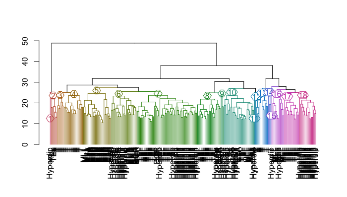

Hierarchical clustering
=======================

Here's a [good post](http://datascienceplus.com/hierarchical-clustering-in-r/) on hierarchical clustering. Using data from the `datamicroarray` package.

~~~~{.r}
# install if necessary
# library(devtools)
# install_github('ramhiser/datamicroarray')

describe_data()
        author year   n     p  K              Disease
1         alon 1999  62  2000  2         Colon Cancer
2    borovecki 2005  31 22283  2 Huntington's Disease
3   burczynski 2006 127 22283  3      Crohn's Disease
4    chiaretti 2004 111 12625  2             Leukemia
5         chin 2006 118 22215  2        Breast Cancer
6     chowdary 2006 104 22283  2        Breast Cancer
7  christensen 2009 217  1413  3                  N/A
8        golub 1999  72  7129  3             Leukemia
9       gordon 2002 181 12533  2          Lung Cancer
10     gravier 2010 168  2905  2        Breast Cancer
11        khan 2001  63  2308  4                SRBCT
12    nakayama 2001 105 22283 10              Sarcoma
13     pomeroy 2002  60  7128  2            CNS Tumor
14       shipp 2002  58  6817  2             Lymphoma
15       singh 2002 102 12600  2      Prostate Cancer
16      sorlie 2001  85   456  5        Breast Cancer
17          su 2002 102  5565  4                  N/A
18 subramanian 2005  50 10100  2                  N/A
19         sun 2006 180 54613  4               Glioma
20        tian 2003 173 12625  2              Myeloma
21        west 2001  49  7129  2        Breast Cancer
22        yeoh 2002 248 12625  6             Leukemia
~~~~

I will use the `yeoh` data set.

~~~~{.r}
data('yeoh', package = "datamicroarray")

dim(yeoh$x)
[1]   248 12625

table(yeoh$y)

     BCR      E2A Hyperdip      MLL        T      TEL 
      15       27       64       20       43       79
~~~~

Calculate distance between all samples.

~~~~{.r}
choose(248, 2)
[1] 30628

my_dist <- dist(yeoh$x)

summary(my_dist)
Min. 1st Qu.  Median    Mean 3rd Qu.    Max. 
10.65   19.32   21.93   22.40   24.87   48.88
~~~~

Perform hierarchical clustering using complete (maximum) linkage, which is the default.

~~~~{.r}
my_hclust <- hclust(my_dist)
~~~~

Form six clusters based on the clustering.

~~~~{.r}
my_clus <- cutree(my_hclust, k = 6)

table(my_clus, yeoh$y)
       
my_clus BCR E2A Hyperdip MLL  T TEL
      1  13  23       32   3 24  35
      2   2   0        4   1  0  18
      3   0   4        9   5  5  10
      4   0   0       18  10  0  14
      5   0   0        1   1  3   2
      6   0   0        0   0 11   0

# to save cluster one
cluster_one <- yeoh$y[my_clus == 1]
~~~~

Form `n` clusters based on arbitrary distance.

~~~~{.r}
my_clus_two <- cutree(my_hclust, h = 25)

# much more homogeneous
table(my_clus_two, yeoh$y)
           
my_clus_two BCR E2A Hyperdip MLL  T TEL
         1   12   0       10   0  0   2
         2    1   0       22   0  0  33
         3    2   0        3   0  0  17
         4    0  23        0   3  0   0
         5    0   4        8   5  1  10
         6    0   0       16   0  0   0
         7    0   0        1   0  0   0
         8    0   0        1   0  0   0
         9    0   0        1  10  0   0
         10   0   0        1   1  0   1
         11   0   0        1   0  0   0
         12   0   0        0   1  3   2
         13   0   0        0   0  6   0
         14   0   0        0   0 18   0
         15   0   0        0   0  8   0
         16   0   0        0   0  3   0
         17   0   0        0   0  4   0
         18   0   0        0   0  0  14
~~~~

Plot.

~~~~{.r}
# install if necessary
# install.packages('dendextend')
library(dendextend)

# new object with modified names
my_hclust_mod <- my_hclust
my_hclust_mod$labels <- as.vector(yeoh$y)
plot(color_branches(my_hclust_mod, h = 25, groupLabels = TRUE))
~~~~

