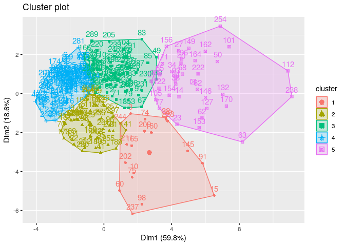
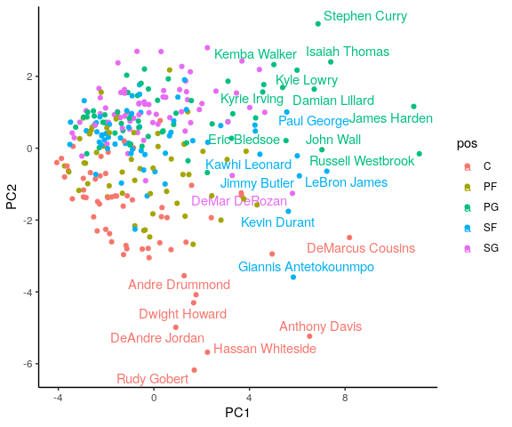

Introduction
------------

Install packages if missing and load.

    .libPaths('/packages')
    my_packages <- c("cluster", "ggrepel", "factoextra")

    for (my_package in my_packages){
       if(!require(my_package, character.only = TRUE)){
          install.packages(my_package, '/packages')
          library(my_package, character.only = TRUE)
       }
    }

Data set
--------

We will use NBA [data
set](https://www.kaggle.com/drgilermo/nba-players-stats) downloaded from
Kaggle and create a subsetted data set using stats from the year 2017
and consisting of:

-   FG - Field Goals
-   FGA - Field Goal Attempts
-   FT - Free Throws
-   FTA - Free Throw Attempts
-   3P3 - Point Field Goals
-   3PA3 - Point Field Goal Attempts
-   PTS - Points
-   TRB - Total Rebounds
-   AST - Assists
-   STL - Steals
-   BLK - Blocks
-   TOV - Turnovers

Some players were traded during the season and thus have stats for
different teams. The “TOT” team is a summation of stats from different
teams but since we will perform our own summation, we will exclude that
row of data.

We will scale the statistics by the number of games each player has
played, since not everyone has played the same number of games. We will
also standardise the data to ensure so that all the stats are on the
same scale.

    season_stat <- read.csv("../data/Seasons_Stats.csv.gz")

    # some players played in different teams
    season_stat %>%
      filter(Year == 2017, Tm != "TOT", G > 50) %>%
      select(Player, Pos, G, FG, FGA, FT, FTA, X3P, X3PA, PTS, TRB, AST, STL, BLK, TOV) -> data_subset

    data_subset %>%
      group_by(Player, Pos) %>%
      summarise_all(sum) -> data_subset

    # scale stats by number of games played and normalise
    data_subset[, -(1:3)] <- data_subset[, -(1:3)] / data_subset$G
    data_subset[, -(1:3)] <- scale(data_subset[, -(1:3)])

    str(data_subset)

    ## grouped_df [298 × 15] (S3: grouped_df/tbl_df/tbl/data.frame)
    ##  $ Player: chr [1:298] "Aaron Brooks" "Aaron Gordon" "Al Horford" "Al Jefferson" ...
    ##  $ Pos   : chr [1:298] "PG" "SF" "C" "C" ...
    ##  $ G     : int [1:298] 65 80 68 66 61 68 77 79 80 81 ...
    ##  $ FG    : num [1:298] -1.004 0.432 0.743 -0.204 -0.468 ...
    ##  $ FGA   : num [1:298] -0.913 0.472 0.688 -0.349 -0.237 ...
    ##  $ FT    : num [1:298] -0.8468 0.0707 -0.157 -0.5368 -0.1661 ...
    ##  $ FTA   : num [1:298] -0.9191 0.1816 -0.2001 -0.5661 -0.0719 ...
    ##  $ X3P   : num [1:298] -0.3136 -0.0341 0.3429 -1.2349 0.1967 ...
    ##  $ X3PA  : num [1:298] -0.382 0.28 0.388 -1.329 0.347 ...
    ##  $ PTS   : num [1:298] -0.963 0.316 0.523 -0.445 -0.344 ...
    ##  $ TRB   : num [1:298] -1.3468 0.28 0.9961 -0.0657 1.2278 ...
    ##  $ AST   : num [1:298] -0.204 -0.229 1.363 -0.752 -0.359 ...
    ##  $ STL   : num [1:298] -1.029 0.0404 -0.0505 -1.278 0.5131 ...
    ##  $ BLK   : num [1:298] -0.7984 0.0516 1.8841 -0.554 0.5719 ...
    ##  $ TOV   : num [1:298] -0.411 -0.289 0.457 -1.059 0.25 ...
    ##  - attr(*, "groups")= tibble [298 × 2] (S3: tbl_df/tbl/data.frame)
    ##   ..$ Player: chr [1:298] "Aaron Brooks" "Aaron Gordon" "Al Horford" "Al Jefferson" ...
    ##   ..$ .rows : list<int> [1:298] 
    ##   .. ..$ : int 1
    ##   .. ..$ : int 2
    ##   .. ..$ : int 3
    ##   .. ..$ : int 4
    ##   .. ..$ : int 5
    ##   .. ..$ : int 6
    ##   .. ..$ : int 7
    ##   .. ..$ : int 8
    ##   .. ..$ : int 9
    ##   .. ..$ : int 10
    ##   .. ..$ : int 11
    ##   .. ..$ : int 12
    ##   .. ..$ : int 13
    ##   .. ..$ : int 14
    ##   .. ..$ : int 15
    ##   .. ..$ : int 16
    ##   .. ..$ : int 17
    ##   .. ..$ : int 18
    ##   .. ..$ : int 19
    ##   .. ..$ : int 20
    ##   .. ..$ : int 21
    ##   .. ..$ : int 22
    ##   .. ..$ : int 23
    ##   .. ..$ : int 24
    ##   .. ..$ : int 25
    ##   .. ..$ : int 26
    ##   .. ..$ : int 27
    ##   .. ..$ : int 28
    ##   .. ..$ : int 29
    ##   .. ..$ : int 30
    ##   .. ..$ : int 31
    ##   .. ..$ : int 32
    ##   .. ..$ : int 33
    ##   .. ..$ : int 34
    ##   .. ..$ : int 35
    ##   .. ..$ : int 36
    ##   .. ..$ : int 37
    ##   .. ..$ : int 38
    ##   .. ..$ : int 39
    ##   .. ..$ : int 40
    ##   .. ..$ : int 41
    ##   .. ..$ : int 42
    ##   .. ..$ : int 43
    ##   .. ..$ : int 44
    ##   .. ..$ : int 45
    ##   .. ..$ : int 46
    ##   .. ..$ : int 47
    ##   .. ..$ : int 48
    ##   .. ..$ : int 49
    ##   .. ..$ : int 50
    ##   .. ..$ : int 51
    ##   .. ..$ : int 52
    ##   .. ..$ : int 53
    ##   .. ..$ : int 54
    ##   .. ..$ : int 55
    ##   .. ..$ : int 56
    ##   .. ..$ : int 57
    ##   .. ..$ : int 58
    ##   .. ..$ : int 59
    ##   .. ..$ : int 60
    ##   .. ..$ : int 61
    ##   .. ..$ : int 62
    ##   .. ..$ : int 63
    ##   .. ..$ : int 64
    ##   .. ..$ : int 65
    ##   .. ..$ : int 66
    ##   .. ..$ : int 67
    ##   .. ..$ : int 68
    ##   .. ..$ : int 69
    ##   .. ..$ : int 70
    ##   .. ..$ : int 71
    ##   .. ..$ : int 72
    ##   .. ..$ : int 73
    ##   .. ..$ : int 74
    ##   .. ..$ : int 75
    ##   .. ..$ : int 76
    ##   .. ..$ : int 77
    ##   .. ..$ : int 78
    ##   .. ..$ : int 79
    ##   .. ..$ : int 80
    ##   .. ..$ : int 81
    ##   .. ..$ : int 82
    ##   .. ..$ : int 83
    ##   .. ..$ : int 84
    ##   .. ..$ : int 85
    ##   .. ..$ : int 86
    ##   .. ..$ : int 87
    ##   .. ..$ : int 88
    ##   .. ..$ : int 89
    ##   .. ..$ : int 90
    ##   .. ..$ : int 91
    ##   .. ..$ : int 92
    ##   .. ..$ : int 93
    ##   .. ..$ : int 94
    ##   .. ..$ : int 95
    ##   .. ..$ : int 96
    ##   .. ..$ : int 97
    ##   .. ..$ : int 98
    ##   .. ..$ : int 99
    ##   .. .. [list output truncated]
    ##   .. ..@ ptype: int(0) 
    ##   ..- attr(*, ".drop")= logi TRUE

We’ll plot histograms of all standardised statistics to visualise the
distributions.

    data_subset[, -(1:3)] %>%
      gather() %>%
      ggplot(., aes(value)) +
      geom_histogram(bins = 20) +
      facet_wrap(~key)

K-means
-------

The idea behind k-means clustering is to define clusters such that the
total within-cluster variation is minimised. The within-cluster
variation is calculated as the sum of squared Euclidean distances
between observations and the centroid of a cluster. The total
within-cluster variation is the sum of all within-cluster calculations
for *k* clusters.

We will use `kmeans` to perform k-means clustering with a *k* of 5 since
there are 5 positions in basketball.

    my_kmeans <- kmeans(x = data_subset[, -(1:3)], centers = 5)
    my_kmeans

    ## K-means clustering with 5 clusters of sizes 37, 84, 55, 37, 85
    ## 
    ## Cluster means:
    ##           FG        FGA         FT        FTA        X3P       X3PA        PTS
    ## 1  0.3994717  0.1115175  0.1358818  0.3661453 -0.9470417 -0.9960164  0.1895305
    ## 2 -0.4356215 -0.3434826 -0.4564842 -0.4865173  0.1102358  0.1248735 -0.4086209
    ## 3  0.5402600  0.6729396  0.2057350  0.1674639  0.8291409  0.8810535  0.5398968
    ## 4  1.8889051  1.8944211  2.1594918  2.0751352  1.1598864  1.1497105  2.0345121
    ## 5 -0.9152004 -0.9691632 -0.6811716 -0.6902405 -0.7380919 -0.7603999 -0.9136441
    ##           TRB         AST          STL        BLK        TOV
    ## 1  1.57299248 -0.38748122 -0.113782044  1.4232126  0.1168200
    ## 2 -0.44214710 -0.05579102  0.007698825 -0.4273546 -0.2759398
    ## 3  0.02384795  0.37262349  0.491090587 -0.2050806  0.3701375
    ## 4  0.67103975  1.49273021  1.176130189  0.3217780  1.7642182
    ## 5 -0.55529969 -0.66708304 -0.787806646 -0.2045580 -0.7856122
    ## 
    ## Clustering vector:
    ##   [1] 5 3 3 5 2 2 1 2 5 1 2 2 2 4 4 2 5 2 3 3 2 1 4 5 3 5 4 5 2 2 2 4 2 4 2 5 2
    ##  [38] 4 2 4 1 1 5 5 2 2 5 2 3 4 3 2 5 5 3 3 5 5 5 1 5 4 4 2 3 2 3 4 2 5 3 5 5 3
    ##  [75] 1 5 4 2 3 3 1 4 3 3 3 2 3 2 3 2 4 5 4 4 1 1 3 1 5 2 4 2 2 3 3 3 5 3 2 2 2
    ## [112] 4 3 5 2 2 5 5 5 5 2 4 5 5 2 5 4 2 2 2 1 4 2 5 1 5 3 2 3 5 1 5 5 2 4 4 2 5
    ## [149] 4 1 3 3 4 4 5 3 5 5 5 1 5 4 5 4 1 2 2 5 5 4 4 5 5 5 2 2 5 2 4 1 2 3 3 5 3
    ## [186] 2 2 3 1 2 2 2 5 5 1 4 5 5 2 2 5 1 2 5 3 3 5 2 1 3 1 5 2 3 2 5 3 5 2 2 1 4
    ## [223] 4 2 2 2 3 5 1 3 3 1 3 2 5 1 1 4 3 5 5 3 5 1 2 3 5 5 5 2 2 2 5 4 1 2 1 1 5
    ## [260] 5 1 2 5 2 2 5 2 3 5 5 3 5 2 2 2 3 1 5 5 1 2 2 3 2 5 5 3 2 2 5 3 3 5 5 1 3
    ## [297] 1 5
    ## 
    ## Within cluster sum of squares by cluster:
    ## [1] 200.4769 255.8427 289.0522 419.2085 165.0146
    ##  (between_SS / total_SS =  62.7 %)
    ## 
    ## Available components:
    ## 
    ## [1] "cluster"      "centers"      "totss"        "withinss"     "tot.withinss"
    ## [6] "betweenss"    "size"         "iter"         "ifault"

The cluster assignments are in `cluster` and since we set *k* to 5 each
player is assigned to 1 of 5 possible clusterings.

    table(my_kmeans$cluster)

    ## 
    ##  1  2  3  4  5 
    ## 37 84 55 37 85

The total within-cluster variation is stored in `tot.withinss`.

    my_kmeans$tot.withinss

    ## [1] 1329.595

We can use `fviz_cluster` to visualise the clusters in a scatter plot of
the first two principal components.

    fviz_cluster(my_kmeans, data = data_subset[, -(1:3)])

In our example above, we chose a *k* of 5 simply because we assume that
each player position produces distinctive statistics. For example, a
centre will have more rebounds and blocks, and a guard will have more
assists and steals. However, this may not be the ideal number of
clusters.

One way for determining an optimal number of clusters is to plot the
total within-cluster variation for a range of *k* values and find the
“elbow” point in the plot. This point is where the total within-cluster
variation has a steep drop and forms a “visual elbow” in the plot.

    # Use map_dbl to run many models with varying value of k (centers)
    tot_withinss <- map_dbl(2:30,  function(k){
      model <- kmeans(x = data_subset[, -(1:3)], centers = k)
      model$tot.withinss
    })

    # Generate a data frame containing both k and tot_withinss
    elbow_df <- data.frame(
      k = 2:30,
      tot_withinss = tot_withinss
    )

    ggplot(elbow_df, aes(x = k, y = tot_withinss)) +
      geom_line() +
      geom_point(aes(x = k, y = tot_withinss)) +
      scale_x_continuous(breaks = 2:30)

Another method for determining a suitable *k* is the silhouette
approach, which measures the within cluster distance of an observation
to all other observations within its cluster and to all other
observations in the closest neighbour cluster. A value close to 1
indicates that an observation is well matched to its cluster; a value of
0 indicates that the observation is on the border between two clusters;
and a value of -1 indicates that the observation has a better fit in the
neighbouring cluster.

    # Use map_dbl to run many models with varying value of k
    sil_width <- map_dbl(2:30,  function(k){
      model <- pam(x = data_subset[, -(1:3)], k = k)
      model$silinfo$avg.width
    })

    # Generate a data frame containing both k and sil_width
    sil_df <- data.frame(
      k = 2:30,
      sil_width = sil_width
    )

    # Plot the relationship between k and sil_width
    ggplot(sil_df, aes(x = k, y = sil_width)) +
      geom_line() +
      geom_point(aes(x = k, y = sil_width)) +
      scale_x_continuous(breaks = 2:30)

The silhouette approach suggests that a *k* of 2 is optimal.

    my_kmeans_k_2 <- kmeans(data_subset[, -(1:3)], centers = 2)
    fviz_cluster(my_kmeans_k_2, data = data_subset[, -(1:3)])

Extra
-----

Below I perform a Principal Component Analysis and plot the PCs.

    my_pca <- prcomp(data_subset[, -(1:3)], center = FALSE, scale = FALSE)

    summary(my_pca)

    ## Importance of components:
    ##                           PC1    PC2     PC3     PC4     PC5     PC6     PC7
    ## Standard deviation     2.6793 1.4954 0.99165 0.80456 0.56571 0.52699 0.48851
    ## Proportion of Variance 0.5982 0.1863 0.08195 0.05394 0.02667 0.02314 0.01989
    ## Cumulative Proportion  0.5982 0.7846 0.86652 0.92046 0.94713 0.97027 0.99016
    ##                            PC8     PC9    PC10    PC11      PC12
    ## Standard deviation     0.29441 0.13550 0.09352 0.06547 1.107e-16
    ## Proportion of Variance 0.00722 0.00153 0.00073 0.00036 0.000e+00
    ## Cumulative Proportion  0.99738 0.99891 0.99964 1.00000 1.000e+00

    my_pca_df <- as.data.frame(my_pca$x)
    my_pca_df$pos <- data_subset$Pos
    my_pca_df$name <- data_subset$Player

    ggplot(my_pca_df, aes(x = PC1, y = PC2, colour = pos, text = name)) +
      geom_point()

If we label the points, we can clearly see that the players with more
variable statistics consist of many NBA All-Stars.

    ggplot(my_pca_df, aes(x = PC1, y = PC2, colour = pos, label = name)) +
      geom_text_repel(
        data = my_pca_df %>% filter(PC1 > 5 | PC2 < -3.7)
      ) +
      geom_point() +
      theme_classic()

Further reading
---------------

-   <a href="https://uc-r.github.io/kmeans_clustering" class="uri">https://uc-r.github.io/kmeans_clustering</a>
-   <a href="https://www.datacamp.com/community/tutorials/k-means-clustering-r" class="uri">https://www.datacamp.com/community/tutorials/k-means-clustering-r</a>

Session info
------------

Time built.

    ## [1] "2022-04-11 01:44:19 UTC"

Session info.

    ## R version 4.1.3 (2022-03-10)
    ## Platform: x86_64-pc-linux-gnu (64-bit)
    ## Running under: Ubuntu 20.04.4 LTS
    ## 
    ## Matrix products: default
    ## BLAS:   /usr/lib/x86_64-linux-gnu/openblas-pthread/libblas.so.3
    ## LAPACK: /usr/lib/x86_64-linux-gnu/openblas-pthread/liblapack.so.3
    ## 
    ## locale:
    ##  [1] LC_CTYPE=en_US.UTF-8       LC_NUMERIC=C              
    ##  [3] LC_TIME=en_US.UTF-8        LC_COLLATE=en_US.UTF-8    
    ##  [5] LC_MONETARY=en_US.UTF-8    LC_MESSAGES=en_US.UTF-8   
    ##  [7] LC_PAPER=en_US.UTF-8       LC_NAME=C                 
    ##  [9] LC_ADDRESS=C               LC_TELEPHONE=C            
    ## [11] LC_MEASUREMENT=en_US.UTF-8 LC_IDENTIFICATION=C       
    ## 
    ## attached base packages:
    ## [1] stats     graphics  grDevices utils     datasets  methods   base     
    ## 
    ## other attached packages:
    ##  [1] factoextra_1.0.7 ggrepel_0.9.1    cluster_2.1.2    forcats_0.5.1   
    ##  [5] stringr_1.4.0    dplyr_1.0.8      purrr_0.3.4      readr_2.1.2     
    ##  [9] tidyr_1.2.0      tibble_3.1.6     ggplot2_3.3.5    tidyverse_1.3.1 
    ## 
    ## loaded via a namespace (and not attached):
    ##  [1] Rcpp_1.0.8.3     lubridate_1.8.0  assertthat_0.2.1 digest_0.6.29   
    ##  [5] utf8_1.2.2       R6_2.5.1         cellranger_1.1.0 backports_1.4.1 
    ##  [9] reprex_2.0.1     evaluate_0.15    httr_1.4.2       highr_0.9       
    ## [13] pillar_1.7.0     rlang_1.0.2      readxl_1.4.0     rstudioapi_0.13 
    ## [17] car_3.0-12       rmarkdown_2.13   labeling_0.4.2   munsell_0.5.0   
    ## [21] broom_0.7.12     compiler_4.1.3   modelr_0.1.8     xfun_0.30       
    ## [25] pkgconfig_2.0.3  htmltools_0.5.2  tidyselect_1.1.2 fansi_1.0.3     
    ## [29] crayon_1.5.1     tzdb_0.3.0       dbplyr_2.1.1     withr_2.5.0     
    ## [33] ggpubr_0.4.0     grid_4.1.3       jsonlite_1.8.0   gtable_0.3.0    
    ## [37] lifecycle_1.0.1  DBI_1.1.2        magrittr_2.0.3   scales_1.1.1    
    ## [41] carData_3.0-5    cli_3.2.0        stringi_1.7.6    farver_2.1.0    
    ## [45] ggsignif_0.6.3   fs_1.5.2         xml2_1.3.3       ellipsis_0.3.2  
    ## [49] generics_0.1.2   vctrs_0.4.0      tools_4.1.3      glue_1.6.2      
    ## [53] hms_1.1.1        abind_1.4-5      fastmap_1.1.0    yaml_2.3.5      
    ## [57] colorspace_2.0-3 rstatix_0.7.0    rvest_1.0.2      knitr_1.38      
    ## [61] haven_2.4.3
