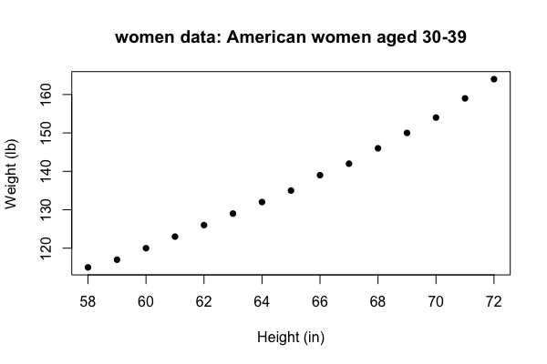

k-Nearest Neighbours
====================

In pattern recognition, the [k-Nearest Neighbours algorithm](https://en.wikipedia.org/wiki/K-nearest_neighbors_algorithm) (k-NN) is a non-parametric method used for classification and regression. In both cases, the input consists of the k closest training examples in the feature space.

We'll use the `women` dataset to demonstrate how k-NN performs regression. The dataset contains height and weight measurements for 15 American women aged between 30–39.

```r
data(women)
str(women)
'data.frame':	15 obs. of  2 variables:
 $ height: num  58 59 60 61 62 63 64 65 66 67 ...
 $ weight: num  115 117 120 123 126 129 132 135 139 142 ...

plot(women, xlab = "Height (in)", ylab = "Weight (lb)", main = "women data: American women aged 30-39", pch = 16)
```



In the example below, we want to *predict the weight* of a female who is 60 inches tall based on data in the `women` dataset.

```r
knn <- function(x, x_train, y_train, k){
  d <- abs(x - x_train)
  s <- order(d)
  return(mean(y_train[s[1:k]]))
}

# using four neighbours
knn(60, women$height, women$weight, 4)
[1] 118.75

# using five neighbours
knn(60, women$height, women$weight, 5)
[1] 120.2
```

* The `knn` algorithm first calculates the absolute distance of an input to a known set of data points for the same variable (height).
* These distances are then sorted, with the closest data points ranked first.
* The k-nearest distances of heights are used to obtain the corresponding weights
* Finally, the k weights are averaged (mean) and returned

Use `sapply` to predict several values.

```r
sapply(c(60,70), knn, x_train = women$height, y_train = women$weight, k = 4)
[1] 118.75 152.25
```

You can also use `knn.reg` in the `FNN` package.

```r
library(FNN)

knn.reg(women$height, 60, women$weight, 4)
Prediction:
[1] 118.75

knn.reg(women$height, 60, women$weight, 5)
Prediction:
[1] 120.2
```

