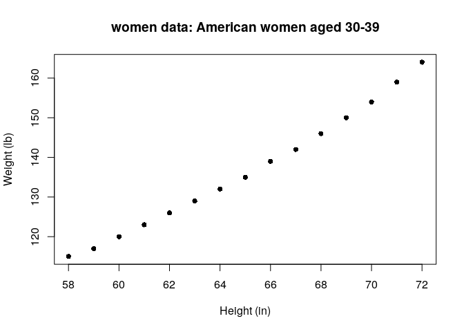

Introduction
------------

In pattern recognition, the [k-Nearest Neighbours
algorithm](https://en.wikipedia.org/wiki/K-nearest_neighbors_algorithm)
(k-NN) is a non-parametric method used for classification and
regression. In both cases, the input consists of the k closest training
examples in the feature space.

Install packages if missing and load.

    .libPaths('/packages')
    my_packages <- 'FNN'

    for (my_package in my_packages){
       if(!require(my_package, character.only = TRUE)){
          install.packages(my_package, '/packages')
          library(my_package, character.only = TRUE)
       }
    }

Regression
----------

We’ll use the `women` dataset to demonstrate how k-NN performs
regression. The dataset contains height and weight measurements for 15
American women aged between 30–39.

    data(women)
    str(women)

    ## 'data.frame':    15 obs. of  2 variables:
    ##  $ height: num  58 59 60 61 62 63 64 65 66 67 ...
    ##  $ weight: num  115 117 120 123 126 129 132 135 139 142 ...

    plot(women, xlab = "Height (in)", ylab = "Weight (lb)", main = "women data: American women aged 30-39", pch = 16)

In the example below, we want to *predict the weight* of a female who is
60 inches tall based on data in the `women` dataset.

    knn <- function(x, x_train, y_train, k){
      d <- abs(x - x_train)
      s <- order(d)
      return(mean(y_train[s[1:k]]))
    }

    # using four neighbours
    knn(60, women$height, women$weight, 4)

    ## [1] 118.75

    # using five neighbours
    knn(60, women$height, women$weight, 5)

    ## [1] 120.2

-   The `knn` algorithm first calculates the absolute distance of an
    input to a known set of data points for the same variable (height).
-   These distances are then sorted, with the closest data points ranked
    first.
-   The k-nearest distances of heights are used to obtain the
    corresponding weights
-   Finally, the k weights are averaged (mean) and returned

Use `sapply` to predict several values.

    sapply(c(60,70), knn, x_train = women$height, y_train = women$weight, k = 4)

    ## [1] 118.75 152.25

You can also use `knn.reg` in the `FNN` package.

    knn.reg(women$height, 60, women$weight, 4)

    ## Prediction:
    ## [1] 118.75

    knn.reg(women$height, 60, women$weight, 5)

    ## Prediction:
    ## [1] 120.2

Session info
------------

Time built.

    ## [1] "2022-04-11 01:55:53 UTC"

Session info.

    ## R version 4.1.3 (2022-03-10)
    ## Platform: x86_64-pc-linux-gnu (64-bit)
    ## Running under: Ubuntu 20.04.4 LTS
    ## 
    ## Matrix products: default
    ## BLAS:   /usr/lib/x86_64-linux-gnu/openblas-pthread/libblas.so.3
    ## LAPACK: /usr/lib/x86_64-linux-gnu/openblas-pthread/liblapack.so.3
    ## 
    ## locale:
    ##  [1] LC_CTYPE=en_US.UTF-8       LC_NUMERIC=C              
    ##  [3] LC_TIME=en_US.UTF-8        LC_COLLATE=en_US.UTF-8    
    ##  [5] LC_MONETARY=en_US.UTF-8    LC_MESSAGES=en_US.UTF-8   
    ##  [7] LC_PAPER=en_US.UTF-8       LC_NAME=C                 
    ##  [9] LC_ADDRESS=C               LC_TELEPHONE=C            
    ## [11] LC_MEASUREMENT=en_US.UTF-8 LC_IDENTIFICATION=C       
    ## 
    ## attached base packages:
    ## [1] stats     graphics  grDevices utils     datasets  methods   base     
    ## 
    ## other attached packages:
    ##  [1] FNN_1.1.3       forcats_0.5.1   stringr_1.4.0   dplyr_1.0.8    
    ##  [5] purrr_0.3.4     readr_2.1.2     tidyr_1.2.0     tibble_3.1.6   
    ##  [9] ggplot2_3.3.5   tidyverse_1.3.1
    ## 
    ## loaded via a namespace (and not attached):
    ##  [1] tidyselect_1.1.2 xfun_0.30        haven_2.4.3      colorspace_2.0-3
    ##  [5] vctrs_0.4.0      generics_0.1.2   htmltools_0.5.2  yaml_2.3.5      
    ##  [9] utf8_1.2.2       rlang_1.0.2      pillar_1.7.0     glue_1.6.2      
    ## [13] withr_2.5.0      DBI_1.1.2        dbplyr_2.1.1     modelr_0.1.8    
    ## [17] readxl_1.4.0     lifecycle_1.0.1  munsell_0.5.0    gtable_0.3.0    
    ## [21] cellranger_1.1.0 rvest_1.0.2      evaluate_0.15    knitr_1.38      
    ## [25] tzdb_0.3.0       fastmap_1.1.0    fansi_1.0.3      highr_0.9       
    ## [29] broom_0.7.12     scales_1.1.1     backports_1.4.1  jsonlite_1.8.0  
    ## [33] fs_1.5.2         hms_1.1.1        digest_0.6.29    stringi_1.7.6   
    ## [37] grid_4.1.3       cli_3.2.0        tools_4.1.3      magrittr_2.0.3  
    ## [41] crayon_1.5.1     pkgconfig_2.0.3  ellipsis_0.3.2   xml2_1.3.3      
    ## [45] reprex_2.0.1     lubridate_1.8.0  rstudioapi_0.13  assertthat_0.2.1
    ## [49] rmarkdown_2.13   httr_1.4.2       R6_2.5.1         compiler_4.1.3
