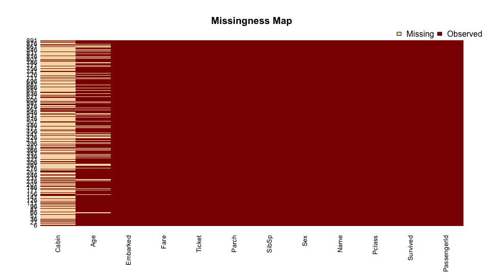
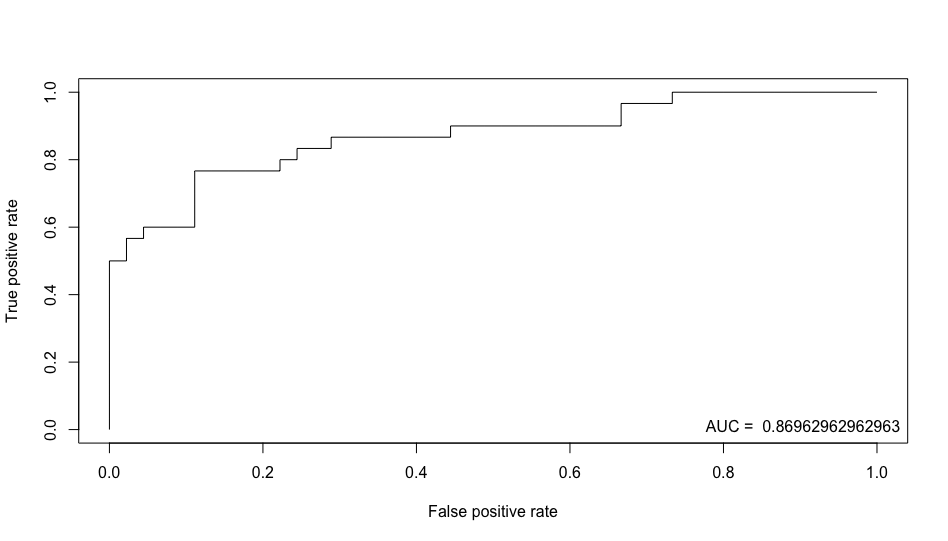

Logistic regression
===================

Logistic regression is a regression model where the dependent variable (DV) is categorical. Example from Wikipedia: "Logistic regression may be used to predict whether a patient has a given disease (e.g. diabetes; coronary heart disease), based on observed characteristics of the patient (age, sex, body mass index, results of various blood tests, etc.)."

# Examples

## Hours of study

Using the example from Wikipedia: [Probability of passing an exam versus hours of study](https://en.wikipedia.org/wiki/Logistic_regression#Example:_Probability_of_passing_an_exam_versus_hours_of_study)

~~~~{.r}
d <- data.frame(hours = c(0.50,0.75,1.00,1.25,1.50,1.75,1.75,2.00,2.25,2.50,2.75,3.00,3.25,3.50,4.00,4.25,4.50,4.75,5.00,5.50), pass = factor(c(0,0,0,0,0,0,1,0,1,0,1,0,1,0,1,1,1,1,1,1)))
model <- glm(pass ~ hours, family=binomial(link='logit'), data=d)
summary(model)

Call:
glm(formula = pass ~ hours, family = binomial(link = "logit"), 
    data = d)

Deviance Residuals: 
     Min        1Q    Median        3Q       Max  
-1.70557  -0.57357  -0.04654   0.45470   1.82008  

Coefficients:
            Estimate Std. Error z value Pr(>|z|)  
(Intercept)  -4.0777     1.7610  -2.316   0.0206 *
hours         1.5046     0.6287   2.393   0.0167 *
---
Signif. codes:  0 ‘***’ 0.001 ‘**’ 0.01 ‘*’ 0.05 ‘.’ 0.1 ‘ ’ 1

(Dispersion parameter for binomial family taken to be 1)

    Null deviance: 27.726  on 19  degrees of freedom
Residual deviance: 16.060  on 18  degrees of freedom
AIC: 20.06

Number of Fisher Scoring iterations: 5
~~~~

"The output indicates that hours studying is significantly associated with the probability of passing the exam (p=0.0167, Wald test). The output also provides the coefficients for Intercept = -4.0777 and Hours = 1.5046."

~~~~{.r}
# probability of passing
prob_passing <- function(hours){
  1 / (1 + exp(-(-4.0777 + 1.5046 * hours)))
}

prob_passing(2)
[1] 0.2556884

prob_passing(4)
[1] 0.874429
~~~~

## Survival on the Titanic

Adapted from [How to Perform a Logistic Regression in R](http://datascienceplus.com/perform-logistic-regression-in-r/)

~~~~{.r}
setwd("~/github/machine_learning/logit_regression/")

library(dplyr)

data <- read.csv("../data/titanic.csv.gz", na.strings = '')

# missing data
sapply(data, function(x) sum(is.na(x)))
PassengerId    Survived      Pclass        Name         Sex         Age       SibSp       Parch      Ticket        Fare 
          0           0           0           0           0         177           0           0           0           0 
      Cabin    Embarked 
        687           2

# install.packages('Amelia')
library(Amelia)
missmap(data)
~~~~

~~~~{.r}
# remove some features
data_subset <- select(data, -PassengerId, -Ticket, -Cabin, -Name)

# remove the two cases with missing embarked data
data_subset <- filter(data_subset, !is.na(Embarked))

# you can use the mean age for the missing ages
# data_subset$Age[is.na(data_subset$Age)] <- mean(data_subset$Age, na.rm=TRUE)

# subset into training and testing sets
train <- data_subset[1:800,]
test  <- data_subset[801:nrow(data_subset),]

model <- glm(Survived ~.,
             family=binomial(link='logit'),
             data=train)

fitted <- predict(model,
                  newdata=test[,-1],
                  type='response')

library(ROCR)
pr <- prediction(fitted, test$Survived)
prf <- performance(pr, measure = "tpr", x.measure = "fpr")
auc <- performance(pr, measure = "auc")
plot(prf)
legend(x = 0.75, y = 0.05, legend = paste("AUC = ", auc@y.values), bty = 'n')
~~~~

# Links

* [Simple logistic regression](http://www.biostathandbook.com/simplelogistic.html)
* [Multiple logistic regression](http://www.biostathandbook.com/multiplelogistic.html)

