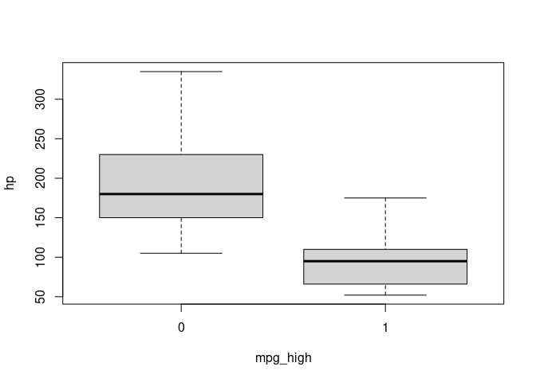

## Introduction

Logistic regression is a regression model where the dependent variable
(DV) is categorical. Example from Wikipedia:

> "Logistic regression may be used to predict whether a patient has a
> given disease (e.g. diabetes; coronary heart disease), based on
> observed characteristics of the patient (age, sex, body mass index,
> results of various blood tests, etc.)."

Install packages if missing and load.

``` r
.libPaths('/packages')
my_packages <- c('Amelia', 'ROCR')

for (my_package in my_packages){
   if(!require(my_package, character.only = TRUE)){
      install.packages(my_package, '/packages')
      library(my_package, character.only = TRUE)
   }
}
```

## mtcars

The data `mtcars` was extracted from the 1974 Motor Trend US magazine,
and comprises fuel consumption and 10 aspects of automobile design and
performance for 32 automobiles (1973--74 models).

For this example, we'll predict whether a car has high or low miles per
gallon (MPG) based on gross horsepower; if `mpg` is higher than the
median, we'll use a 1 to indicate that it is high and a 0 otherwise.

``` r
mtcars$mpg_high <- factor(with(mtcars, ifelse(mpg > median(mpg), 1, 0)))
head(mtcars)
```

    ##                    mpg cyl disp  hp drat    wt  qsec vs am gear carb mpg_high
    ## Mazda RX4         21.0   6  160 110 3.90 2.620 16.46  0  1    4    4        1
    ## Mazda RX4 Wag     21.0   6  160 110 3.90 2.875 17.02  0  1    4    4        1
    ## Datsun 710        22.8   4  108  93 3.85 2.320 18.61  1  1    4    1        1
    ## Hornet 4 Drive    21.4   6  258 110 3.08 3.215 19.44  1  0    3    1        1
    ## Hornet Sportabout 18.7   8  360 175 3.15 3.440 17.02  0  0    3    2        0
    ## Valiant           18.1   6  225 105 2.76 3.460 20.22  1  0    3    1        0

Miles/(US) gallon versus gross horsepower.

``` r
boxplot(hp ~ mpg_high, data = mtcars)
```



Use `glm()` to fit a logistic regression model that predicts `mpg_high`
using `hp`.

``` r
fit <- glm(mpg_high ~ hp, data = mtcars, family = binomial)
summary(fit)
```

    ## 
    ## Call:
    ## glm(formula = mpg_high ~ hp, family = binomial, data = mtcars)
    ## 
    ## Coefficients:
    ##             Estimate Std. Error z value Pr(>|z|)   
    ## (Intercept)  7.62119    2.64469   2.882  0.00396 **
    ## hp          -0.05901    0.02114  -2.791  0.00525 **
    ## ---
    ## Signif. codes:  0 '***' 0.001 '**' 0.01 '*' 0.05 '.' 0.1 ' ' 1
    ## 
    ## (Dispersion parameter for binomial family taken to be 1)
    ## 
    ##     Null deviance: 44.236  on 31  degrees of freedom
    ## Residual deviance: 18.022  on 30  degrees of freedom
    ## AIC: 22.022
    ## 
    ## Number of Fisher Scoring iterations: 7

The negative coefficient for `hp` (-0.05901) suggests that as horsepower
(hp) increases, the likelihood of high MPG decreases.

## Hours of study

Using the example from Wikipedia: [Probability of passing an exam versus
hours of
study](https://en.wikipedia.org/wiki/Logistic_regression#Example:_Probability_of_passing_an_exam_versus_hours_of_study)

``` r
d <- data.frame(
   hours = c(0.50,0.75,1.00,1.25,1.50,1.75,1.75,2.00,2.25,2.50,2.75,3.00,3.25,3.50,4.00,4.25,4.50,4.75,5.00,5.50),
   pass = factor(c(0,0,0,0,0,0,1,0,1,0,1,0,1,0,1,1,1,1,1,1))
)

model <- glm(
   pass ~ hours,
   family=binomial(link='logit'),
   data=d
)
summary(model)
```

    ## 
    ## Call:
    ## glm(formula = pass ~ hours, family = binomial(link = "logit"), 
    ##     data = d)
    ## 
    ## Coefficients:
    ##             Estimate Std. Error z value Pr(>|z|)  
    ## (Intercept)  -4.0777     1.7610  -2.316   0.0206 *
    ## hours         1.5046     0.6287   2.393   0.0167 *
    ## ---
    ## Signif. codes:  0 '***' 0.001 '**' 0.01 '*' 0.05 '.' 0.1 ' ' 1
    ## 
    ## (Dispersion parameter for binomial family taken to be 1)
    ## 
    ##     Null deviance: 27.726  on 19  degrees of freedom
    ## Residual deviance: 16.060  on 18  degrees of freedom
    ## AIC: 20.06
    ## 
    ## Number of Fisher Scoring iterations: 5

The output indicates that hours studying is significantly associated
with the probability of passing the exam (p=0.0167, Wald test). The
output also provides the coefficients for Intercept = -4.0777 and Hours
= 1.5046.

Probability of passing as a function of hours of study.

``` r
prob_passing <- function(hours){
  1 / (1 + exp(-(-4.0777 + 1.5046 * hours)))
}

prob_passing(4)
```

    ## [1] 0.874429

## Survival on the Titanic

Adapted from [How to Perform a Logistic Regression in
R](https://datascienceplus.com/perform-logistic-regression-in-r/).

``` r
data <- read.csv("../data/titanic.csv.gz", na.strings = '')

# missing data
sapply(data, function(x) sum(is.na(x)))
```

    ## PassengerId    Survived      Pclass        Name         Sex         Age 
    ##           0           0           0           0           0         177 
    ##       SibSp       Parch      Ticket        Fare       Cabin    Embarked 
    ##           0           0           0           0         687           2

``` r
missmap(data)
```


Remove some features

``` r
data_subset <- select(data, -PassengerId, -Ticket, -Cabin, -Name)

# remove the two cases with missing embarked data
data_subset <- filter(data_subset, !is.na(Embarked))

# you can use the mean age for the missing ages
data_subset$Age[is.na(data_subset$Age)] <- mean(data_subset$Age, na.rm=TRUE)

# subset into training and testing sets
train <- data_subset[1:800,]
test  <- data_subset[801:nrow(data_subset),]

model <- glm(Survived ~.,
             family=binomial(link='logit'),
             data=train)

fitted <- predict(model,
                  newdata=test[,-1],
                  type='response')
```

``` r
pr <- prediction(fitted, test$Survived, )
prf <- performance(pr, measure = "tpr", x.measure = "fpr")
auc <- performance(pr, measure = "auc")
plot(prf)
legend(x = 0.75, y = 0.05, legend = paste("AUC = ", auc@y.values), bty = 'n')
```


## Links

-   [Simple logistic
    regression](http://www.biostathandbook.com/simplelogistic.html)
-   [Multiple logistic
    regression](http://www.biostathandbook.com/multiplelogistic.html)

## Session info

Time built.

    ## [1] "2024-11-15 05:26:42 UTC"

Session info.

    ## R version 4.4.0 (2024-04-24)
    ## Platform: x86_64-pc-linux-gnu
    ## Running under: Ubuntu 22.04.4 LTS
    ## 
    ## Matrix products: default
    ## BLAS:   /usr/lib/x86_64-linux-gnu/openblas-pthread/libblas.so.3 
    ## LAPACK: /usr/lib/x86_64-linux-gnu/openblas-pthread/libopenblasp-r0.3.20.so;  LAPACK version 3.10.0
    ## 
    ## locale:
    ##  [1] LC_CTYPE=en_US.UTF-8       LC_NUMERIC=C              
    ##  [3] LC_TIME=en_US.UTF-8        LC_COLLATE=en_US.UTF-8    
    ##  [5] LC_MONETARY=en_US.UTF-8    LC_MESSAGES=en_US.UTF-8   
    ##  [7] LC_PAPER=en_US.UTF-8       LC_NAME=C                 
    ##  [9] LC_ADDRESS=C               LC_TELEPHONE=C            
    ## [11] LC_MEASUREMENT=en_US.UTF-8 LC_IDENTIFICATION=C       
    ## 
    ## time zone: Etc/UTC
    ## tzcode source: system (glibc)
    ## 
    ## attached base packages:
    ## [1] stats     graphics  grDevices utils     datasets  methods   base     
    ## 
    ## other attached packages:
    ##  [1] ROCR_1.0-11     Amelia_1.8.2    Rcpp_1.0.12     lubridate_1.9.3
    ##  [5] forcats_1.0.0   stringr_1.5.1   dplyr_1.1.4     purrr_1.0.2    
    ##  [9] readr_2.1.5     tidyr_1.3.1     tibble_3.2.1    ggplot2_3.5.1  
    ## [13] tidyverse_2.0.0
    ## 
    ## loaded via a namespace (and not attached):
    ##  [1] gtable_0.3.5      highr_0.10        compiler_4.4.0    tidyselect_1.2.1 
    ##  [5] scales_1.3.0      yaml_2.3.8        fastmap_1.1.1     R6_2.5.1         
    ##  [9] generics_0.1.3    knitr_1.46        munsell_0.5.1     pillar_1.9.0     
    ## [13] tzdb_0.4.0        rlang_1.1.3       utf8_1.2.4        stringi_1.8.3    
    ## [17] xfun_0.43         timechange_0.3.0  cli_3.6.2         withr_3.0.0      
    ## [21] magrittr_2.0.3    digest_0.6.35     grid_4.4.0        hms_1.1.3        
    ## [25] lifecycle_1.0.4   vctrs_0.6.5       evaluate_0.23     glue_1.7.0       
    ## [29] fansi_1.0.6       colorspace_2.1-0  foreign_0.8-86    rmarkdown_2.27   
    ## [33] tools_4.4.0       pkgconfig_2.0.3   htmltools_0.5.8.1
