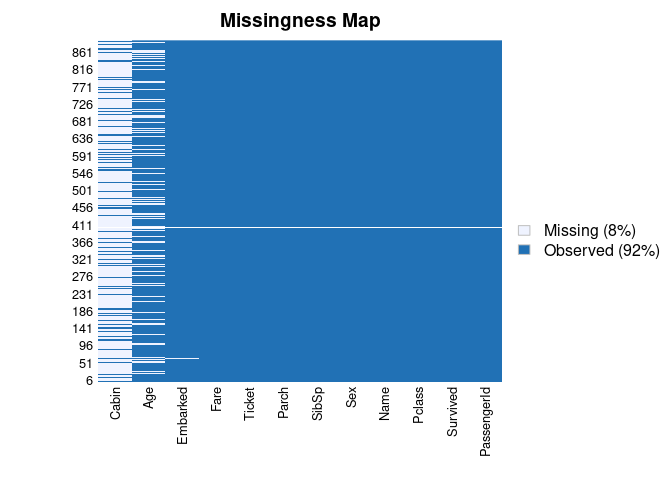
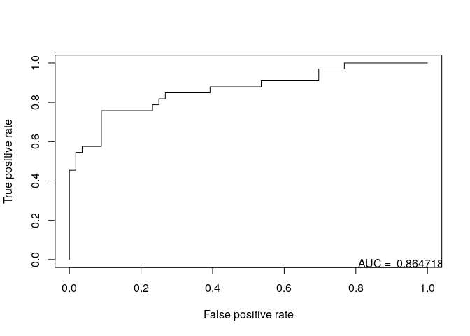

Introduction
------------

Logistic regression is a regression model where the dependent variable
(DV) is categorical. Example from Wikipedia: "Logistic regression may be
used to predict whether a patient has a given disease (e.g. diabetes;
coronary heart disease), based on observed characteristics of the
patient (age, sex, body mass index, results of various blood tests,
etc.)."

Install packages if missing and load.

``` {.r}
.libPaths('/packages')
my_packages <- c('Amelia', 'ROCR')

for (my_package in my_packages){
   if(!require(my_package, character.only = TRUE)){
      install.packages(my_package, '/packages')
      library(my_package, character.only = TRUE)
   }
}
```

Hours of study
--------------

Using the example from Wikipedia: [Probability of passing an exam versus
hours of
study](https://en.wikipedia.org/wiki/Logistic_regression#Example:_Probability_of_passing_an_exam_versus_hours_of_study)

``` {.r}
d <- data.frame(
   hours = c(0.50,0.75,1.00,1.25,1.50,1.75,1.75,2.00,2.25,2.50,2.75,3.00,3.25,3.50,4.00,4.25,4.50,4.75,5.00,5.50),
   pass = factor(c(0,0,0,0,0,0,1,0,1,0,1,0,1,0,1,1,1,1,1,1))
)

model <- glm(
   pass ~ hours,
   family=binomial(link='logit'),
   data=d
)
summary(model)
```

    ## 
    ## Call:
    ## glm(formula = pass ~ hours, family = binomial(link = "logit"), 
    ##     data = d)
    ## 
    ## Deviance Residuals: 
    ##      Min        1Q    Median        3Q       Max  
    ## -1.70557  -0.57357  -0.04654   0.45470   1.82008  
    ## 
    ## Coefficients:
    ##             Estimate Std. Error z value Pr(>|z|)  
    ## (Intercept)  -4.0777     1.7610  -2.316   0.0206 *
    ## hours         1.5046     0.6287   2.393   0.0167 *
    ## ---
    ## Signif. codes:  0 '***' 0.001 '**' 0.01 '*' 0.05 '.' 0.1 ' ' 1
    ## 
    ## (Dispersion parameter for binomial family taken to be 1)
    ## 
    ##     Null deviance: 27.726  on 19  degrees of freedom
    ## Residual deviance: 16.060  on 18  degrees of freedom
    ## AIC: 20.06
    ## 
    ## Number of Fisher Scoring iterations: 5

The output indicates that hours studying is significantly associated
with the probability of passing the exam (p=0.0167, Wald test). The
output also provides the coefficients for Intercept = -4.0777 and Hours
= 1.5046.

Probability of passing as a function of hours of study.

``` {.r}
prob_passing <- function(hours){
  1 / (1 + exp(-(-4.0777 + 1.5046 * hours)))
}

prob_passing(4)
```

    ## [1] 0.874429

Survival on the Titanic
-----------------------

Adapted from [How to Perform a Logistic Regression in
R](https://datascienceplus.com/perform-logistic-regression-in-r/).

``` {.r}
data <- read.csv("../data/titanic.csv.gz", na.strings = '')

# missing data
sapply(data, function(x) sum(is.na(x)))
```

    ## PassengerId    Survived      Pclass        Name         Sex         Age 
    ##           0           0           0           0           0         177 
    ##       SibSp       Parch      Ticket        Fare       Cabin    Embarked 
    ##           0           0           0           0         687           2

``` {.r}
missmap(data)
```



Remove some features

``` {.r}
data_subset <- select(data, -PassengerId, -Ticket, -Cabin, -Name)

# remove the two cases with missing embarked data
data_subset <- filter(data_subset, !is.na(Embarked))

# you can use the mean age for the missing ages
data_subset$Age[is.na(data_subset$Age)] <- mean(data_subset$Age, na.rm=TRUE)

# subset into training and testing sets
train <- data_subset[1:800,]
test  <- data_subset[801:nrow(data_subset),]

model <- glm(Survived ~.,
             family=binomial(link='logit'),
             data=train)

fitted <- predict(model,
                  newdata=test[,-1],
                  type='response')
```

``` {.r}
pr <- prediction(fitted, test$Survived, )
prf <- performance(pr, measure = "tpr", x.measure = "fpr")
auc <- performance(pr, measure = "auc")
plot(prf)
legend(x = 0.75, y = 0.05, legend = paste("AUC = ", auc@y.values), bty = 'n')
```



Links
-----

-   [Simple logistic
    regression](http://www.biostathandbook.com/simplelogistic.html)
-   [Multiple logistic
    regression](http://www.biostathandbook.com/multiplelogistic.html)

Session info
------------

Time built.

    ## [1] "2022-07-12 05:57:22 UTC"

Session info.

    ## R version 4.2.1 (2022-06-23)
    ## Platform: x86_64-pc-linux-gnu (64-bit)
    ## Running under: Ubuntu 20.04.4 LTS
    ## 
    ## Matrix products: default
    ## BLAS:   /usr/lib/x86_64-linux-gnu/openblas-pthread/libblas.so.3
    ## LAPACK: /usr/lib/x86_64-linux-gnu/openblas-pthread/liblapack.so.3
    ## 
    ## locale:
    ##  [1] LC_CTYPE=en_US.UTF-8       LC_NUMERIC=C              
    ##  [3] LC_TIME=en_US.UTF-8        LC_COLLATE=en_US.UTF-8    
    ##  [5] LC_MONETARY=en_US.UTF-8    LC_MESSAGES=en_US.UTF-8   
    ##  [7] LC_PAPER=en_US.UTF-8       LC_NAME=C                 
    ##  [9] LC_ADDRESS=C               LC_TELEPHONE=C            
    ## [11] LC_MEASUREMENT=en_US.UTF-8 LC_IDENTIFICATION=C       
    ## 
    ## attached base packages:
    ## [1] stats     graphics  grDevices utils     datasets  methods   base     
    ## 
    ## other attached packages:
    ##  [1] ROCR_1.0-11     Amelia_1.8.0    Rcpp_1.0.8.3    forcats_0.5.1  
    ##  [5] stringr_1.4.0   dplyr_1.0.9     purrr_0.3.4     readr_2.1.2    
    ##  [9] tidyr_1.2.0     tibble_3.1.7    ggplot2_3.3.6   tidyverse_1.3.1
    ## 
    ## loaded via a namespace (and not attached):
    ##  [1] tidyselect_1.1.2 xfun_0.31        haven_2.5.0      colorspace_2.0-3
    ##  [5] vctrs_0.4.1      generics_0.1.3   htmltools_0.5.2  yaml_2.3.5      
    ##  [9] utf8_1.2.2       rlang_1.0.3      pillar_1.7.0     foreign_0.8-82  
    ## [13] glue_1.6.2       withr_2.5.0      DBI_1.1.3        dbplyr_2.2.1    
    ## [17] modelr_0.1.8     readxl_1.4.0     lifecycle_1.0.1  munsell_0.5.0   
    ## [21] gtable_0.3.0     cellranger_1.1.0 rvest_1.0.2      evaluate_0.15   
    ## [25] knitr_1.39       tzdb_0.3.0       fastmap_1.1.0    fansi_1.0.3     
    ## [29] highr_0.9        broom_1.0.0      scales_1.2.0     backports_1.4.1 
    ## [33] jsonlite_1.8.0   fs_1.5.2         hms_1.1.1        digest_0.6.29   
    ## [37] stringi_1.7.6    grid_4.2.1       cli_3.3.0        tools_4.2.1     
    ## [41] magrittr_2.0.3   crayon_1.5.1     pkgconfig_2.0.3  ellipsis_0.3.2  
    ## [45] xml2_1.3.3       reprex_2.0.1     lubridate_1.8.0  rstudioapi_0.13 
    ## [49] assertthat_0.2.1 rmarkdown_2.14   httr_1.4.3       R6_2.5.1        
    ## [53] compiler_4.2.1
