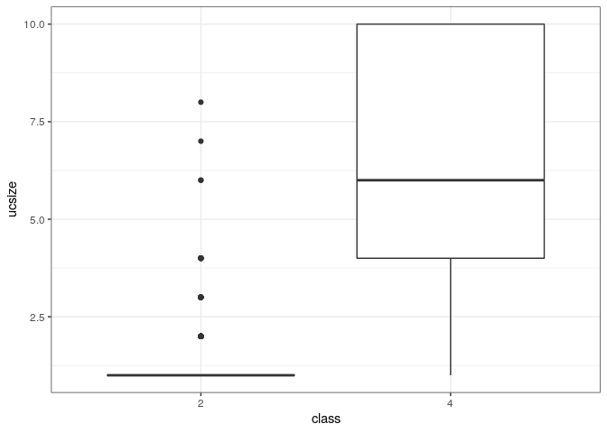

Introduction
------------

This README was generated by running from the root directory of this
repository:

    script/rmd_to_md.sh pca/readme.Rmd

PCA background
--------------

Sample data as per PCA tutorial.

``` {.r}
X = c(1, 2, 4, 6, 12, 15, 25, 45, 68, 67, 65, 98)
```

Sample mean (X bar) by adding up all the numbers and then divide by how
many there are.

$$ \bar{X}  = \frac{\sum^n_{i=1} X_i}{n}$$

``` {.r}
mean(X)
```

    ## [1] 34

The Standard Deviation (SD) of a data set is a measure of how spread out
the data is. The way to calculate it is to compute the squares of the
distance from each data point to the mean of the set, add them all up,
divide by $n-1$, and take the positive square root.

$$ s = \sqrt\frac{\sum^n_{i=1} (X_i - \bar{X})^2}{(n - 1)} $$

``` {.r}
sd(X)
```

    ## [1] 33.22923

Variance is another measure of the spread of data in a data set and it
is simply the standard deviation squared.

$$ s^2 = \frac{\sum^n_{i=1} (X_i - \bar{X})^2}{(n - 1)} $$

Many data sets have more than one dimension and the aim of the
statistical analysis of these data sets is usually to see if there is
any relationship between the dimensions. Standard deviation and variance
only operate on one dimension, so you can only calculate the standard
deviation for each dimension of the data set *independent* of the other
dimensions. However, it is useful to have a similar measure to find out
how much the dimensions vary from the mean *with respect to each other*,
which is what covariance measures and is calculated *between* two
dimensions.

If you calculate the covariance between one dimension and *itself*, you
end up with the variance. For a 3D data set (x, y, z), you could measure
the covariance between the x and y dimensions, the x and z dimensions,
and the y and z dimensions. The formula for covariance is very similar
to the formula for variance.

$$ cov(X, Y) = \frac{\sum^n_{i=1} (X_i-\bar{X})(Y_i-\bar{Y})}{(n - 1)} $$

How does the covariance work? Imagine a 2D data set containing hours
spent studying for an exam (`hours`) and the mark they received for the
exam (`mark`).

``` {.r}
my_df <- data.frame(
   hours = c(9, 15, 25, 14, 10, 18, 0, 16, 5, 19, 16, 20),
   mark = c(39, 56, 93, 61, 50, 75, 32, 85, 42, 70, 66, 80)
)

cov(my_df)
```

    ##          hours     mark
    ## hours  47.7197 122.9470
    ## mark  122.9470 370.0833

The exact value is not as important as it's sign (i.e. positive or
negative). If the value is positive, then it indicates that both
dimensions *increase together*, meaning that as the numbers of hours of
study increased, so did the mark.

If the value is negative, such as the example below, then one dimension
increases as the other decreases; the windier it gets, the lower the
temperature.

``` {.r}
cov(airquality[, c('Wind', 'Temp')])
```

    ##           Wind      Temp
    ## Wind  12.41154 -15.27214
    ## Temp -15.27214  89.59133

If the covariance is zero (or close to zero), then it indicates that the
two dimensions are independent of each other.

``` {.r}
my_random <- data.frame(
   x = rnorm(20),
   y = rnorm(20)
)

cov(my_random)
```

    ##            x          y
    ## x 0.52835171 0.04576695
    ## y 0.04576695 0.86685896

A useful way to represent all possible covariance values in to calculate
them and store them in a matrix.

``` {.r}
cov(airquality[, 1:4], use = "complete.ob")
```

    ##              Ozone   Solar.R      Wind      Temp
    ## Ozone   1107.29009 1056.5835 -72.51124 221.52072
    ## Solar.R 1056.58346 8308.7422 -41.24480 255.46765
    ## Wind     -72.51124  -41.2448  12.65732 -16.85717
    ## Temp     221.52072  255.4676 -16.85717  90.82031

You can multiply two matrices together provided that they are of
compatible sizes and eigenvectors are a special case of this.

The following multiplication, results in a vector that is not an integer
multiple of the original vector, i.e. non-eigenvector.

$$ \begin{bmatrix} 2 & 3 \\ 2 & 1 \end{bmatrix} \times \begin{bmatrix} 1 \\ 3 \end{bmatrix} = \begin{bmatrix} 11 \\ 5 \end{bmatrix} $$

This second example, results in a vector that is exactly four times the
vector we began with, i.e. an eigenvector.

$$ \begin{bmatrix} 2 & 3 \\ 2 & 1 \end{bmatrix} \times \begin{bmatrix} 3 \\ 2 \end{bmatrix} = \begin{bmatrix} 12 \\ 8 \end{bmatrix} = 4 \times \begin{bmatrix} 3 \\ 2 \end{bmatrix} $$

In R.

``` {.r}
matrix(c(2, 3, 2, 1), byrow = TRUE, nrow = 2) %*% matrix(c(3, 2))
```

    ##      [,1]
    ## [1,]   12
    ## [2,]    8

The vector \$
\begin{bmatrix} 3 \\ 2 \end{bmatrix}
\$ represents an arrow pointing from the origin, \$ (0,0) \$, to the
point \$ (3,2) \$. The square matrix \$
\begin{bmatrix} 2 & 3 \\ 2 & 1 \end{bmatrix}

\$ can be considered as a transformation matrix. If you multiply this
matrix on the left of a vector (as per the example), the answer is
another vector that is transformed from its original position. It is the
nature of the transformation that the eigenvectors arise from.

Now imagine a transformation matrix that, when multiplied on the left,
reflected vectors in the line $y = x$ (like the second example). Then
you can see that if there were a vector that lay on the line $y = x$,
it's reflection is itself. This vector (and all multiples of it), would
be an eigenvector of that transformation matrix.

Eigenvectors can only be found for square matrices and not every square
matrix has eigenvectors. If an $n \times n$ matrix does have
eigenvectors, there are $n$ of them. Lastly, all eigenvectors of a
matrix are perpendicular, i.e. at right angles to each other, no matter
the number of dimensions. Another word for perpendicular is orthogonal
and being orthogonal is important because it means that you can express
the data in terms of these perpendicular eigenvectors, instead of
expressing them in terms of the $x$ and $y$ axes.

In addition, eigenvectors are scaled such that it has a length of 1, so
that all eigenvectors have the same length. The vector \$
\begin{bmatrix} 3 \\ 2 \end{bmatrix}

\$ has a length \$ \sqrt(3\^2 + 2\^2) = \sqrt13 \$ so we divide the
original vector by this length to make it have a length of 1.

``` {.r}
matrix(c(3,2) / sqrt(13))
```

    ##           [,1]
    ## [1,] 0.8320503
    ## [2,] 0.5547002

4 is the eigenvalue associated with the \$
\begin{bmatrix} 3 \\ 2 \end{bmatrix}

\$ and the `eigen()` function can be used to find eigenvalues and
eigenvectors of a square matrix.

``` {.r}
my_mat <- matrix(c(2, 3, 2, 1), byrow = TRUE, nrow = 2)
eigen(my_mat)
```

    ## eigen() decomposition
    ## $values
    ## [1]  4 -1
    ## 
    ## $vectors
    ##           [,1]       [,2]
    ## [1,] 0.8320503 -0.7071068
    ## [2,] 0.5547002  0.7071068

PCA
---

Principal Components Analysis (PCA) is a way of identifying patterns in
data and expressing the data in such a way as to highlight their
similarities and differences.

``` {.r}
x <- c(2.5, 0.5, 2.2, 1.9, 3.1, 2.3, 2, 1, 1.5, 1.1)
y <- c(2.4, 0.7, 2.9, 2.2, 3.0, 2.7, 1.6, 1.1, 1.6, 0.9)
```

Breast cancer data
------------------

Using the [Breast Cancer Wisconsin (Diagnostic) Data
Set](https://archive.ics.uci.edu/ml/datasets/Breast+Cancer+Wisconsin+(Diagnostic)).

``` {.r}
data <- read.table(
   "../data/breast_cancer_data.csv",
   stringsAsFactors = FALSE,
   sep = ',',
   header = TRUE
)
data$class <- factor(data$class)
data <- data[,-1]
```

Separate into training (80%) and testing (20%).

``` {.r}
set.seed(31)
my_prob <- 0.8
my_split <- as.logical(
  rbinom(
    n = nrow(data),
    size = 1,
    p = my_prob
  )
)

train <- data[my_split,]
test <- data[!my_split,]
```

Results
-------

``` {.r}
ggplot(data, aes(class, ucsize)) +
   geom_boxplot()
```



Session info
------------

Time built.

    ## [1] "2022-10-20 06:48:10 UTC"

Session info.

    ## R version 4.2.1 (2022-06-23)
    ## Platform: x86_64-pc-linux-gnu (64-bit)
    ## Running under: Ubuntu 20.04.4 LTS
    ## 
    ## Matrix products: default
    ## BLAS:   /usr/lib/x86_64-linux-gnu/openblas-pthread/libblas.so.3
    ## LAPACK: /usr/lib/x86_64-linux-gnu/openblas-pthread/liblapack.so.3
    ## 
    ## locale:
    ##  [1] LC_CTYPE=en_US.UTF-8       LC_NUMERIC=C              
    ##  [3] LC_TIME=en_US.UTF-8        LC_COLLATE=en_US.UTF-8    
    ##  [5] LC_MONETARY=en_US.UTF-8    LC_MESSAGES=en_US.UTF-8   
    ##  [7] LC_PAPER=en_US.UTF-8       LC_NAME=C                 
    ##  [9] LC_ADDRESS=C               LC_TELEPHONE=C            
    ## [11] LC_MEASUREMENT=en_US.UTF-8 LC_IDENTIFICATION=C       
    ## 
    ## attached base packages:
    ## [1] stats     graphics  grDevices utils     datasets  methods   base     
    ## 
    ## other attached packages:
    ## [1] forcats_0.5.1   stringr_1.4.0   dplyr_1.0.9     purrr_0.3.4    
    ## [5] readr_2.1.2     tidyr_1.2.0     tibble_3.1.7    ggplot2_3.3.6  
    ## [9] tidyverse_1.3.1
    ## 
    ## loaded via a namespace (and not attached):
    ##  [1] tidyselect_1.1.2 xfun_0.31        haven_2.5.0      colorspace_2.0-3
    ##  [5] vctrs_0.4.1      generics_0.1.3   htmltools_0.5.2  yaml_2.3.5      
    ##  [9] utf8_1.2.2       rlang_1.0.3      pillar_1.7.0     glue_1.6.2      
    ## [13] withr_2.5.0      DBI_1.1.3        dbplyr_2.2.1     modelr_0.1.8    
    ## [17] readxl_1.4.0     lifecycle_1.0.1  munsell_0.5.0    gtable_0.3.0    
    ## [21] cellranger_1.1.0 rvest_1.0.2      evaluate_0.15    labeling_0.4.2  
    ## [25] knitr_1.39       tzdb_0.3.0       fastmap_1.1.0    fansi_1.0.3     
    ## [29] highr_0.9        broom_1.0.0      scales_1.2.0     backports_1.4.1 
    ## [33] jsonlite_1.8.0   farver_2.1.1     fs_1.5.2         hms_1.1.1       
    ## [37] digest_0.6.29    stringi_1.7.6    grid_4.2.1       cli_3.3.0       
    ## [41] tools_4.2.1      magrittr_2.0.3   crayon_1.5.1     pkgconfig_2.0.3 
    ## [45] ellipsis_0.3.2   xml2_1.3.3       reprex_2.0.1     lubridate_1.8.0 
    ## [49] rstudioapi_0.13  assertthat_0.2.1 rmarkdown_2.14   httr_1.4.3      
    ## [53] R6_2.5.1         compiler_4.2.1
