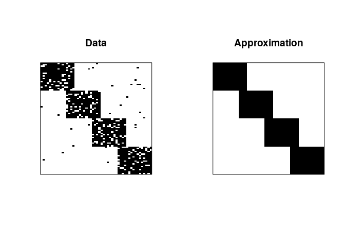

Introduction
------------

<a href="https://en.wikibooks.org/wiki/Data_Mining_Algorithms_In_R/Clustering/Proximus" class="uri">https://en.wikibooks.org/wiki/Data_Mining_Algorithms_In_R/Clustering/Proximus</a>

Install packages if missing and load.

    .libPaths('/packages')
    my_packages <- 'cba'

    for (my_package in my_packages){
       if(!require(my_package, character.only = TRUE)){
          install.packages(my_package, '/packages')
          library(my_package, character.only = TRUE)
       }
    }

Results
-------

<a href="https://www.rdocumentation.org/packages/cba/versions/0.2-21/topics/proximus" class="uri">https://www.rdocumentation.org/packages/cba/versions/0.2-21/topics/proximus</a>

x: a logical matrix. max.radius: the maximum number of bits a member in
a row set may deviate from its dominant pattern. min.size: the minimum
split size of a row set. min.retry: number of retries to split a pure
rank-one approximation (translates into a resampling rate). max.iter:
the maximum number of iterations for finding a local rank-one
approximation. debug: optional debugging output.

    x <- rlbmat()
    pr <- proximus(x, max.radius=8, debug=TRUE)

    ## Non-Zero: 1078
    ## Sparsity: 0.26
    ##   0 [80,20,7] 1 >
    ##   1 [20,20,7] 1 * 1
    ##   1 [60,20,6] 1 >
    ##   2 [20,20,6] 1 * 2
    ##   2 [40,20,7] 1 >
    ##   3 [20,20,7] 1 * 3
    ##   3 [20,20,6] 1 * 4
    ##   2 <
    ##   1 <
    ##   0 <

    op <- par(mfrow=c(1,2), pty="s")
    lmplot(x, main="Data")
    box()
    lmplot(fitted(pr)$x, main="Approximation")
    box()

    par(op)

Session info
------------

Time built.

    ## [1] "2022-04-10 09:20:35 UTC"

Session info.

    ## R version 4.1.3 (2022-03-10)
    ## Platform: x86_64-pc-linux-gnu (64-bit)
    ## Running under: Ubuntu 20.04.4 LTS
    ## 
    ## Matrix products: default
    ## BLAS:   /usr/lib/x86_64-linux-gnu/openblas-pthread/libblas.so.3
    ## LAPACK: /usr/lib/x86_64-linux-gnu/openblas-pthread/liblapack.so.3
    ## 
    ## locale:
    ##  [1] LC_CTYPE=en_US.UTF-8       LC_NUMERIC=C              
    ##  [3] LC_TIME=en_US.UTF-8        LC_COLLATE=en_US.UTF-8    
    ##  [5] LC_MONETARY=en_US.UTF-8    LC_MESSAGES=en_US.UTF-8   
    ##  [7] LC_PAPER=en_US.UTF-8       LC_NAME=C                 
    ##  [9] LC_ADDRESS=C               LC_TELEPHONE=C            
    ## [11] LC_MEASUREMENT=en_US.UTF-8 LC_IDENTIFICATION=C       
    ## 
    ## attached base packages:
    ## [1] grid      stats     graphics  grDevices utils     datasets  methods  
    ## [8] base     
    ## 
    ## other attached packages:
    ##  [1] cba_0.2-21      proxy_0.4-26    forcats_0.5.1   stringr_1.4.0  
    ##  [5] dplyr_1.0.8     purrr_0.3.4     readr_2.1.2     tidyr_1.2.0    
    ##  [9] tibble_3.1.6    ggplot2_3.3.5   tidyverse_1.3.1
    ## 
    ## loaded via a namespace (and not attached):
    ##  [1] tidyselect_1.1.2 xfun_0.30        haven_2.4.3      colorspace_2.0-3
    ##  [5] vctrs_0.4.0      generics_0.1.2   htmltools_0.5.2  yaml_2.3.5      
    ##  [9] utf8_1.2.2       rlang_1.0.2      pillar_1.7.0     glue_1.6.2      
    ## [13] withr_2.5.0      DBI_1.1.2        dbplyr_2.1.1     modelr_0.1.8    
    ## [17] readxl_1.4.0     lifecycle_1.0.1  munsell_0.5.0    gtable_0.3.0    
    ## [21] cellranger_1.1.0 rvest_1.0.2      evaluate_0.15    knitr_1.38      
    ## [25] tzdb_0.3.0       fastmap_1.1.0    fansi_1.0.3      highr_0.9       
    ## [29] broom_0.7.12     scales_1.1.1     backports_1.4.1  jsonlite_1.8.0  
    ## [33] fs_1.5.2         hms_1.1.1        digest_0.6.29    stringi_1.7.6   
    ## [37] cli_3.2.0        tools_4.1.3      magrittr_2.0.3   crayon_1.5.1    
    ## [41] pkgconfig_2.0.3  ellipsis_0.3.2   xml2_1.3.3       reprex_2.0.1    
    ## [45] lubridate_1.8.0  rstudioapi_0.13  assertthat_0.2.1 rmarkdown_2.13  
    ## [49] httr_1.4.2       R6_2.5.1         compiler_4.1.3
