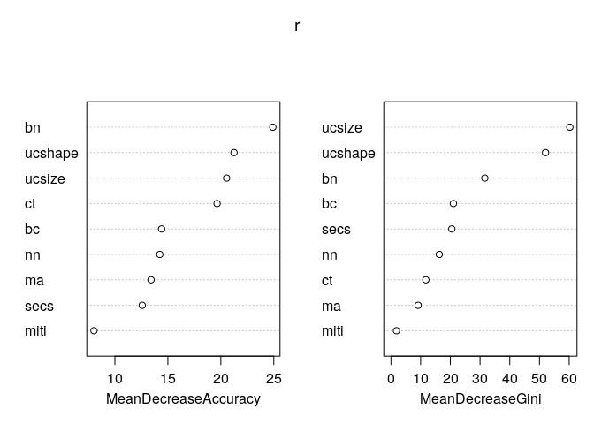

Introduction
------------

Install packages if missing and load.

    .libPaths('/packages')
    my_packages <- c('randomForest')

    for (my_package in my_packages){
       if(!require(my_package, character.only = TRUE)){
          install.packages(my_package, '/packages')
          library(my_package, character.only = TRUE)
       }
    }

Breast cancer data
------------------

Using the [Breast Cancer Wisconsin (Diagnostic) Data
Set](https://archive.ics.uci.edu/ml/datasets/Breast+Cancer+Wisconsin+(Diagnostic)).

    data <- read.table(
       "../data/breast_cancer_data.csv",
       stringsAsFactors = FALSE,
       sep = ',',
       header = TRUE
    )
    data$class <- factor(data$class)
    data <- data[,-1]

Separate into training (80%) and testing (20%).

    set.seed(31)
    my_prob <- 0.8
    my_split <- as.logical(
       rbinom(
          n = nrow(data),
          size = 1,
          p = my_prob
       )
    )

    train <- data[my_split,]
    test <- data[!my_split,]

Analysis
--------

Parameters:

-   `data` = an optional data frame containing the variables in the
    model
-   `importance` = calculate the importance of predictors
-   `do.trace` = give a more verbose output as randomForest is running
-   `proximity` = calculate the proximity measure among the rows

<!-- -->

    set.seed(31)
    r <- randomForest(class ~ ., data=train, importance=TRUE, do.trace=100, proximity = TRUE)

    ## ntree      OOB      1      2
    ##   100:   3.98%  3.39%  4.95%
    ##   200:   3.98%  3.39%  4.95%
    ##   300:   3.98%  3.39%  4.95%
    ##   400:   3.98%  3.39%  4.95%
    ##   500:   3.77%  3.39%  4.40%

Predict
-------

Predict testing data.

    table(
       test$class, predict(object = r, newdata = test)
    )

    ##    
    ##      2  4
    ##   2 76  3
    ##   4  2 41

Plots
-----

Variable importance.

    varImpPlot(r)

Random Forest object
--------------------

    class(r)

    ## [1] "randomForest.formula" "randomForest"

Names.

    names(r)

    ##  [1] "call"            "type"            "predicted"       "err.rate"       
    ##  [5] "confusion"       "votes"           "oob.times"       "classes"        
    ##  [9] "importance"      "importanceSD"    "localImportance" "proximity"      
    ## [13] "ntree"           "mtry"            "forest"          "y"              
    ## [17] "test"            "inbag"           "terms"

The original call to randomForest

    r$call

    ## randomForest(formula = class ~ ., data = train, importance = TRUE, 
    ##     do.trace = 100, proximity = TRUE)

One of regression, classification, or unsupervised

    r$type

    ## [1] "classification"

The predicted values of the input data based on out-of-bag samples

    table(r$predicted, train$class)

    ##    
    ##       2   4
    ##   2 285   8
    ##   4  10 174

A matrix with number of classes + 2 (for classification) or two (for
regression) columns for classification:

-   the first two columns are the class-specific measures computed as
    mean decrease in accuracy
-   the `MeanDecreaseAccuracy` column is the mean decrease in accuracy
    over all classes
-   the `MeanDecreaseGini` is the mean decrease in Gini index

<!-- -->

    r$importance

    ##                   2           4 MeanDecreaseAccuracy MeanDecreaseGini
    ## ct      0.044678510 0.035067024          0.040987744        11.745922
    ## ucsize  0.049202330 0.104776212          0.070220951        60.235972
    ## ucshape 0.030609004 0.113253361          0.062130700        52.052137
    ## ma      0.011245848 0.026950895          0.017253296         9.158375
    ## secs    0.023748641 0.011854733          0.019162136        20.489933
    ## bn      0.056022548 0.075065293          0.063226482        31.605019
    ## bc      0.014271270 0.029746523          0.020034944        21.035236
    ## nn      0.050747220 0.010876336          0.035453362        16.284314
    ## miti    0.008103249 0.002033872          0.005719762         1.860970

The “standard errors” of the permutation-based importance measure.

    r$importanceSD

    ##                   2           4 MeanDecreaseAccuracy
    ## ct      0.003182645 0.001633369         0.0020862257
    ## ucsize  0.004278754 0.006227886         0.0034179246
    ## ucshape 0.003357186 0.005898210         0.0029245321
    ## ma      0.001618164 0.002145479         0.0012865441
    ## secs    0.002264203 0.001566974         0.0015232088
    ## bn      0.003745384 0.002682827         0.0025380534
    ## bc      0.001586304 0.002467881         0.0013904835
    ## nn      0.003971541 0.001328165         0.0024904352
    ## miti    0.001117440 0.000558201         0.0007129329

Number of trees grown.

    r$ntree

    ## [1] 500

Number of predictors sampled for spliting at each node.

    r$mtry

    ## [1] 3

A list that contains the entire forest.

    r$forest[[1]]

    ##   [1] 43 61 55 47 33 35 47 51 37 37 39 57 49 55 37 35 35 45 53 43 33 41 61 37 39
    ##  [26] 41 49 39 35 47 41 43 65 41 39 41 49 37 53 47 43 37 45 49 45 43 45 37 45 41
    ##  [51] 59 53 51 41 39 47 51 43 43 55 47 43 47 57 39 53 45 47 41 57 47 51 43 39 59
    ##  [76] 41 41 47 43 31 25 33 59 43 49 35 39 29 55 45 35 45 43 43 43 51 53 45 33 45
    ## [101] 59 35 41 43 41 43 41 45 41 43 61 53 41 39 53 49 29 53 45 31 51 51 45 51 39
    ## [126] 51 35 37 51 33 47 41 39 41 55 51 41 51 35 65 43 57 53 39 43 49 51 43 35 45
    ## [151] 43 45 49 49 51 39 49 51 51 35 39 45 53 49 33 47 41 47 43 51 45 37 53 47 49
    ## [176] 41 39 41 49 57 31 35 45 47 35 37 53 45 41 51 51 41 49 45 33 47 43 33 43 51
    ## [201] 41 35 49 39 49 51 47 45 55 47 49 41 39 41 53 43 41 43 31 55 45 39 43 33 45
    ## [226] 39 37 45 55 31 57 43 47 47 41 45 25 41 35 49 45 57 43 43 47 51 45 43 59 49
    ## [251] 45 45 41 43 47 45 41 41 41 39 41 33 51 57 41 43 43 47 33 41 45 47 49 45 43
    ## [276] 53 33 49 47 51 59 45 47 45 29 53 39 39 37 53 43 39 37 51 35 45 49 49 31 63
    ## [301] 35 39 39 37 29 43 37 45 57 33 43 37 39 39 43 51 29 53 33 41 45 47 45 39 45
    ## [326] 43 47 49 39 41 47 47 53 57 55 49 49 41 41 47 47 43 53 41 43 35 45 35 49 45
    ## [351] 47 49 39 41 45 45 37 49 37 43 49 53 45 39 43 43 51 47 43 43 31 51 39 53 41
    ## [376] 35 35 43 51 57 47 39 53 51 39 55 53 45 31 39 39 41 33 51 45 43 37 41 57 37
    ## [401] 27 43 37 61 39 53 43 45 53 37 35 57 41 45 43 35 41 43 43 37 33 51 33 57 49
    ## [426] 39 51 45 37 37 47 37 55 27 37 41 41 29 47 49 41 47 57 35 43 45 45 43 37 49
    ## [451] 47 39 43 49 49 43 49 47 43 51 43 33 47 39 43 39 55 37 35 45 39 63 51 31 39
    ## [476] 45 33 41 35 47 33 45 47 57 47 43 37 65 59 47 53 61 39 45 39 41 35 49 39 57

Use `getTree` to obtain an individual tree.

    head(getTree(r, k = 1))

    ##   left daughter right daughter split var split point status prediction
    ## 1             2              3         3         2.5      1          0
    ## 2             4              5         1         6.5      1          0
    ## 3             6              7         6         1.5      1          0
    ## 4             0              0         0         0.0     -1          1
    ## 5             8              9         7         3.0      1          0
    ## 6            10             11         7         2.5      1          0

Vector error rates (classification only) of the prediction on the input
data, the i-th element being the (OOB) error rate for all trees up to
the i-th.

    head(r$err.rate)

    ##             OOB          2          4
    ## [1,] 0.04278075 0.03508772 0.05479452
    ## [2,] 0.04651163 0.03867403 0.05833333
    ## [3,] 0.05737705 0.04888889 0.07092199
    ## [4,] 0.06372549 0.05490196 0.07843137
    ## [5,] 0.05760369 0.04797048 0.07361963
    ## [6,] 0.06345733 0.04593640 0.09195402

The confusion matrix (classification only) of the prediction (based on
OOB data).

    r$confusion

    ##     2   4 class.error
    ## 2 285  10  0.03389831
    ## 4   8 174  0.04395604

A matrix with one row for each input data point and one column for each
class, giving the fraction or number of (OOB) ‘votes’ from the random
forest (classification only).

    head(r$votes)

    ##            2         4
    ## 1  1.0000000 0.0000000
    ## 3  1.0000000 0.0000000
    ## 4  0.1724138 0.8275862
    ## 6  0.5355191 0.4644809
    ## 8  1.0000000 0.0000000
    ## 10 0.5574713 0.4425287

Number of times cases are “out-of-bag” (and thus used in computing OOB
error estimate).

    r$oob.times

    ##   [1] 193 174 203 183 180 174 198 192 175 180 191 167 182 195 188 195 177 188
    ##  [19] 169 169 169 186 183 203 186 186 192 188 181 201 178 199 174 193 205 186
    ##  [37] 182 201 165 173 194 195 191 199 181 196 191 196 164 178 191 173 184 174
    ##  [55] 199 178 205 179 180 195 179 180 200 169 187 179 162 194 181 164 185 184
    ##  [73] 191 179 183 179 188 184 191 175 191 179 180 199 182 174 172 208 189 184
    ##  [91] 196 182 192 183 182 169 159 193 178 176 201 194 176 181 196 198 171 178
    ## [109] 161 176 192 179 210 199 186 195 179 183 186 192 180 187 172 177 182 181
    ## [127] 189 204 174 183 186 185 194 179 187 160 180 179 187 191 180 183 188 187
    ## [145] 182 184 178 197 176 181 176 186 160 169 182 199 177 184 182 176 183 194
    ## [163] 198 180 184 175 186 192 185 187 187 185 173 179 195 163 186 174 187 183
    ## [181] 188 173 200 169 192 179 190 191 168 174 175 188 178 166 193 187 190 186
    ## [199] 178 158 173 177 183 207 184 207 195 183 164 189 170 177 190 189 181 205
    ## [217] 183 160 154 201 183 167 172 191 178 184 175 197 182 163 175 190 183 176
    ## [235] 187 197 169 184 168 169 176 175 181 181 168 165 171 180 177 188 170 168
    ## [253] 197 176 177 179 187 190 184 175 192 187 170 185 171 186 189 173 178 186
    ## [271] 179 197 174 196 178 195 190 183 162 190 155 190 190 181 167 214 172 177
    ## [289] 189 182 196 179 197 181 185 174 175 188 197 195 183 169 186 202 186 192
    ## [307] 183 196 180 181 192 172 185 167 182 198 183 187 185 170 183 158 182 176
    ## [325] 167 177 198 188 189 200 177 167 182 172 199 188 184 176 186 195 173 177
    ## [343] 206 193 183 195 188 173 169 161 179 175 170 168 174 198 186 182 206 185
    ## [361] 196 180 188 180 184 168 183 194 185 180 195 178 190 188 170 202 194 175
    ## [379] 184 193 178 177 173 157 179 197 180 183 167 173 179 179 181 199 189 195
    ## [397] 168 185 190 179 199 197 193 173 158 182 168 174 175 193 186 189 198 192
    ## [415] 191 169 191 182 183 162 192 184 202 169 193 156 169 190 173 198 198 186
    ## [433] 204 185 185 180 167 184 173 177 168 177 182 186 179 207 176 181 191 185
    ## [451] 175 176 191 180 174 196 185 194 195 191 184 196 192 175 191 170 187 189
    ## [469] 207 180 190 179 182 190 177 183 183

If proximity=TRUE when `randomForest` is called, a matrix of proximity
measures among the input (based on the frequency that pairs of data
points are in the same terminal nodes).

    dim(r$proximity)

    ## [1] 477 477

On importance
-------------

Notes from [Stack
Exchange](http://stats.stackexchange.com/questions/92419/relative-importance-of-a-set-of-predictors-in-a-random-forests-classification-in%3E):

MeanDecreaseGini is a measure of variable importance based on the Gini
impurity index used for the calculation of splits during training. A
common misconception is that the variable importance metric refers to
the Gini used for asserting model performance which is closely related
to AUC, but this is wrong. Here is the explanation from the randomForest
package written by Breiman and Cutler:

> Every time a split of a node is made on variable m the gini impurity
> criterion for the two descendent nodes is less than the parent node.
> Adding up the gini decreases for each individual variable over all
> trees in the forest gives a fast variable importance that is often
> very consistent with the permutation importance measure.

The Gini impurity index is defined as:

)

where nc is the number of classes in the target variable and
pi is the ratio of this class.

Session info
------------

Time built.

    ## [1] "2022-04-11 05:43:34 UTC"

Session info.

    ## R version 4.1.3 (2022-03-10)
    ## Platform: x86_64-pc-linux-gnu (64-bit)
    ## Running under: Ubuntu 20.04.4 LTS
    ## 
    ## Matrix products: default
    ## BLAS:   /usr/lib/x86_64-linux-gnu/openblas-pthread/libblas.so.3
    ## LAPACK: /usr/lib/x86_64-linux-gnu/openblas-pthread/liblapack.so.3
    ## 
    ## locale:
    ##  [1] LC_CTYPE=en_US.UTF-8       LC_NUMERIC=C              
    ##  [3] LC_TIME=en_US.UTF-8        LC_COLLATE=en_US.UTF-8    
    ##  [5] LC_MONETARY=en_US.UTF-8    LC_MESSAGES=en_US.UTF-8   
    ##  [7] LC_PAPER=en_US.UTF-8       LC_NAME=C                 
    ##  [9] LC_ADDRESS=C               LC_TELEPHONE=C            
    ## [11] LC_MEASUREMENT=en_US.UTF-8 LC_IDENTIFICATION=C       
    ## 
    ## attached base packages:
    ## [1] stats     graphics  grDevices utils     datasets  methods   base     
    ## 
    ## other attached packages:
    ##  [1] randomForest_4.7-1 forcats_0.5.1      stringr_1.4.0      dplyr_1.0.8       
    ##  [5] purrr_0.3.4        readr_2.1.2        tidyr_1.2.0        tibble_3.1.6      
    ##  [9] ggplot2_3.3.5      tidyverse_1.3.1   
    ## 
    ## loaded via a namespace (and not attached):
    ##  [1] tidyselect_1.1.2 xfun_0.30        haven_2.4.3      colorspace_2.0-3
    ##  [5] vctrs_0.4.0      generics_0.1.2   htmltools_0.5.2  yaml_2.3.5      
    ##  [9] utf8_1.2.2       rlang_1.0.2      pillar_1.7.0     glue_1.6.2      
    ## [13] withr_2.5.0      DBI_1.1.2        dbplyr_2.1.1     modelr_0.1.8    
    ## [17] readxl_1.4.0     lifecycle_1.0.1  munsell_0.5.0    gtable_0.3.0    
    ## [21] cellranger_1.1.0 rvest_1.0.2      evaluate_0.15    knitr_1.38      
    ## [25] tzdb_0.3.0       fastmap_1.1.0    fansi_1.0.3      highr_0.9       
    ## [29] broom_0.7.12     scales_1.1.1     backports_1.4.1  jsonlite_1.8.0  
    ## [33] fs_1.5.2         hms_1.1.1        digest_0.6.29    stringi_1.7.6   
    ## [37] grid_4.1.3       cli_3.2.0        tools_4.1.3      magrittr_2.0.3  
    ## [41] crayon_1.5.1     pkgconfig_2.0.3  ellipsis_0.3.2   xml2_1.3.3      
    ## [45] reprex_2.0.1     lubridate_1.8.0  rstudioapi_0.13  assertthat_0.2.1
    ## [49] rmarkdown_2.13   httr_1.4.2       R6_2.5.1         compiler_4.1.3
