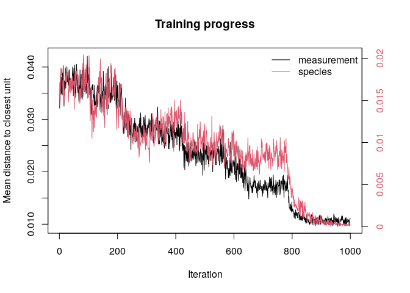
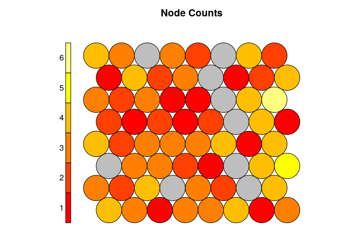
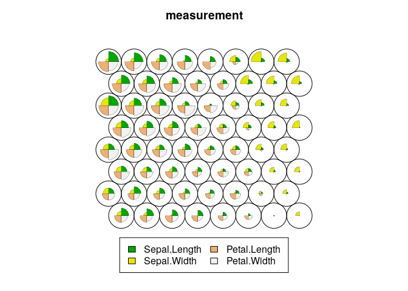
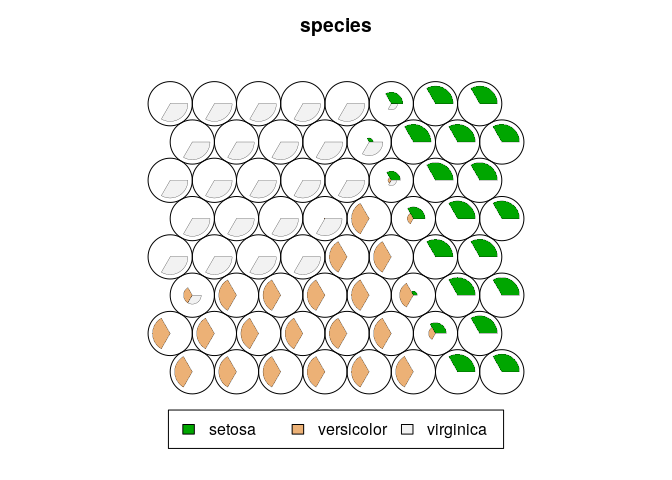

Introduction
------------

Self Organising Maps (SOMs) consist of nodes that are first initialised
with random weights that match the length of the input vector. Over many
iterations, each node is adjusted to more closely resemble an input
vector. The algorithm is described below:

1.  Select number of nodes and the type of node (e.g. square, hexagon,
    circle, etc.)
2.  Initialise all node weight vectors randomly
3.  Choose a random data point from your training data and compare it to
    all nodes (e.g. Euclidean distance)
4.  Find the Best Matching Unit (BMU) in the map, which is the mode
    similar node based on the distance metric used
5.  Determine the nodes within the neighbourhood of the BMU
6.  Adjust weights of nodes in the BMU neighbourhood towards the chosen
    data point; weights are adjusted according to the distance of the
    node to the BMU

We’ll use the
[kohonen](https://cran.r-project.org/web/packages/kohonen/index.html)
package.

    .libPaths('/packages')
    my_packages <- 'kohonen'

    for (my_package in my_packages){
       if(!require(my_package, character.only = TRUE)){
          install.packages(my_package, '/packages')
          library(my_package, character.only = TRUE)
       }
    }

Getting started
---------------

Build a SOM using the iris dataset; we’ll use 64 nodes, perform 1,000
iterations using the default learning rate.

    data(iris)

    # normalise and  convert to matrix
    data_train_matrix <- as.matrix(scale(iris[, -5]))

    data_train <- list(measurement = data_train_matrix,
                       species = iris[, 5])

    som_grid <- somgrid(xdim = 8, ydim = 8, topo="hexagonal")

    # som_model <- som(data_train_matrix, 
    som_model <- supersom(data_train,
                          grid = som_grid, 
                          rlen = 1000,
                          alpha = c(0.05, 0.01), 
                          keep.data = TRUE)

    names(som_model)

    ##  [1] "data"             "unit.classif"     "distances"        "grid"            
    ##  [5] "codes"            "changes"          "alpha"            "radius"          
    ##  [9] "na.rows"          "user.weights"     "distance.weights" "whatmap"         
    ## [13] "maxNA.fraction"   "dist.fcts"

    summary(som_model)

    ## SOM of size 8x8 with a hexagonal topology and a bubble neighbourhood function.
    ## The number of data layers is 2.
    ## Distance measure(s) used: sumofsquares, tanimoto.
    ## Training data included: 150 objects.
    ## Mean distance to the closest unit in the map: 0.003.

Explore `som_model`.

    str(som_model)

    ## List of 14
    ##  $ data            :List of 2
    ##   ..$ measurement: num [1:150, 1:4] -0.898 -1.139 -1.381 -1.501 -1.018 ...
    ##   .. ..- attr(*, "dimnames")=List of 2
    ##   .. .. ..$ : NULL
    ##   .. .. ..$ : chr [1:4] "Sepal.Length" "Sepal.Width" "Petal.Length" "Petal.Width"
    ##   .. ..- attr(*, "scaled:center")= Named num [1:4] 5.84 3.06 3.76 1.2
    ##   .. .. ..- attr(*, "names")= chr [1:4] "Sepal.Length" "Sepal.Width" "Petal.Length" "Petal.Width"
    ##   .. ..- attr(*, "scaled:scale")= Named num [1:4] 0.828 0.436 1.765 0.762
    ##   .. .. ..- attr(*, "names")= chr [1:4] "Sepal.Length" "Sepal.Width" "Petal.Length" "Petal.Width"
    ##   ..$ species    : num [1:150, 1:3] 1 1 1 1 1 1 1 1 1 1 ...
    ##   .. ..- attr(*, "dimnames")=List of 2
    ##   .. .. ..$ : NULL
    ##   .. .. ..$ : chr [1:3] "setosa" "versicolor" "virginica"
    ##  $ unit.classif    : num [1:150] 14 12 4 4 6 16 5 5 3 12 ...
    ##  $ distances       : num [1:150] 0.002608 0.000648 0.001024 0.001694 0.001304 ...
    ##  $ grid            :List of 6
    ##   ..$ pts              : num [1:64, 1:2] 1.5 2.5 3.5 4.5 5.5 6.5 7.5 8.5 1 2 ...
    ##   .. ..- attr(*, "dimnames")=List of 2
    ##   .. .. ..$ : NULL
    ##   .. .. ..$ : chr [1:2] "x" "y"
    ##   ..$ xdim             : num 8
    ##   ..$ ydim             : num 8
    ##   ..$ topo             : chr "hexagonal"
    ##   ..$ neighbourhood.fct: Factor w/ 2 levels "bubble","gaussian": 1
    ##   ..$ toroidal         : logi FALSE
    ##   ..- attr(*, "class")= chr "somgrid"
    ##  $ codes           :List of 2
    ##   ..$ measurement: num [1:64, 1:4] -1.16 -1.61 -1.78 -1.49 -1.23 ...
    ##   .. ..- attr(*, "dimnames")=List of 2
    ##   .. .. ..$ : chr [1:64] "V1" "V2" "V3" "V4" ...
    ##   .. .. ..$ : chr [1:4] "Sepal.Length" "Sepal.Width" "Petal.Length" "Petal.Width"
    ##   ..$ species    : num [1:64, 1:3] 0.257 0.99 1 1 1 ...
    ##   .. ..- attr(*, "dimnames")=List of 2
    ##   .. .. ..$ : chr [1:64] "V1" "V2" "V3" "V4" ...
    ##   .. .. ..$ : chr [1:3] "setosa" "versicolor" "virginica"
    ##  $ changes         : num [1:1000, 1:2] 0.04 0.0378 0.035 0.035 0.0347 ...
    ##   ..- attr(*, "dimnames")=List of 2
    ##   .. ..$ : NULL
    ##   .. ..$ : chr [1:2] "measurement" "species"
    ##  $ alpha           : num [1:2] 0.05 0.01
    ##  $ radius          : Named num [1:2] 4.58 0
    ##   ..- attr(*, "names")= chr [1:2] "66.66667%" ""
    ##  $ na.rows         : int(0) 
    ##  $ user.weights    : num [1:2] 0.5 0.5
    ##  $ distance.weights: num [1:2] 0.118 2.225
    ##  $ whatmap         : int [1:2] 1 2
    ##  $ maxNA.fraction  : int 0
    ##  $ dist.fcts       : chr [1:2] "sumofsquares" "tanimoto"
    ##  - attr(*, "class")= chr "kohonen"

    str(som_model$grid)

    ## List of 6
    ##  $ pts              : num [1:64, 1:2] 1.5 2.5 3.5 4.5 5.5 6.5 7.5 8.5 1 2 ...
    ##   ..- attr(*, "dimnames")=List of 2
    ##   .. ..$ : NULL
    ##   .. ..$ : chr [1:2] "x" "y"
    ##  $ xdim             : num 8
    ##  $ ydim             : num 8
    ##  $ topo             : chr "hexagonal"
    ##  $ neighbourhood.fct: Factor w/ 2 levels "bubble","gaussian": 1
    ##  $ toroidal         : logi FALSE
    ##  - attr(*, "class")= chr "somgrid"

First, we’ll check for convergence.

    plot(som_model, type = "changes")

We can check the number of samples that are mapped to each node. (I
tested different node numbers and 64 nodes gave us a good uniform
distribution of samples mapped to each node.)

    plot(som_model, type="count", main="Node Counts")

The code plot is a nice visualisation of the weighted values across all
nodes.

    plot(som_model, type="codes")

The setosa species have longer sepal widths.

    library(ggplot2)
    ggplot(iris, aes(x = Species, y = Sepal.Width)) +
      geom_violin() +
      theme_bw()

We can create a heatmap of the sepal width weights across all nodes.

    my_var <- "Sepal.Width"

    plot(som_model,
         type = "property",
         property = som_model$codes$measurement[, my_var],
         main = my_var)

Further reading
---------------

-   [Tutorial](https://www.shanelynn.ie/self-organising-maps-for-customer-segmentation-using-r/)
    for building SOMs in R
-   [Tutorial on SOMs and on their
    implementation](http://www.ai-junkie.com/ann/som/som1.html)

Session info
------------

Time built.

    ## [1] "2022-04-11 00:22:31 UTC"

Session info.

    ## R version 4.1.3 (2022-03-10)
    ## Platform: x86_64-pc-linux-gnu (64-bit)
    ## Running under: Ubuntu 20.04.4 LTS
    ## 
    ## Matrix products: default
    ## BLAS:   /usr/lib/x86_64-linux-gnu/openblas-pthread/libblas.so.3
    ## LAPACK: /usr/lib/x86_64-linux-gnu/openblas-pthread/liblapack.so.3
    ## 
    ## locale:
    ##  [1] LC_CTYPE=en_US.UTF-8       LC_NUMERIC=C              
    ##  [3] LC_TIME=en_US.UTF-8        LC_COLLATE=en_US.UTF-8    
    ##  [5] LC_MONETARY=en_US.UTF-8    LC_MESSAGES=en_US.UTF-8   
    ##  [7] LC_PAPER=en_US.UTF-8       LC_NAME=C                 
    ##  [9] LC_ADDRESS=C               LC_TELEPHONE=C            
    ## [11] LC_MEASUREMENT=en_US.UTF-8 LC_IDENTIFICATION=C       
    ## 
    ## attached base packages:
    ## [1] stats     graphics  grDevices utils     datasets  methods   base     
    ## 
    ## other attached packages:
    ##  [1] kohonen_3.0.11  forcats_0.5.1   stringr_1.4.0   dplyr_1.0.8    
    ##  [5] purrr_0.3.4     readr_2.1.2     tidyr_1.2.0     tibble_3.1.6   
    ##  [9] ggplot2_3.3.5   tidyverse_1.3.1
    ## 
    ## loaded via a namespace (and not attached):
    ##  [1] tidyselect_1.1.2 xfun_0.30        haven_2.4.3      colorspace_2.0-3
    ##  [5] vctrs_0.4.0      generics_0.1.2   htmltools_0.5.2  yaml_2.3.5      
    ##  [9] utf8_1.2.2       rlang_1.0.2      pillar_1.7.0     glue_1.6.2      
    ## [13] withr_2.5.0      DBI_1.1.2        dbplyr_2.1.1     modelr_0.1.8    
    ## [17] readxl_1.4.0     lifecycle_1.0.1  munsell_0.5.0    gtable_0.3.0    
    ## [21] cellranger_1.1.0 rvest_1.0.2      evaluate_0.15    labeling_0.4.2  
    ## [25] knitr_1.38       tzdb_0.3.0       fastmap_1.1.0    fansi_1.0.3     
    ## [29] highr_0.9        Rcpp_1.0.8.3     broom_0.7.12     scales_1.1.1    
    ## [33] backports_1.4.1  jsonlite_1.8.0   farver_2.1.0     fs_1.5.2        
    ## [37] hms_1.1.1        digest_0.6.29    stringi_1.7.6    grid_4.1.3      
    ## [41] cli_3.2.0        tools_4.1.3      magrittr_2.0.3   crayon_1.5.1    
    ## [45] pkgconfig_2.0.3  ellipsis_0.3.2   xml2_1.3.3       reprex_2.0.1    
    ## [49] lubridate_1.8.0  rstudioapi_0.13  assertthat_0.2.1 rmarkdown_2.13  
    ## [53] httr_1.4.2       R6_2.5.1         compiler_4.1.3
