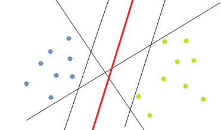

```{r setup, include=FALSE}
library(tidyverse)
theme_set(theme_bw())
knitr::opts_chunk$set(cache = FALSE)
knitr::opts_chunk$set(echo = TRUE)
knitr::opts_chunk$set(fig.path = "img/")
```

## Introduction

A support vector machine (SVM) is a supervised machine learning algorithm that can be used for classification and regression. The essence of SVM classification is broken down into four main concepts:

* The separating hyperplane (a plane that can separate cases into their respective classes)
* The maximum-margin hyperplane or maximum-margin linear discriminants (the hyperplane that has maximal distance from the different classes)



* The soft margin (allowing cases from another class to fall into the opposite class)
* The kernel function (adding an additional dimension)

SVMs rely on preprocessing the data to represent patterns in a high dimension using a kernel function, typically much higher than the original feature space.

In essence, the kernel function is a mathematical trick that allows the SVM to perform a "two-dimensional" classification of a set of originally one-dimensional data. In general, a kernel function projects data from a low-dimensional space to a space of higher dimension. It is possible to prove that, for any given data set with consistent labels (where consistent simply means that the data set does not contain two identical objects with opposite labels) there exists a kernel function that will allow the data to be linearly separated ([Noble, Nature Biotechnology 2006](https://www.ncbi.nlm.nih.gov/pubmed/17160063)).

Using a hyperplane from an SVM that uses a very high-dimensional kernel function will result in overfitting. An optimal kernel function can be selected from a fixed set of kernels in a statistically rigorous fashion by using cross-validation. Kernels also allow us to combine different data sets.

Install packages if missing and load.

```{r load_package, message=FALSE, warning=FALSE}
.libPaths('/packages')
my_packages <- 'e1071'

for (my_package in my_packages){
   if(!require(my_package, character.only = TRUE)){
      install.packages(my_package, '/packages')
      library(my_package, character.only = TRUE)
   }
}
```

## Breast cancer data

Using the [Breast Cancer Wisconsin (Diagnostic) Data Set](http://archive.ics.uci.edu/ml/datasets/Breast+Cancer+Wisconsin+(Diagnostic)).

```{r}
data <- read.table("../data/breast_cancer_data.csv", stringsAsFactors = FALSE, sep = ',', header = TRUE)
```

The class should be a factor; 2 is benign and 4 is malignant.

```{r}
data$class <- factor(data$class)
```

Finally remove id column.

```{r}
data <- data[,-1]
```

Separate into training (80%) and testing (20%).

```{r}
set.seed(31)
my_decider <- rbinom(n=nrow(data),size=1,p=0.8)
table(my_decider)
train <- data[as.logical(my_decider),]
test <- data[!as.logical(my_decider),]
```

Using the `e1071` package.

```{r}
tuned <- tune.svm(class ~ ., data = train, gamma = 10^(-6:-1), cost = 10^(-1:1))
summary(tuned)
```

Train model using the best values for gamma and cost.

```{r}
svm_model <- svm(class ~ ., data = train, kernel="radial", gamma=0.01, cost=1)
summary(svm_model)
```

Predict test cases.

```{r}
svm_predict <- predict(svm_model, test)
table(svm_predict, test$class)
```

## Further reading

* [Data Mining Algorithms In R/Classification/SVM](https://en.wikibooks.org/wiki/Data_Mining_Algorithms_In_R/Classification/SVM)

## Session info

Time built.

```{r time, echo=FALSE}
Sys.time()
```

Session info.

```{r session_info, echo=FALSE}
sessionInfo()
```

