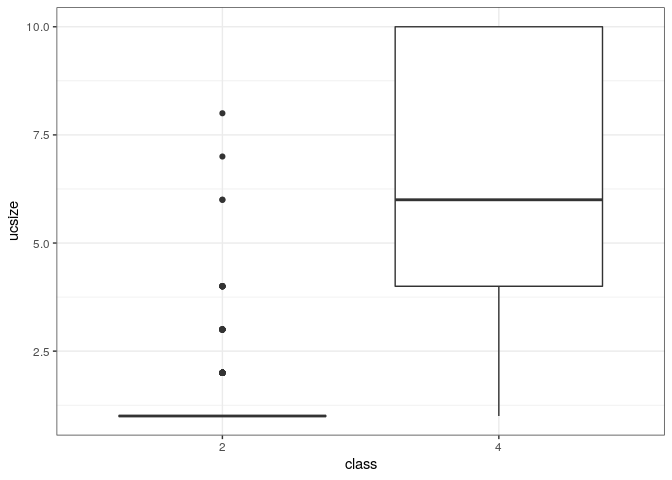

Introduction
------------

This README was generated by running from the root directory of this
repository:

    script/rmd_to_md.sh template/template.Rmd

Install packages if missing and load.

``` {.r}
.libPaths('/packages')
my_packages <- 'beepr'

for (my_package in my_packages){
   if(!require(my_package, character.only = TRUE)){
      install.packages(my_package, '/packages')
      library(my_package, character.only = TRUE)
   }
}
```

$\LaTeX$:

$$ e = mc^2 $$

Breast cancer data
------------------

Using the [Breast Cancer Wisconsin (Diagnostic) Data
Set](https://archive.ics.uci.edu/ml/datasets/Breast+Cancer+Wisconsin+(Diagnostic)).

``` {.r}
data <- read.table(
   "../data/breast_cancer_data.csv",
   stringsAsFactors = FALSE,
   sep = ',',
   header = TRUE
)
data$class <- factor(data$class)
data <- data[,-1]
```

Separate into training (80%) and testing (20%).

``` {.r}
set.seed(31)
my_prob <- 0.8
my_split <- as.logical(
  rbinom(
    n = nrow(data),
    size = 1,
    p = my_prob
  )
)

train <- data[my_split,]
test <- data[!my_split,]
```

Results
-------

``` {.r}
ggplot(data, aes(class, ucsize)) +
   geom_boxplot()
```



Session info
------------

Time built.

    ## [1] "2022-07-12 05:45:25 UTC"

Session info.

    ## R version 4.2.1 (2022-06-23)
    ## Platform: x86_64-pc-linux-gnu (64-bit)
    ## Running under: Ubuntu 20.04.4 LTS
    ## 
    ## Matrix products: default
    ## BLAS:   /usr/lib/x86_64-linux-gnu/openblas-pthread/libblas.so.3
    ## LAPACK: /usr/lib/x86_64-linux-gnu/openblas-pthread/liblapack.so.3
    ## 
    ## locale:
    ##  [1] LC_CTYPE=en_US.UTF-8       LC_NUMERIC=C              
    ##  [3] LC_TIME=en_US.UTF-8        LC_COLLATE=en_US.UTF-8    
    ##  [5] LC_MONETARY=en_US.UTF-8    LC_MESSAGES=en_US.UTF-8   
    ##  [7] LC_PAPER=en_US.UTF-8       LC_NAME=C                 
    ##  [9] LC_ADDRESS=C               LC_TELEPHONE=C            
    ## [11] LC_MEASUREMENT=en_US.UTF-8 LC_IDENTIFICATION=C       
    ## 
    ## attached base packages:
    ## [1] stats     graphics  grDevices utils     datasets  methods   base     
    ## 
    ## other attached packages:
    ##  [1] beepr_1.3       forcats_0.5.1   stringr_1.4.0   dplyr_1.0.9    
    ##  [5] purrr_0.3.4     readr_2.1.2     tidyr_1.2.0     tibble_3.1.7   
    ##  [9] ggplot2_3.3.6   tidyverse_1.3.1
    ## 
    ## loaded via a namespace (and not attached):
    ##  [1] tidyselect_1.1.2 xfun_0.31        haven_2.5.0      colorspace_2.0-3
    ##  [5] vctrs_0.4.1      generics_0.1.3   htmltools_0.5.2  yaml_2.3.5      
    ##  [9] utf8_1.2.2       rlang_1.0.3      pillar_1.7.0     glue_1.6.2      
    ## [13] withr_2.5.0      DBI_1.1.3        dbplyr_2.2.1     modelr_0.1.8    
    ## [17] readxl_1.4.0     audio_0.1-10     lifecycle_1.0.1  munsell_0.5.0   
    ## [21] gtable_0.3.0     cellranger_1.1.0 rvest_1.0.2      evaluate_0.15   
    ## [25] labeling_0.4.2   knitr_1.39       tzdb_0.3.0       fastmap_1.1.0   
    ## [29] fansi_1.0.3      highr_0.9        broom_1.0.0      scales_1.2.0    
    ## [33] backports_1.4.1  jsonlite_1.8.0   farver_2.1.1     fs_1.5.2        
    ## [37] hms_1.1.1        digest_0.6.29    stringi_1.7.6    grid_4.2.1      
    ## [41] cli_3.3.0        tools_4.2.1      magrittr_2.0.3   crayon_1.5.1    
    ## [45] pkgconfig_2.0.3  ellipsis_0.3.2   xml2_1.3.3       reprex_2.0.1    
    ## [49] lubridate_1.8.0  rstudioapi_0.13  assertthat_0.2.1 rmarkdown_2.14  
    ## [53] httr_1.4.3       R6_2.5.1         compiler_4.2.1
