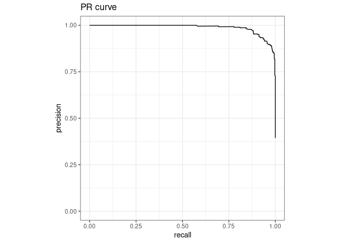
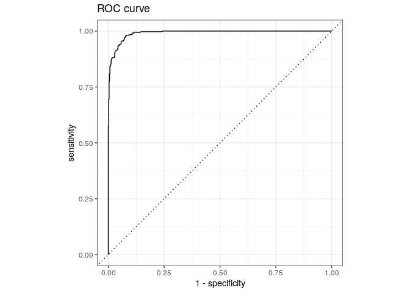
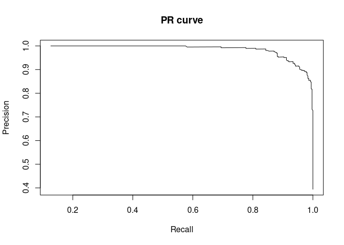
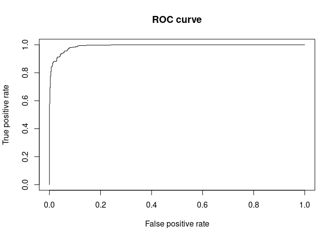
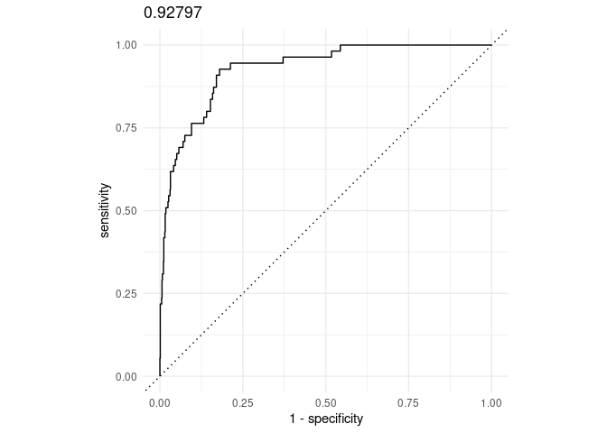
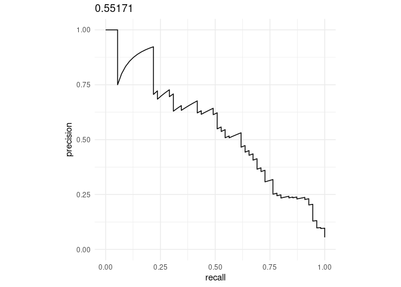

## Setup

Install packages.

``` r
my_packages <- c('tidyverse', 'tidymodels', 'randomForest', 'ROCR')

for (my_package in my_packages){
   if(!require(my_package, character.only = TRUE)){
      install.packages(my_package)
   }
  library(my_package, character.only = TRUE)
}

theme_set(theme_bw())
```

## Spam

Use [spam
data](https://archive.ics.uci.edu/ml/machine-learning-databases/spambase/spambase.names)
to train a Random Forest model to illustrate evaluation measures.

``` r
spam_data <- read.csv(file = "../data/spambase.csv")
dim(spam_data)
```

    ## [1] 4601   58

Class 0 and 1 are ham (non-spam) and spam, respectively.

``` r
spam_data$class <- factor(spam_data$class)
spam_data[c(1:3, (nrow(spam_data)-2):nrow(spam_data)), (ncol(spam_data)-2):ncol(spam_data)]
```

    ##      capital_run_length_longest capital_run_length_total class
    ## 1                            61                      278     1
    ## 2                           101                     1028     1
    ## 3                           485                     2259     1
    ## 4599                          6                      118     0
    ## 4600                          5                       78     0
    ## 4601                          5                       40     0

[Split data](https://www.tidymodels.org/start/resampling/#data-split)
using [rsample](https://rsample.tidymodels.org/).

The `initial_split()` function takes the original data and saves the
information on how to make the partitions. The `strata` argument
conducts a stratified split ensuring that our training and test data
sets will keep roughly the same proportion of classes.

``` r
set.seed(1984)
spam_split <- initial_split(data = spam_data, prop = 0.8, strata = 'class')
spam_split
```

    ## <Training/Testing/Total>
    ## <3680/921/4601>

``` r
spam_train <- training(spam_split)
spam_test <- testing(spam_split)
```

## `parsnip`

The [parsnip package](https://parsnip.tidymodels.org/index.html)
provides a tidy and unified interface to a range of models.

``` r
my_mtry <- ceiling(sqrt(ncol(spam_data)))

rf <- list()
rand_forest(mtry = my_mtry, trees = 500) |>
  set_engine("randomForest") |>
  set_mode("classification") -> rf$model

rf$model |>
  fit(class ~ ., data = spam_train) -> rf$fit

rf$model
```

    ## Random Forest Model Specification (classification)
    ## 
    ## Main Arguments:
    ##   mtry = my_mtry
    ##   trees = 500
    ## 
    ## Computational engine: randomForest

`rf` contains the model parameters and the model.

``` r
str(rf, max.level = 2)
```

    ## List of 2
    ##  $ model:List of 7
    ##   ..$ args                 :List of 3
    ##   ..$ eng_args             : Named list()
    ##   .. ..- attr(*, "class")= chr [1:2] "quosures" "list"
    ##   ..$ mode                 : chr "classification"
    ##   ..$ user_specified_mode  : logi TRUE
    ##   ..$ method               : NULL
    ##   ..$ engine               : chr "randomForest"
    ##   ..$ user_specified_engine: logi TRUE
    ##   ..- attr(*, "class")= chr [1:2] "rand_forest" "model_spec"
    ##  $ fit  :List of 6
    ##   ..$ lvl         : chr [1:2] "0" "1"
    ##   ..$ spec        :List of 7
    ##   .. ..- attr(*, "class")= chr [1:2] "rand_forest" "model_spec"
    ##   ..$ fit         :List of 18
    ##   .. ..- attr(*, "class")= chr "randomForest"
    ##   ..$ preproc     :List of 4
    ##   ..$ elapsed     :List of 1
    ##   ..$ censor_probs: list()
    ##   ..- attr(*, "class")= chr [1:2] "_randomForest" "model_fit"

## `yardstick`

The [yardstick package](https://yardstick.tidymodels.org/) provides a
tidy interface to estimate how well models are performing.

Example data to check how to prepare our data for use with `yardstick`.

``` r
data(two_class_example)
str(two_class_example)
```

    ## 'data.frame':    500 obs. of  4 variables:
    ##  $ truth    : Factor w/ 2 levels "Class1","Class2": 2 1 2 1 2 1 1 1 2 2 ...
    ##  $ Class1   : num  0.00359 0.67862 0.11089 0.73516 0.01624 ...
    ##  $ Class2   : num  0.996 0.321 0.889 0.265 0.984 ...
    ##  $ predicted: Factor w/ 2 levels "Class1","Class2": 2 1 2 1 2 1 1 1 2 2 ...

Make predictions on the test data; `.pred_1` is the "probability" of
spam.

``` r
predict(rf$fit, spam_test, type = 'prob')
```

    ## # A tibble: 921 × 2
    ##    .pred_0 .pred_1
    ##      <dbl>   <dbl>
    ##  1   0.006   0.994
    ##  2   0.178   0.822
    ##  3   0.206   0.794
    ##  4   0.092   0.908
    ##  5   0.024   0.976
    ##  6   0.888   0.112
    ##  7   0.47    0.53 
    ##  8   0.012   0.988
    ##  9   0.022   0.978
    ## 10   0.06    0.94 
    ## # ℹ 911 more rows

Predict and generate table in the format of `two_class_example` using a
wrapper function.

-   `fit` - model
-   `test_data` - test data
-   `pos` - class that the model is testing for
-   `neg` - the other class

Since the model is testing for spam, `pos` is 'spam'.

``` r
predict_wrapper <- function(fit, test_data, pos, neg, type = 'prob'){
  predict(fit, test_data, type = type) |>
    mutate(truth = ifelse(as.integer(test_data$class) == 2, pos, neg)) |>
    mutate(truth = factor(truth, levels = c(pos, neg))) |>
    rename(
      ham = .pred_0,
      spam = .pred_1
    ) |>
    mutate(
      predicted = ifelse(spam > 0.5, pos, neg)
    ) |>
    mutate(
      predicted = factor(predicted, levels = c(pos, neg))
    ) |>
    select(truth, everything())
}

rf$predictions <- predict_wrapper(rf$fit, spam_test, 'spam', 'ham')
rf$predictions
```

    ## # A tibble: 921 × 4
    ##    truth   ham  spam predicted
    ##    <fct> <dbl> <dbl> <fct>    
    ##  1 spam  0.006 0.994 spam     
    ##  2 spam  0.178 0.822 spam     
    ##  3 spam  0.206 0.794 spam     
    ##  4 spam  0.092 0.908 spam     
    ##  5 spam  0.024 0.976 spam     
    ##  6 spam  0.888 0.112 ham      
    ##  7 spam  0.47  0.53  spam     
    ##  8 spam  0.012 0.988 spam     
    ##  9 spam  0.022 0.978 spam     
    ## 10 spam  0.06  0.94  spam     
    ## # ℹ 911 more rows

Confusion matrix.

``` r
cm <- table(rf$predictions$truth, rf$predictions$predicted)
cm |>
  prop.table()
```

    ##       
    ##              spam        ham
    ##   spam 0.36264929 0.03148751
    ##   ham  0.02605863 0.57980456

Metrics.

``` r
metrics(rf$predictions, truth, predicted)
```

    ## # A tibble: 2 × 3
    ##   .metric  .estimator .estimate
    ##   <chr>    <chr>          <dbl>
    ## 1 accuracy binary         0.942
    ## 2 kap      binary         0.879

[table_metrics](https://github.com/davetang/learning_r/blob/main/code/table_metrics.R).

``` r
source("https://raw.githubusercontent.com/davetang/learning_r/main/code/table_metrics.R")
table_metrics(cm, 'spam', 'ham', 'row', sig_fig = 7)
```

    ## $accuracy
    ## [1] 0.9424539
    ## 
    ## $misclassifcation_rate
    ## [1] 0.05754615
    ## 
    ## $error_rate
    ## [1] 0.05754615
    ## 
    ## $true_positive_rate
    ## [1] 0.9201102
    ## 
    ## $sensitivity
    ## [1] 0.9201102
    ## 
    ## $recall
    ## [1] 0.9201102
    ## 
    ## $false_positive_rate
    ## [1] 0.04301075
    ## 
    ## $true_negative_rate
    ## [1] 0.9569892
    ## 
    ## $specificity
    ## [1] 0.9569892
    ## 
    ## $precision
    ## [1] 0.9329609
    ## 
    ## $prevalance
    ## [1] 0.3941368
    ## 
    ## $f1_score
    ## [1] 0.926491

Area under the PR curve.

``` r
pr_auc(rf$predictions, truth, spam)
```

    ## # A tibble: 1 × 3
    ##   .metric .estimator .estimate
    ##   <chr>   <chr>          <dbl>
    ## 1 pr_auc  binary         0.987

[PR curve](https://yardstick.tidymodels.org/reference/pr_curve.html).

``` r
pr_curve(rf$predictions, truth, spam) |>
  ggplot(aes(x = recall, y = precision)) +
  geom_path() +
  coord_equal() +
  ylim(c(0, 1)) +
  ggtitle('PR curve')
```



Area under the ROC curve.

``` r
roc_auc(rf$predictions, truth, spam)
```

    ## # A tibble: 1 × 3
    ##   .metric .estimator .estimate
    ##   <chr>   <chr>          <dbl>
    ## 1 roc_auc binary         0.991

[ROC curve](https://yardstick.tidymodels.org/reference/roc_curve.html).

``` r
roc_curve(rf$predictions, truth, spam) |>
  ggplot(aes(x = 1 - specificity, y = sensitivity)) +
  geom_path() +
  geom_abline(lty = 3) +
  coord_equal() +
  ggtitle('ROC curve')
```



### Using ROCR

Compare with
[ROCR](https://cran.rstudio.com/web/packages/ROCR/vignettes/ROCR.html).

Every classifier evaluation using {ROCR} starts with creating a
prediction object.

``` r
predictions <- predict(rf$fit, spam_test, type = 'prob')$.pred_1
labels <- spam_test$class
pred <- prediction(predictions, labels)
aucpr <- performance(pred, "aucpr")
aucroc <- performance(pred, "auc")
str(aucpr)
```

    ## Formal class 'performance' [package "ROCR"] with 6 slots
    ##   ..@ x.name      : chr "None"
    ##   ..@ y.name      : chr "Area under the Precision/Recall curve"
    ##   ..@ alpha.name  : chr "none"
    ##   ..@ x.values    : list()
    ##   ..@ y.values    :List of 1
    ##   .. ..$ : num 0.987
    ##   ..@ alpha.values: list()

``` r
str(aucroc)
```

    ## Formal class 'performance' [package "ROCR"] with 6 slots
    ##   ..@ x.name      : chr "None"
    ##   ..@ y.name      : chr "Area under the ROC curve"
    ##   ..@ alpha.name  : chr "none"
    ##   ..@ x.values    : list()
    ##   ..@ y.values    :List of 1
    ##   .. ..$ : num 0.991
    ##   ..@ alpha.values: list()

PR curve.

``` r
perf <- performance(pred, "prec", "rec")
plot(perf, lwd= 1, main= "PR curve")
```



ROC curve.

``` r
perf <- performance(pred, "tpr", "fpr")
plot(perf, lwd= 1, main= "ROC curve")
```



### Class imbalance

Difference in area under the ROC curve and area under the precision
recall curve.

``` r
set.seed(1984)

n <- 1000
p_positive <- 0.05

y <- factor(rbinom(n, 1, p_positive))
x <- rnorm(n, mean = ifelse(y == 1, 2, 0), sd = 1)

fit <- glm(y ~ x, family = binomial)
probs <- predict(fit, type = "response")

data.frame(
  truth = ifelse(y == 1, 'DA', 'NotDA'),
  NotDA = 1 - probs,
  DA = probs
) |>
  dplyr::mutate(truth = factor(truth, levels = c('DA', 'NotDA'))) -> toy_data
```

Identify most `DA` (\>96%) but a lot of `NotDA` (\>43%) are also
predicted as `DA`, i.e., false positives.

``` r
toy_data |>
  dplyr::mutate(
    predicted = factor(ifelse(DA > 0.01, 'DA', 'NotDA'), levels = c('DA', 'NotDA'))
  ) |>
  dplyr::select(truth, predicted) |>
  table() |>
  prop.table(margin = 1)
```

    ##        predicted
    ## truth           DA      NotDA
    ##   DA    0.96363636 0.03636364
    ##   NotDA 0.43703704 0.56296296

Area under the ROC curve (high if we can rank positives higher than
negatives)

``` r
roc_curve(toy_data, truth, DA) |>
  ggplot(aes(x = 1 - specificity, y = sensitivity)) +
  geom_path() +
  geom_abline(lty = 3) +
  coord_equal() +
  ggtitle(round(roc_auc(toy_data, truth, DA)$.estimate, 5)) +
  theme_minimal()
```



Area under the precision recall curve (sensitive to false positives)

``` r
pr_curve(toy_data, truth, DA) |>
  ggplot(aes(x = recall, y = precision)) +
  geom_path() +
  coord_equal() +
  ylim(c(0, 1)) +
  ggtitle(round(pr_auc(toy_data, truth, DA)$.estimate, 5)) +
  theme_minimal()
```



## Session info

Time built.

    ## [1] "2024-11-13 09:29:21 UTC"

Session info.

    ## R version 4.4.0 (2024-04-24)
    ## Platform: x86_64-pc-linux-gnu
    ## Running under: Ubuntu 22.04.4 LTS
    ## 
    ## Matrix products: default
    ## BLAS:   /usr/lib/x86_64-linux-gnu/openblas-pthread/libblas.so.3 
    ## LAPACK: /usr/lib/x86_64-linux-gnu/openblas-pthread/libopenblasp-r0.3.20.so;  LAPACK version 3.10.0
    ## 
    ## locale:
    ##  [1] LC_CTYPE=en_US.UTF-8       LC_NUMERIC=C              
    ##  [3] LC_TIME=en_US.UTF-8        LC_COLLATE=en_US.UTF-8    
    ##  [5] LC_MONETARY=en_US.UTF-8    LC_MESSAGES=en_US.UTF-8   
    ##  [7] LC_PAPER=en_US.UTF-8       LC_NAME=C                 
    ##  [9] LC_ADDRESS=C               LC_TELEPHONE=C            
    ## [11] LC_MEASUREMENT=en_US.UTF-8 LC_IDENTIFICATION=C       
    ## 
    ## time zone: Etc/UTC
    ## tzcode source: system (glibc)
    ## 
    ## attached base packages:
    ## [1] stats     graphics  grDevices utils     datasets  methods   base     
    ## 
    ## other attached packages:
    ##  [1] ROCR_1.0-11          randomForest_4.7-1.1 yardstick_1.3.1     
    ##  [4] workflowsets_1.1.0   workflows_1.1.4      tune_1.2.1          
    ##  [7] rsample_1.2.1        recipes_1.0.10       parsnip_1.2.1       
    ## [10] modeldata_1.3.0      infer_1.0.7          dials_1.2.1         
    ## [13] scales_1.3.0         broom_1.0.5          tidymodels_1.2.0    
    ## [16] lubridate_1.9.3      forcats_1.0.0        stringr_1.5.1       
    ## [19] dplyr_1.1.4          purrr_1.0.2          readr_2.1.5         
    ## [22] tidyr_1.3.1          tibble_3.2.1         ggplot2_3.5.1       
    ## [25] tidyverse_2.0.0     
    ## 
    ## loaded via a namespace (and not attached):
    ##  [1] tidyselect_1.2.1    timeDate_4032.109   farver_2.1.1       
    ##  [4] fastmap_1.1.1       digest_0.6.35       rpart_4.1.23       
    ##  [7] timechange_0.3.0    lifecycle_1.0.4     survival_3.5-8     
    ## [10] magrittr_2.0.3      compiler_4.4.0      rlang_1.1.3        
    ## [13] tools_4.4.0         utf8_1.2.4          yaml_2.3.8         
    ## [16] data.table_1.15.4   knitr_1.46          labeling_0.4.3     
    ## [19] DiceDesign_1.10     withr_3.0.0         nnet_7.3-19        
    ## [22] grid_4.4.0          fansi_1.0.6         colorspace_2.1-0   
    ## [25] future_1.33.2       globals_0.16.3      iterators_1.0.14   
    ## [28] MASS_7.3-60.2       cli_3.6.2           rmarkdown_2.27     
    ## [31] generics_0.1.3      rstudioapi_0.16.0   future.apply_1.11.2
    ## [34] tzdb_0.4.0          splines_4.4.0       parallel_4.4.0     
    ## [37] vctrs_0.6.5         hardhat_1.4.0       Matrix_1.7-0       
    ## [40] hms_1.1.3           listenv_0.9.1       foreach_1.5.2      
    ## [43] gower_1.0.1         glue_1.7.0          parallelly_1.37.1  
    ## [46] codetools_0.2-20    stringi_1.8.3       gtable_0.3.5       
    ## [49] munsell_0.5.1       GPfit_1.0-8         pillar_1.9.0       
    ## [52] furrr_0.3.1         htmltools_0.5.8.1   ipred_0.9-14       
    ## [55] lava_1.8.0          R6_2.5.1            lhs_1.1.6          
    ## [58] evaluate_0.23       lattice_0.22-6      highr_0.10         
    ## [61] backports_1.4.1     class_7.3-22        Rcpp_1.0.12        
    ## [64] prodlim_2023.08.28  xfun_0.43           pkgconfig_2.0.3
