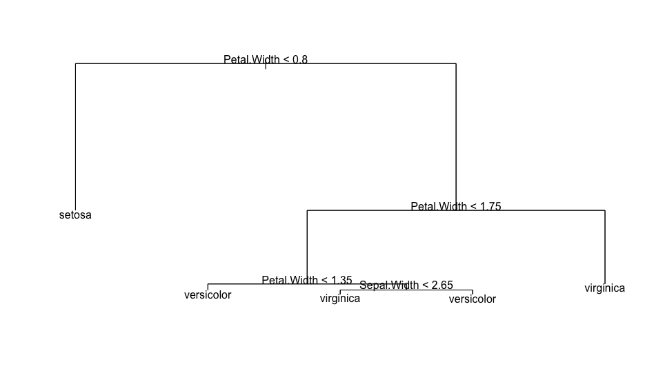
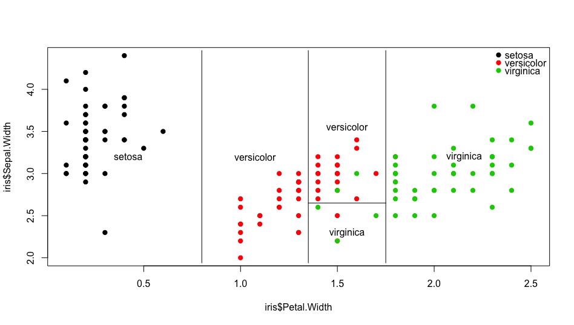
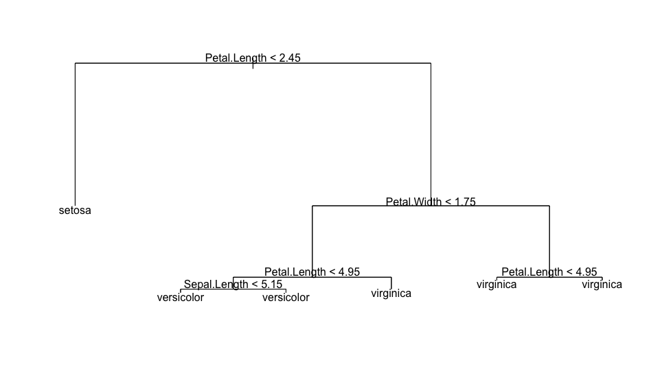
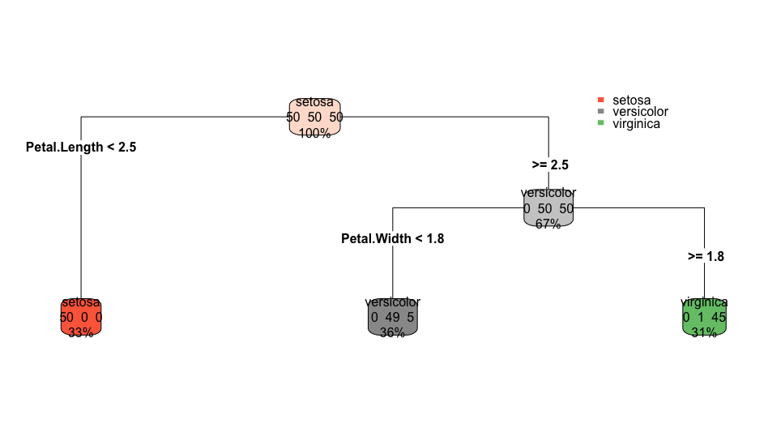

Decision trees
==============

A [decision tree](https://en.wikipedia.org/wiki/Decision_tree) is a decision support tool that uses a tree-like graph or model of decisions and their possible consequences, including chance event outcomes, resource costs, and utility.

~~~~{.r}
# install packages if necessary
# install.packages("tree")
# install.packages('rpart')
# install.packages('rpart.plot')

library(tree)
library(rpart.plot)
library(rpart)

tree1 <- tree(Species ~ Sepal.Width + Petal.Width, data = iris)
summary(tree1)
plot(tree1); text(tree1)
~~~~

~~~~{.r}
plot(iris$Petal.Width,
     iris$Sepal.Width,
     pch=19,
     col=as.numeric(iris$Species))

partition.tree(tree1, label="Species", add=TRUE)
legend(2.3,4.5,
       legend=levels(iris$Species),
       col=1:length(levels(iris$Species)),
       pch=19,
       bty = 'n')
~~~~

~~~~{.r}
tree2 <- tree(Species ~ ., data = iris)
summary(tree2)
plot(tree2); text(tree2)
~~~~

~~~~{.r}
rpart <- rpart(Species ~ ., data=iris, method="class")
summary(rpart)
rpart.plot(rpart, type = 4, extra = 101)
~~~~

