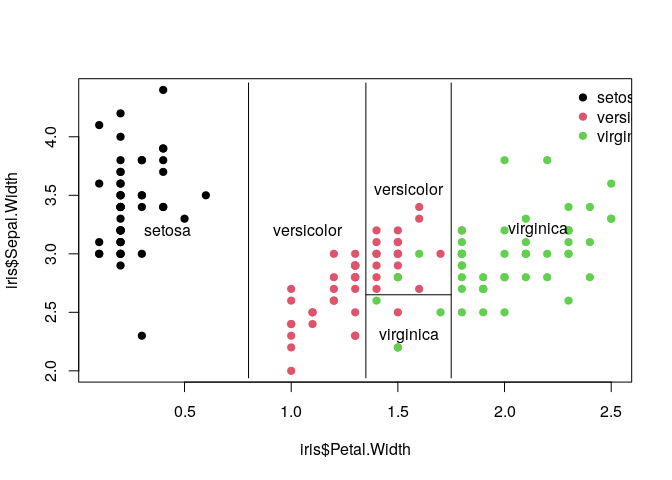
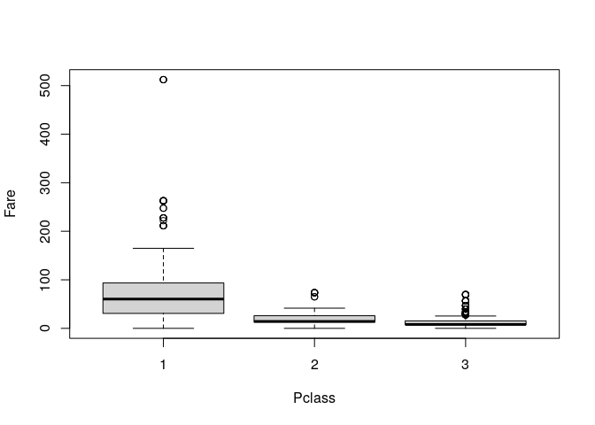

Introduction
------------

A [decision tree](https://en.wikipedia.org/wiki/Decision_tree) is a
decision support tool that uses a tree-like graph or model of decisions
and their possible consequences, including chance event outcomes,
resource costs, and utility.

``` {.r}
.libPaths('/packages')
my_packages <- c('tree', 'rpart', 'rpart.plot')

for (my_package in my_packages){
   if(!require(my_package, character.only = TRUE)){
      install.packages(my_package, '/packages')
      library(my_package, character.only = TRUE)
   }
}
```

``` {.r}
tree1 <- tree(Species ~ Sepal.Width + Petal.Width, data = iris)
summary(tree1)
```

    ## 
    ## Classification tree:
    ## tree(formula = Species ~ Sepal.Width + Petal.Width, data = iris)
    ## Number of terminal nodes:  5 
    ## Residual mean deviance:  0.204 = 29.57 / 145 
    ## Misclassification error rate: 0.03333 = 5 / 150

``` {.r}
plot(tree1)
text(tree1)
```


``` {.r}
plot(iris$Petal.Width,
     iris$Sepal.Width,
     pch=19,
     col=as.numeric(iris$Species))

partition.tree(tree1, label="Species", add=TRUE)
legend(2.3,4.5,
       legend=levels(iris$Species),
       col=1:length(levels(iris$Species)),
       pch=19,
       bty = 'n')
```



``` {.r}
tree2 <- tree(Species ~ ., data = iris)
summary(tree2)
```

    ## 
    ## Classification tree:
    ## tree(formula = Species ~ ., data = iris)
    ## Variables actually used in tree construction:
    ## [1] "Petal.Length" "Petal.Width"  "Sepal.Length"
    ## Number of terminal nodes:  6 
    ## Residual mean deviance:  0.1253 = 18.05 / 144 
    ## Misclassification error rate: 0.02667 = 4 / 150

``` {.r}
plot(tree2); text(tree2)
```


Each node shows:

1.  The predicted class (setosa, versicolor, and virginica)
2.  The numbers of each class (in the order above)
3.  The percentage of all samples

``` {.r}
rpart <- rpart(Species ~ ., data=iris, method="class")
summary(rpart)
```

    ## Call:
    ## rpart(formula = Species ~ ., data = iris, method = "class")
    ##   n= 150 
    ## 
    ##     CP nsplit rel error xerror       xstd
    ## 1 0.50      0      1.00   1.11 0.05372150
    ## 2 0.44      1      0.50   0.66 0.06079474
    ## 3 0.01      2      0.06   0.08 0.02751969
    ## 
    ## Variable importance
    ##  Petal.Width Petal.Length Sepal.Length  Sepal.Width 
    ##           34           31           21           14 
    ## 
    ## Node number 1: 150 observations,    complexity param=0.5
    ##   predicted class=setosa      expected loss=0.6666667  P(node) =1
    ##     class counts:    50    50    50
    ##    probabilities: 0.333 0.333 0.333 
    ##   left son=2 (50 obs) right son=3 (100 obs)
    ##   Primary splits:
    ##       Petal.Length < 2.45 to the left,  improve=50.00000, (0 missing)
    ##       Petal.Width  < 0.8  to the left,  improve=50.00000, (0 missing)
    ##       Sepal.Length < 5.45 to the left,  improve=34.16405, (0 missing)
    ##       Sepal.Width  < 3.35 to the right, improve=19.03851, (0 missing)
    ##   Surrogate splits:
    ##       Petal.Width  < 0.8  to the left,  agree=1.000, adj=1.00, (0 split)
    ##       Sepal.Length < 5.45 to the left,  agree=0.920, adj=0.76, (0 split)
    ##       Sepal.Width  < 3.35 to the right, agree=0.833, adj=0.50, (0 split)
    ## 
    ## Node number 2: 50 observations
    ##   predicted class=setosa      expected loss=0  P(node) =0.3333333
    ##     class counts:    50     0     0
    ##    probabilities: 1.000 0.000 0.000 
    ## 
    ## Node number 3: 100 observations,    complexity param=0.44
    ##   predicted class=versicolor  expected loss=0.5  P(node) =0.6666667
    ##     class counts:     0    50    50
    ##    probabilities: 0.000 0.500 0.500 
    ##   left son=6 (54 obs) right son=7 (46 obs)
    ##   Primary splits:
    ##       Petal.Width  < 1.75 to the left,  improve=38.969400, (0 missing)
    ##       Petal.Length < 4.75 to the left,  improve=37.353540, (0 missing)
    ##       Sepal.Length < 6.15 to the left,  improve=10.686870, (0 missing)
    ##       Sepal.Width  < 2.45 to the left,  improve= 3.555556, (0 missing)
    ##   Surrogate splits:
    ##       Petal.Length < 4.75 to the left,  agree=0.91, adj=0.804, (0 split)
    ##       Sepal.Length < 6.15 to the left,  agree=0.73, adj=0.413, (0 split)
    ##       Sepal.Width  < 2.95 to the left,  agree=0.67, adj=0.283, (0 split)
    ## 
    ## Node number 6: 54 observations
    ##   predicted class=versicolor  expected loss=0.09259259  P(node) =0.36
    ##     class counts:     0    49     5
    ##    probabilities: 0.000 0.907 0.093 
    ## 
    ## Node number 7: 46 observations
    ##   predicted class=virginica   expected loss=0.02173913  P(node) =0.3066667
    ##     class counts:     0     1    45
    ##    probabilities: 0.000 0.022 0.978

``` {.r}
rpart.plot(rpart, type = 4, extra = 101)
```


Titanic data
------------

``` {.r}
titanic <- read.csv('../data/titanic.csv.gz')
str(titanic)
```

    ## 'data.frame':    891 obs. of  12 variables:
    ##  $ PassengerId: int  1 2 3 4 5 6 7 8 9 10 ...
    ##  $ Survived   : int  0 1 1 1 0 0 0 0 1 1 ...
    ##  $ Pclass     : int  3 1 3 1 3 3 1 3 3 2 ...
    ##  $ Name       : chr  "Braund, Mr. Owen Harris" "Cumings, Mrs. John Bradley (Florence Briggs Thayer)" "Heikkinen, Miss. Laina" "Futrelle, Mrs. Jacques Heath (Lily May Peel)" ...
    ##  $ Sex        : chr  "male" "female" "female" "female" ...
    ##  $ Age        : num  22 38 26 35 35 NA 54 2 27 14 ...
    ##  $ SibSp      : int  1 1 0 1 0 0 0 3 0 1 ...
    ##  $ Parch      : int  0 0 0 0 0 0 0 1 2 0 ...
    ##  $ Ticket     : chr  "A/5 21171" "PC 17599" "STON/O2. 3101282" "113803" ...
    ##  $ Fare       : num  7.25 71.28 7.92 53.1 8.05 ...
    ##  $ Cabin      : chr  "" "C85" "" "C123" ...
    ##  $ Embarked   : chr  "S" "C" "S" "S" ...

``` {.r}
titanic$Pclass <- factor(titanic$Pclass)
boxplot(Fare ~ Pclass, data = titanic)
```



Each node shows:

1.  The predicted class (0 or 1)
2.  The predicted probability of survival
3.  The percentage of all samples

``` {.r}
t <-  rpart(Survived ~ Sex + Fare + Age, data=titanic, method="class")
rpart.plot(t)
```


For example the 0.74 indicates that 74% of females survived.

``` {.r}
prop.table(
   table(
      titanic$Sex, titanic$Survived
   ), margin = 1
)
```

    ##         
    ##                  0         1
    ##   female 0.2579618 0.7420382
    ##   male   0.8110919 0.1889081

Breast cancer data
------------------

``` {.r}
data <- read.table(
   "../data/breast_cancer_data.csv",
   stringsAsFactors = FALSE,
   sep = ',',
   header = TRUE
)
data$class <- factor(data$class)
data <- data[,-1]
```

Each node shows:

1.  The predicted class (0 or 1)
2.  The predicted probability of malignancy
3.  The percentage of all samples

``` {.r}
t <- rpart(class ~ ., data = data, method="class")
rpart.plot(t)
```


Session info
------------

Time built.

    ## [1] "2022-10-20 06:51:15 UTC"

Session info.

    ## R version 4.2.1 (2022-06-23)
    ## Platform: x86_64-pc-linux-gnu (64-bit)
    ## Running under: Ubuntu 20.04.4 LTS
    ## 
    ## Matrix products: default
    ## BLAS:   /usr/lib/x86_64-linux-gnu/openblas-pthread/libblas.so.3
    ## LAPACK: /usr/lib/x86_64-linux-gnu/openblas-pthread/liblapack.so.3
    ## 
    ## locale:
    ##  [1] LC_CTYPE=en_US.UTF-8       LC_NUMERIC=C              
    ##  [3] LC_TIME=en_US.UTF-8        LC_COLLATE=en_US.UTF-8    
    ##  [5] LC_MONETARY=en_US.UTF-8    LC_MESSAGES=en_US.UTF-8   
    ##  [7] LC_PAPER=en_US.UTF-8       LC_NAME=C                 
    ##  [9] LC_ADDRESS=C               LC_TELEPHONE=C            
    ## [11] LC_MEASUREMENT=en_US.UTF-8 LC_IDENTIFICATION=C       
    ## 
    ## attached base packages:
    ## [1] stats     graphics  grDevices utils     datasets  methods   base     
    ## 
    ## other attached packages:
    ##  [1] rpart.plot_3.1.1 rpart_4.1.16     tree_1.0-42      forcats_0.5.1   
    ##  [5] stringr_1.4.0    dplyr_1.0.9      purrr_0.3.4      readr_2.1.2     
    ##  [9] tidyr_1.2.0      tibble_3.1.7     ggplot2_3.3.6    tidyverse_1.3.1 
    ## 
    ## loaded via a namespace (and not attached):
    ##  [1] tidyselect_1.1.2 xfun_0.31        haven_2.5.0      colorspace_2.0-3
    ##  [5] vctrs_0.4.1      generics_0.1.3   htmltools_0.5.2  yaml_2.3.5      
    ##  [9] utf8_1.2.2       rlang_1.0.3      pillar_1.7.0     glue_1.6.2      
    ## [13] withr_2.5.0      DBI_1.1.3        dbplyr_2.2.1     modelr_0.1.8    
    ## [17] readxl_1.4.0     lifecycle_1.0.1  munsell_0.5.0    gtable_0.3.0    
    ## [21] cellranger_1.1.0 rvest_1.0.2      evaluate_0.15    knitr_1.39      
    ## [25] tzdb_0.3.0       fastmap_1.1.0    fansi_1.0.3      highr_0.9       
    ## [29] broom_1.0.0      scales_1.2.0     backports_1.4.1  jsonlite_1.8.0  
    ## [33] fs_1.5.2         hms_1.1.1        digest_0.6.29    stringi_1.7.6   
    ## [37] grid_4.2.1       cli_3.3.0        tools_4.2.1      magrittr_2.0.3  
    ## [41] crayon_1.5.1     pkgconfig_2.0.3  ellipsis_0.3.2   xml2_1.3.3      
    ## [45] reprex_2.0.1     lubridate_1.8.0  rstudioapi_0.13  assertthat_0.2.1
    ## [49] rmarkdown_2.14   httr_1.4.3       R6_2.5.1         compiler_4.2.1
