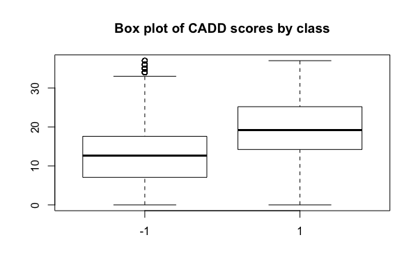
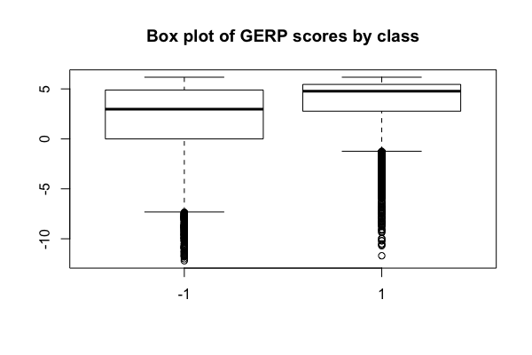

Machine learning on variants
============================

List of manually collected variants that are known to be pathogenic.

* Known pathogenic variants for [Kabuki syndrome](https://en.wikipedia.org/wiki/Kabuki_syndrome) from the work of [Ng et al. in Nature Genetics 2010](http://www.ncbi.nlm.nih.gov/pubmed/20711175); variants available in [Supplementary Table 3](http://www.nature.com/ng/journal/v42/n9/extref/ng.646-S1.pdf)
* Known pathogenic variants for [Miller syndrome](https://en.wikipedia.org/wiki/Miller_syndrome) from the work of [Ng et al. in Nature Genetics 2010](http://www.ncbi.nlm.nih.gov/pubmed/19915526); variants are available in Table 4

# ClinVar variants

Accessing and using data in [ClinVar](http://www.ncbi.nlm.nih.gov/clinvar/docs/maintenance_use/#download)

~~~~{.bash}
# download and index data
wget -c ftp://ftp.ncbi.nlm.nih.gov/pub/clinvar/vcf_GRCh37/clinvar_20160831.vcf.gz
gunzip clinvar_20160831.vcf.gz
bgzip clinvar_20160831.vcf
tabix -p vcf clinvar_20160831.vcf.gz

# how many variants?
gunzip -c clinvar_20160831.vcf.gz | grep -v "^#" | wc -l
130740

# Variant Clinical Significance
# 0 - Uncertain significance
# 1 - not provided
# 2 - Benign
# 3 - Likely benign
# 4 - Likely pathogenic
# 5 - Pathogenic
# 6 - drug response
# 7 - histocompatibility
# 255 - other
bcftools query -f '%CLNSIG\n' clinvar_20160831.vcf.gz | head
5
5
2
0
5
3
5
0
2

# tally of clinical significance
bcftools query -f '%CLNSIG\n' clinvar_20160831.vcf.gz  | sort | uniq -c | sort -k1rn | head
  31464 0
  26623 5
  12895 3
  12565 2
  11198 1
   6006 4
   4058 255
   2955 0|0
   2792 5|5
   1033 2|2

# how many variant have conflicting codes?
bcftools query -f '%CLNSIG\n' clinvar_20160831.vcf.gz  |
perl -nle 'next if /^\d+$/;
@l = split(/\||,/);
for($i=1; $i<=$#l; ++$i){
   if ($l[0] != $l[$i]){
       print; last
   }
}' | wc -l
12685

# how many of the Kabuki syndrome variants are in ClinVar?
# two out of six
cat kabuki_hg19.bed |
sed 's/^chr//' |
bedtools intersect -a stdin -b clinvar_20160831.vcf.gz -u
12      49420553        49420554        c.G15195A       0       +
12      49432650        49432651        c.C8488T        0       +

# and Miller syndrome?
# nine out of eleven
cat miller_hg19.bed |
sed 's/^chr//' |
bedtools intersect -a stdin -b clinvar_20160831.vcf.gz -u
16      72045982        72045983        G56A    0       +
16      72048539        72048540        C403T   0       +
16      72050941        72050942        G454A   0       +
16      72055099        72055100        C595T   0       +
16      72055109        72055110        G605A   0       +
16      72055109        72055110        G605C   0       +
16      72056284        72056285        C730T   0       +
16      72057434        72057435        C1036T  0       +
16      72057434        72057435        C1036T  0       +
~~~~

# Benchmark dataset

The paper "[The evaluation of tools used to predict the impact of missense variants is hindered by two types of circularity](http://www.ncbi.nlm.nih.gov/pubmed/25684150)" and the related [blog post](http://cazencott.info/index.php/post/2015/03/27/Beware-of-circularity-Evaluating-SNV-deleteriousness-prediction-tools) is a must read. The paper describes the evaluation of 10 pathogenicity prediction tools on five variant datasets, and discusses the difficulty in the evaluation due to two types of circularity. The first is due to an overlap of variants in the training and testing data; the second is due to the presence of "pure proteins", which are proteins that contain only benign or pathogenic variants. For example, protein *abc* contains only benign variants and protein *def* contains only pathogenic variants. To demonstrate how this can be a problem the paper discusses the strategy behind the prediction tool, FATHMM. Variants are weighted by FATHMM using two metrics, Wn and Wd, which represent the relative frequency of neutral and deleterious variants respectively in the relevant protein family. Thus a variant in "pure protein" with only deleterious variants will be weighted higher in terms of deleteriousness. Since this "pure protein" only contains deleterious variants, FATHMM will make a correct prediction. This is a problem because it seems very likely that neutral variants can occur in this "pure protein". Perhaps there is some biological rationale behind this, as some proteins are less tolerant to mutations and are more likely to cause disease, hence there is a greater ratio of deleterious variants in the protein. It may also be due to the fact that once a protein has been implicated in an disorder, there will be more reports of pathogenic variants in the protein.

Grimm et al. also provides five benchmark datasets; three of the datasets only contain variants that have not been used for training in various pathogenicity prediction tools. To download the data:

~~~~{.bash}
# download Grimm et al. dataset
wget https://www.ethz.ch/content/dam/ethz/special-interest/bsse/borgwardt-lab/Projects/PathogenicityPrediction/DataS1.zip

unzip DataS1.zip
~~~~

The benchmark datasets are in the `ToolScores` folder of `DataS1`.

* VariBench has an overlap of approximately 50% with both HumVar and ExoVar. Non-overlapping variants were used to build an independent evaluation dataset called VariBench-Selected (varibench_selected_tool_scores.csv)
* The predictSNPSelected dataset (predictSNP_selected_tool_scores.csv) is the predictSNP dataset that has all variants that overlap with HumVar, ExoVar, and VariBench removed
* The SwissVarSelected dataset (swissvar_selected_tool_scores.csv) was created by excluding from the latest SwissVar database (December 2014) all variants overlapping with the other four datasets: HumVar, ExoVar, VariBench, and predictSNP. SwissVarSelected should be the dataset containing the newest variants across all datasets

Some statistics and plots with R.

~~~~{.r}
df <- read.csv('swissvar_selected_tool_scores.csv')
df$True.Label <- factor(df$True.Label)

class_table <- function(x){
  cat(names(df)[x-1])
  print(table(df$True.Label, df[,x])/sum(table(df$True.Label, df[,x])))
  cat("\n")
}

my_cols <- c(16, 18, 23, 25, 27, 35, 37, 39, 41)
for(i in my_cols){
  class_table(i)
}

MutationTaster    
             -1          1
  -1 0.35730415 0.27618551
  1  0.07199931 0.29451103

MutationAssessor    
            -1         1
  -1 0.4376731 0.1929825
  1  0.1630991 0.2062453

SIFT    
            -1         1
  -1 0.4179363 0.2177112
  1  0.1399758 0.2243767

LRT    
            -1         1
  -1 0.3664136 0.2476393
  1  0.1096093 0.2763377

FatHMM.U    
            -1         1
  -1 0.4799116 0.1648907
  1  0.1775989 0.1775989

Condel..PolyPhen2.MutationAssessor.SIFT.    
             -1          1
  -1 0.28383080 0.33858268
  1  0.07489471 0.30269181

Condel...PolyPhen2.MutationAssessor.SIFT.FatHMM.W.    
            -1         1
  -1 0.4608559 0.1739924
  1  0.1344336 0.2307182

Logit..PolyPhen2.MutationAssessor.SIFT.    
            -1         1
  -1 0.5144380 0.1247446
  1  0.1595735 0.2012439

Logit...PolyPhen2.MutationAssessor.SIFT.FatHMM.W.    
             -1          1
  -1 0.54984438 0.08937305
  1  0.16238328 0.19839929

boxplot(df$CADD ~ df$True.Label, main = 'Box plot of CADD scores by class')
boxplot(df$GERP.. ~ df$True.Label, main = 'Box plot of GERP scores by class')
~~~~

# Further reading

* Sarah Ng's [PhD thesis](https://digital.lib.washington.edu/researchworks/bitstream/handle/1773/21834/Ng_washington_0250E_11012.pdf)

