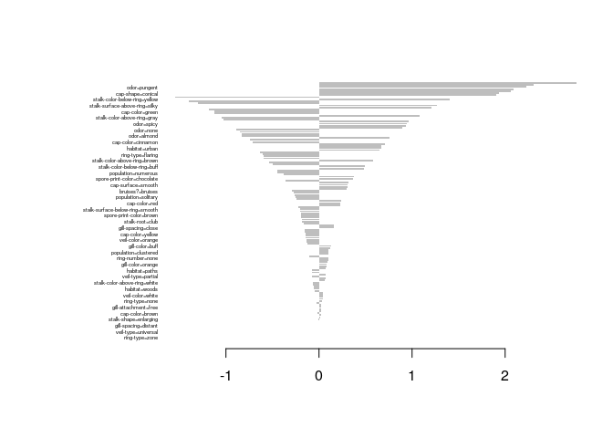
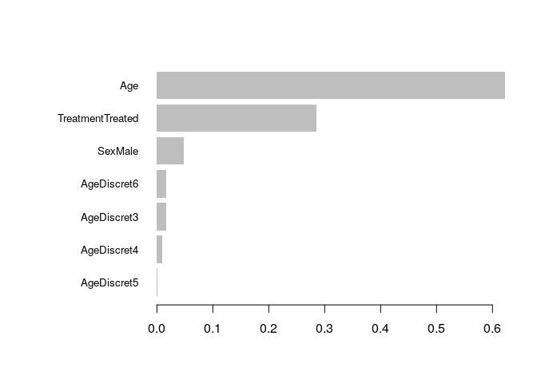
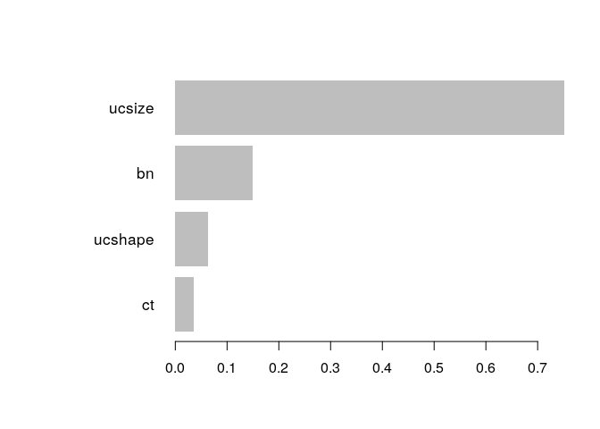

Introduction
============

[Gradient boosting](https://en.wikipedia.org/wiki/Gradient_boosting) is
a machine learning technique for regression, classification and other
tasks, which produces a prediction model in the form of an ensemble of
weak prediction models, typically decision trees. When a decision tree
is the weak learner, the resulting algorithm is called gradient boosted
trees, which usually outperforms random forest. It builds the model in a
stage-wise fashion like other boosting methods do, and it generalises
them by allowing optimisation of an arbitrary differentiable loss
function.

XGBoost is one of the implementations of the Gradient Boosting concept
but uses a more regularised model formalisation to control over-fitting,
which gives it better performance.

In this notebook we will be following the [XGBoost R
Tutorial](https://xgboost.readthedocs.io/en/stable/R-package/xgboostPresentation.html)
and the [Understand your dataset with
XGBoost](https://xgboost.readthedocs.io/en/stable/R-package/discoverYourData.html)
articles.

Install packages if missing and load.

``` {.r}
.libPaths('/packages')
my_packages <- c('Matrix', 'vcd', 'data.table', 'xgboost', 'SHAPforxgboost')

for (my_package in my_packages){
   if(!require(my_package, character.only = TRUE)){
      install.packages(my_package, '/packages')
      library(my_package, character.only = TRUE)
   }
}
```

XGBoost R Tutorial
------------------

This tutorial uses mushroom data with the goal of predicting whether a
mushroom can be eaten or not. The data is packaged with `xgboost` as
`agaricus`. From [Wikipedia](https://en.wikipedia.org/wiki/Agaricus):

> Agaricus is a genus of mushrooms containing both edible and poisonous
> species, with over 400 members worldwide (although many are disputed
> or newly-discovered species). The genus includes the common button
> mushroom (*Agaricus bisporus*) and the field mushroom (*A.
> campestris*), the dominant cultivated mushrooms of the West.

``` {.r}
data("agaricus.train", package = "xgboost")
data("agaricus.test", package = "xgboost")

train <- agaricus.train
test <- agaricus.test

dtrain <- xgb.DMatrix(data = train$data, label = train$label)
dtest <- xgb.DMatrix(data = test$data, label = test$label)
dim(dtrain)
```

    ## [1] 6513  126

We will train using a decision tree model with the following parameters:

-   `objective = "binary:logistic"` - train a binary classification
    model
-   `max.depth = 2` - shallow depth because our case is very simple
-   `nthread = 2` - use two CPU threads
-   `eta = 1` - learning rate used to prevent overfitting by making the
    boosting process more conservative. Lower value for `eta` implies
    larger value for `nrounds` and low `eta` value means model more
    robust to overfitting but slower to compute. The default is 0.3.
-   `nrounds = 2` - make two passes on the data, where the second one
    will enhance the model by further reducing the difference between
    ground truth and prediction

``` {.r}
bst <- xgboost(
   data = dtrain,
   max.depth = 2,
   eta = 1,
   nthread = 2,
   nrounds = 2,
   objective = "binary:logistic",
   verbose = 2
)
```

    ## [1]  train-logloss:0.233376 
    ## [2]  train-logloss:0.136658

Predict.

``` {.r}
prediction <- as.numeric(predict(bst, dtest) > 0.5)
err <- mean(as.numeric(prediction > 0.5) != test$label)
print(paste("test-error=", signif(err, 5)))
```

    ## [1] "test-error= 0.021726"

Table of results.

``` {.r}
prop.table(table(real = test$label, predict = prediction))
```

    ##     predict
    ## real           0           1
    ##    0 0.504655493 0.013656114
    ##    1 0.008069522 0.473618870

Follow the progress of learning.

From `?xgb.train`:

The following is the list of built-in metrics for which `XGBoost`
provides optimized implementation:

-   `rmse` - [root mean square
    error](https://en.wikipedia.org/wiki/Root_mean_square_error)
-   `logloss` - [negative
    log-likelihood](https://en.wikipedia.org/wiki/Log-likelihood)
-   `mlogloss` - [multiclass
    logloss](https://scikit-learn.org/stable/modules/generated/sklearn.metrics.log_loss.html)
-   `error` - Binary classification error rate. It is calculated as (\#
    wrong cases) / (\# all cases). By default, it uses the 0.5 threshold
    for predicted values to define negative and positive instances.
    Different threshold (e.g., 0.) could be specified as "<error@0>."
-   `merror` - Multiclass classification error rate. It is calculated as
    (\# wrong cases) / (\# all cases).
-   `mae` - Mean absolute error
-   `mape` - Mean absolute percentage error
-   `auc` - [Area under the
    curve](https://en.wikipedia.org/wiki/Receiver_operating_characteristic#Area_under_the_curve)
-   `aucpr` - [Area under the PR
    curve](https://en.wikipedia.org/wiki/Precision_and_recall)
-   `ndcg` - [Normalized Discounted Cumulative
    Gain](https://en.wikipedia.org/wiki/NDCG)

``` {.r}
watchlist <- list(train=dtrain, test=dtest)

bst <- xgb.train(
   data=dtrain,
   max.depth=2,
   eta=1, 
   nthread = 2,
   nrounds=2,
   watchlist=watchlist,
   eval.metric = "error",
   eval.metric = "logloss",
   eval.metric = "auc",
   eval.metric = "aucpr",
   objective = "binary:logistic"
)
```

    ## [1]  train-error:0.046522    train-logloss:0.233376  train-auc:0.958228  train-aucpr:0.930072    test-error:0.042831 test-logloss:0.226686   test-auc:0.960373   test-aucpr:0.933942 
    ## [2]  train-error:0.022263    train-logloss:0.136658  train-auc:0.981413  train-aucpr:0.971330    test-error:0.021726 test-logloss:0.137874   test-auc:0.979930   test-aucpr:0.967223

The evaluation metrics are saved in `evaluation_log`.

``` {.r}
bst$evaluation_log
```

    ##    iter train_error train_logloss train_auc train_aucpr test_error test_logloss
    ## 1:    1  0.04652234     0.2333756 0.9582280   0.9300723 0.04283054    0.2266860
    ## 2:    2  0.02226317     0.1366581 0.9814132   0.9713302 0.02172564    0.1378742
    ##     test_auc test_aucpr
    ## 1: 0.9603733  0.9339420
    ## 2: 0.9799301  0.9672231

Linear boosting.

``` {.r}
bst2 <- xgb.train(
   data=dtrain,
   booster = "gblinear",
   nthread = 2,
   nrounds=2,
   watchlist=watchlist,
   eval.metric = "error",
   eval.metric = "logloss",
   eval.metric = "auc",
   eval.metric = "aucpr",
   objective = "binary:logistic"
)
```

    ## [1]  train-error:0.016736    train-logloss:0.192460  train-auc:0.998971  train-aucpr:0.999041    test-error:0.020484 test-logloss:0.196722   test-auc:0.999181   test-aucpr:0.999109 
    ## [2]  train-error:0.002917    train-logloss:0.083358  train-auc:0.999698  train-aucpr:0.999763    test-error:0.002483 test-logloss:0.085952   test-auc:0.999952   test-aucpr:0.999948

Linear boosting predictions.

``` {.r}
prediction2 <- as.numeric(predict(bst2, dtest) > 0.5)
err2 <- mean(as.numeric(prediction2 > 0.5) != test$label)

prop.table(table(real = test$label, predict = prediction2))
```

    ##     predict
    ## real            0            1
    ##    0 0.5176908752 0.0006207325
    ##    1 0.0018621974 0.4798261949

Feature importance.

``` {.r}
importance_matrix <- xgb.importance(model = bst2)
head(importance_matrix)
```

    ##                    Feature   Weight
    ## 1: spore-print-color=green 2.763826
    ## 2:     cap-surface=grooves 2.307125
    ## 3:            odor=pungent 2.230102
    ## 4:        gill-color=green 2.086703
    ## 5:           odor=creosote 2.059562
    ## 6:       cap-shape=conical 1.935094

Feature importance plot.

``` {.r}
xgb.plot.importance(importance_matrix)
```



Understand your dataset with XGBoost
------------------------------------

How to use XGBoost to discover and understand your dataset better.

### Data

XGBoost uses only numeric vectors and categorical variables need to be
converted using [one-hot
encoding](https://en.wikipedia.org/wiki/One-hot). The data for this
section is from a 1988 double-blind clinical trial investigating a new
treatment for rheumatoid arthritis.

``` {.r}
data(Arthritis, package = "vcd")
df <- data.table(Arthritis, keep.rownames = FALSE)
dim(df)
```

    ## [1] 84  5

The variables are:

1.  `ID` - patient ID.
2.  `Treatment` - factor indicating treatment (Placebo, Treated).
3.  `Sex` - factor indicating sex (Female, Male).
4.  `Age` - age of patient.
5.  `Improved` - ordered factor indicating treatment outcome (None,
    Some, Marked).

``` {.r}
head(df)
```

    ##    ID Treatment  Sex Age Improved
    ## 1: 57   Treated Male  27     Some
    ## 2: 46   Treated Male  29     None
    ## 3: 77   Treated Male  30     None
    ## 4: 17   Treated Male  32   Marked
    ## 5: 36   Treated Male  46   Marked
    ## 6: 23   Treated Male  58   Marked

Remove ID.

``` {.r}
df[, ID:=NULL]
```

Add new age variable.

``` {.r}
head(df[,AgeDiscret := as.factor(round(Age/10,0))])
```

    ##    Treatment  Sex Age Improved AgeDiscret
    ## 1:   Treated Male  27     Some          3
    ## 2:   Treated Male  29     None          3
    ## 3:   Treated Male  30     None          3
    ## 4:   Treated Male  32   Marked          3
    ## 5:   Treated Male  46   Marked          5
    ## 6:   Treated Male  58   Marked          6

Random split.

``` {.r}
head(df[,AgeCat:= as.factor(ifelse(Age > 30, "Old", "Young"))])
```

    ##    Treatment  Sex Age Improved AgeDiscret AgeCat
    ## 1:   Treated Male  27     Some          3  Young
    ## 2:   Treated Male  29     None          3  Young
    ## 3:   Treated Male  30     None          3  Young
    ## 4:   Treated Male  32   Marked          3    Old
    ## 5:   Treated Male  46   Marked          5    Old
    ## 6:   Treated Male  58   Marked          6    Old

We will transform the categorical data to dummy variables in a process
called one-hot encoding. The purpose is to transform each value of each
categorical feature into a binary feature.

The formula `Improved~.-1` transforms all categorical features but
column `Improved` (it is excluded because this is our label column that
we want to predict) to binary values.

``` {.r}
sparse_matrix <- sparse.model.matrix(Improved~., data = df)
sparse_matrix <- sparse_matrix[, -1]
sparse_matrix[c(1:3, (nrow(sparse_matrix)-2):nrow(sparse_matrix)), ]
```

    ## 6 x 9 sparse Matrix of class "dgCMatrix"
    ##    TreatmentTreated SexMale Age AgeDiscret3 AgeDiscret4 AgeDiscret5 AgeDiscret6
    ## 1                 1       1  27           1           .           .           .
    ## 2                 1       1  29           1           .           .           .
    ## 3                 1       1  30           1           .           .           .
    ## 82                .       .  66           .           .           .           .
    ## 83                .       .  68           .           .           .           .
    ## 84                .       .  74           .           .           .           .
    ##    AgeDiscret7 AgeCatYoung
    ## 1            .           1
    ## 2            .           1
    ## 3            .           1
    ## 82           1           .
    ## 83           1           .
    ## 84           1           .

Create labels.

``` {.r}
output_vector = as.integer(df[, Improved] == "Marked")
head(output_vector)
```

    ## [1] 0 0 0 1 1 1

Train.

``` {.r}
bst <- xgboost(
   data = sparse_matrix,
   label = output_vector,
   max.depth = 4,
   eta = 1,
   nthread = 2,
   nrounds = 10,
   objective = "binary:logistic"
)
```

    ## [1]  train-logloss:0.485466 
    ## [2]  train-logloss:0.438534 
    ## [3]  train-logloss:0.412250 
    ## [4]  train-logloss:0.395828 
    ## [5]  train-logloss:0.384264 
    ## [6]  train-logloss:0.374028 
    ## [7]  train-logloss:0.365005 
    ## [8]  train-logloss:0.351233 
    ## [9]  train-logloss:0.341678 
    ## [10] train-logloss:0.334465

Feature importance where:

-   `Gain` is the improvement in accuracy brought by a feature to the
    branches it is on. The idea is that before adding a new split on a
    feature X to the branch there was some wrongly classified elements,
    after adding the split on this feature, there are two new branches,
    and each of these branch is more accurate (one branch saying if your
    observation is on this branch then it should be classified as 1, and
    the other branch saying the exact opposite).
-   `Cover` measures the relative quantity of observations concerned by
    a feature.
-   `Frequency` is a simpler way to measure the Gain. It just counts the
    number of times a feature is used in all generated trees. You should
    not use it (unless you know why you want to use it).

``` {.r}
importance <- xgb.importance(feature_names = sparse_matrix@Dimnames[[2]], model = bst)
head(importance)
```

    ##             Feature        Gain      Cover  Frequency
    ## 1:              Age 0.622031768 0.67251696 0.67241379
    ## 2: TreatmentTreated 0.285750540 0.11916651 0.10344828
    ## 3:          SexMale 0.048744026 0.04522028 0.08620690
    ## 4:      AgeDiscret6 0.016604636 0.04784639 0.05172414
    ## 5:      AgeDiscret3 0.016373781 0.08028951 0.05172414
    ## 6:      AgeDiscret4 0.009270558 0.02858801 0.01724138

Importance plot.

``` {.r}
xgb.plot.importance(importance)
```



Breast cancer data
------------------

Using the [Breast Cancer Wisconsin (Diagnostic) Data
Set](https://archive.ics.uci.edu/ml/datasets/Breast+Cancer+Wisconsin+(Diagnostic)).

``` {.r}
data <- read.table(
   "../data/breast_cancer_data.csv",
   stringsAsFactors = FALSE,
   sep = ',',
   header = TRUE
)
data$class <- factor(data$class)
data <- data[,-1]
```

Separate into training (80%) and testing (20%).

``` {.r}
set.seed(31)
my_prob <- 0.8
my_split <- as.logical(
  rbinom(
    n = nrow(data),
    size = 1,
    p = my_prob
  )
)

train <- list(
   data = as.matrix(data[my_split, -10]),
   label = as.numeric(data[my_split, 10] == 4)
)
test <- list(
   data = as.matrix(data[!my_split, -10]),
   label = as.numeric(data[!my_split, 10] == 4)
)
```

Training
--------

Train decision tree model using the following parameters:

-   `objective`: "binary:logistic", train a binary classification model
-   `max.depth`: "2", use low depth because this case study is simple
-   `nthread`: "2", use two CPU threads
-   `nrounds`: "2" there will be two passes on the data, the second will
    enhance the model by further reducing the difference between the
    ground truth and prediction

``` {.r}
bst <- xgboost(
   data = train$data,
   label = train$label,
   max.depth = 2,
   eta = 1,
   nthread = 2,
   nrounds = 2,
   objective = "binary:logistic"
)
```

    ## [1]  train-logloss:0.228338 
    ## [2]  train-logloss:0.136391

Prediction
----------

Predict.

``` {.r}
pred <- predict(bst, test$data)

prediction <- as.numeric(pred > 0.5)

err <- mean(as.numeric(pred > 0.5) != test$label)

print(paste("test-error =", err))
```

    ## [1] "test-error = 0.0655737704918033"

Compare real labels with the predictions.

``` {.r}
prop.table(table(test$label, prediction))
```

    ##    prediction
    ##              0          1
    ##   0 0.60655738 0.04098361
    ##   1 0.02459016 0.32786885

Feature importance
------------------

A benefit of using ensembles of decision tree methods like gradient
boosting is that they can automatically provide estimates of feature
importance from a trained predictive model. Generally, importance
provides a score that indicates how useful or valuable each feature was
in the construction of the boosted decision trees within the model. The
more an attribute is used to make key decisions, the higher its relative
importance.

Importance is calculated for a single decision tree by the amount that
each attribute split point improves the performance measure, weighted by
the number of observations the node is responsible for. The performance
measure may be the purity (Gini index) used to select the split points
or another more specific error function. Finally, the feature importance
are then averaged across all of the decision trees within the model.

``` {.r}
importance_matrix <- xgb.importance(model = bst)
print(importance_matrix)
```

    ##    Feature       Gain     Cover Frequency
    ## 1:  ucsize 0.75088388 0.3980799 0.3333333
    ## 2:      bn 0.14997836 0.3606183 0.3333333
    ## 3: ucshape 0.06313211 0.1393817 0.1666667
    ## 4:      ct 0.03600566 0.1019201 0.1666667

``` {.r}
xgb.plot.importance(importance_matrix = importance_matrix)
```



SHAP
----

[SHAP](https://shap.readthedocs.io/en/latest/) (SHapley Additive
exPlanations) is a game theoretic approach to explain the output of any
machine learning model. It connects optimal credit allocation with local
explanations using the classic Shapley values from game theory and their
related extensions.

Following this [blog
post](https://liuyanguu.github.io/post/2019/07/18/visualization-of-shap-for-xgboost/).

``` {.r}
# To return the SHAP values and ranked features by mean|SHAP|
shap_values <- shap.values(xgb_model = bst, X_train = train$data)

# The ranked features by mean |SHAP|
head(shap_values$mean_shap_score)
```

    ##    ucsize        bn   ucshape        ct        ma      secs 
    ## 1.3314532 0.8935497 0.3685138 0.2847471 0.0000000 0.0000000

Useful links
------------

-   [Introduction to Extreme Gradient
    Boosting](https://blog.exploratory.io/introduction-to-extreme-gradient-boosting-in-exploratory-7bbec554ac7)

Session info
------------

Time built.

    ## [1] "2022-11-09 06:03:38 UTC"

Session info.

    ## R version 4.2.1 (2022-06-23)
    ## Platform: x86_64-pc-linux-gnu (64-bit)
    ## Running under: Ubuntu 20.04.4 LTS
    ## 
    ## Matrix products: default
    ## BLAS:   /usr/lib/x86_64-linux-gnu/openblas-pthread/libblas.so.3
    ## LAPACK: /usr/lib/x86_64-linux-gnu/openblas-pthread/liblapack.so.3
    ## 
    ## locale:
    ##  [1] LC_CTYPE=en_US.UTF-8       LC_NUMERIC=C              
    ##  [3] LC_TIME=en_US.UTF-8        LC_COLLATE=en_US.UTF-8    
    ##  [5] LC_MONETARY=en_US.UTF-8    LC_MESSAGES=en_US.UTF-8   
    ##  [7] LC_PAPER=en_US.UTF-8       LC_NAME=C                 
    ##  [9] LC_ADDRESS=C               LC_TELEPHONE=C            
    ## [11] LC_MEASUREMENT=en_US.UTF-8 LC_IDENTIFICATION=C       
    ## 
    ## attached base packages:
    ## [1] grid      stats     graphics  grDevices utils     datasets  methods  
    ## [8] base     
    ## 
    ## other attached packages:
    ##  [1] SHAPforxgboost_0.1.1 xgboost_1.6.0.1      data.table_1.14.2   
    ##  [4] vcd_1.4-10           Matrix_1.4-1         forcats_0.5.1       
    ##  [7] stringr_1.4.0        dplyr_1.0.9          purrr_0.3.4         
    ## [10] readr_2.1.2          tidyr_1.2.0          tibble_3.1.7        
    ## [13] ggplot2_3.3.6        tidyverse_1.3.1     
    ## 
    ## loaded via a namespace (and not attached):
    ##  [1] httr_1.4.3         jsonlite_1.8.0     carData_3.0-5      modelr_0.1.8      
    ##  [5] assertthat_0.2.1   highr_0.9          cellranger_1.1.0   yaml_2.3.5        
    ##  [9] pillar_1.7.0       backports_1.4.1    lattice_0.20-45    glue_1.6.2        
    ## [13] digest_0.6.29      RColorBrewer_1.1-3 ggsignif_0.6.3     polyclip_1.10-0   
    ## [17] checkmate_2.1.0    rvest_1.0.2        colorspace_2.0-3   htmltools_0.5.2   
    ## [21] pkgconfig_2.0.3    broom_1.0.0        haven_2.5.0        scales_1.2.0      
    ## [25] tweenr_1.0.2       tzdb_0.3.0         ggforce_0.3.3      car_3.1-0         
    ## [29] generics_0.1.3     farver_2.1.1       ellipsis_0.3.2     ggpubr_0.4.0      
    ## [33] withr_2.5.0        cli_3.3.0          magrittr_2.0.3     crayon_1.5.1      
    ## [37] readxl_1.4.0       evaluate_0.15      fs_1.5.2           fansi_1.0.3       
    ## [41] MASS_7.3-57        rstatix_0.7.0      xml2_1.3.3         tools_4.2.1       
    ## [45] hms_1.1.1          lifecycle_1.0.1    BBmisc_1.12        munsell_0.5.0     
    ## [49] reprex_2.0.1       compiler_4.2.1     rlang_1.0.3        rstudioapi_0.13   
    ## [53] rmarkdown_2.14     gtable_0.3.0       abind_1.4-5        DBI_1.1.3         
    ## [57] R6_2.5.1           zoo_1.8-11         lubridate_1.8.0    knitr_1.39        
    ## [61] fastmap_1.1.0      utf8_1.2.2         stringi_1.7.6      Rcpp_1.0.8.3      
    ## [65] vctrs_0.4.1        dbplyr_2.2.1       tidyselect_1.1.2   xfun_0.31         
    ## [69] lmtest_0.9-40
