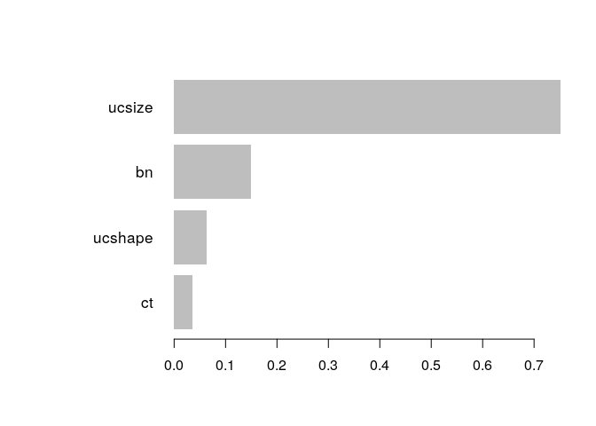

Introduction
------------

[Gradient boosting](https://en.wikipedia.org/wiki/Gradient_boosting) is
a machine learning technique for regression, classification and other
tasks, which produces a prediction model in the form of an ensemble of
weak prediction models, typically decision trees. When a decision tree
is the weak learner, the resulting algorithm is called gradient boosted
trees, which usually outperforms random forest. It builds the model in a
stage-wise fashion like other boosting methods do, and it generalises
them by allowing optimisation of an arbitrary differentiable loss
function.

XGBoost is one of the implementations of the Gradient Boosting concept
but uses a more regularised model formalisation to control over-fitting,
which gives it better performance.

In this notebook we will be following [this
tutorial](https://xgboost.readthedocs.io/en/latest/R-package/xgboostPresentation.html).

Install packages if missing and load.

``` {.r}
.libPaths('/packages')
my_packages <- c('xgboost', 'SHAPforxgboost')

for (my_package in my_packages){
   if(!require(my_package, character.only = TRUE)){
      install.packages(my_package, '/packages')
      library(my_package, character.only = TRUE)
   }
}
```

Breast cancer data
------------------

Using the [Breast Cancer Wisconsin (Diagnostic) Data
Set](https://archive.ics.uci.edu/ml/datasets/Breast+Cancer+Wisconsin+(Diagnostic)).

``` {.r}
data <- read.table(
   "../data/breast_cancer_data.csv",
   stringsAsFactors = FALSE,
   sep = ',',
   header = TRUE
)
data$class <- factor(data$class)
data <- data[,-1]
```

Separate into training (80%) and testing (20%).

``` {.r}
set.seed(31)
my_prob <- 0.8
my_split <- as.logical(
  rbinom(
    n = nrow(data),
    size = 1,
    p = my_prob
  )
)

train <- list(
   data = as.matrix(data[my_split, -10]),
   label = as.numeric(data[my_split, 10] == 4)
)
test <- list(
   data = as.matrix(data[!my_split, -10]),
   label = as.numeric(data[!my_split, 10] == 4)
)
```

Training
--------

Train decision tree model using the following parameters:

-   `objective`: "binary:logistic", train a binary classification model
-   `max.depth`: "2", use low depth because this case study is simple
-   `nthread`: "2", use two CPU threads
-   `nrounds`: "2" there will be two passes on the data, the second will
    enhance the model by further reducing the difference between the
    ground truth and prediction

``` {.r}
bst <- xgboost(data = train$data,
               label = train$label,
               max.depth = 2,
               eta = 1,
               nthread = 2,
               nrounds = 2,
               objective = "binary:logistic")
```

    ## [1]  train-logloss:0.228338 
    ## [2]  train-logloss:0.136391

Prediction
----------

Predict.

``` {.r}
pred <- predict(bst, test$data)

prediction <- as.numeric(pred > 0.5)

err <- mean(as.numeric(pred > 0.5) != test$label)

print(paste("test-error =", err))
```

    ## [1] "test-error = 0.0655737704918033"

Compare real labels with the predictions.

``` {.r}
prop.table(table(test$label, prediction))
```

    ##    prediction
    ##              0          1
    ##   0 0.60655738 0.04098361
    ##   1 0.02459016 0.32786885

Feature importance
------------------

A benefit of using ensembles of decision tree methods like gradient
boosting is that they can automatically provide estimates of feature
importance from a trained predictive model. Generally, importance
provides a score that indicates how useful or valuable each feature was
in the construction of the boosted decision trees within the model. The
more an attribute is used to make key decisions, the higher its relative
importance.

Importance is calculated for a single decision tree by the amount that
each attribute split point improves the performance measure, weighted by
the number of observations the node is responsible for. The performance
measure may be the purity (Gini index) used to select the split points
or another more specific error function. Finally, the feature importance
are then averaged across all of the decision trees within the model.

``` {.r}
importance_matrix <- xgb.importance(model = bst)
print(importance_matrix)
```

    ##    Feature       Gain     Cover Frequency
    ## 1:  ucsize 0.75088388 0.3980799 0.3333333
    ## 2:      bn 0.14997836 0.3606183 0.3333333
    ## 3: ucshape 0.06313211 0.1393817 0.1666667
    ## 4:      ct 0.03600566 0.1019201 0.1666667

``` {.r}
xgb.plot.importance(importance_matrix = importance_matrix)
```



SHAP
----

[SHAP](https://shap.readthedocs.io/en/latest/) (SHapley Additive
exPlanations) is a game theoretic approach to explain the output of any
machine learning model. It connects optimal credit allocation with local
explanations using the classic Shapley values from game theory and their
related extensions.

Following this [blog
post](https://liuyanguu.github.io/post/2019/07/18/visualization-of-shap-for-xgboost/).

``` {.r}
# To return the SHAP values and ranked features by mean|SHAP|
shap_values <- shap.values(xgb_model = bst, X_train = train$data)

# The ranked features by mean |SHAP|
head(shap_values$mean_shap_score)
```

    ##    ucsize        bn   ucshape        ct        ma      secs 
    ## 1.3314532 0.8935497 0.3685138 0.2847471 0.0000000 0.0000000

Useful links
------------

-   [Introduction to Extreme Gradient
    Boosting](https://blog.exploratory.io/introduction-to-extreme-gradient-boosting-in-exploratory-7bbec554ac7)

Session info
------------

Time built.

    ## [1] "2022-10-20 06:51:59 UTC"

Session info.

    ## R version 4.2.1 (2022-06-23)
    ## Platform: x86_64-pc-linux-gnu (64-bit)
    ## Running under: Ubuntu 20.04.4 LTS
    ## 
    ## Matrix products: default
    ## BLAS:   /usr/lib/x86_64-linux-gnu/openblas-pthread/libblas.so.3
    ## LAPACK: /usr/lib/x86_64-linux-gnu/openblas-pthread/liblapack.so.3
    ## 
    ## locale:
    ##  [1] LC_CTYPE=en_US.UTF-8       LC_NUMERIC=C              
    ##  [3] LC_TIME=en_US.UTF-8        LC_COLLATE=en_US.UTF-8    
    ##  [5] LC_MONETARY=en_US.UTF-8    LC_MESSAGES=en_US.UTF-8   
    ##  [7] LC_PAPER=en_US.UTF-8       LC_NAME=C                 
    ##  [9] LC_ADDRESS=C               LC_TELEPHONE=C            
    ## [11] LC_MEASUREMENT=en_US.UTF-8 LC_IDENTIFICATION=C       
    ## 
    ## attached base packages:
    ## [1] stats     graphics  grDevices utils     datasets  methods   base     
    ## 
    ## other attached packages:
    ##  [1] SHAPforxgboost_0.1.1 xgboost_1.6.0.1      forcats_0.5.1       
    ##  [4] stringr_1.4.0        dplyr_1.0.9          purrr_0.3.4         
    ##  [7] readr_2.1.2          tidyr_1.2.0          tibble_3.1.7        
    ## [10] ggplot2_3.3.6        tidyverse_1.3.1     
    ## 
    ## loaded via a namespace (and not attached):
    ##  [1] httr_1.4.3         jsonlite_1.8.0     carData_3.0-5      modelr_0.1.8      
    ##  [5] assertthat_0.2.1   highr_0.9          cellranger_1.1.0   yaml_2.3.5        
    ##  [9] pillar_1.7.0       backports_1.4.1    lattice_0.20-45    glue_1.6.2        
    ## [13] digest_0.6.29      RColorBrewer_1.1-3 ggsignif_0.6.3     polyclip_1.10-0   
    ## [17] checkmate_2.1.0    rvest_1.0.2        colorspace_2.0-3   htmltools_0.5.2   
    ## [21] Matrix_1.4-1       pkgconfig_2.0.3    broom_1.0.0        haven_2.5.0       
    ## [25] scales_1.2.0       tweenr_1.0.2       tzdb_0.3.0         ggforce_0.3.3     
    ## [29] generics_0.1.3     farver_2.1.1       car_3.1-0          ellipsis_0.3.2    
    ## [33] ggpubr_0.4.0       withr_2.5.0        cli_3.3.0          magrittr_2.0.3    
    ## [37] crayon_1.5.1       readxl_1.4.0       evaluate_0.15      fs_1.5.2          
    ## [41] fansi_1.0.3        MASS_7.3-57        rstatix_0.7.0      xml2_1.3.3        
    ## [45] tools_4.2.1        data.table_1.14.2  hms_1.1.1          lifecycle_1.0.1   
    ## [49] BBmisc_1.12        munsell_0.5.0      reprex_2.0.1       compiler_4.2.1    
    ## [53] rlang_1.0.3        grid_4.2.1         rstudioapi_0.13    rmarkdown_2.14    
    ## [57] gtable_0.3.0       abind_1.4-5        DBI_1.1.3          R6_2.5.1          
    ## [61] lubridate_1.8.0    knitr_1.39         fastmap_1.1.0      utf8_1.2.2        
    ## [65] stringi_1.7.6      Rcpp_1.0.8.3       vctrs_0.4.1        dbplyr_2.2.1      
    ## [69] tidyselect_1.1.2   xfun_0.31
